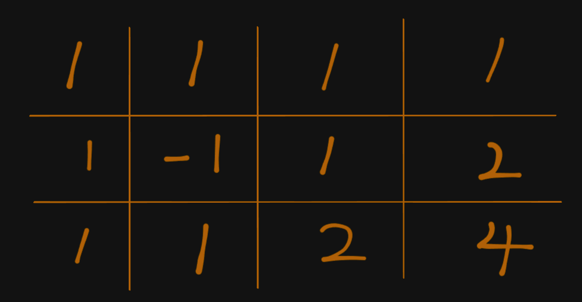

# [DAY 10] 동적 프로그래밍

## [백준] 2629번 양팔저울 (출제)

### 코드

```java
import java.io.BufferedReader;
import java.io.IOException;
import java.io.InputStreamReader;
import java.util.StringTokenizer;

public class Main {
    static int n;
    static int[] weight = new int[31];

    // 추의 개수는 최대 30개까지, 무게는 최대 15000g이 될 수 있다.
    static boolean[][] dp = new boolean[31][15001];

    public static void main(String[] args) throws IOException {
        BufferedReader br = new BufferedReader(new InputStreamReader(System.in));
        StringBuilder sb = new StringBuilder();

        // 추 입력
        n = Integer.parseInt(br.readLine());
        StringTokenizer st = new StringTokenizer(br.readLine());
        for (int i = 0; i < n; i++) {
            weight[i] = Integer.parseInt(st.nextToken());
        }

        solve(0, 0);

        int balls = Integer.parseInt(br.readLine());
        st = new StringTokenizer(br.readLine());
        for (int i = 0; i < balls; i++) {
            int ball = Integer.parseInt(st.nextToken());
            if (ball > 15000) {
                sb.append("N").append(" ");
            } else {
                String result = dp[n][ball] ? "Y" : "N";
                sb.append(result).append(" ");
            }
        }


        System.out.println(sb);
    }

    static void solve(int i, int w) {
        // 재귀 종료 조건
        // 모든 추의 개수를 조합해 봤거나, 이미 추들로 완성했던 무게는 스킵
        if (i > n || dp[i][w]) {
            return;
        }

        dp[i][w] = true;
        solve(i + 1, w + weight[i]);
        solve(i + 1,  Math.abs(w - weight[i]));
        solve(i + 1, w);
    }
}
```

### 풀이

추를 놓는 경우의 수는 3개다. 구슬 쪽 저울에 올릴 것인지, 반대편 저울에 올린 것인지, 아예 사용하지 않을 것인지. 따라서 이 모든 경우의 수를 따져보고 구슬 무게를 만들 수 있는지 확인해야 한다. 그러나 이대로 구현하면 경우의 수가 매우 많아 시간 초과가 발생할 것이기 때문에, 다이나믹 프로그래밍 방식을 적용한다.

구현하기 위해 냅색 문제(배낭 문제)와 비슷하게 dp를 2차원 배열로 선언한다. 그리고 추를 놓는 3가지 경우에 대해 재귀를 수행한다. 만약 이미 true(구슬 무게를 잴 수 있음)이면 해당 재귀 스택은 종료된다.

이 때 dp[x][y]는 x번까지의 추를 사용했을 때 y 무게를 만들 수 있는지에 대한 여부이다. 

추는 입력으로 최대 30개까지 들어오고, 각각의 추는 최대 500g이다. 즉, 추로 만들 수 있는 최대 무게는 15000g이다. 그래서 dp 배열은 dp[31][15001]로 할당해주고, 15,000g까지만 무게 잴 수 있는지 여부를 계산한다. 

구슬 입력으로 15,000보다 크게 들어오면 주어진 추로는 절대 무게를 잴 수 없기 때문에 항상 "N"이다.

## [프로그래머스] 등굣길 (풀이)

### 코드

```java
class Solution {
    static public int solution(int m, int n, int[][] puddles) {
        int[][] dp = new int[n + 1][m + 1];
        for (int[] puddle : puddles) {
            dp[puddle[1]][puddle[0]] = -1;
        }

        // 시작점(dp[1][1])을 1로 초기화하기 위해 설정
        dp[0][1] = 1;
        int sum = 0;

        // 현재 위치로 올 수 있는 경로의 개수는 dp 배열의 위와 왼쪽의 값을 더한 값이다.
        // 만약 -1일 경우에는 합 연산에서 제외한다.
        for (int i = 1; i <= n; i++) {
            for (int j = 1; j <= m; j++) {
                if (dp[i][j] == -1) {
                    continue;
                }

                sum = 0;
                if (dp[i - 1][j] != -1) {
                    sum += dp[i - 1][j];
                }
                if (dp[i][j - 1] != -1) {
                    sum += dp[i][j - 1];
                }

                dp[i][j] = sum % 1000000007;
            }
        }

        return dp[n][m];
    }
}
```

### 풀이

좌표상에서 오른쪽과 아래쪽으로만 움직이기 때문에 특정 위치에 도달했을 때의 경로는 항상 최단경로다. 따라서 우리는 `학교`까지의 모든 경로 개수를 구하면 된다.


dp[i][j]에 도달하는 경로의 개수는 dp[i-1][j] + dp[i][j-1]이다. 만약 둘 중 하나가 -1(물에 잠긴 곳)이라면 덧셈 연산에서 제외한다. 예제를 표로 그려보면 다음과 같을 것이다.



집(1, 1)에서 출발하는 경우의 수는 항상 1개다. (3, 2)에서는 왼쪽 값이 -1이므로 위의 값 1만 더한다. `(A + B) % C == (A % B) + (A % C)`이므로 표의 값을 갱신할 때마다 모듈로 연산을 수행한다.

주의해야 할 점으로, 물에 잠긴 곳(`puddles`) 좌표는 2차원 배열이 아니라 (x, y) 좌표 방식으로 제공된다. 처음에 아무 생각없이 `dp[puddle[0]][puddle[1]] = -1;`로 처리해서 오답이 떠서 한참 헤맸었다.
