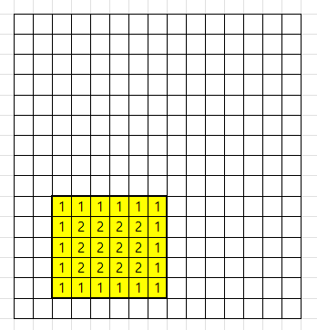
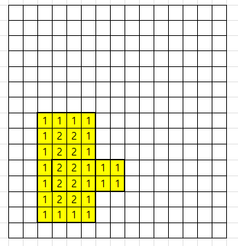

# [DAY 11] 코딩 테스트

지금까지 배운 내용들 중 문제 하나를 선택했다.

## [프로그래머스] 아이템 줍기 (출제)

### 코드

```java
import java.util.LinkedList;
import java.util.Queue;

class Solution {
    static int MAX_X = 101;
    static int MAX_Y = 101;

    static class Point {
        int x, y;

        public Point(int x, int y) {
            this.x = x;
            this.y = y;
        }
    }

    static public int solution(int[][] rectangle, int characterX, int characterY, int itemX, int itemY) {
        int[][] map = new int[MAX_X][MAX_Y];
        int[][] distance = new int[MAX_X][MAX_Y];

        // 현재 위치 기준 상, 우, 하, 좌의 좌표
        int[] dx = {-1, 0, 1, 0};
        int[] dy = {0, 1, 0, -1};

        // 도형 테두리는 1, 안쪽 부분은 2씩 더함
        for (int[] rec : rectangle) {
            rec[0] *= 2;
            rec[1] *= 2;
            rec[2] *= 2;
            rec[3] *= 2;
            for (int i = rec[0]; i <= rec[2]; i++) {
                for (int j = rec[1]; j <= rec[3]; j++) {
                    if (i == rec[0] || i == rec[2]
                            || j == rec[1] || j == rec[3]) {
                        // 도형의 테두리인 경우
                        if (map[i][j] != 1) {
                            map[i][j] += 1;
                        }
                    } else {
                        map[i][j] += 2;
                    }
                }
            }
        }

        characterX *= 2;
        characterY *= 2;
        itemX *= 2;
        itemY *= 2;

        // BFS
        Queue<Point> queue = new LinkedList<>();

        queue.offer(new Point(characterX, characterY));
        map[characterX][characterY] = 0;
        distance[characterX][characterY] = 0;

        while (!queue.isEmpty()) {
            Point point = queue.poll();

            for (int i = 0; i < 4; i++) {
                int nowX = point.x + dx[i];
                int nowY = point.y + dy[i];

                if (nowX >= 0 && nowX < MAX_X
                        && nowY >= 0 && nowY < MAX_Y
                        && map[nowX][nowY] == 1) {
                    map[nowX][nowY] = 0;

                    distance[nowX][nowY] = distance[point.x][point.y] + 1;
                    if (nowX == itemX && nowY == itemY) {
                        return distance[nowX][nowY] / 2;
                    }

                    queue.offer(new Point(nowX, nowY));
                }
            }
        }

        return -1;
    }
}
```

### 풀이

여러 개의 직사각형으로 이루어진 도형을 2차원 배열에서 표현할 때 테두리 부분(도형의 가장 바깥쪽)은 1로, 나머지 안쪽 부분은 2씩 더해준다. 

입력으로 `[[2,1,7,5],[6,4,10,10]]`일 때 도형은 아래와 같이 저장될 것이다. 이해를 돕기 위해 x, y 좌표 평면에서 표시했다. 




이제 출발 위치(characterX, characterY)로부터 도착 위치(itemX, itemY)까지 숫자 1이 나오는 경로로만 BFS/DFS로 탐색하면 된다. 

다만 여기서 문제되는 케이스가 있다. 아래의 그림과 같이 상하좌우에 위치한 1의 개수가 2개 이상인 경우에는 원하지 않는 경로로 탐색을 할 수 있게 된다.



이를 해결하기 위해 격자의 한 칸 길이를 1이 아니라 0.5라고 생각한다. 즉, 모든 좌표 단위에 2배를 해줘서 계산하면 이 예외 케이스를 해결할 수 있다.

## [프로그래머스] 호텔 방 배정 (풀이)

### 코드

```java
import java.util.ArrayList;
import java.util.HashMap;
import java.util.List;
import java.util.Map;

class Solution {
    static public long[] solution(long k, long[] room_number) {
        long[] answer = new long[room_number.length];

        // key : 방 번호, value : 현재 방보다 크면서 비어있는 방
        // value는 초기 상태로 현재 방 번호보다 1 큰 숫자를 가진다.
        Map<Long, Long> rooms = new HashMap<>();

        for (int i = 0; i < room_number.length; i++) {
            // 배정되지 않은 빈 방이라면
            if (!rooms.containsKey(room_number[i])) {
                // 그대로 원하는 방 배정
                answer[i] = room_number[i];

                // 방 배정됐으면 hash 데이터 추가
                rooms.put(room_number[i], room_number[i] + 1);
            }
            // 빈 방이 아니라면 다음 방을 탐색한다.
            else {
                List<Long> updateRoomList = new ArrayList<>();
                updateRoomList.add(room_number[i]);

                long nextRoom = rooms.get(room_number[i]);

                while (true) {
                    // 할당되지 않은 빈 방임
                    if (!rooms.containsKey(nextRoom)) {
                        answer[i] = nextRoom;
                        rooms.put(nextRoom, nextRoom + 1);
                        break;
                    }
                    // 이미 할당된 방일 경우 다음 방을 갱신하기 위해 리스트에 저장해둔다.
                    else {
                        updateRoomList.add(nextRoom);
                        nextRoom = rooms.get(nextRoom);
                    }
                }

                // 확인했던 방들의 다음 방 번호 갱신
                for (Long aLong : updateRoomList) {
                    rooms.put(aLong, nextRoom + 1);
                }
            }
        }

        return answer;
    }
}
```

### 풀이

전체 방 개수가 10^12개 이므로 배열을 이용해 모든 방을 나타낼 경우 메모리가 부족하게 된다. 때문에 HashMap 등의 자료구조를 이용해 필요한 만큼 노드를 생성해 메모리를 절약할 수 있다.

먼저 고객에게 배정할 방이 빈 방이면 즉시 배정한다. 이 때, Map 변수에 key는 배정된 방 번호, value는 현재 방 번호에 1을 더한 값을 저장한다.

만약 고객에게 배정할 방이 빈 방이 아니면 다음과 같이 배정할 빈 방을 탐색한다.
- 현재 노드의 방이 빈 방이 아니면 빈 방이 나올 때까지 부모 노드를 계속 방문한다.
- 빈 방이 나오면 고객에게 배정하고, 배정된 방 번호를 노드(key)로 만든 후, 부모 노드(value)는 배정된 방 번호에 1을 더해준 값을 저장한다.
- 빈 방이 나오기 전까지 방문한 노드들의 부모 노드 또한 고객에게 배정한 방 번호에 1을 더한 값으로 수정한다.

### 참고

- [2019 카카오 개발자 겨울 인턴십 코딩 테스트 문제 해설](https://tech.kakao.com/posts/381)