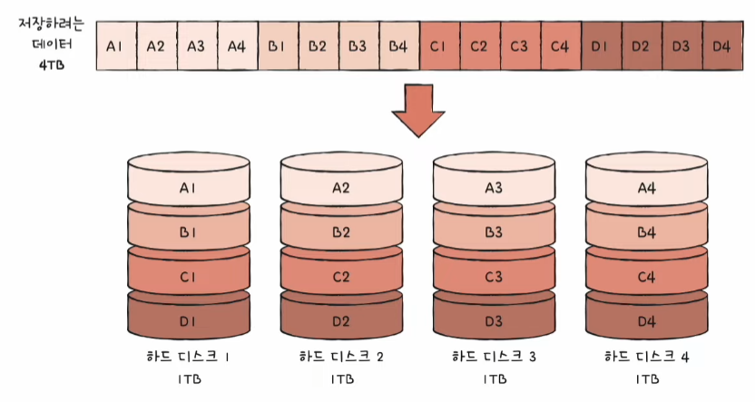
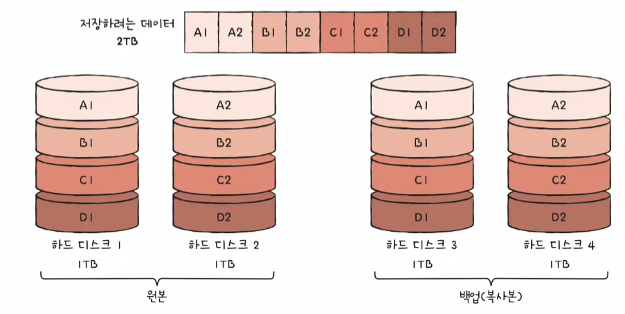
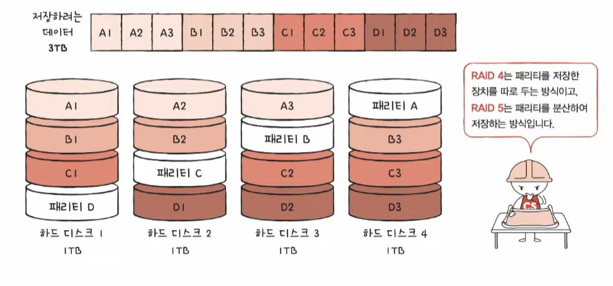
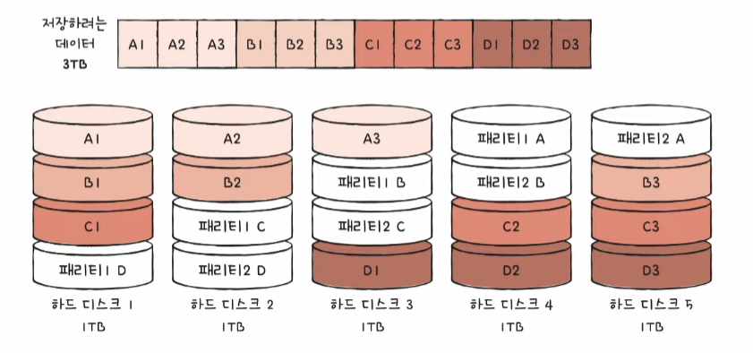

# 다양한 보조기억장치

## 하드 디스크

### 하드 디스크 (HDD; Hard Disk Drive)

- _자기적인 방식으로 데이터를 저장하는 보조기억장치_
  - 이 때문에 `자기 디스크(magnetic disk)`의 일종으로 지칭하기도 함
- 생김새나 동작 방식이 CD나 LP와 비슷함
  - 동그란 원판에 데이터를 저장하고, 그것을 회전시켜 뾰족한 리더기로 데이터를 읽음

### 하드 디스크 구성

- `플래터(platter)`
  - 하드 디스크에서 실질적으로 데이터가 저장되는 곳
  - 자기 물질로 덮여 있어 수많은 N극과 S극을 저장함
  - N극과 S극은 0과 1의 역할을 수행함
- `스핀들(spindle)`
  - 플래터를 회전시키는 구성 요소
  - 스핀들이 플래터를 돌리는 속도 표현 -> RPM(Revolution Per Minute)
- `헤드(head)`
  - 플래터를 대상으로 데이터를 읽고 쓰는 구성 요소
  - 디스크 암에 부착되어 있음
- `디스크 암(disk arm)`
  - 원하는 위치로 헤드를 이동시킴

_많은 양의 데이터를 저장하기 위해_ 하드 디스크는 일반적으로 여러 겹의 플래터로 이루어져 있고 플래터 양면을 모두 사용할 수 있다.

### 하드 디스크 저장 단위

플래터는 다음과 같이 나누어진다.

- `트랙(track)`
  - 플래터를 여러 동심원으로 나누었을 때 그중 하나의 원
- `섹터(sector)`
  - 트랙은 마치 피자처럼 여러 조각으로 나누어지는데, 이 한 조각을 섹터라고 함
  - 하드 디스크의 가장 작은 전송 단위
  - 하나의 섹터는 하드 디스크마다 크기가 다름
- `실린더(cylinder)`
  - 여러 겹의 플래터 상에서 같은 트랙이 위치한 곳을 모아 연결한 논리적 단위

_연속된 정보는 보통 한 실린더에 기록된다._ 이는 디스크 암을 움직이지 않고 바로 데이터에 접근할 수 있기 떄문이다.

### 하드 디스크의 데이터 접근 과정

하드 디스크가 저장된 데이터에 접근하는 시간은 크게 탐색 시간, 회전 지연, 전송 시간으로 나누어진다.

- `탐색 시간(seek time)`
  - 접근하려는 데이터가 저장된 트랙까지 헤드를 이동시키는 시간
- `최저 지연(rotational latency)`
  - 헤드가 있는 곳으로 플래터를 회전시키는 시간
- `전송 시간(transfer time)`
  - 하드 디스크와 컴퓨터 간에 데어터를 전송하는 시간

하드 디스크에서 다량의 데이터를 탐색하고 읽어 들이는 시간은 생각보다 어마어마하다. 탐색 시간과 지연 시간을 단축시키기 위해서 플래터를 빨리 돌려 RPM을 높이는 것도 중요하지만, `참조 지역성`, 즉 _접근하려는 데이터가 플래터 혹은 헤드를 조금만 옮겨도 접근할 수 있는 곳에 위치해 있는 것도 중요하다._

> **다중 헤드 디스크와 고정 헤드 디스크**
>
> 플래터의 한 면당 헤드가 하나씩 달려 있는 하드 디스크를 단일 헤드 디스크(single-head disk) 또는 이동 헤드 디스크(movable-head disk)라고 부른다.
>
> 반면 트랙별로 여러 개 달려 있는 하드 디스크는 다중 헤드 디스크(multiple-head disk) 또는 고정 헤드 디스크(fixed-head disk)라고 부른다. 트랙마다 헤드가 있기 때문에 탐색 시간이 들지 않는다. 따라서 다중 헤드 디스크는 탐색 시간이 0이다.

## 플래시 메모리

### 플래시 메모리(flash memory)

전기적으로 데이터를 읽고 쓸 수 있는 **반도체 기반**의 저장 장치다. 우리가 일상적으로 접하는 거의 모든 전자 제품 안에 플래시 메모리가 내장되어 있다고 봐도 무방하다.

> 플래시 메모리의 수명
>
> 플래시 메모리와 하드 디스크에는 수명이 있다. 한 셀에 일정 횟수 이상 데이터를 쓰고 지우면 그 셀은 더 이상 데이터를 저장할 수 없다.

### 플래시 메모리의 타입

플래시 메모리에는 `셀(cell)`이라는 단위가 있다. 셀이란 _플래시 메모리에서 데이터를 저장하는 가장 작은 단위다._ 이 때 하나의 셀에 몇 비트를 저장할 수 있느냐에 따라 플래시 메모리 종류가 나뉜다.

- `SLC(Single Level Cell)`
  - 한 셀로 두 개의 정보를 표현
  - MLC나 TLC에 비해 비트의 빠른 입출력이 가능
  - 수명도 MLC나 TLC 타입보다 길다
  - 용량 대비 가격이 높음
  - 보통 기업에서 데이터를 읽고 쓰기가 매우 많이 반복되며 고성능의 빠른 저장 장치가 필요한 경우에 사용
- `MLC(Multiple Level Cell)`
  - 한 셀로 네 개의 정보를 표현
  - SLC 타입보다 일반적으로 속도와 수명이 떨어지지만, 한 셀에 두 비트씩 저장할 수 있으므로 _대용화하기 유리함_
  - SLC 타입보다 용량 대비 가격이 저렴함
  - 시중에서 사용되는 많은 플래시 메모리 저장 장칟르이 MLC 또는 TLC 타입으로 만들어짐
- `TLC(Triple Level Cell)`
  - 한 셀로 여덟 개의 정보를 표현 => 대용화하기 유리
  - SLC나 MLC 타입보다 수명과 속도가 떨어지지만 용량 대비 가격도 저렴

같은 용량의 플래시 메모리 저장 장치라고 할지라도 셀의 타입에 따라 수명, 가격, 성능 등이 다르다. 

### 플래시 메모리의 저장 단위

플래시 메모리의 가장 작은 단위인 셀보다 더 큰 단위들이 있다.

- `페이지(page)` : 셀들이 모여 만들어진 단위
- `블록(block)` : 페이지가 모여 만들어진 단위
- `플레인(plane)` : 플레인이 모여 만들어진 단위

플래시 메모리에서 **읽기와 쓰기**는 **페이지 단위**로 이루어진다. **삭제**는 페이지보다 큰 **블록 단위**로 이루어진다. 즉, 읽기/쓰기 단위와 삭제 단위가 다르다.

이 때 페이지는 세 개의 상태를 가질 수 있다.

- Free 상태 : 어떠한 데이터도 저장하고 있지 않아 새로운 데이터를 저장할 수 있는 상태
- Valid 상태 : 이미 유효한 데이터를 저장하고 있는 상태
- Invalid 상태 : 쓰레기값이라 부르는 유효하지 않은 데이터를 저장하고 있는 상태

플래시 메모리는 하드 디스크와는 달리 덮어쓰기가 불가능하여 Valid 상태인 페이지에는 새 데이터를 저장할 수 없다.

### 플래시 메모리의 동작 예시

`A`, `B`, `C` 데이터가 저장되어 있는 블록에서 `A`만 `A'` 값으로 변경하고 싶다고 하자. 플래시 메모리에서는 덮어쓰기가 불가능하므로 기존의 `A` 데이터를 저장한 페이지를 Invalid 상태 즉, 유효하지 않은 쓰레기값이 되고, 새로운 `A` 데이터가 저장된다. 결과적으로 이 블록의 Valid 페이지는 `B`, `C`, `A'`가 되고 `A`가 저장되어 있던 페이지는 Invalid 상태이다.

이와 같은 상황에서 `A`와 같이 쓰레기값을 저장하고 있는 것은 용량 낭비다. 때문에 최근 SSD를 비롯한 플래시 메모리는 이런 쓰레기값을 정리하기 위해 `가비지 컬렉션(garbage collection)` 기능을 제공한다.

가비지 컬렉션은 유효한 페이지들만을 새로운 블록으로 복사한 뒤, 기존의 블록을 삭제한다. 플래시 메모리에서 삭제는 블록 단위로만 수행되기 때문이다.

# RAID의 정의와 종류

## RAID의 정의

- `RAID(Redundant Array of Independent Disks)`
  - 데이터의 안정성 혹은 높은 성능을 위해 여러 개의 물리적 보조기억장치를 마치 하나의 논리적 보조기억장치처럼 사용하는 기술
  - 주로 하드디스크와 SSD를 사용함

## RAID의 종류

RAID를 구성하는 방법은 여러 가지가 있는데, 일들을 RAID 레벨이라고 표현한다. RAID 레벨에는 RAID 0, RAID 1, RAID 2, RAID 3, RAID 4, RAID 5, RAID 6과 여기서 파생된 RAID 10, RAID 50 등이 있다.

### RAID 0

- 여러 개의 보조기억장치에서 데이터를 단순히 나누어 저장하는 구성 방식
- 데이터를 저장할 때 각 하드 디스크는 번갈아 가며 데이터를 저장한다.
  - -> 저장되는 데이터가 하드 디스크 개수만큼 나뉘어 저장된다.
- `스트라입(stripe)` : 줄무늬처럼 분산되어 저장된 데이터
- `스트라이핑(striping)` : 분산하여 저장하는 것
- 저장된 데이터를 읽고 쓰는 속도가 빨라진다. 여러 장치에서 동시에 읽고 쓸 수 있기 때문
- *저장된 정보가 안전하지 않다.*
  - 구성된 하드 디스크 중 하나에 문제가 생긴다면 모든 하드 디스크의 정보를 읽는데 문제가 생길 수 있다. => **RAID 1** 탄생

### RAID 1

- 복사본을 만드는 방식
- 거울처럼 완전한 복사본을 만드는 구성이기 때문에 `미러링(mirroring)`이라고도 부른다.
- *복구가 매우 간단하다.*
- 사용 가능한 용량이 적어진다.
- 많은 양의 하드 디스크가 필요하게 되고, *비용이 증가한다.*

### RAID 4

- RAID 1처럼 완전한 복사본을 만드는 대신 오류를 검출하고 복구하기 위한 정보를 저장한 장치를 두는 구성 방식
- `패리티 비트(parity bit)` : 오류를 검출하고 복구하기 위한 정보
- 패리티를 저장한 장치를 이용해 다른 장치들의 오류를 검출하고, 오류가 있다면 복구한다.
- 어떤 새로운 데이터가 저장될 때마다 패리티를 저장하는 디스크에도 데이터를 쓰게 된다.
  - => 패리티를 저장하는 장치에 병목 현상이 발생하는 문제가 있음

### RAID 5

- 패리티 정보를 분산하여 저장하는 방식으로 RAID 4의 병목 현상 문제를 해소한다.

### RAID 6

- 구성은 기본적으로 RAID 5와 같으나, 서로 다른 두 개의 패리티를 두는 방식이다.
  - => 오류를 검출하고 복구할 수 있는 수단이 두 개가 생긴 셈이다.
  - 따라서 RAID 4나 RAID 5보다 안전한 구성이라고 볼 수 있다.
- *데이터 저장 속도를 조금 희생하더라도 데이터를 더욱 안전하게 보관하고 싶을 때 사용하는 방식이다.*
  - 새로운 정보를 저장할 때마다 저장할 패리티도 두 개이기 때문에 쓰기는 RAID 5보다 느리다.

