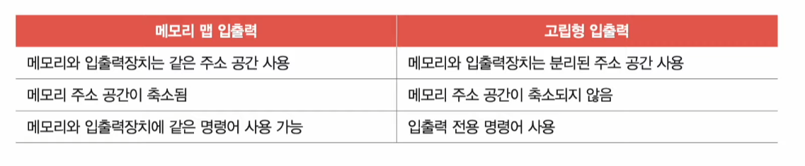
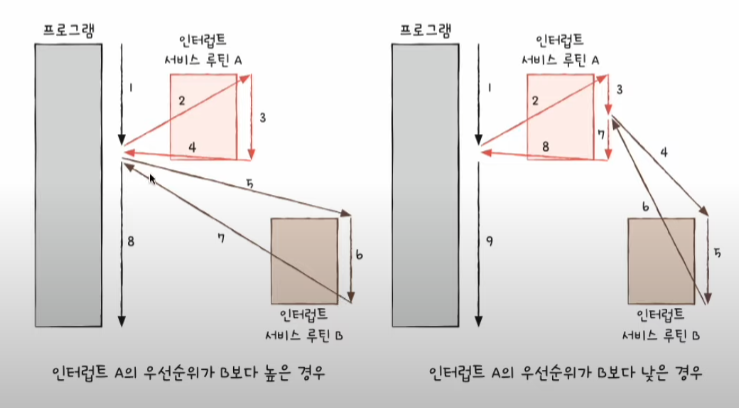
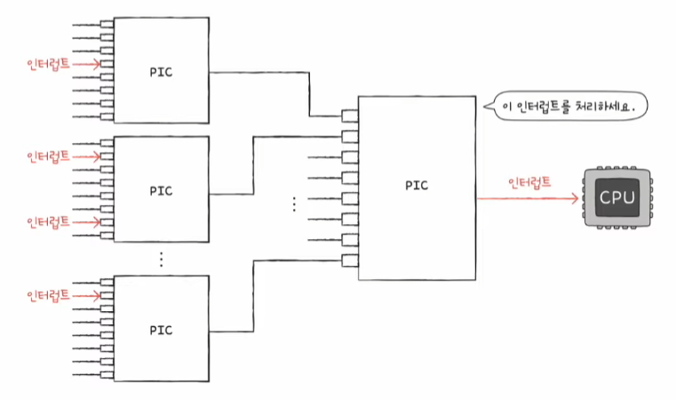
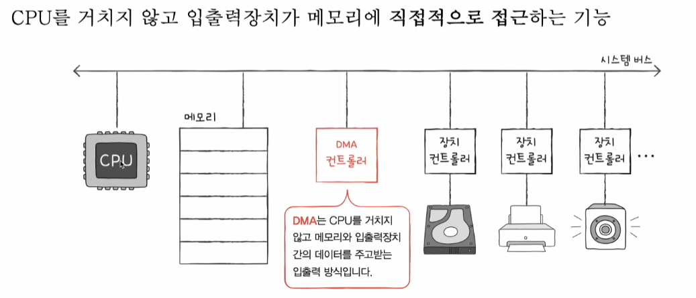
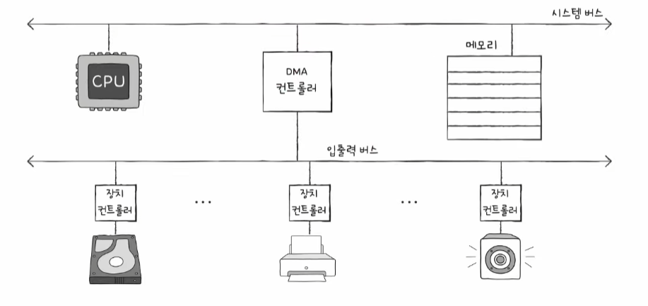
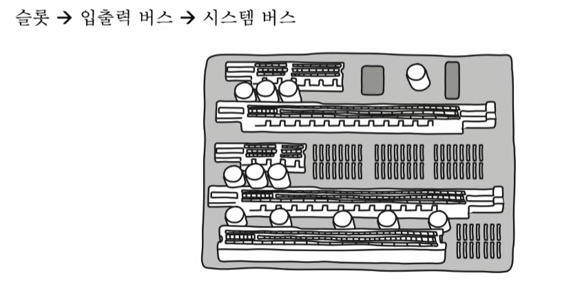

# 장치 컨트롤러와 장치 드라이버

## 장치 컨트롤러

### 입출력장치가 다루기 까다로운 이유

입출력장치는 CPU, 메모리보다 다루기 까다롭다. 그 이유는 다음과 같다.

1. 입출력 장치에는 종류가 너무나도 많다.
- 입출력 장치에는 키보드, 모니터, USB 메모리, CD-ROM, SSD, 마우스 등 굉징히 많은 종류가 있으며 이들은 각각 다양한 속도, 데이터, 전송 형식 등을 가지고 있다.
- *다양한 입출력장치와 정보를 주고받는 방식을 규격화하기 어렵다.*

2. 일반적으로 CPU와 메모리의 데이터 전송률은 높지만, 입출력장치의 데이터 전송률은 낮다.
- `전송률(transfer rate)` : 데이터를 얼마나 빨리 교환할 수 있는지를 나타내는 지표
- CPU나 메모리와 전송률이 비슷하지 않기 때문에 통신을 어렵게 한다.

위와 같은 이유로 입출력장치는 *컴퓨터에 직접 연결되지 않고 `장치 컨트롤러(device controller)`라는 하드웨어를 통해 연결된다.* 장치 컨트롤러는 `입출력 제어기(I/O controller)`, `입출력 모듈(I/O module)` 등으로도 불린다.

모든 입출력장치는 각자의 장치 컨트롤러를 통해 컴퓨터 내부와 정보를 주고받고, 장치 컨트롤러는 하나 이상의 입출력장치와 연결되어 있다.

### 장치 컨트롤러의 역할

장치 컨트롤러는 다음과 같은 역할을 통해 앞에서 언급한 문제들을 해결한다.

- CPU와 입출력장치 간의 통신 중개
- 오류 검출
- 데이터 버퍼링
  - `버퍼링(buffering)` : 전송률이 높은 장치와 낮은 장치 사이에 주고받는 데이터를 `버퍼(buffer)`라는 임시 공간에 저장하여 전송률을 비슷하게 맞추는 방법
  - **전송률 차이**를 데이터 버퍼링으로 완화한다.

### 장치 컨트롤러의 구조

- `데이터 레지스터(data register)`
  - CPU와 입출력장치 사이에 주고받을 데이터가 담기는 레지스터 (버퍼 역할)
  - 최근 주고받는 데이터가 많은 입출력장치에서는 레지스터 대신 RAM을 사용하기도 한다.
- `상태 레지스터(status register)`
  - 입출력 작업 준비 여부, 작업 완료, 오류 유무 등의 상태 정보 저장
- `제어 레지스터(control register)`
  - 입출력장치가 수행할 내용에 대한 제어 정보와 명령 저장

## 장치 드라이버

- `장치 드라이버(device driver)`
  - 장치 컨트롤러의 동작을 감지하고 제어함으로써 *장치 컨트롤러가 컴퓨터 내부와 정보를 주고받을 수 있게 하는 프로그램*
  - 입출력장치를 연결하기 위한 소프트웨어적인 통로

# 다양한 입출력 방법

## 프로그램 입출력

- `프로그램 입출력(programmed I/O)` : 프로그램 속 명령어로 입출력장치를 제어하는 방법

CPU가 프로그램 속 명령어를 실행하는 과정에서 입출력 명령어를 만나면 CPU는 입출력장치에 연결된 장치 컨트롤러와 상호작용하며 입출력 작업을 수행한다.

CPU가 장치 컨트롤러에 내리는 명령어를 표현하고 메모리에 저장하는 방법은 두 가지가 있다.

- `메모리 맵 입출력(memory-mapped I/O)`
  - 메모리에 접근하기 위한 주소 공간과 입출력장치에 접근하기 위한 주소 공간을 하나의 주소 공간으로 간주하는 방법
  - 메모리에 접근하는 명령어와 입출력장치에 접근하는 명령어는 다를 필요가 없다.
- `고립형 입출력(isolated I/O)`
  - 메모리를 위한 주소 공간과 입출력장치를 위한 주소 공간을 분리하는 방법
  - 입출력장치에 접근하기 위해 메모리에 접근하는 명령어와는 다른 입출력 명령어를 사용한다.

## 인터럽트 기반 입출력

- `인터럽트 기반 입출력(Interrupt-Driven I/O)` : 인터럽트를 기반으로 하는 입출력

입출력장치에 의한 하드웨어 인터럽트는 입출력장치가 아닌 *장치 컨트롤러에 의해 발생한다.* 

CPU는 장치 컨트롤러에 입출력 작업을 명령하고, 장치 컨트롤러가 입출력장치를 제어하며 입출력을 수행하는 동안 CPU는 다른 작업을 할 수 있다. 장치 컨트롤러가 입출력 작업을 끝낸 뒤 CPU에게 인터럽트 요청 신호를 보내면 CPU는 하던 일을 잠시 백업하고 ISR을 실행한다.

### 여러 입출력장치에서 인터럽트가 동시에 발생한 경우

**인터럽트가 발생한 순서대로 인터럽트를 처리할 때**
 => 인터럽트 중에서도 더 빨리 처리해야 하는 인터럽트가 있기 때문에 현실적으로 어려움

즉, CPU는 인터럽트 간에 우선순위를 고려하여 우선순위가 높은 인터럽트 순으로 여러 인터럽트를 처리할 수 있다.

- `NMI(Non-Maskable Interrupt)` : 인터럽트 비트를 비활성화해도 무시할 수 없는 인터럽트
- `프로그래머블 인터럽트 컨트롤러(PIC; Programmable Interrupt Controller)`
  - 여러 장치 컨트롤러에 연결되어 장치 컨트롤러에서 보낸 하드웨어 인터럽트 요청들의 우선순위를 판별한 뒤, CPU에 지금 처리해야 할 하드웨어 인터럽트는 무엇인지 알려주는 장치
  - **NMI**까지 우선순위를 파악하지는 않는다.
    - => **NMI**는 우선순위가 가장 높아 *우선순위 판별이 불필요하기 때문이다.*
    - PIC가 우선순위를 조정해 주는 인터럽트는 *인터럽트 비트를 통해 막을 수 있는 하드웨어 인터럽트다.*
  - 일반적으로 더 많고 복잡한 장치들에서 동시다발적으로 발생하는 인터럽트를 관리하기 위해 PIC를 두 개 이상 계층적으로 구성한다.

## DMA 입출력

**프로그램 기반 입출력**과 **인터럽트 기반 입출력** 모두 *입출력장치와 메모리 간의 데이터 이동은 CPU가 주도하고, 이동하는 데이터도 반드시 CPU를 거친다.*
 => CPU는 입출력장치를 위한 연산 때문에 시간을 뺏기게 된다.

- `DMA(Direct Memory Access)`
  - 입출력장치와 메모리가 CPU를 거치지 않고도 상호작용할 수 있는 입출력 방식
  - 직접 메모리에 접근할 수 있는 입출력 기능
  - DMA 입출력을 하기 위해 시스템 버스에 연결된 `DMA 컨트롤러`라는 하드웨어가 필요하다.

### DMA 입출력 과정

1. CPU는 DMA 컨트롤러에 입출력 작업을 명령
2. DMA 컨트롤러는 CPU 대신 장치 컨트롤러와 상호작용하며 입출력 작업을 수행
3. 입출력 작업이 끝나면 DMA 컨트롤러는 인터럽트를 통해 CPU에 작업이 끝났음을 알림

CPU는 DMA 컨트롤러에게 입출력 작업 명령을 내리고, 인터럽트만 받으면 되기 때문에 작업 부담을 훨씬 줄일 수 있다. 즉, CPU는 오로지 입출력의 시작과 끝에만 관여하면 된다.

### 입출력 버스

DMA 컨트롤러는 시스템 버스로 메모리에 직접 접근이 가능하지만, *시스템 버스는 동시 사용이 불가능하다.* 이 때문에 DMA 컨트롤러는 CPU가 시스템 버스를 이용하지 않을 때마다 조금씩 시스템 버스를 이용하거나, CPU가 일시적으로 시스템 버스를 이용하지 않도록 허락을 구하고 시스템 버스를 집중적으로 이용한다. 이를 CPU 입장에서는 버스에 접근하는 주기를 도둑 맞는 것처럼 보여 `사이클 스틸링(cycle stealing)`이라고 부른다.

DMA를 위해 시스템 버스를 너무 자주 사용하면 그만큼 CPU가 시스템 버스를 이용하지 못한다. 이 문제는 DMA 컨트롤러와 장치 컨트롤러들을 `입출력 버스(input/output bus)`라는 별도의 버스에 연결하여 해결할 수 있다. 

`입출력 버스`를 사용하면 DMA 컨트롤러와 장치 컨트롤러가 서로 데이터를 전송할 때는 시스템 버스를 이용할 필요가 없으므로 *시스템 버스의 사용 빈도를 줄일 수 있다.*

현대 대부분 컴퓨터에는 입출력 버스가 있다. 즉, 대부분의 입출력장치(장치 컨트롤러)는 시스템 버스가 아닌 입출력 버스와 연결된다.

- 입출력 버스의 종류
  - PCI(Peripheral Component Interconnect) 버스, PCI Express(PCIe) 버스 등
  - PC에 연결되는 대부분의 입출력장치들은 입출력 버스와 연결되는 통로를 통해 시스템 버스를 타고 CPU와 정보를 주고받는다.
  - 아래 그림은 여러 입출력장치들을 PCIe 버스와 연결해 주는 통로다.

> **더욱 발전한 DMA, 입출력 채널**
>
> DMA를 통해 CPU의 부담이 많이 줄었지만, 여전히 입출력 명령어의 인출, 해석, 실행하는 역할은 상당 부분 CPU의 몫이었다. 최근에는 메모리에 직접 접근할 뿐만 아니라 입출력 명령어를 직접 인출, 해석, 실행까지 하는 일종의 입출력 전용 CPU가 만들어졌다. 이를 `입출력 프로세서(IOP; Input/Output Processor)` 혹은 `입출력 채널(Input/Output Channel)`이라고 부른다. 
> 
> 실제로 일부 최신 입출력장치 내부에는 별도의 CPU가 포함되어 있다.
