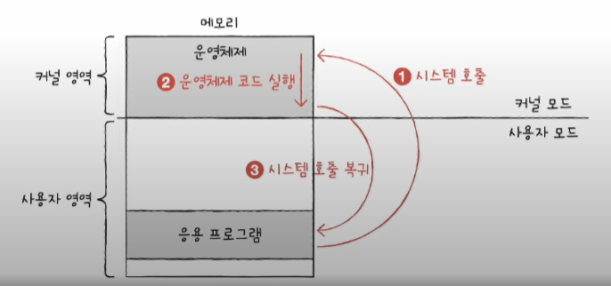
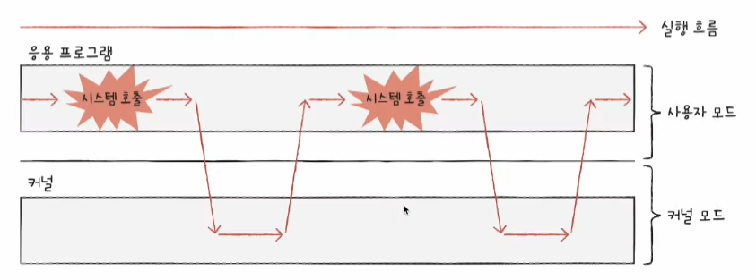

# 운영체제를 알아야 하는 이유

## 운영체제란

- `자원(시스템 자원)`
  - 프로그램 실행에 마땅히 필요한 요소들
- `운영체제(operating system)`
  - 실행할 프로그램에 필요한 자원을 할당하고, 프로그램이 올바르게 실행되도록 돕는 특별한 프로그램

### 운영체제의 역할

- 사용자 영역에 적재된 프로그램들에 자원을 할당하고 이들이 올바르게 실행되도록 돕는다.
  - 운영체제는 컴퓨터 부팅 시 메모리 내 `커널 영역(kernel space)`에 적재되어 실행된다.
  - 응용 프로그램은 `사용자 영역(user space)`에 적재된다.
  - `응용 프로그램(application software)` : 사용자가 특정 목적을 위해 사용하는 일반적인 프로그램
- 실행할 프로그램을 메모리에 적재하고, 더 이상 실행되지 않는 프로그램을 메모리에서 삭제하며 *지속적으로 메모리 자원을 관리한다.*
- *응용 프로그램에 자원을 효율적으로 배분*하고, 실행할 프로그램들이 *지켜야 할 규칙을 만들어 컴퓨터 시스템 전체를 관리한다.*

## 운영체제를 알아야 하는 이유

개발자가 만든 대부분의 프로그램은 하드웨어가 실행하고, 그 하드웨어를 조작하는 프로그램이 운영체제다.

운영체제는 현재 하드웨어의 상태, 코드 실행 과정, 하드웨어에서 발생한 장애 등을 상세하게 알려줄 수 있고, 이를 통해 **문제 해결**의 실마리를 찾을 수 있다.

즉, 운영체제를 깊이 이해하면 운영체제가 건네는 말을 제대로 이해할 수 있고, 운영체제에 제대로 명령할 수 있다. 결과적으로 하드웨어와 프로그램을 더 깊이 이해할 수 있다.

# 운영체제의 큰 그림

## 운영체제의 심장, 커널

- `커널(kernel)`
  - 운영체제의 핵심 서비스를 담당하는 부분
    - 자원에 접근하고 조작
    - 프로그램이 올바르고 안전하게 실행되게 하는 기능
  - 어떤 커널을 사용하는지에 따라 개발하는 프로그램이 하드웨어를 이용하는 양상이 달라지고, 결과적으로 컴퓨터 전체의 성능도 달라질 수 있음
- `사용자 인터페이스(UI; User Interface)`
  - 사용자가 컴퓨터와 상호작용할 수 있는 통로
  - `그래픽 유저 인터페이스(GUI; Graphical User Interface)` : 그래픽을 기반으로 컴퓨터와 상호작용할 수 있는 인터페이스
  - `커맨드 라인 인터페이스(CUI; Command Line Interface)` : 명령어를 기반으로 컴퓨터와 상호작용할 수 있는 인터페이스

## 이중 모드와 시스템 호출

운영체제는 응용 프로그램들이 자원에 접근하려고 할 때 오직 자신을 통해서 접근하도록 하여 자원을 보호한다. 이러한 운영체제의 문지기 역할은 이중 모드로써 구현된다. `이중 모드(dual mode)`란 CPU가 명령어를 실행하는 모드를 크게 **사용자 모드**와 **커널 모드**로 구분하는 방식이다.

- `사용자 모드(user mode)`
  - 운영체제 서비스를 제공받을 수 없는 실행 모드(커널 영역의 코드를 실행 못함)
  - 일반적인 응용 프로그램은 사용자 모드로 실행됨
  - 사용자 모드로 실행되는 일반적인 응용 프로그램은 자원에 접근할 수 없음
- `커널 모드(kernel mode)`
  - 운영체제 서비스를 제공받을 수 있는 실행 모드(커널 영역의 코드를 실행할 수 있음)
  - 자원에 접근할 수 있음
- `시스템 호출(system call)`
  - 사용자 모드로 실행되는 프로그램이 자원에 접근하는 운영체제 서비스를 제공받으려면 운영체제에 요청을 보내 *커널 모드로 전환되어야* 한다.
    - 이러한 요청을 시스템 호출이라고 한다.
  - 일종의 인터럽트, 정확하게는 소프트웨어 인터럽트

**시스템 호출의 작동 예**

1. 하드 디스크에 데이터를 저장하는 시스템 호출을 발생시켜 커널 모드로 전환
2. 운영체제 내의 '하드 디스크에 데이터를 저장하는 코드'를 실행함으로써 하드 디스크에 접근
3. 하드 디스크에 접근이 끝났다면 다시 사용자 모드로 복귀하여 실행을 계속

일반적으로 응용 프로그램은 실행 과정에서 운영체제 서비스들을 매우 빈번하게 이용한다. 그 과정에서 *빈번하게 시스템 호출을 발생시키고 사용자 모드와 커널 모드를 오가며 실행된다.*

## 운영체제의 핵심 서비스

### 프로세스 관리

- `프로세스(process)` : 실행 중인 프로그램

CPU는 한 프로세스를 실행하다가 다른 프로세스로 실행을 전환하고, 그 프로세스를 실행하다가 또 다른 프로세스로 실행을 전환하는 것을 반복한다.

=> *운영체제는 다양한 프로세스를 일목요연하게 관리하고 실행할 수 있어야 한다.* 또한 프로세스 동기화가 필수적이고 교착 상태를 해결해야 한다.

> - 프로세스 동기화 : 여러 프로세스가 동시에 실행되는 환경에서 필수적
> - 교착 상태 : 프로세스가 꼼짝도 못하고 더 이상 실행되지 못하는 상황

### 자원 접근 및 할당

모든 프로세스는 실행을 위해 자원을 필요로 한다. 그리고 운영체제는 *프로세스들이 사용할 자원에 접근하고 조작함으로써 프로세스에 필요한 자원을 할당해 준다.*

- CPU
  - 운영체제는 *프로세스들에 공정하게 CPU를 할당해야 함*
  - CPU 스케줄링 : 어떤 프로세스부터 CPU를 사용할지, 얼마나 오래 CPU를 이용하게 할지 결정하는 것
- 메모리
  - 운영체제는 *새로운 프로세스가 적재될 때마다 어느 주소에 적재해야 할지를 결정해야 함*
  - 14장에서 자세하게 다룸
- 입출력장치
  - 인터럽트 서비스 루틴(이하 ISR)은 커널 영역에 있음
  - 운영체제는 *ISR을 제공함으로써 입출력 작업을 수행함*

### 파일 시스템 관리

파일 열기, 생성, 삭제 등과 디렉터리 등의 관리는 `파일 시스템(file system)`으로, 운영체제가 지원하는 핵심 서비스다.
