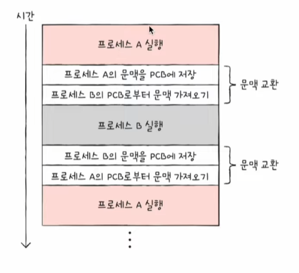

# 프로세스 개요

## 프로세스 직접 확인하기

- `포그라운드 프로세스(foreground process)` : 사용자가 보는 앞에서 실행되는 프로세스
- `백그라운드 프로세스(background process)` : 사용자가 보지 못하는 뒤편에서 실행되는 프로세스
- `데몬(daemon)` / `서비스(service)`
  - 사용자와 상호작용하지 않고 그저 묵묵히 정해진 일만 수행하는 백그라운드 프로세스
  - 유닉스 체계의 운영체제에서는 데몬, 윈도우 운영체제에서는 서비스라고 부름

## 프로세스 제어 블록

- `프로세스 제어 블록(PCB; Process Control Block)`
  - 프로세스와 관련된 정보를 저장하는 자료 구조
  - 운영체제에서 *빠르게 번갈아 수행되는 프로세스의 실행 순서를 관리하고, 프로세스에 CPU를 비롯한 자원을 배분하기 위해 이용*
  - 커널 영역에 생성됨
  - 운영체제는 *PCB로 특정 프로세스를 식별하고 해당 프로세스를 처리하는데 필요한 정보를 판단함*
  - 프로세스 생성 시에 만들어지고 실행이 끝나면 폐기됨

아래는 PCB에 담긴 정보들을 설명한다.

- 프로세스 ID
  - `프로세스 ID(PID; Process ID)` : 특정 프로세스를 식별하기 위해 부여하는 고유한 번호
-  레지스터 값
   -  프로세스는 자신의 실행 차례가 돌아오면 이전까지 사용했던 레지스터의 중간값들을 모두 복원한다.
   => PCB에는 해당 프로세스가 실행하며 사용했던 프로그램 카운터를 비롯한 레지스터 값들이 담김
- 프로세스 상태
  - 현재 프로세스가 어떤 상태인지도 PCB에 기록되어야 한다.
- CPU 스케줄링 정보
  - 프로세스 언제, 어떤 순서로 CPU를 할당받을지에 대한 정보
- 모메리 관리 정보
  - 프로세스가 어느 주소에 저장되어 있는지에 대한 정보
  - 프로세스의 메모리 주소를 알기 위한 또 다른 중요한 정보인 페이지 테이블 정보
- 사용한 파일과 입출력장치 목록
  - 어떤 입출력장치가 이 프로세스에 할당되었는지, 어떤 파일들을 열었는지에 대한 정보

## 문맥 교환

- `문맥(context)`
  - *하나의 프로세스 수행을 재개하기 위해 기억해야 할 정보*
  - PCB에 기록되는 정보들을 문맥이라고 봐도 무방함
  - CPU 사용 시간이 다 되거나 인터럽트가 발생하면 운영체제는 해당 프로세스의 PCB 문맥을 백업함
- `문맥 교환(context switching)`
  - 기존 프로세스의 문맥을 PCB에 백업하고, 새로운 프로세스를 실행하기 위해 문맥을 PCB로부터 복구하여 새로운 프로세스를 실행하는 것

## 프로세스의 메모리 영역

### 코드 영역

`코드 영역(code segment)` 또는 `텍스트 영역(text segment)`는 실행할 수 있는 코드, 즉 기계어로 이루어진 명령어가 저장된다.

코드 영역에는 데이터가 아닌 CPU가 실행할 명령어가 담겨 있기 때문에 쓰기가 금지되어 있다. 다시 말해 코드 영역은 **읽기 전용(read-only)** 공간이다.

### 데이터 영역

`데이터 영역(data segment)`은 잠깐 썼다가 없앨 데이터가 아닌, 프로그램이 실행되는 동안 유지할 데이터가 저장되는 공간이다. `전역 변수(global variable)`가 대표적이다.

코드 영역과 데이터 영역은 그 크기가 변하지 않고, 컴파일 시에 결정된다. **코드 영역**과 **데이터 영역**은 '크기가 고정된 영역'이라는 점에서 `정적 할당 영역`이라고 부른다.

### 힙 영역

`힙 영역(heap segment)`은 프로그래머가 직접 할당할 수 있는 저장 공간이다. 

힙 영역에 메모리 공간을 할당했다면 언젠가는 해당 공간을 반환해야 한다. 그렇지 않으면 할당한 공간은 메모리 내에 계속 남아 메모리 낭비를 초래하며, 이를 `메모리 누수(memory leak)`이라고 한다. C/C++의 경우 개발자가 직접 메모리 해제를 명시해줘야 하고, Java 등의 언어에서는 GC(Garbage Collection)이 자동으로 수행한다.

### 스택 영역

`스택 영역(stack segment)`은 데이터를 일시적으로 저장하는 공간이다. 함수의 실행이 끝나면 사라지는 매개 변수, 지역 변수가 대표적이다.

**힙 영역**과 **스택 영역**은 실시간으로 그 크기가 변할 수 있기 때문에 `동적 할당 영역`이라고 부른다. 그래서 일반적으로 힙 영역은 메모리의 낮은 주소에서 높은 주소로 할당되고, 스택 영역은 높은 주소에서 낮은 주소로 할당된다. 두 영역에 데이터가 쌓여도 새롭게 할당되는 주소가 겹칠 일이 없게 하기 위해서다.

# 프로세스 상태와 계층 구조

## 프로세스 상태

운영체제는 프로세스 상태를 PCB를 통해 인식하고 관리한다. 프로세스가 가질 수 있는 대표적인 상태는 아래와 같다.

- `생성 상태(new)`
  - 프로세스를 생성 중인 상태
- `준비 상태(ready)`
  - 당장이라도 CPU를 할당받아 실행할 수 있지만, 아직 자신의 차례가 아니기에 기다리고 있는 상태
  - 준비 상태인 프로세스가 실행 상태로 전환되는 것을 디스패치(dispatch)라고 한다.
- `실행 상태(running)`
  - CPU를 할당받아 실행 중인 상태
  - 프로세스가 할당된 CPU 이용 시간을 모두 사용하면 준비 상태가 되고, 입출력 장치의 작업이 끝날 때까지 기다려야 한다면 대기 상태가 된다.
- `대기 상태(blocked)`
  - 입출력장치의 작업을 기다리는 상태
  - 입출력 작업이 완료되면 해당 프로세스는 다시 준비 상태로 CPU 할당을 기다린다.
- `종료 상태(terminated)`
  - 프로세스가 종료된 상태
  - 프로세스가 종료되면 운영체제는 CPU와 프로세스가 사용한 메모리를 정리한다.

프로세스 상태를 도표로 정리한 것을 `프로세스 상태 다이어그램(process state diagram)`이라고 한다. 프로세스는 생성, 준비, 실행, 대기, 종료 상태를 거치며 실행된다. 운영체제는 이 상태를 PCB에 기록하며 프로세스들을 관리한다.

## 프로세스 계층 구조

프로세스는 실행 도중 시스템 호출을 통해 다른 프로세스를 생성할 수 있다.

- `부모 프로세스(parent process)` : 새 프로세스를 생성한 프로세스
- `자식 프로세스(child process)` : 부모 프로세스에 의해 생성된 프로세스

부모 프로세스와 자식 프로세스는 엄연히 다른 프로세스이기에 각기 다른 PID를 가진다. 일부 운영체제에서는 자식 프로세스의 PCB에 부모 프로세스의 PID인 `PPID(Parent PID)`가 기록되기도 한다.

부모 프로세스로부터 생성된 자식 프로세스는 실행 과정에서 또 다른 자식 프로세스를 생성할 수 있고, 그 자식 프로세스는 실행 과정에서 또 다른 자식 프로세스를 생성할 수 있다. 많은 운영체제는 이처럼 *프로세스가 프로세스를 낳는 계층적인 구조로써 프로세스들을 관리한다.*

위와 같은 트리 구조를 `프로세스 계층 구조`라고 한다.

## 프로세스 생성 기법

부모 프로세스는 `fork`를 통해 *자신의 복사본을 자식 프로세스로 생성*해내고, 만들어진 복사본(자식 프로세스)은 `exec`를 통해 *자신의 메모리 공간을 다른 프로그램으로 교체*한다.

`fork`와 `exec`는 **시스템 호출**이다. **fork**는 자기 자신 프로세스의 복사본을 만드는 시스템 호출이다. 복사본이 만들어진 후 자식 프로세스는 **exec** 시스템 호출을 통해 새로운 프로그램으로 전환된다. **exec**를 호출하면 *코드 영역과 데이터 영역의 내용이 실행할 프로그램의 내용으로 바뀌고, 나머지 영역은 초기화된다.*

프로세스 계층 구조를 이루는 과정은 fork와 exec가 반복되는 과정이다. 

부모 프로세스가 자식 프로세스를 fork한 뒤에 부모 프로세스, 자식 프로세스 누구도 exec를 호출하지 않는 경우도 있다. 이 경우 부모 프로세스와 자식 프로세스는 *같은 코드를 병행하여 실행하는 프로세스가 된다.*

# 스레드

- `스레드(thread)`
  - 실행의 단위
  - 프로세스를 구성하는 실행의 흐름 단위
  - 스레드를 이용하면 하나의 프로세스에서 여러 부분을 동시에 실행할 수 있다.

## 프로세스와 스레드

스레드는 프로세스 내에서 각기 다른 스레드 ID, 프로그램 카운터 값을 비롯한 레지스터 값, 스택으로 구성된다. 각자 프로그램 카운터 값, 레지스터 값, 스택을 가지고 있기에 스레드마다 각기 다른 코드를 실행할 수 있다.

스레드들은 *실행에 필요한 최소한의 정보만을 유지한 채 프로세스 자원을 공유*하며 실행된다. 여기서 프로세스의 자원을 공유한다는 것이 스레드의 핵심이다.

## 멀티프로세스와 멀티스레드

- `멀티프로세스(multiprocess)` : 여러 프로세스를 동시에 실행하는 것
- `멀티스레드(multithread)` : 여러 스레드로 프로세스를 동시에 실행하는 것

프로세스끼리는 기본적으로 자원을 공유하지 않지만, 스레드끼리는 같은 프로세스 내의 자원을 공유한다.

여러 프로세스를 병행 실행하는 것보다 메모리를 더 효율적으로 사용할 수 있다. 또한 스레드는 프로세스의 자원을 공유하기 때문에 서로 협력과 통신에 유리하다.

다만 하나의 스레드에 문제가 생기면 프로세스 전체에 문제가 생길 수 있다.
