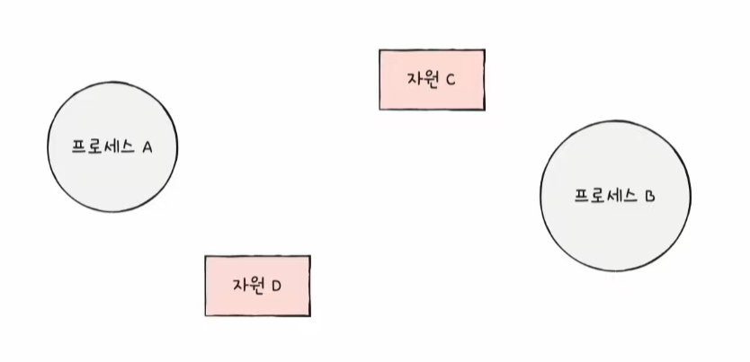
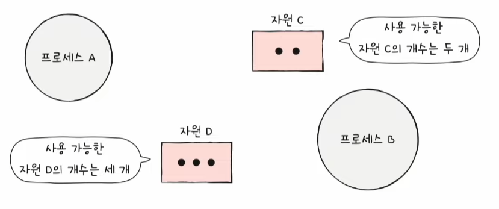
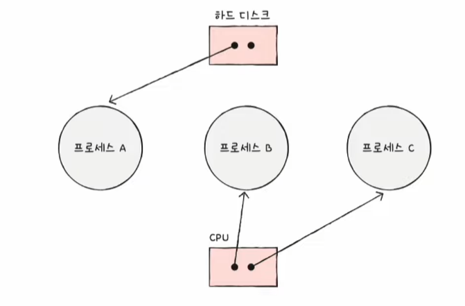
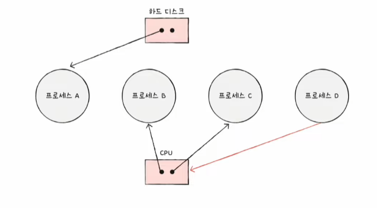
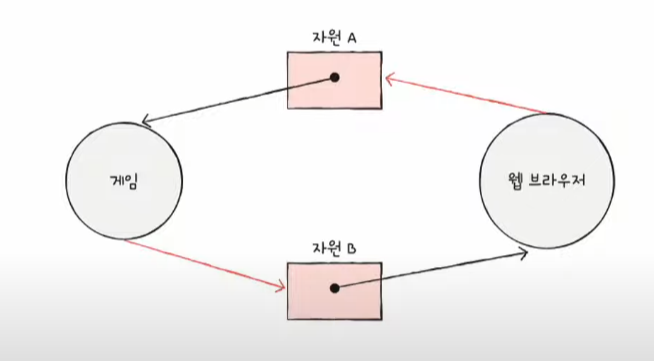

# 교착 상태란?

## 식사하는 철학자 문제

- `식사하는 철학자 문제(dining philosophers problem)`
  - 교착 상태가 **어떤 상황에서 왜 발생**하는지, 나아가 교착 상태를 **어떻게 해결**할 수 있는지를 엿볼 수 있는 가상의 문제 시나리오
  - 모든 철학자가 동시에 포크를 집어 식사를 하면 어떤 철학자도 식사를 할 수 없고 영원히 생각만 하는 상황이 발생할 수 있음
  - 일어나지 않을 사건을 기다리며 진행이 멈춰 버리는 현상 => `교착 상태(deadlock)`

교착 상태를 해결하기 위해서는

첫째, *교착 상태가 발생했을 때의 상황을 정확히 표현*하고 
둘째, *교착 상태가 일어나는 근본적인 이유에 대해 알아야* 한다.

## 자원 할당 그래프

- `자원 할당 그래프(resource-allocation graph)`
  - 어떤 프로세스가 어떤 자원을 사용할 수 있고, 또 어떤 프로세스가 어떤 자원을 기다리고 있는지를 표현하는 간단한 그래프
  - 교착 상태를 단순하게 표현할 수 있음

### 그래프 그릴 때의 규칙  

1. **프로세스는 원으로, 자원의 종류는 사각형으로 표현**

2. **사용할 수 있는 자원의 개수는 자원 사각형 내에 점으로 표현**

같은 자원이라 할지라도 사용 가능한 자원의 개수는 여러 개 있을 수 있다.

3. **프로세스가 어떤 자원을 할당받아 사용 중이라면 자원에서 프로세스를 향해 화살표를 표시**

4. **프로세스가 어떤 자원을 기다리고 있다면 프로세스에서 자원으로 화살표를 표시**

### 원의 형태 그래프

교착 상태가 발생한 상황은 자원 할당 그래프가 원의 형태를 띄고 있다.

## 교착 상태 발생 조건

교착 상태가 발생하는 네 가지 조건 중 하나라도 만족하지 않는다면 교착 상태가 발생하지 않지만, 조건이 모두 만족될 때 교착 상태가 발생할 가능성이 생긴다.

### 상호 배제

- 교착 상태 -> *해당 자원을 한 번에 하나의 프로세스만 이용 가능*하기 때문에 발생
- 즉, 한 프로세스가 사용하는 자원을 다른 프로세스가 사용할 수 없는 `상호 배제(mutual exclusion)` 상황에서 교착 상태가 발생할 수 있다.

### 점유와 대기

- `점유와 대기(hold and wait)` : 자원을 할당받은 상태에서 다른 자원을 할당받기를 기다리는 상태

### 비선점

- 교착상태가 발생하게 된 또 하나의 근본적인 문제 -> `비선점(nonpreemptive)`
- 어떤 프로세스도 다른 프로세스의 자원을 강제로 빼앗지 못했기 때문에 교착 상태가 발생함

### 원형 대기

- 프로세스들과 프로세스가 요청 및 할당받은 자원이 원의 형태를 이루었기 때문에 교착 상태 발생
- `원형 대기(circular wait)` : 프로세스들이 원의 형태로 자원을 대기하는 것
- 자원 할당 그래프가 *원의 형태를 띈다고 해서 반드시 교착 상태가 발생하는 것은 아님*

# 교착 상태 해결 방법

## 교착 상태 예방

**교착 상태 예방**을 위해서는 교착 상태 발생 필요 조건 중 네 가지 중 하나를 충족하지 못하게 해야 한다.

### 상호 배제 없애기

*모든 자원을 공유 가능하게* 만들면 된다. 그러나 현실적으로 모든 자원의 상호 배제를 없애기는 어렵기에 *현실에서 사용하기에는 다소 무리*가 있다.

### 점유와 대기 없애기

점유와 대기를 없애면 **운영체제**는 *특정 프로세스에 자원을 모두 할당하거나, 아예 할당하지 않는 방식으로 배분*한다. 이 때의 단점은 다음과 같다.

- 자원의 활용률이 낮아짐
  - 당장 자원이 필요해도 기다릴 수밖에 없는 프로세스와 사용되지 않으면서 오랫동안 할당되는 자원을 다수 양산하기 때문
- 많은 자원을 사용하는 프로세스가 불리해짐 -> 기아 현상 야기

### 비선점 조건 없애기

이 방식은 CPU와 같이 *선점하여 사용할 수 있는 일부 자원에 대해서는 효과적*이다. 

그러나 모든 자원이 이렇게 선점 가능하지 않다. 한 프로세스의 작업이 끝날 때까지 다른 프로세스가 기다려야 하는 자원도 얼마든지 있다. 때문에 *다소 범용성이 떨어지는 방안*이다.

### 원형 대기 조건 없애기

*모든 자원에 번호를 붙이고, 오름차순으로 자원을 할당한다.*

- 모든 컴퓨터 시스템 내에 존재하는 수많은 자원에 번호를 붙이는 일은 간단하지 않음
- 각 자원에 어떤 번호를 붙이는지에 따라 특정 자원의 활용률이 떨어질 수 있음

### 요약

교착 상태를 사전에 방지하는 예방 방식은 *교착 상태가 발생하지 않음을 보장할 수는 있지만 여러 부작용이 따른다.*

## 교착 상태 회피

**교착 상태 회피**는 *프로세스들에 배분할 수 있는 자원의 양을 고려하여 교착 상태가 발생하지 않을 정도의 양만큼만 자원을 배분하는 방법*이다. 이 방식에서는 `교착 상태`를 *한정된 자원의 무분별한 할당으로 인해 발생하는 문제*로 간주한다.

- `안전 상태(safe state)`
  - 교착 상태가 발생하지 않고 모든 프로세스가 정상적으로 자원을 할당받고 종료될 수 있는 상태
  - 안전 순서열대로 프로세스들에 자원을 배분하여 교착 상태가 발생하지 않는 상태
- `불안전 상태(unsafe state)`
  - 교착 상태가 발생할 수도 있는 상황
  - 안전 순서열이 없는 상황
- `안전 순서열(safe sequence)`
  - 교착 상태 없이 안전하게 프로세스들에 자원을 할당할 수 있는 순서

프로세스들에게 안전 순서열대로 자원을 배분하면, 모두 자원을 할당받고 교착 상태 없이 올바르게 작업을 마칠 수 있다. 즉, **운영체제가 교착 상태를 회피**하기 위해서는 *시스템 상태가 안전 상태에서 안전 상태로 움직이는 경우에만 자원을 할당*하면 된다.

## 교착 상태 검출 후 회복

**교착 상태 검출 후 회복**은 *교착 상태 발생을 인정하고 사후에 조치하는 방식*이다. 

이 방식에서 **운영체제**는 *프로세스들이 자원을 요구할 때마다 그때그때 모두 할당하며, 교착 상태 발생 여부를 주기적으로 검사*한다. 교착 상태가 검출되면 다음과 같은 방식으로 회복한다.

### 선점을 통한 회복

교착 상태가 해결될 때까지 한 프로세스씩 자원을 몰아주는 방식이다.

### 프로세스 강제 종료를 통한 회복

가장 단순하면서 확실한 방식이다. 운영체제는 프로세스 강제 종료 방식을 선택할 수 있다.

- 교착 상태에 놓인 프로세스를 모두 강제 종료
  - 한 방에 교착 상태를 해결할 수 있는 가장 확실한 방식
  - 많은 프로세스들이 작업 내역을 잃게 될 가능성이 있음
- 교착 상태가 없어질 때까지 한 프로세스씩 강제 종료
  - 작업 내역을 잃는 프로세스는 최대한 줄일 수 있음
  - 교착 상태가 없어졌는지 여부를 확인하는 과정에서 오버헤드를 야기함

## 교착 상태 무시

드물게 발생하는 잠재적 문제를 무시로 대처하는 방식인 `타조 알고리즘(ostrich algorithm)`이 있다. 문제 발생의 빈도나 심각성에 따라 최대 효율을 추구하는 엔지니어 입장에서는 때때로 *이 방식이 적합할 때도 많다.*