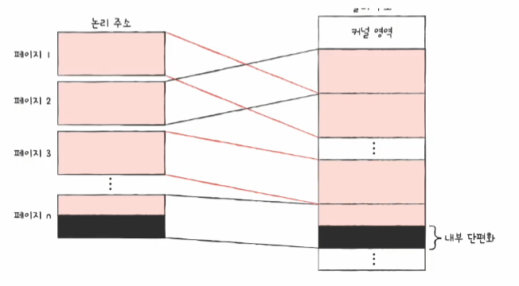
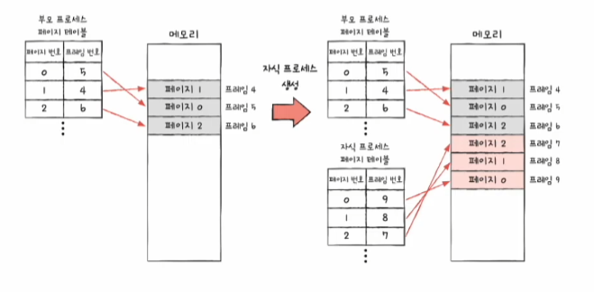

# 연속 메모리 할당

*프로세스에 연속적인 메모리 공간을 할당하는 방식*을 `연속 메모리 할당` 방식이라고 한다.

## 스와핑

- `스와핑(swapping)` : 메모리상의 빈 공간에 또 다른 프로세스를 적재하여 실행하는 방식
- `스왑 영역(swap space)` : 프로세스들이 쫓겨나는 보조기억장치의 일부 영역
- `스왑 아웃(swap out)` : 현재 실행되지 않는 프로세스가 메모리에서 스왑 영역으로 옮겨지는 것
- `스왑 인(swap in)` : 스왑 영역에 있던 프로세스가 다시 메모리로 옮겨오는 것

스와핑을 이용하면 프로세스들이 요구하는 메모리 주소 강간의 크기가 실제 메모리 크기보다 큰 경우에도 프로세스들을 동시 실행할 수 있다.

## 메모리 할당

비어 있는 메모리 공간에 프로세스를 연속적으로 할당하는 방식에는 대표적으로 3가지 방식이 있다.

### 최초 적합

- `최초 적합(first fit)`
  - 운영체제가 메모리 내의 빈 공간을 순서대로 검색하다가 적재할 수 있는 공간을 발견하면 그 공간에 프로세스를 배치하는 방식
  - 프로세스가 적재될 수 있는 공간을 발견하면 즉시 메모리를 할당하는 방식
  - **검색을 최소화**할 수 있고 결과적으로 **빠른 할당**이 가능함
- `최적 적합(best fit)`
  - 운영체제가 빈 공간을 모두 검색해 본 후, 프로세스가 적재될 수 있는 공간 중 가장 작은 공간에 프로세스를 배치하는 방식
- `최악 적합(worst fit)`
  - 운영체제가 빈 공간을 모두 검색해 본 후, 프로세스가 적재될 수 있는 공간 중 가장 큰 공간에 프로세스를 배치하는 방식

## 외부 단편화

- `외부 단편화(external fragmentation)`
  - 프로세스를 할당하기 어려울 만큼 작은 메모리 공간들로 인해 메모리가 낭비되는 현상
  - 프로세스들이 메모리에 연속적으로 할당되는 환경에서 프로세스들이 실행되고 종료되기를 반복함
    - 메모리 사이 사이에 빈 공간들이 생김
    - 빈 공간이지만 그 공간보다 큰 프로세스를 적재하기 어려운 상황을 초래 => **메모리 낭비**
  - 연속 메모리 할당은 `외부 단편화` 문제를 내포하고 있어 메모리를 효율적으로 사용하는 방법은 아니다.

실제로는 메모리 용량이 크고 적재되는 프로세스도 많기 때문에 외부 단편화로 인해 낭비되는 공간은 더욱 크다. 이 때문에 외부 단편화 문제는 반드시 해결해야할 문제다.

- `압축(compaction)`
  - 여기저기 흩어져 있는 빈 공간들을 하나로 모으는 방식
  - 메모리 내에 저장된 프로세스들을 적당히 재배치시켜 여기저기 *흩어져 있는 작은 빈 공간들을 하나의 메모리 내에 저장된 프로세스를 적당히 재배치*시켜 흩어져 있는 *작은 빈 공간들을 하나의 큰 공간으로 만드는 방법*
  - 외부 단편화를 해결할 수 있는 대표적인 방안
  - 메모리 조각 모음이라고도 함
  - 단점
    - 작은 빈 공간들을 하나로 모으는 동안 시스템은 하던 일을 중지해야 함
    - 메모리에 있는 내용을 옮기는 작업은 많은 오버헤드를 야기함
    - 어떤 프로세스를 어떻게 움직여야 오버헤드를 최소화하며 압축할 수 있는지에 대한 명확한 방법을 결정하기 어려움
  - 또 다른 해결 방안 : 가상 메모리 기법(페이징 기법)

# 페이징을 통한 가상 메모리 관리

- `가상 메모리(virtual memory)`
  - 실행하고자 하는 프로그램을 일부만 멤뢰에 적재하여 실제 물리 메모리 크기보다 더 큰 프로세스를 실행할 수 있게 하는 기술
  - 크게 **페이징**과 **세그먼테이션**이 있음
  - 현대 대부분의 운영체제는 **페이징** 기법을 사용함

## 페이징이란

외부 단편화가 생긴 근본적인 이유 -> 각기 다른 크기의 프로세스가 메모리에 연속적으로 할당되었기 때문

만약 메모리와 프로세스를 일정한 단위로 자르고, 이를 메모리에 불연속적으로도 할당할 수만 있다면 외부 단편화는 발생하지 않는다.

- `페이징(paging)`
  - 메모리의 물리 주소 공간을 `프레임` 단위로 자르고, 프로세스의 논리 주소 공간을 `페이지` 단위로 자른 뒤 각 페이지를 프레임에 할당하는 가상 메모리 관리 기법
  - `페이지(page)` : 프로세스의 논리 주소 공간을 일정한 단위로 자른 것
  - `프레임(frame)` : 메모리 물리 주소 공간을 페이지와 동일한 크기의 일정한 단위로 자른 것
  - 페이징 시스템에서의 스왑 인/스왑 아웃은 **페이지 아웃(page out) / 페이지 인(page in)** 이라고 부른다.
  - 한 프로세스를 실행하기 위해 프로세스 전체가 메모리에 적재될 필요가 없다.

## 페이지 테이블

프로세스가 메모리에 불연속적으로 배치되면 CPU 입장에서 '다음에 실행할 명령어 위치'를 찾기가 어려워진다. 이를 해결하기 위해 페이지 테이블을 사용한다.

### 페이지 테이블(page table)
- 현재 어떤 페이지가 어떤 프레임에 할당되었는지 알려줌
- 페이지 번호와 프레임 번호를 짝지어 주는 일종의 이정표
- 프로세스마다 각자의 프로세스 테이블이 있다.
- 물리 주소상에서는 프로세스들이 분산되어 저장되어 있더라도 *CPU 입장에서 바라본 논리 주소는 연속적*일 수 있다.
  - 프로세스들이 메모리에 분서되어 저장되어 있더라도 CPU는 논리 주소를 그저 순차적으로 실행하면 된다.

### 내부 단편화(internal fragmentation)

- 모든 프로세스가 페이지 크기에 딱 맞게 잘리는 것은 아니다. -> 모든 프로세스 크기가 페이지의 배수는 아니다.
- 내부 단편화는 하나의 페이지보다 작은 크기로 발생한다.
- 하나의 페이지 크기를 너무 작게 설정하면 그만큼 페이지 테이블의 크기도 커지기 때문에 페이지 테이블이 차지하는 공간이 낭비된다.
- 내부 단편화를 적당히 방지하면서, *너무 크지 않은 페이지 테이블이 만들어지도록 페이지의 크기를 조정하는 것이 중요*하다.

### 페이지 테이블 레지스터(PTBR; Page Table Base Register)

- 각 프로세스의 페이지 테이블이 적재된 주소를 가리키고 있음
- 페이지 테이블 정보들은 각 프로세스의 PCB에 기록된다. 프로세스의 문맥 교환이 일어날 때 다른 레지스터와 마찬가지로 함께 변경된다.

### TLB(Translation Lookaside Buffer)

- 페이지 테이블의 **캐시 메모리**
- 페이지 테이블을 메모리에 두면 메모리 접근 시간이 두 배로 늘어나기 때문에 사용
- 페이지 테이블의 캐시이므로 페이지 테이블의 일부 내용을 저장
  - **참조 지역성**에 근거해 *주로 최근에 사용된 페이지 위주로 가져와 저장*함
  - `TLB hit` : CPU가 발생한 논리 주소에 대한 페이지 번호가 TLB에 있을 경우
  - `TLB miss` : 페이지 번호가 TLB에 없을 경우. 이 경우 메모리 내의 페이지 테이블에 접근해야 함

## 페이징에서의 주소 변환

페이지 또는 프레임의 특정 주소에 접근하려면 아래와 같은 두 가지 정보가 필요하다.

- `페이지 번호(page number)`
  - 접근하고자 하는 페이지 번호
- `변위(offset)`
  - 접근하려는 주소가 프레임의 시작 번지로부터 얼만큼 떨어져 있는지를 알기 위한 정보

## 페이지 테이블 엔트리

- `페이지 테이블 엔트리(PTE; Page Table Entry)`
  - 페이지 테이블의 각각의 행들
  - 페이지 번호와 프레임 번호 외에도 다른 중요한 정보들이 있음

### 유효 비트(valid bit)

- 현재 해당 페이지에 접근 가능한지 여부를 알려줌
- 프레임 번호 다음으로 중요한 정보
- 현재 페이지가 메모리에 적재되어 있는지 아니면 보조기억장치에 있는지를 알려주는 비트
- `페이지 폴트(page fault)`
  - 유효 비트가 0인, 메모리에 적재되어 있지 않은 페이지로 접근하려고 할 때 발생하는 예외(Exception)
  - 하드웨어 인터럽트를 처리하는 과정과 유사함

### 보호 비트(protection bit)

- 페이지 보호 기능을 위해 존재하는 비트
- 읽고 쓰기가 모두 가능한 페이지인지, 읽기만 가능한 페이지인지를 나타냄
  - 프로세스에서 코드 영역 등은 읽기 전용 영역임
- 읽기, 쓰기, 실행하기 권한의 조합을 나타낼 수 있음
  - 읽기(Read) **r**
  - 쓰기(Write) **w**
  - 실행(eXecute) **x**

### 참조 비트(reference bit)

- CPU가 이 페이지에 접근한 적이 있는지 여부
- 적재 이후 CPU가 읽거나 쓴 페이지는 참조 비트가 1
- 적재 이후 한 번도 읽거나 쓴 적이 없는 페이지는 0

### 수정 비트(modified bit)

- 해당 페이지에 데이터를 쓴 적이 있는지 없는지 수정 여부
- `더티 비트(dirty bit)`라고도 함
- 페이지가 메모리에서 사라질 때 보조기억장치에 쓰기 작업을 해야하는지, 할 필요가 없는지를 판단하기 위해 존재
  - 한 번도 수정된 적이 없는 페이지가 스왑 아웃될 경우, 추가 작업 없이 새로 적재된 페이지로 덮어쓰기만 하면 됨
  - 그렇지 않은 경우 변경된 값을 보조기억장치에 기록하는 작업이 추가되어야 함

페이지 테이블에 무엇이 저장되는지만 알아도 실제로 CPU가 메모리에 어떻게 접근하며 가상 메모리를 어떻게 다루는지 알 수 있다.

## 쓰기 시 복사(copy on write)

`페이징`은 외부 단편화 문제 해결 외에도 프로세스 간에 페이지를 공유할 수 있다는 장점이 있다.

유닉스/리눅스 계열이 OS에서 **fork** 시스템 호출을 하면 부모 프로세스의 복사본이 자식 프로세스로서 만들어진다. 새롭게 생성된 **자식 프로세스의 코드 및 데이터 영역**은 부모 프로세스가 적재된 메모리 공간과는 *전혀 다른 메모리 공간에 생성*된다.
 => 이러한 복사 작업은 프로세스 생성 시간을 늦출 뿐만 아니라 *불필요한 메모리 낭비를 야기한다.*

`쓰기 시 복사`에서는 자식 프로세스로 하여금 부모 프로세스와 동일한 프레임을 가리킨다. 이렇게 하면 굳이 부모 프로세스의 메모리 공간을 복사하지 않고도 동일한 코드 및 데이터 영역을 가리킬 수 있다. 만약 부모/자식 프로세스가 *메모리에 어떠한 데이터도 쓰지 않고 읽기 작업만 이어 나간다면 이 상태가 지속된다.*

부모/자식 프로세스 둘 중 하나가 페이지에 쓰기 작업을 하면 그 순간 해당 페이지가 별도의 공간으로 복제된다. 이것이 `쓰기 시 복사`이며, 이를 통해 *프로세스 생성 시간을 줄이는 것은 물론이고 메모리 공간 절약도 가능하다.*

## 계층적 페이징(hierarchical paging)

- 모든 페이지 테이블 엔트리를 항상 메모리에 유지하지 않을 수 있는 방법
- 페이지 테이블을 페이징하여 여러 단계의 페이지를 두는 방식
- `다단계 페이지 테이블(multilevel page table)`이라고도 함
- 페이지 테이블을 여러 개의 페이지로 쪼개고, 이 페이지들을 가리키는 페이지 테이블(Outer 페이지 테이블)을 두는 방식

페이지 테이블의 계층은 세 개, 네 개, 그 이상의 계층으로도 구성될 수 있다. 그러나 계층이 늘어날수록 *페이지 폴트가 발생했을 경우 메모리 참조 횟수가 많아지므로* 계층이 많다고 해서 반드시 좋다고 볼 수는 없다.
