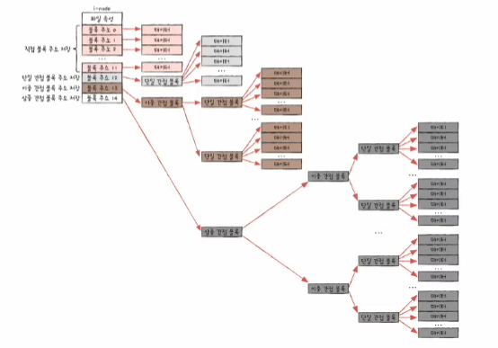

# 파일과 디렉터리

## 파일

- `파일(file)`
  - 의미 있고 관련 있는 정보를 모은 논리적 단위
  - 하드 디스크나 SSD와 같은 보조기억장치에 저장된 관련 정보의 집합
- `속성(attribute)`
  - `메타데이터(metadata)`라고도 부름
  - 파일 이름, 파일을 실행하기 위한 정보, 파일 관련 부가 정보 등이 해당됨

### 파일 속성과 유형

- `파일 유형`
  - 운영체제가 인식하는 파일 종류
  - 유형이 다르면 실행 양상도 달라짐
- `확장자(extension)`
  - 파일 유형을 알리기 위해 가장 흔히 사용하는 방식
  - 파일 종류가 무엇인지 운영체제에 알려주는 힌트와도 같음

### 파일 연산을 위한 시스템 호출

- 파일을 다루는 모든 작업은 운영체제에 의해 이루어짐
- 운영체제는 파일 연산을 위한 `시스템 호출`을 제공함
  - 파일 생성, 삭제, 열기, 닫기, 읽기, 쓰기 등

### 디렉터리(directory)

- 파일들을 일목요연하게 관리하기 위해 사용
- `폴더(folder)`라고도 부름
- `1단계 디렉터리(single-level directory)`
  - 모든 파일이 하나의 디렉터리 아래에 있는 디렉터리 구조
  - 실제로 이렇게 사용하는 컴퓨터는 거의 없음
  - 많은 파일을 관리하기 어려움
- `트리 구조 디렉터리(tree-structured directory)`
  - 여러 계층을 가진 디렉터리 구조
  - **최상위 디렉터리** 아래에 여러 서브 디렉터리(자식 디렉터리)가 있음
  - **최상위 디렉터리**는 흔히 `루트 디렉터리(root directory)`라고 부름

### 절대 경로와 상대 경로

- `경로(path)` : 디렉터리를 이용해 파일 위치, 나아가 파일 이름을 특정 짓는 정보
- `절대 경로(absolute path)`
  - 루트 디렉터리에서 자기 자신까지 이르는 공유한 경로
  - **슬래시 기호(/)** 는 루트 디렉터리를 표시할 뿐만 아니라 디렉터리와 디렉터리 사이의 구분자로도 사용됨
- `상대 경로(relative path)`
  - 현재 디렉터리부터 시작하는 경로

### 디렉터리 연산을 위한 시스템 호출

- 운영체제는 디렉터리 연산을 위한 **시스템 호출**을 제공함
- 디렉터리 생성, 삭제, 열기, 닫기, 읽기 등

### 디렉터리도 파일이다

- 많은 운영체제에서는 디렉터리를 그저 '**특별한 형태의 파일**'로 간주함
- 디렉터리도 포함된 정보가 조금 특별할 뿐, 파일임

### 디렉터리 엔트리

파일은 내부에 해당 파일과 관련된 정보를 담고 있고, 디렉터리는 해당 디렉터리에 담겨 있는 대상과 관련된 정보를 담고 있다. 이러한 디렉터리는 보조기억장치에 **테이블 형태**의 정보로 저장되는데, 테이블의 각각의 행을 `디렉터리 엔트리`라고 한다.

파일 시스템을 막론하고 디렉터리 엔트리가 공통으로 포함하는 정보는 **디렉터리에 포함된 대상의 이름**과 **그 대상이 보조기억장치 내에 저장된 위치를 유추할 수 있는 정보**가 있다.

# 파일 시스템

## 파티셔닝과 포매팅

- `파티셔닝(partitioning)` : 저장 장치의 논리적인 영역을 구획하는 작업
- `파티션(partition)` : 파티셔닝 작업을 통해 나누어진 영역
- `포맷팅(foramtting)`
  - 파일 시스템을 설정하여 어떤 방식으로 파일을 저장하고 관리할 것인지를 결정하고, 새로운 데이터를 쓸 준비를 하는 작업을 의미함

파티셔닝과 포매팅을 마치면 파일과 디렉터리를 생성할 수 있다.

> **포매팅의 종류**
> - 저수준 포매팅 : 저장 장치를 생성할 당시 공장에서 수행되는 물리적인 포매팅
> - 논리적 포매팅 : 파일 시스템을 생성하는 포매팅
>
> 여기서 설명하는 포매팅은 논리적 포매팅을 의미한다.

## 파일 할당 방법

- `블록(block)`
  - 운영체제는 하나 이상의 섹터를 블록이라는 단위로 묶은 뒤 블록 단위로 파일과 디렉터리를 관리한다.
  - 하드 디스크의 가장 작은 단위는 섹터이지만, 섹터를 관리하기에는 개수가 너무 많고 크기도 작기 때문

파일을 보조기억장치에 할당하는 방법에는 크게 `연속 할당`과 `불연속 할당`이 이쓰며, `불연속 할당`에는 크게 `연결 할당`, `색인 할당`이 있다.

### 연속 할당

- `contiguous allocation`
- 보조기억장치 내 연속적인 블록에 파일을 할당하는 방식
- 디렉터리 엔트리 : 파일 이름, 첫 번째 블록 주소, 블록 단위의 길이 등을 명시
- 구현이 단순하지만 **외부 단편화**를 야기함

### 연결 할당

- `linked allocation`
- 각 블록 일부에 다음 블록의 주소를 저장하여 각 블록이 다음 블록을 가리키는 형태
- 파일을 이루는 데이터를 연결 리스트로 관리함
- 마지막 블록에는 다음 블록이 없다는 특별한 표시자를 기록함(보통 -1)
- 디렉터리 엔트리 : 파일 이름, 첫 번째 블록 주소, 블록 단위의 길이 등을 명시
- 단점
  - 외부 단편화 문제를 해결하지만, 단점이 있음
  - *반드시 첫 번째 블록부터 하나씩 차례대로 읽어야 한다.*
    - 파일 내 임의의 위치에 접근하는 속도, `임의 접근 속도(random access)` 속도가 매우 느림
    - 성능 면에서 상당히 비효율적
  - *하드웨어 고장이나 오류 발생 시 해당 블록 이후 블록은 접근할 수 없다.*
    - 블록에 하나라도 문제가 발생하면 그 블록 이후의 블록에 접근할 수 없음

오늘날에는 연결 할당을 조금 변형한 `FAT 파일 시스템`을 사용한다.

### 색인 할당

- `indexed allocation`
- 모든 블록 주소를 `색인 블록(index block)`이라는 하나의 블록에 모아 관리하는 방식
- 연결 할당과 달리 *파일 내 임의의 위치에 접근하기 쉽다.*
- 디렉터리 엔트리 : 파일 이름, **색인 블록 주소** 등을 명시
- 색인 할당 방식을 기반으로 만든 파일 시스템 -> `유닉스 파일 시스템`

## 파일 시스템 살펴보기

### FAT 파일 시스템

- 연결 할당의 단점을 보완한 파일 시스템
- 각 블록에 포함된 다음 블록의 주소들을 한데 모아 테이블 형태로 관리함
  - 이러한 테이블을 `파일 할당 테이블(FAT; File Allocation Table)`이라고 함
  - 연결 할당 단점들의 원인은 블록 안에 다음 블록의 주소를 저장했기 때문에 발생하는 단점들이었는데, 이들을 `FAT`에서 관리함으로써 해결함
- 디렉터리 엔트리 : 파일 이름, 파일의 첫 번째 블록 주소 등을 명시
- 과거엔 MS-DOS, 현대에는 USB 메모리, SD 카드와 같은 저용량 저장 장치용 파일 시스템으로 많이 이용됨
- FAT12, FAT16, FAT32와 같이 *FAT 뒤에 오는 숫자는 블록을 표현하는 비트 수를 의미함*
- 실행하는 도중 FAT가 *메모리에 캐시*될 수 있음
  - 연결 할당과 달리 파일의 연결 정보를 전부 담고 있는 FAT를 메모리에 올릴 수 있음
  - FAT가 메모리에 적재된 채 실행되면 *임의 접근의 성능이 개선된다.*
- FAT는 파티션의 앞부분에 만들어짐

### 유닉스 파일 시스템

- 색인 할당 기반
- `i-node(index-node)`
  - 유닉스 파일 시스템에서는 색인 블록을 i-node라고 부름
  - 파일 속성 정보는 i-node에 표현됨
  - 파일마다 이러한 i-node가 있고, i-node마다 번호가 부여되어 있음
  - 이러한 i-node들은 파티션 내 특정 영역에 모여 있음
- 디렉터리 엔트리 : 파일 이름, i-node 번호 등을 명시
- 유닉스 파일 시스템은 루트 디렉터리의 i-node를 항상 기억하고 있음

i-node 하나는 기본적으로 열다섯 개의 블록 주소를 저장할 수 있기 때문에 i-node의 크기는 유한하다. 그래서 유닉스 시스템은 이보다 크기가 큰 파일을 저장하기 위해 다음과 같은 방법을 사용한다.

1. 블록 주소 중 열두 개에는 직접 블록 주소를 저장
2. '첫째' 내용으로 충분하지 않다면 열세 번째 주소에 간접 블록 주소를 저장
3. '둘째' 내용으로 충분하지 않다면 열네 번째 주소에 이중 간접 블록 주소를 저장

- `직접 블록(direct block)` : 파일 데이터가 저장된 블록
- `이중 간접 블록(double indirect block)` : 데이터 블록 주소를 저장하는 블록 주소가 저장된 블록
- `삼중 간접 블록(triple indirect block)`
  - 이중 간접 블록 주소가 저장된 블록
  - 삼중 간접 블록까지 이용하면 웬만한 크기의 파일은 모두 표현할 수 있음

### 저널링 파일 시스템

- `저널링 기법`을 이용하는 파일 시스템
- `저널링(journaling) 기법` : 작업 로그를 통해 시스템 크래시가 발생했을 때 빠르게 복구하기 위한 방법
- 저널링 파일 시스템이 있기 전
  - 파일 시스템을 변경하는 도중에 **시스템 크래시**가 발생하면 파일 시스템이 훼손될 수 있음
  - 부팅 직후 파일 시스템을 검사하고 복구하는 프로그램 실행
  - 이러한 작업은 모든 블록에 대한 파일 시스템을 검사하기 때문에 *시간이 매우 오래 걸림*
- 시스템 크래시가 발생한 직후에 로그 영역을 읽어 크래시가 발생한 당시 어떤 작업을 실행 중이었는지 알아낸 다음 해당 작업을 완료함
- 현대 대부분의 파일 시스템은 이러한 저널링 기능을 지원함

### 마운트

- 한 저장 장치의 파일 시스템에서 다른 저장 장치의 파일 시스템에 접근할 수 있도록 파일 시스템을 편입시키는 작업
- 유닉스, 리눅스와 같은 운영체제에서 다양한 저장 장치를 컴퓨터에 연결할 때 `mount` 명령어로 빈번하게 마운트함
