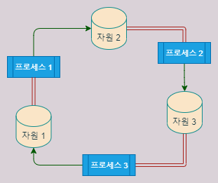

> 출제일 : 2024/03/05 (DAY1)

# DAY1

## 컴퓨터 구조를 이해하면 문제 해결 능력이 향상된다. 이에 대한 예시 또는 사례는? (Ch01-1)

### 효율적인 알고리즘 개발

컴퓨터 구조를 이해하면 컴퓨터가 데이터를 처리하는 방식을 이해할 수 있다. 이를 통해 데이터를 효율적으로 다루는 알고리즘을 개발할 수 있다. 예를 들어, 정렬 알고리즘을 개발할 때 어떤 알고리즘이 CPU나 메모리 등의 자원을 더 효율적으로 사용할 수 있는지를 이해하고 선택할 수 있다.

### 메모리 관리

메모리를 효율적으로 활용하는 방법을 배울 수 있다. 이는 곧 프로그램 성능의 최적화와 이어진다.

### 디버깅

프로그램에서 발생하는 에러 또는 버그는 개발자의 실수(휴먼에러) 등으로 발생할 수도 있지만, 구동 환경이나 메모리 상태 등에 따라 영향을 받을 때가 많다. 이러한 경우는 컴퓨터 구조적인 지식을 가지고 있지 않으면 이해하기 힘들고 문제로서 접근하기도 어렵다.

### 새로운 지식 습득

프로그램이라 함은 기본적으로 `컴퓨터` 위에서 돌아간다. 그리고 프로그램에서 사용되는 새로운 기술 등은 이 `컴퓨터 구조`를 베이스로 구성되기 때문에 이를 알고 있으면 이해하고 배우기 비교적 쉽다.

---

> 출제일 : 2024/03/08 (DAY2)

# DAY2

## 베이스 레지스터 주소 지정 방식의 용도 (Ch04-2)

### 배열(Array) 접근

배열의 첫 번째 요소의 주소를 베이스 레지스터에 저장하고, 오프셋(offset)을 더해 원하는 요소에 접근할 수 있다.

```assembly
; 배열의 주소를 베이스 레지스터에 저장
MOV R2, #base_address_of_array

; 원하는 인덱스 계산
MOV R3, #index
MUL R3, R3, #element_size ; 요소의 크기를 곱해 오프셋 계산

; 베이스 레지스터와 오프셋을 합쳐 실제 주소 계산
ADD R2, R2, R3

; 해당 주소의 데이터에 접근
MOV R1, [R2]
```

이렇게 하면 배열에서 index에 해당하는 요소에 접근할 수 있다. base_address_of_array는 배열의 시작 주소이고, index는 원하는 요소의 인덱스다. element_size는 배열의 각 요소의 크기를 나타낸다.

### 구조체(Struct) 접근

구조체의 필드에 접근하는 경우에도 베이스 레지스터 주소 지정 방식이 유용하다. 구조체의 시작 주소를 베이스 레지스터에 저장하고 필드의 오프셋을 더하여 필드에 접근할 수 있다.

```assembly
; 구조체의 시작 주소를 베이스 레지스터에 저장
MOV R2, #base_address_of_struct

; 필드의 오프셋 계산
MOV R3, #offset_of_field

; 베이스 레지스터와 오프셋을 합쳐 필드의 주소 계산
ADD R2, R2, R3

; 해당 필드의 데이터에 접근
MOV R1, [R2]
```

여기서 base_address_of_struct는 구조체의 시작 주소이고, offset_of_field는 접근하려는 필드의 오프셋을 나타낸다. 이 방식을 사용하면 구조체의 특정 필드에 쉽게 접근할 수 있다.

### 함수 인자(Arguments) 전달

베이스 레지스터 주소 지정 방식은 함수에 인자를 전달할 때도 유용하다. 함수 호출 시 인자들을 레지스터에 저장하고 함수가 호출될 때 베이스 레지스터를 통해 인자들에 접근할 수 있다.

```assembly
; 함수에 전달할 인자들을 레지스터에 저장
MOV R1, #arg1
MOV R2, #arg2

; 함수 호출 시 베이스 레지스터에 인자들의 주소 저장
MOV R3, #base_address_of_args
STR R1, [R3]
ADD R3, R3, #4 ; 다음 인자의 위치로 이동
STR R2, [R3]

; 함수 호출
BL function_name
```

이 경우 base_address_of_args는 함수에 전달할 인자들의 주소를 가리킨다. 함수가 호출되면 베이스 레지스터를 통해 인자들의 값을 전달할 수 있다.

이러한 예시에서 보듯이 베이스 레지스터 주소 지정 방식은 주로 메모리에 접근할 때 특정 위치를 기준으로 계산할 때 사용된다. 배열, 구조체, 함수 인자 등의 다양한 상황에서 유용하게 쓰일 수 있다.

---

> 출제일 : 2024/03/12 (DAY3)

# DAY3

## 동기 인터럽트와 비동기 인터럽트의 차이와 각각의 예시 (Ch04-3)

### 동기 인터럽트 (Synchronous Interrupts):
- CPU 내부에서 발생: 동기 인터럽트는 CPU가 예상치 못한 상황에 직면했을 때 발생
- 소프트웨어적인 인터럽트: 소프트웨어적인 요인에 의해 발생하며, 프로그램 실행 중에 처리된다.
- 예시: 0으로 나누기 오류, 스택 오버플로우, 부적절한 메모리 접근 등

### 비동기 인터럽트 (Asynchronous Interrupts):
- CPU 외부에서 발생: 비동기 인터럽트는 주로 입출력 장치에 의해 발생하며, 알림과 같은 역할을 한다. 입출력 장치의 읽기 및 쓰기 시간은 CPU가 명령어를 수행하는 시간보다 훨씬 오래 걸리기 때문에, 입출력 작업이 완료되면 CPU에게 알림 신호를 보내도록 설계되었다.
- 하드웨어적인 인터럽트: 하드웨어적인 요인에 의해 발생하며, 주로 입출력 장치와 상호 작용할 때 발생한다.
- 예시: 디스크 I/O 완료, 네트워크 패킷 수신, 타이머 인터럽트 등

## 참고

- [컴퓨터 구조 #8 - 명령어 사이클과 인터럽트](https://uzinlab.tistory.com/100)
- [인터럽트(interrupt), 예외(exception), 트랩(trap)의 비교](https://melonicedlatte.com/computerarchitecture/2019/02/12/213856.html)

---

> 출제일 : 2024/03/15 (DAY4)

# DAY4

## 캐시 메모리의 최적화를 위한 코드 개선 (Ch06-3)

### 행렬 곱셈


```python
for i in 0..n
  for j in 0..m
    for k in 0..p
      C[i][j] = C[i][j] + A[i][k] * B[k][j];
```

위 코드에서 캐시 메모리에는 공간적 지역성에 의해 A[i][k] 배열이 있다. k가 마지막 차원에서 연속적으로 증가하기 때문이다. 

하지만 B[k][j]는 첫 번째 차원에서 k가 증가하므로 캐시 미스가 발생한다. 루프 인덱스 k가 증가할수록 B[k][j]를 참조하기 위해 m * sizeof(int)만큼 점프해야 하기 때문이다.

```python
for i in 0..n
  for k in 0..p
    for j in 0..m
      C[i][j] = C[i][j] + A[i][k] * B[k][j];
```

i와 k의 루프 순서를 바꾸는 것만으로 드라마틱한 속도 향상을 볼 수 있다. A[i][k]는 내부 루프에서 고정되어 있고, B[k][j]는 마지막 차원에서 j가 증가하므로 공간적 지역성을 충분히 활용하여 캐시 적중율을 높일 수 있다. 물론 순서만 다를뿐 결과는 수학적으로 동일하다.

이러한 성능 향상은 p의 값이 100,000이 넘거나 L1, L2 캐시 메모리가 감당하지 못할 정도로 크면 더욱 눈에 띈다.

### 코드 파티셔닝(Code Partitioning)

```c
int foo() {
    if (condition) {
        // Large code block 1
    } else {
        // Large code block 2
    }

    // more code
    return value;
}
```

CPU는 두 개의 코드 블록 중 하나인 code block 1 또는 2를 실행한다. 공간적 지역성에 따라 캐시는 두 블럭의 코드를 모두 저장할 수 있다. 여기서 Large code block 1이 매우 높은 확률로 실행되고 Large code block 2가 매우 드물게 실행되면 동적 메모리의 크기가 불필요하게 커져 캐시 활용도가 낮아진다.

```c
int foo() {
    if (condition) {
        // Large code block 1
    } else {
        Large_code_2();
    }

    // more code
    return value;
}
```

드물게 실행되는 Large code block 2를 별도의 함수로 분리했다. 이 함수의 코드는 메모리의 다른 곳에 위치하기 때문에 공간적 지역성은 더 이상 두 블록의 코드에서 강제되지 않는다. 이렇게 하면 동적 메모리 설치 공간이 줄어들어 캐시 사용률이 높아진다. 동일한 방법을 케이스문이 많은 스위치(switch)문에도 적용할 수 있다.

정리하자면, 많은 케이스가 존재하는 큰 함수를 가지고 있다면, 어떤 케이스가 자주 실행될 것인지 따져보고, 자주 실행되지 않는 케이스에서 다른 함수를 호출한다.

### 인라이닝(Inlining)

```c
#include <stdio.h>

#define SIZE 1000

int add(int a, int b) {
    return a + b;
}

int main() {
    int array[SIZE];
    int sum = 0;

    // 배열 초기화
    for (int i = 0; i < SIZE; ++i) {
        array[i] = i + 1;
    }

    // 배열 합 구하기
    for (int i = 0; i < SIZE; ++i) {
        sum = add(sum, array[i]);
    }

    printf("Sum: %d\n", sum);

    return 0;
}
```

부모 함수가 자식 함수를 호출하는 경우, 다음 두 가지 이유로 인한 결함이 존재한다. 

1. 자식 함수의 코드가 캐시에 존재하지 않는 경우 캐시 미스가 발생하여 프로세서가 중지된다.
2. 흐름 변경(COF, Change of Flow)이 발생하면, 파이프라인을 Flush 해야하므로 사이클에 상당한 결함이 발생할 수 있다.

이와 같은 경우를 `함수기반의 조각화(Function-Based Fragmentation)`이라고 한다.

> COF에는 예외 처리, 비동기 프로그래밍, 조건문, 반복문, 함수 호출과 같은 상황에서 발생할 수 있다.

```c
#include <stdio.h>

#define SIZE 1000

// 인라인 함수 정의
inline int add(int a, int b) {
    return a + b;
}

int main() {
    int array[SIZE];
    int sum = 0;

    // 배열 초기화
    for (int i = 0; i < SIZE; ++i) {
        array[i] = i + 1;
    }

    // 배열 합 구하기 (인라인 함수 사용)
    for (int i = 0; i < SIZE; ++i) {
        sum = add(sum, array[i]);
    }

    printf("Sum: %d\n", sum);

    return 0;
}
```

`인라인 함수(inline function)`는 컴파일러가 함수를 호출하는 대신, 그에 대응하는 함수 코드로 대체하여 호출되는 모든 장소에 삽입할 것을 요청할 수 있다.

인라인 함수는 `함수 기반의 조각화`를 줄이는데 유용하다. 한 함수를 다른 함수에 포함시킴으로써 흐름 변화(COF)를 줄이고 코드를 더 선형적으로 만들 수 있다.

> **인라인 함수의 장단점**
> 
> 장점은 무엇보다도 프로그램의 실행속도가 빨라진다는 점입니다. 함수는 호출될 때마다 처리해야 하는 작업이 상당히 많습니다. 함수 종료 후 반환할 위치를 알려줘야 하니 실행 중인 현재 명령어의 주소를 저장도 해야 하고 함수도 호출해야 합니다. 함수를 호출하려면 프로그램 실행 중 함수를 실행해야 하면 해당 함수의 주소로 점프시켰다가, 함수의 처리가 종결되면 다시 원래의 자리로 돌아오게 해야 하는데 이러한 과정에서 시간이 소요됩니다. 반면에 인라인 함수는 컴파일된 함수 코드가 프로그램의 코드 안에 직접 삽입되므로 이러한 과정이 필요가 없어 프로그램 속도 측면에서는 유리하다고 볼 수 있습니다.
> 
> 반대로 메모리 사용 측면에서는 인라인 함수가 일반 함수보다 불리합니다. 인라인 함수는 호출한 부분이 몇번이 되던 컴파일러는 인라인 함수의 사본을 호출한 부분에 계속해서 삽입해야 하기 때문에 그만큼 메모리의 낭비가 있을 수밖에 없습니다. 그러므로 인라인 함수를 사용하기에 적절한곳은 호출이 많이 일어나지 않는 함수이거나 함수 내부 코드의 양이 매우 실행 속도가 짧은데 비해 함수의 호출시간이 부담스럽다고 생각할 때만 인라인 함수로 만들어 활용하는 것이 적당합니다.

인라이닝은 코드가 커진다는 단점이 있기 때문에 때때로 역효과를 가지고 올 수 있다. 따라서 인라이닝을 사용할 때는 다음과 같은 체크리스트를 확인해야 한다.

- 함수의 크기는 어떻게 되는가?
- 그 함수를 호출하는 장소가 몇 개나 되는가?
- 함수가 자주 호출되는가? 아니면 코너 케이스인가?

## 참고

- [Locality of reference](https://en.wikipedia.org/wiki/Locality_of_reference)
- [캐시 메모리의 참조 지역성(Locality of Reference)과 코드 최적화(Partitioning, Inlining, Alignment)](https://blog.naver.com/techref/222251293739)
- [[C언어/C++] 인라인(inline) 함수 사용법 & 예제](https://coding-factory.tistory.com/694#:~:text=%EC%9D%B8%EB%9D%BC%EC%9D%B8%20%ED%95%A8%EC%88%98%EB%9E%80%3F%20%EC%9D%B8%EB%9D%BC%EC%9D%B8%20%ED%95%A8%EC%88%98%EB%8A%94%20%EC%A0%95%EC%9D%98%ED%95%9C%20%EC%BD%94%EB%93%9C%EB%93%A4%EC%9D%B4%20%EC%9D%B8%EB%9D%BC%EC%9D%B8%20%ED%95%A8%EC%88%98,%EC%95%84%EB%8B%88%EB%9D%BC%2C%20%ED%98%B8%EC%B6%9C%ED%95%98%EB%8A%94%20%EC%BD%94%EB%93%9C%20%EC%9E%90%EC%B2%B4%EA%B0%80%20%ED%95%A8%EC%88%98%20%EB%82%B4%EC%9A%A9%EC%9D%98%20%EC%BD%94%EB%93%9C%EA%B0%80%20%EB%90%A9%EB%8B%88%EB%8B%A4.)
- [캐시가 동작하는 아주 구체적인 원리](https://parksb.github.io/article/29.html)

--- 

> 출제일 : 2024/03/20 (DAY5)

# DAY 5

## DMA 종류 중 하나로 채널 방식이라는 것이 있다. 이는 DMA에 비해 어떤 이점이 있을까? (Ch08-2)


`DMAC(DMA Controller)`의 경우 CPU는 모든 단일 IO 작업을 시작하는데 관여한다. DMA 방식은 Programmed I/O, 인터럽트 기반 I/O보다 우수하지만 CPU에서 간단한 시작 명령으로 전체 I/O를 처리하는 설계 방법이 있으면 전체 시스템 성능을 향상시킬 수 있다. `IOP(I/O Processor)` 설계는 이 요구 사항을 지원한다.

IOP는 I/O 작업의 DMA 개념을 확장한 것이다. IOP는 자체 메모리가 있으며 I/O 명령을 해석하고 실행할 수 있다. 이러한 명령어는 주기억장치에서 가져온다. 데이터 전송은 메모리를 통해 직접 발생한다. 즉, *IOP는 CPU에서 최소한의 시작 명령만으로 IO 작업을 상당 부분 제어할 수 있다.*

### 채널 통신 종류

- Selecter Channel : 각 Channel에 고정적으로 연결되어 사용하며, Disk Driver와 같이 고속의 전송에 사용된다.
- Multiplexer Channel : 각 Channel에 연결된 장치를  정해진 시간 마다 1개씩 할당하여 사용하며, Termianl이나 Printer와 같은 저속의 장치에 주로 사용한다


## 참고

- [Direct Memory Access controller and I/O Processor](https://witscad.com/course/computer-architecture/chapter/dma-controller-and-io-processor#:~:text=The%20I%2FO%20devices%20are%20connected%20to%20the%20DMA,the%20CPU%20responding%20with%20DMA%20HOLD%20ACK%20signal.)
- [DMA의 동작원리](https://gomsik.tistory.com/82)


---

> 출제일 : 2024/03/29 (DAY6)

# DAY 6

## 스레드의 장점 (Ch10-3)

### 자원 공유
쓰레드는 같은 프로세스 내에서 실행되기 때문에 프로세스의 자원(메모리, 파일 등)을 공유할 수 있다. 이를 통해 데이터 공유와 효율적인 작업 분담이 가능하다.

### 빠른 생성과 종료
쓰레드는 프로세스 내에서 생성되고 종료되는데, 이는 프로세스의 생성 및 종료보다 더 빠르다. 따라서 작업의 동시성을 향상시킬 수 있다.

### 작은 메모리 오버헤드
쓰레드는 프로세스와는 달리 독립적인 메모리 공간을 가지지 않기 때문에, 프로세스를 생성하는 것보다 적은 메모리 오버헤드를 가진다.

### 빠른 컨텍스트 전환
쓰레드 간의 전환은 프로세스 간의 전환보다 더 빠르다. 이는 쓰레드가 프로세스 내에서 실행되기 때문에 추가적인 자원 할당이 필요하지 않기 때문이다.


## 리눅스에서 프로세스와 스레드를 구분하지 않는 이유는 뭘까?

### 리눅스 철학 - "모든 것이 파일이다"

리눅스는 "모든 것이 파일" 철학을 따른다. 이는 리눅스 시스템에서 디바이스, 네트워크 소켓, 프로세스 등 모든 것을 파일로 다룬다는 의미다. 따라서 리눅스에서는 프로세스와 스레드를 모두 파일 형태로 다룬다.

### 경량 프로세스

리눅스에서 쓰레드는 `경량 프로세스(Lightweight Process, LWP)`로 구현되는 경우가 일반적이다. 이는 프로세스와 달리 독립적인 메모리 영역을 가지지 않으며, 프로세스 내에서 스택 메모리와 레지스터 등 일부 자원을 공유한다. 이로써 쓰레드 간의 전환 및 통신이 더 빠르게 이루어진다.

사용자(개발자) 입장에서 봤을 때에는 프로세스와 스레드는 별개의 것이지만, 리눅스의 커널 입장에서 봤을 때 이 둘은 메모리를 공유한다는 점을 빼고 같은 COE(Context of Execution)이다. 따라서 커널 라이브러리 등에서는 프로세스와 스레드를 구분하지 않고 `task`라고 칭한다.

리누스 토발즈에 의하면 스레드/프로세스 사고 방식을 중심으로 디자인하지 말고, COE 사고 방식을 중심으로 설계해야 한다고 당부한다.

## 참고

- [[Linux]리눅스 프로세스 관리](https://blog.naver.com/hj_kim97/223107014744)
- [리눅스 - 프로세스(Process)와 쓰레드(Thread) & linux ps, 작업(job) handling](https://velog.io/@qlgks1/%ED%94%84%EB%A1%9C%EC%84%B8%EC%8A%A4%EC%99%80-%EB%84%A4%ED%8A%B8%EC%9B%8C%ED%81%AC)

---

> 출제일 : 2024/03/29 (DAY7)

# DAY 7

## 레이스 컨디션(race condition)이 발생하는 이유와 그로 인해 발생하는 문제 (Ch12-1)

`레이스 컨디션 (Race Condition)`은 병렬 프로그래밍에서 발생하는 문제로, 여러 프로세스 또는 스레드가 동시에 같은 자원을 수정하려고 할 때 예상치 못한 결과가 발생하는 상황이다. 이로 인해 다음과 같은 문제가 발생할 수 있다.

### 데이터 불일치 (Data Inconsistency)

여러 스레드가 동시에 같은 변수를 수정하는 경우, 변수의 값이 일관성 없이 변경될 수 있다. 예를 들어 은행 계좌 잔액을 동시에 감소시키는 경우, 잔액이 정확하지 않게 갱신될 수 있다.

### 쓰기-읽기 충돌 (Write-Read Conflict)

하나의 스레드가 데이터를 수정하는 동안 다른 스레드가 같은 데이터를 읽으려고 할 때 충돌이 발생합니다. 이로 인해 잘못된 데이터를 읽을 수 있다.

### 쓰기-쓰기 충돌 (Write-Write Conflict)

두 개 이상의 스레드가 동시에 같은 데이터를 수정하려고 할 때 충돌이 발생한다. 이로 인해 데이터가 무효화될 수 있다.

### 교착 상태 (Deadlock)

두 개 이상의 스레드가 서로의 작업이 끝나기를 기다리며 멈춰있는 상태다. 데드락이 발생하면 프로그램이 더 이상 진행되지 않는다. 교착 상태가 발생할 수 있는 조건은 다음과 같다.

1. 상호 배제

레이스 컨디션의 문제를 해결하고자 상호 배제 조건을 두어 동시에 공유 자원에 접근할 수 없도록 하여 한 자원에 한 스레드만 접근 할 수 있게 하는 것을 의미한다.

스레드가 자원을 독점적으로 사용하고 있어 다른 스레드가 자원에 접근하려고 락을 획득하기 위해 무한 대기할 수 있는 상황이 발생할 수 있다.

2. 점유 상태로 대기

공유 자원에 락을 획득하여 점유하고 있는 상태인데 다른 자원의 락을 획득하기 위해 대기하고 있는 상황을 의미한다.

조금 더 이해하기 쉽게 풀어서 말해본다면, 발생할 수 있는 상황이 여러 개의 자원을 동시에 써야하는 경우 락을 획득한 자원에 대한 처리는 끝났는데 남은 자원의 락을 다른 스레드가 가지고 해제를 하지 않아 무한정 대기하는 상태다.

또한 자신이 점유하고 있는 락도 해제를 해주어야 그 락을 획득하기 위해 대기하고 있는 다른 스레드들도 자원에 접근하여 처리를 할 수 있는데 락을 획득할 수 없어 다른 스레드 마저 무한정 대기할 수 밖에 없는 상황이 발생한다.


3. 선점 불가

다른 스레드가 자원을 선점하고 있어서 자원을 뺏어올 방법이 없는 것을 의미한다. 만일 어느 스레드가 공유 자원의 락을 획득하여 선점하고 있다면 그 공유 자원에 접근해야 하는 다른 스레드들은 아무리 잠깐 처리하면 끝나는 상황이라도 락을 빼앗을 방법이 없기 때문에 무한 대기할 상황이 발생할 수 있다.

4. 순환성 대기

프로세스가 어느 자원을 점유하고 있고 다른 자원을 요청하여 대기하고 있는데 순환적인 구조를 가지는 경우를 순환성 대기라고 한다.

즉, `점유 상태로 대기`가 순환적으로 발생한 상황으로 볼 수 있다. 락을 해제하고 락을 획득하는게 순차적으로 잘 돌아가면 좋겠지만, 어느 순간 모든 프로세스가 락을 획득하려고 대기하여 모든 프로세스가 무한 대기에 놓인 상황이 발생할 수 있다.



### 레이스 컨디션 공격

리눅스 환경에서 레이스 컨디션 상태를 이용해 root 권한을 얻어내는 공격 방식이다. 

사용자가 프로그램을 실행했을 때 SETUID를 통한 권한 상승으로 관리자 권한의 임시 파일이 생성된다. 공격자는 이 *임시 파일의 이름을 파악해놓고*, 임시 파일이 생성되면 이 파일의 심볼릭 링크를 생성한다. 

다음 프로그램 실행 시 기존의 임시 파일이 삭제되고 재생성되면 공격자는 심볼릭 링크를 이용해 파일의 내용을 변경한다. 이후 시스템은 변경된 파일을 자신이 생성한 임시 파일이라 인식해 프로세스를 진행시키고, 공격자는 관리자 권한으로 실행되는 프로그램에서 자신이 원하는 동작을 실행할 수 있게 된다.

이를 위한 필요조건은 다음과 같다.
1. 공격자는 생성되는 임시 파일의 이름을 사전에 알고 있어야 한다.
2. 파일의 소유자가 root이며 SETUID 비트를 가져야 한다.

## 참고

- [[OS] 스레드 동기화 문제](https://cheetile.tistory.com/entry/OS-%EC%8A%A4%EB%A0%88%EB%93%9C-%EB%8F%99%EA%B8%B0%ED%99%94-%EB%AC%B8%EC%A0%9C-Race-Condition-Deadlock-Starvation-Livelock)
- [레이스 컨디션 그게 뭐야?](https://velog.io/@maketheworldwise/%EB%A0%88%EC%9D%B4%EC%8A%A4-%EC%BB%A8%EB%94%94%EC%85%98-%EA%B7%B8%EA%B2%8C-%EB%AD%90%EC%95%BC#%EC%9E%84%EA%B3%84-%EC%98%81%EC%97%AD)
- [[시스템해킹] 레이스 컨디션 공격 기법 (Race Condition)](https://m.blog.naver.com/kky564/80188027120)
- [레이스 컨디션(Race Condition) 공격](https://angangmoddi.tistory.com/130)

---

> 출제일 : 2024/04/15 (DAY8)

# DAY8

## 실제 운영체제에서는 어떻게 교착 상태를 해결할까? (Ch13-2)

## 타조 알고리즘

대부분의 운영체제는 교착 상태 발생 시 시스템에 문제가 없는 척을 한다. 교착 상태는 매우 드물게 발생하는 경우이기 때문에, 이에 대한 투자는 교착 상태의 방지 또는 감지 등과 관련된 지속적인 오버헤드 및 시스템 성능 저하로 이어질 수 있다.

만약 문제가 발생했다면 참을성 없는 사용자가 직접 프로세스를 종료하거나 컴퓨터를 재시작한다.

### Windows의 경우

*Windows에는 런타임 시 교착 상태를 확인하도록 특별히 설계된 기본 제공 기능이 없다.* (윈도우 드라이버에서 교착 상태가 일반적으로 발생하므로 드라이버 개발자가 교착 상태 버그를 진단하는데 도움이 되도록 설계된 도구가 있지만, 여전히 최종 사용자 단의 컴퓨터에서 실행되는 것은 아니다.)

Windows에서는 어떤 프로세스들이 교착 상태에 빠졌더라도, 그것이 일시적인 것인지 영구적인 것인지 알 수 있는 방법이 없다. 

그리고 일반적인 Windows 소프트웨어에서는 교착 상태가 매우 드물기 때문에 Windows가 정교한 전략으로 교착 상태를 처리하는 것은 "프로그램 중 하나가 자원을 포기하거나 사용자가 와서 작업을 종료할 때까지 두 스레드를 모두 교착 상태로 두는 것"보다 비생산적이다. 이런 경우에는 그냥 컴퓨터를 다시 시작한다. (블루스크린)

즉, 프로그래머의 실수로 프로그램이 교착 상태에 빠지더라도, 운영체제는 이를 직접 해결하지 않고 최종 사용자에게 판단을 맡긴다. 

## 참고

- [How does Windows deal with deadlocks?](https://www.quora.com/How-does-Windows-deal-with-deadlocks)
- [Which algorithm is used in Windows to come over a deadlock?](https://www.quora.com/unanswered/Which-algorithm-is-used-in-Windows-to-come-over-a-deadlock)
- [Deadlock Detection - Windwos Drivers](https://learn.microsoft.com/en-us/windows-hardware/drivers/devtest/deadlock-detection)

--- 

> 출제일 : 2024/04/19 (DAY9)

## 절대경로와 상대경로의 장단점과 쓰임새 (Ch15-1)

### 절대경로

- 파일이나 디렉토리의 위치를 정확하게 지정할 때 사용됨
- 프로그램이나 스크립트가 여러 위치에서 실행될 수 있고, 절대경로를 사용하면 항상 정확한 위치를 참조할 수 있음
- 프로젝트의 구동 서버나 환경이 변경되면 다시 설정해줘야 함
- 프로젝트 디렉터리의 위치가 
- Ex) 프로젝트 외부 정적 파일(이미지, 폰트 등) 또는 실행 프로그램

### 상대경로

- 프로젝트 내에서 파일이나 디렉터리의 위치를 참조할 때 편리함
- 프로젝트 디렉터리가 다른 위치로 이동하더라도 파일이나 디렉터리의 위치를 변경하지 않고도 쉽게 참조할 수 있음
- 배포나 서버 이전 등의 이유로 프로젝트 구동 환경이 변경되어도 다시 설정할 필요가 없음
- 주로 프로젝트 관리와 유지보수를 간편하게 만들어 줌
- Ex) .gitignore 관리, 프로젝트 내 설정 파일(config) 등
