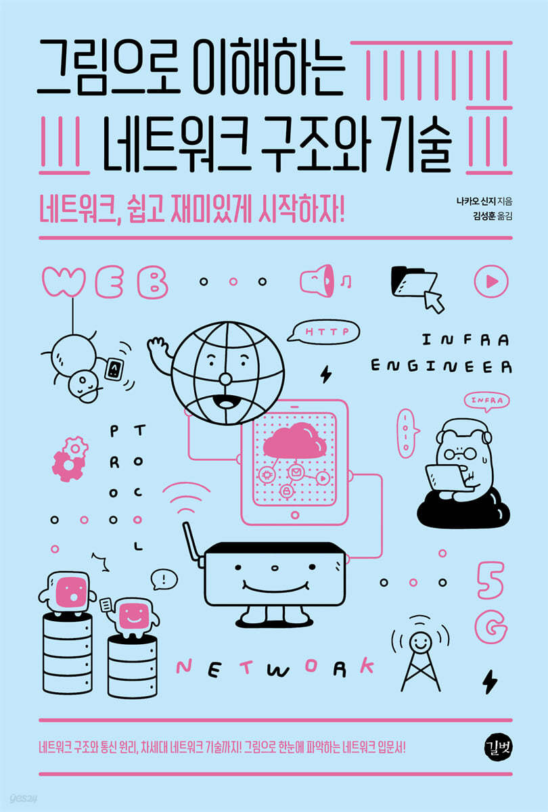

## 교재

**그림으로 이해하는 네트워크 구조와 기술**

## 네트워크 - 입문서 (2024.01.12 ~ 2024.03.01)

- [[1장] 네트워크의 기본 개념](01_네트워크의_기본개념.md)
- [[2장] 데이터를 주고받는 원리](02_데이터_주고받는_원리.md)
- [[3장] 네트워크 종류와 구성](03_네트워크_종류와_구성.md)
- [[4장] 인터넷 구조](04_인터넷_구조.md)
- [[5장] 클라우드 구조](05_클라우드_구조.md)
- [[6장] 모바일과 무선통신의 구조](06_모바일과_무선통신의_구조.md)
- [[7장] 보안 구조](07_보안_구조.md)

## 스터디

[깃허브 링크](https://github.com/team-imad-study/study-question/tree/main/Network/%EA%B7%B8%EB%A6%BC%EC%9C%BC%EB%A1%9C_%EC%9D%B4%ED%95%B4%ED%95%98%EB%8A%94_%EB%84%A4%ED%8A%B8%EC%9B%8C%ED%81%AC_%EA%B5%AC%EC%A1%B0%EC%99%80_%EA%B8%B0%EC%88%A0)
