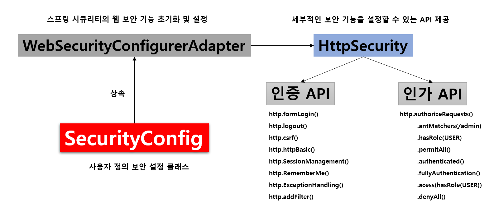

OAuth를 구현하려고 인터넷에 있는 예제들을 따라하며 Spring Security를 설정하고 있는데, WebSecurityConfigurerAdapter라는 놈이 Deprecated 되어있어 해결 방법을 찾아보았다. 그 전에 이 친구가 뭐하는 양반인지 알아보자.

# WebSecurityConfigurerAdapter란?



## 역할
WebSecurityConfigurerAdapter 클래스는 스프링 시큐리티의 웹 보안 기능의 초기화 및 설정들을 담당하는 내용이 담겨있으며, 내부적으로 getHttp() 메소드가 실행될 때 HTTPSecurity 클래스를 생성하게 된다. 이때의 HTTPSecurity는 인증/인가 API들의 설정을 제공한다.

## 사용자 정의 설정 구현

인증/인가 설정을 프로젝트에 맞게 변경하려면 아래와 같이 WebSecurityConfigurerAdapter를 상속한 SecurityConfig 클래스를 생성하고, configure(HttpSecurity http) 메소드를 override하여 설정할 수 있다.

```java
@RequiredArgsConstructor
@EnableWebSecurity
public class SecurityConfig extends WebSecurityConfigurerAdapter {

   private final CustomOAuth2UserService customOAuth2UserService;

   @Override
   protected void configure(HttpSecurity http) throws Exception {
       http
               .csrf().disable()
               .headers().frameOptions().disable() 
               .and()
                   .authorizeRequests()
                   .antMatchers("/", "/css/**", "/images/**",
                           "/js/**", "/h2-console/**").permitAll()
                   .antMatchers("/api/v1/**").hasRole(Role.
                                                    USER.name())
                   .anyRequest().authenticated()
               .and()
                   .logout()
                       .logoutSuccessUrl("/")
               .and()
                   .oauth2Login()
                       .userInfoEndpoint()
                           .userService(customOAuth2UserService);
   }
}
```

## @EnableWebSecurity란?

SecurityConfig 클래스의 붙은 어노테이션 코드를 살펴보면 들을 import해서 실행시켜주는 것을 알 수 있다.

```java
// EnableWebSecurity.java

// ...
@Retention(RetentionPolicy.RUNTIME)
@Target(ElementType.TYPE)
@Documented
@Import({ WebSecurityConfiguration.class, SpringWebMvcImportSelector.class, OAuth2ImportSelector.class,
		HttpSecurityConfiguration.class })
@EnableGlobalAuthentication
@Configuration
public @interface EnableWebSecurity {

	/**
	 * Controls debugging support for Spring Security. Default is false.
	 * @return if true, enables debug support with Spring Security
	 */
	boolean debug() default false;

}
```


# WebSecurityConfigurerAdapter Deprecated

> In Spring Security 5.7.0-M2 we deprecated the WebSecurityConfigurerAdapter, as we encourage users to move towards a component-based security configuration.

[공식 블로그](https://spring.io/blog/2022/02/21/spring-security-without-the-websecurityconfigureradapter)를 찾아보니 개발자들이 component 베이스의 security configuration을 사용하도록 권장하기 위해 WebSecurityConfigurerAdapter를 deprecated 했다고 한다. 그리고 해당 글에서는 기존의 WebSecurityConfigurerAdapter를 사용한 코드를 대체하는 방법들에 대해서 자세히 설명해두었다. 여기에서는 내가 기존에 사용하려던 코드를 알맞게 수정해보려고 한다.

## SecurityFilterChain bean 등록

Spring Security 5.4에서 SecurityFilterChain bean을 생성하여 ```HttpSecurity```를 설정할 수 있는 기능을 도입했다. 내가 사용했던 코드를 이에 맞게 수정해보았다. 참고로 CustomOAuth2UserService 클래스는 Oauth 로그인 이후 가져온 사용자의 정보들을 기반으로 회원가입, 정보수정, 세션 저장 등의 기능을 지원하는 클래스를 별도로 만든 것이다.

```java
@RequiredArgsConstructor
@EnableWebSecurity
public class SecurityConfig {

    private final CustomOAuth2UserService customOAuth2UserService;

    @Bean
    public SecurityFilterChain filterChain(HttpSecurity http) throws Exception {
        http
                // h2-console 화면을 사용하기 위해 해당 옵션들을 disable
                .csrf().disable()
                .headers().frameOptions().disable()
                .and()
                    // URL 별 권한 관리를 설정하는 옵션의 시작점
                    .authorizeRequests()
                    .antMatchers("/", "/css/**", "/images/**",
                            "/js/**", "/h2-console/**").permitAll()
                    .antMatchers("/api/v1/**").hasRole(Role.USER.name())
                    .anyRequest().authenticated()
                .and()
                    .logout()
                        .logoutSuccessUrl("/")
                .and()
                    .oauth2Login()
                        .userInfoEndpoint()
                            .userService(customOAuth2UserService);


        return http.build();
    }
}
```

# Reference
- [[Spring Security] 기본 동작 구조 이해하기](https://velog.io/@seongwon97/security)
- [Spring Security without the WebSecurityConfigurerAdapter](https://spring.io/blog/202
- 2/02/21/spring-security-without-the-websecurityconfigureradapter)