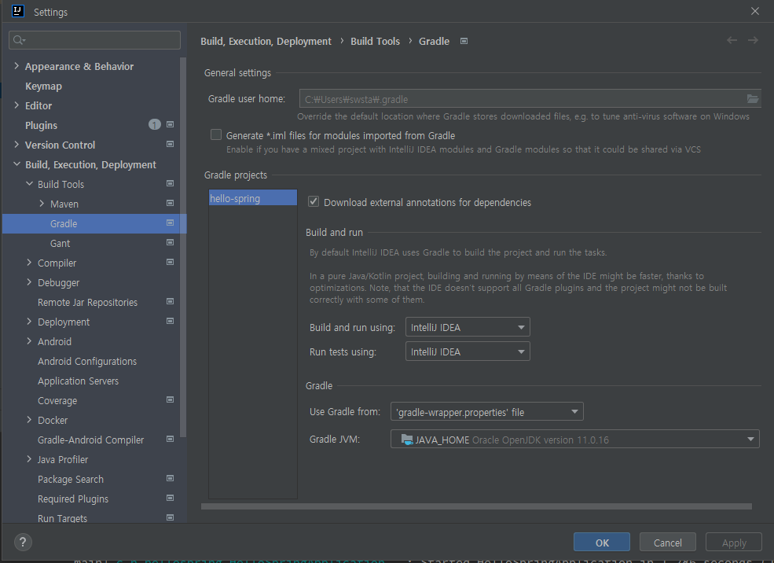

# 스프링 입문 - 코드로 배우는 스프링 부트, 웹 MVC, DB 접근 기술

인프런 강의 링크 : https://www.inflearn.com/course/%EC%8A%A4%ED%94%84%EB%A7%81-%EC%9E%85%EB%AC%B8-%EC%8A%A4%ED%94%84%EB%A7%81%EB%B6%80%ED%8A%B8/dashboard

## 섹션 1. 프로젝트 환경설정

### 프로젝트 생성
- https://start.spring.io/ 접속
  - gradle, java 선택
  - dependencies에서 Spring Web과 Thymeleaf 추가
  - GENERAGE 버튼 클릭해서 프로젝트 다운로드
  - InteliJ에서 Open

- InteliJ 설정에서 gradle [Build and run]을 [InteliJ IDEA]로 바꿔주면 빌드가 더 빨리 됨

### 라이브러리 살펴보기
- IneliJ 우측의 Gradle 탭에서 Dependency 확인할 수 있음
- 실무에서는 System.out.print는 사용하지 않고 로그를 사용함
  - Spring 개발에서 최근 logback과 log4j 이 두 조합을 많이 사용함
  - io에서도 기본적으로 제공

> Gradle은 의존관계가 있는 라이브러리를 함께 다운로드 한다.

#### 스프링 부트 라이브러리
- spring-boot-starter-web
- spring-boot-starter-tomcat: 톰캣 (웹서버)
- spring-webmvc: 스프링 웹 MVC
- spring-boot-starter-thymeleaf: 타임리프 템플릿 엔진(View)
- spring-boot-starter(공통): 스프링 부트 + 스프링 코어 + 로깅
  - spring-boot
    - spring-core
  - spring-boot-starter-logging
    - logback, slf4j

#### 테스트 라이브러리
- spring-boot-starter-test
  - junit: 테스트 프레임워크
  - mockito: 목 라이브러리
  - assertj: 테스트 코드를 좀 더 편하게 작성하게 도와주는 라이브러리
  - spring-test: 스프링 통합 테스트 지원

## 섹션 2. 스프링 웹 개발 기초

### 정적 컨텐츠
- 서버에서 가지고 있는 html 파일을 그대로 클라이언트에 보냄

### MVC와 템플릿 엔진
- Model, View, Controller

### API
- @ResponseBody
  - viewResolver를 사용하지 않음
  - HTTP BODY에 데이터를 직접 반환함
  - viewResolver 대신에 HttpMessageConverter가 동작함
  - 반환 데이터가 문자열일 경우 그대로 보내주고(StringConverter), 객체일 때에는 JSON으로 변환함(StringConverter)