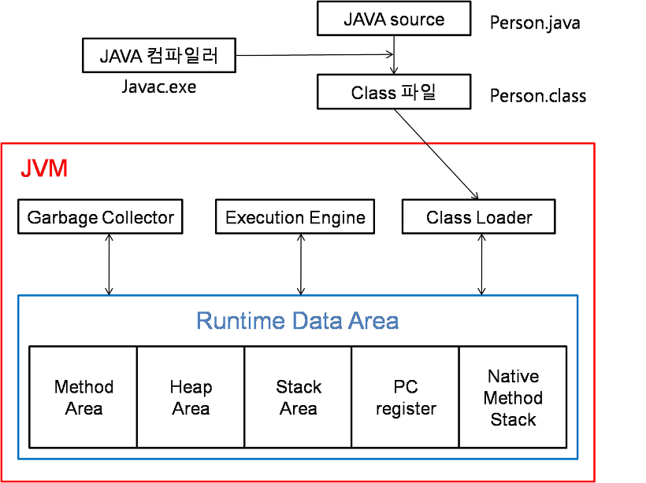
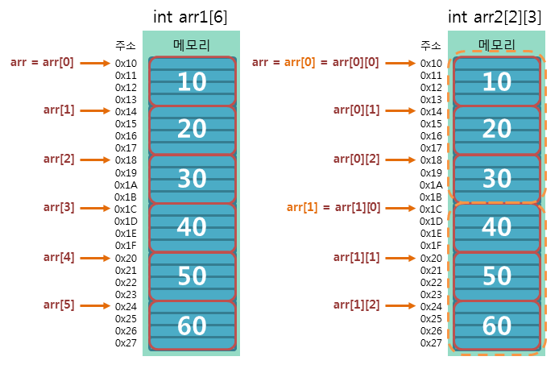
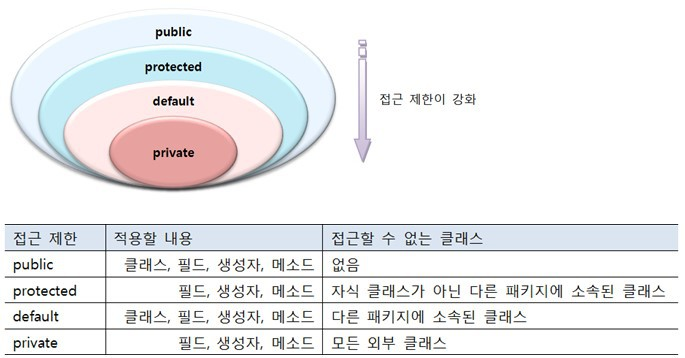

# 목차
##### [1. 자바 시작하기](#1-자바-시작하기)
##### [2. 변수와 타입](#2-변수와-타입)
##### [3. 연산자](#3-연산자)
##### [4. 조건문과 반복문](#4-조건문과-반복문)
##### [5. 참조 타입](#5-참조-타입)
##### [6. 클래스](#6-클래스)
##### [7. 상속](#7-상속)
##### [8. 인터페이스](#8-인터페이스)
##### [9. 중첩 클래스와 중첩 인터페이스](#9-중첩-클래스와-중첩-인터페이스)
##### [10. 예외 처리](#10-예외-처리)
##### [11. 기본 API 클래스](#11-기본-api-클래스)
##### [12. 멀티 스레드](#12-멀티-스레드)
##### [13. 제너릭](#13-제너릭)

---

# 1. 자바 시작하기

## 1.1 Java의 특징
- 이식성이 높은 언어
- 객체 지향 언어
- 함수적 스타일 코딩 지원
- 메모리를 자동으로 관리(JVM)
- 다양한 어플리케이션을 개발할 수 있음
   - 개발 도구와 API를 묶어 에디션 형태로 정의하고 있음(Java SE, EE 등)
 - 동적 로딩 지원
   - 객체가 필요한 시점에 클래스를 동적으로 로딩해서 객체를 생성
   - 전체 애플리케이션을 다시 컴파일할 필요가 없음
 - 막강한 오픈소스 라이브러리가 풍부


## 1.2 자바 가상기계(JVM)
- 자바 프로그램은 완전한 기계어가 아닌 중간 단계의 바이트 코드임
- 때문에 이것을 해석하고 실행할 수 있는 가상의 운영체제 필요
- 이것이 바로 JVM(가상의 운영체제 역할)
- 바이트 코드는 모든 JVM에서 동일한 실행 결과를 보장하지만 JVM은 운영체제에 종속적
- java는 JVM에 의해 기계어로 번역되고 실행됨
  - C, C++ 같은 완전한 기계어보다는 속도가 느림
  - JVM 내부의 최적화된 JIT 컴파일러를 통해서 속도의 격차는 많이 줄어드는 중




## 1.3 자바 프로그램 개발 순서
1. 소스 코드 작성 -> 자바 소스 파일(.java)
2. 컴파일러(javac.exe)로 컴파일 -> 바이트 코드 파일(.class)
3. JVM을 구동시키는 명령어 java.exe로 실행 -> main() 메서드를 찾아 실행

---

# 2. 변수와 타입

## 2.1 변수
- 변수(variable)는 **값을 저장할 수 있는 메모리의 공간을 의미**
- 프로그램에 의해서 수시로 값이 변동됨
- 한 가지 타입의 값만 저장 가능
- 의미 있는 변수 이름을 지어주는 것이 좋음
- 리터럴(literal)
  - 소스 코드 내에서 직접 입력된 값
  - 상수(contant)와 같은 의미이지만 프로그램에서는 상수를 '값을 한 번 저장하면 변경할 수 없는 변수'로 정의하기 때문에 이와 구분하기 위해 사용
- 변수는 초기화 되어야 읽을 수 있음
- 선언된 블록 내에서만 사용 가능
- 저장할 수 있는 값의 범위를 초과해서 값이 저장될 경우 엉터리 값이 변수에 저장됨 -> 쓰레기 값


## 2.2 데이터 타입
### 기본(원시: primitive) 타입
- 정수, 실수, 문자, 논리 **리터럴을 직접 저장**하는 타입

#### 정수 타입(byte, char, short, int, long)
- ##### byte 타입
  - 색상 정보 및 파일 또는 이미지 등의 이진(바이너리) 데이터를 처리할 때 주로 사용됨
- ##### char 타입
  - 자바는 모든 문자를 유니코드(Unicode)로 처리함
  - Ex) char c = 65;    // 10진수
  - Ex) char c = '\u0041';  // 16진수
  - String은 기본 타입이 아닌 클래스 타입이고 String 변수는 참조 변수임
    - 문자열을 String 변수에 대입하면 문자열이 변수에 직접 저장되는 것이 아니라 String 객체가 생성되고 String 변수는 String 객체의 번지를 참고함
    - 자세한 내용은 [참조 타입]()에서 자세하게 설명
- ##### short 타입
  - C언어와의 호환을 위해 사용
  - 보통 자바에서는 잘 사용되지 않음
- ##### int 타입
  - **자바에서 정수를 연산하기 위한 기본 타입**
  - byte, short 타입의 변수와 int 타입 변수는 성능 차이가 거의 없음
    - 자바에서 정수 연산을 4 byte로 처리하기 때문
- ##### long 타입
  - 수치와 큰 데이터를 다루는 프로그램에서 사용(은행, 우주 관련 등)
  - int 타입의 저장 범위를 넘어서는 큰 정수는 반드시 소문자 'l'이나 대문자 'L'을 붙어야 함
    - 그렇지 않으면 컴파일 에러 발생
    - 보통 혼동을 피하기 위해 대문자 'L'을 사용함
    - Ex) long var = 1000000000L;

#### 실수 타입(float, double)
- 실수는 정수와 달리 부동소수점(floating-point) 방식으로 저장됨
- 높은 정밀도를 요구하는 계산에서는 double 타입을 사용
- 자바는 실수 리터럴의 기본 타입을 double로 간주함
- 실수 리터럴을 float 타입 변수에 저장하려면 리터럴 뒤에 소문자 'f'나 대문자 'F'를 붙여야 함

#### 논리 타입(boolean)
- 1byte(8bit)로 표현되는 논리값(true/false)을 저장할 수 있는 데이터 타입
- 상태값에 따라 조건문과 제어문의 실행 흐름을 변경하는데 주로 이용됨


## 2.3 타입 변환
- 데이터 타입을 다른 데이터 타입으로 변환하는 것
- 자동(묵시적) 타입 변환과 강제(명시적) 타입 변환이 있음

#### 자동 타입 변환(Promotion)
- 프로그램 실행 도중 자동적으로 타입 변환이 일어남
- 작은 크기를 가지는 타입이 큰 크기를 가지는 타입에 저장될 때 발생
- 변환 이전의 값과 변환 이후의 값은 동일함 -> 손실 없이 그대로 보존

#### 강제 타입 변환(Casting)
- 큰 데이터 타입을 작은 데이터 타입으로 쪼개어서 저장
- float -> int 형변환의 경우 소수점 이하 부분은 버려지고 정수 부분만 저장됨
- 사용자로부터 입력받은 값을 변환할 때 손실이 발생하지 않도록 해야함
- 정수 타입을 실수 타입으로 변환할 때 정밀도 손실을 피해야 함
  - 모든 int 값을 실수 타입으로 안전하게 변환시키는 double 타입을 사용하면 됨
  - double의 가수부는 52비트가 할당되어 있기 때문에 모든 int 값 커버 가능

#### 연산식에서의 자동 타입 변환
- 연산은 기본적으로 같은 타입의 피연산자(operand) 간에만 수행됨
- 정수 연산일 경우 int 타입을 기본으로 함
  - 크기가 4byte 보다 작은 타입(byte, char, short)은 4byte인 int 타입으로 변환된 후 연산이 수행됨
  - 따라서 연산 결과도 int 타입임
- 피연산자 중 하나가 long 타입이라면 다른 피연산자도 long 타입으로 변환 -> 결과값도 long 타입
- 실수 연산은 double 타입을 기본으로 함

---

# 3. 연산자

## 3.1 연산자와 연산식
- 연산(operations) : 데이터를 처리하여 결과를 산출하는 것
- 연산자(operator) : 연산에 사용되는 표시나 기호
- 피연산자(operand) : 연산되는 데이터
- 연산식(expressions) : 연산의 과정을 기술한 것
- 산출되는 값의 타입은 연산자별로 다름
- 필요로 하는 피연산자의 수에 따라 단항, 이항, 삼항 연산자로 구분함


## 3.2 단항 연산자
#### 비트 반전 연산자(~)
- 비트 반전 연산자 산출 타입은 int 타입임
- 부호를 바꾸기 위해서는 비트 반전 연산자를 사용한 후 +1을 해줘야 함
```java
byte v1 = 10;
int v2 = ~v1 + 1;
```


## 3.3 이항 연산자

#### 산술 연산자(+, -, *, /, %)
- boolean 타입을 제외한 모든 기본 타입에 사용 가능
- 피연산자들의 타입이 동일하지 않을 경우 다음과 같은 규칙을 사용함
  - 피연산자들이 *모두 정수 타입이고, int 타입(4 byte)보다 작은 타입일 경우* 모두 int 타입으로 변환 후, 연산을 수행한다. 따라서 연산의 **산출 타입은 int**이다.
  - 피연산자들이 *모두 정수 타입이고, long 타입이 있을 경우* 모두 long 타입으로 변환 후, 연산을 수행한다. 따라서 연산의 **산출 타입은 long**이다.
  - 피연산자 중 *실수 타입(float, double)이 있을 경우*, 크기가 큰 실수 타입으로 변환 후, 연산을 수행한다. 따라서 연산의 **산출 타입은 실수 타입**이다.
- 정수 타입 연산의 결과가 int 타입으로 나오는 이유 -> JVM이 기본적으로 32비트 단위로 계산하기 때문
- 리터럴 간의 연산은 타입 변환 없이 해당 타입으로 계산됨
```java
char c1 = 'A' + 1;  // 오류 발생 안함
char c2 = 'A'
char c3 = c2 + 1;   // 컴파일 에러
char c4 = (char) (c2 + 1);  // 강제 타입 변환(casting)을 했기 때문에 정상 동작
```

- ##### 오버플로우 탐지
  - 산술 연산할 때 산출 타입으로 충분히 표현 가능한지 살펴봐야 함
  - safeAdd() 메소드를 사용하면 오버플로우 발생 시 ArithmeticException을 발생시켜 데이터에 쓰레기값이 들어가는 것을 방지할 수 있음
- ##### 정확한 계산은 정수 사용
  - 이진 포맷의 가수를 사용하는 부동소수점 타입(float, double)은 0.1을 정확히 표현할 수 없어 근사치로 처리함
  - 정확한 계산이 필요하다면 정수 연산으로 변경해서 계산해야 함
- ##### NaN과 Infinity 연산
  - 정수 연산 시 우측 피연산자로 0을 사용하면 실행 시 ArithmeticExceiption 발생
  - 실수 연산으로 하게 되면 에러는 발생하지 않지만 Infinity 값을 가지고 % 연산은 NaN(Not a Number)을 가짐
  - Inifinity와 NaN은 어떤 다른 값과 연산을 하더라도 Inifinity와 NaN이 산출되기 때문에 데이터가 엉망이 될 수 있음
    - 이를 방지하기 위해 Double.isInfinity()와 Double.isNaN() 메소드를 사용함

#### 문자열 연결 연산자
- 문자열을 서로 결합하는 연산자
- 문자열과 숫자가 혼합된 + 연산식은 왼쪽에서부터 오른쪽으로 연산이 진행됨
```java
"JDK" + 3 + 3.0;        // "JDK33.0"
3 + 3.0 + "JDK";        // "6.0JDK"
```

#### 비교 연산자
- 흐름 제어문에서 주로 이용되어 실행 흐름을 제어할 때 사용됨
- 연산을 수행하기 전에 타입 변환을 통해 피연산자의 타입을 일치시킴(자동 타입 변환 적용)
```java
'A' == 65       // true, 'A'가 더 큰 타입인 int 타입으로 변환되어 65 == 65로 수행
3 == 3.0        // true, double이 int보다 더 큰 타입이기 때문에 3.0 == 3.0으로 비교

/* 예외사항 */
0.1 == 0.1f     // false
/*
이진 포맷의 가수를 사용하는 모든 부동소수점 타입은 0.1을 정확히 표현할 수 없어서 
0.1f는 0.1의 근사값으로 표현되어 0.1000000149011612와 같은 값이 됨

때문에 피연산자라를 모두 float 타입으로 강제 타입 변환한 후에 비교 연산을 하던지,
정수로 변환해서 비교해야 함
*/
```

#### 논리 연산자
- 논리 연산자의 피연산자는 boolean 타입만 사용 가능
- &&와 &는 산출 결과는 같지만 연산 과정이 조금 다름
  - &&는 앞의 피연산자가 false라면 바로 false 산출 결과를 내지만 &는 두 피연산자 모두를 평가해서 산출 결과를 냄
  - 따라서 보다 &&가 더 효율적으로 동작함
  - 이는 ||와 |도 마찬가지

#### 비트 연산자
- 0과 1로 표현이 가능한 정수 타입만 비트 연산 가능

--- 

# 4. 조건문과 반복문


#### if문
- 조건식에 true 또는 false 값을 산출할 수 있는 연산식이나, boolean 변수가 올 수 있음
#### switch문
- 조건식에 정수형(byte, char, short, int)이 올 수 있음
- 조건식에 boolean, 실수형(float, double)은 사용불가
- break를 써주지 않으면 case 값과 상관없이 다음 case가 연달아 실행됨

#### for문
- 반복 횟수를 알고 있을 때 주로 사용함
- 초기화식에서 루프 카운트 변수를 선언할 때 부동소수점 타입을 사용하지 말아야 함
  - 근사값으로 표현되기 때문에 원하는만큼 루프가 시행되지 않을 수 있음

#### while문
- 조건에 따라 반복할 때 주로 사용
- 조건식이 false가 되면 반복 행위를 멈추고, while문을 종료함

#### break, continue
- 반복문이 중첩되있을 때 label을 사용하여 바깥쪽 반복문까지 종료하거나 다음 루프를 실행할 수 있음
```java
for (;;) {
    for (;;) {
        break;      // 안쪽 반복문만 종료
    }
}

Outer: for (;;) {
    for (;;) {
        break Outer;      // 라벨이 적혀있는 바깥쪽 반복문까지 종료
    }
}

All: for (;;) {
    for (;;) {
        for (;;) {
            continue All;      // continue도 마찬가지
        }
    }
}
```

---

# 5. 참조 타입

## 5.1 데이터 타입 분류
- 자바의 데이터 타입
  - 기본 타입(primitive type) : 정수, 실수, 문자, 논리 리터럴을 저장하는 타입
  - 참조 타입(reference type) : 객체(Object)의 번지를 참조하는 타입(배열, 열거, 클래스, 인터페이스 등)


## 5.2 메모리 사용 영역
- JVM이 시작되면 JVM은 운영체제에서 할당받은 메모리 영역(Runtime Data Area)을 다음과 같이 세부영역으로 구분해서 사용함
- 추후 다시 읽어봐야 할 글
  - [Full explanation of JVM – Runtime Data Area and How JVM using it](https://blog.knoldus.com/full-explanation-of-jvm-runtime-data-area-and-how-jvm-using-it/)
  - [자바 메모리 구조(Runtime Data Area)](https://jithub.tistory.com/40)


### 메소드 영역
- 코드에서 사용되는 클래스(~.class)들을 클래스 로더로 읽어 클래스별로 runtime contant pool, field data, method data, method 코드, constructor 코드 등을 분류해서 저장함
- Class Loader가 적재한 클래스(또는 인터페이스)에 대한 메타데이터 정보가 저장됨
- JVM이 시작할 때 생성되고 **모든 스레드가 공유**하는 영역

### 힙(Heap) 영역
- 객체와 배열이 **동적**으로 생성되는 영역
  - 이를 JVM 스택 영역의 변수나 다른 객체의 필드에서 참조함
- 참조하는 변수나 필드가 없다면 의미 없는 객체(쓰레기)로 취급하고 JVM의 GC(Garbage Collector)를 실행시켜 쓰레기 객체를 힙 영역에서 자동으로 제거함
- 개발자는 객체 제거를 위해 별도의 코드를 작성할 필요가 없고 오히려 부작용만 낳을 가능성이 큼
- 모든 Thread가 공유하기 때문에 동기화 문제가 발생할 수 있음

### JVM 스택(Stack) 영역
- 각 스레드마다 하나씩 존재하며 스레드가 시작될 때 할당됨
- 기본적으로 main 스레드 하나만 존재하며 JVM 스택도 하나임
- 메소드를 호출할 때마다 프레임(Frame)을 추가(push)하고 메소드가 종료되면 해당 프레임을 제거(pop)함
- printStackTrace()에서 Stack Trace의 각 라인은 하나의 프레임을 표현함
- 로컬 변수 스택
  - 프레임 내부에 있음
  - 초기화될 때 변수가 이 영역에 생성됨
  - 변수는 선언된 블록 안에서만 스택이 존재하고 블록을 벗어나면 스택에서 제거됨


## 5.3 참조 변수의 ==, != 연산
- 동일한 객체를 참조하는지, 다른 객체를 참조하는지 알아볼 때 사용됨
- 참조 타입 변수의 값은 힙 영역의 객체 주소이므로 결국 주소 값을 비교한느 것임


## 5.4 null과 NullPointerException
- 참조 타입 변수는 힙 영역의 객체를 참조하지 않는다는 뜻으로 null 값을 가질 수 있음
- null로 초기화된 참조 변수는 스택 영역에 저장됨
- NullPointerException : 참조 타입 변수를 잘못 사용하면 발생함


## 5.5 String 타입
- 큰 따옴표로 감싼 문자열 리터럴을 대입하여 저장 가능
```java
String s;
s = "test";
String s2 = "second";
```
- new 연산자
  - 힙 영역에 새로운 객체를 만들 때 사용
  - 객체 생성 연산자라고도 함
```java
String s1 = "TEST";
String s2 = "TEST";
/* 
s1 == s2 -> true
s1.equals(s2) -> true

자바에서는 문자열 리터럴이 동일하다면 String 객체를 공유하도록 되어있음
*/ 

String s3 = new String("TEST");
String s4 = new String("TEST");
/*
s3 == s4 -> false
s3.equals(s4) -> true

문자열이 동일하더라도 new를 사용하여 String 객체를 생성했기 때문에 서로 다른 객체를 참조함
문자열의 값은 같기 때문에 equals() 메소드의 결과값은 true임
*/
```


## 5.6 배열 타입
- 같은 타입의 데이터를 연속된 공간에 나열시키고, 각 데이터에 인덱스(index)를 부여해놓은 자료구조임
- 같은 타입의 데이터만 저장할 수 있음
- 선언과 동시에 저장할 수 있는 데이터 타입이 결정됨
- 다른 데이터 타입의 값을 저장하려고 하면 타입 불일치(Type mismatch) 컴파일 오류 발생

### 배열 선언
- 대괄호 []를 타입 또는 변수 뒤에 붙임
- null 값으로 초기화할 수 있음
- 배열 변수를 이미 선언한 후에 다른 실행문에서 중괄호를 사용한 배열 생성은 허용되지 않음
  - new 연산자를 사용해서 할당해주는건 가능
- new 연산자를 사용하여 배열을 생성할 경우, 배열은 자동적으로 기본값으로 초기화됨
  - 배열의 데이터 타입에 따라 0, 0.0f, false, null 등으로 초기화됨
```java
// 배열 선언
int[] intArray;
double[] doubleArray;
String[] strArray;

int intArray[];
double doubleArray[];
String strArray[];

// 배열 생성
String[] names = {"Alice", "Brown", "Charile"};

String[] names = null;
names = {"Alice", "Brown", "Charile"};                  // 컴파일 에러 발생!!
naems = new String[] {"Alice", "Brown", "Charile"};     // 정상 동작

int[] scores = new int[3];    // 기본값인 0으로 초기화
// 배열 생성 후 값을 저장하기 위해서 대입 연산자 사용
scores[0] = 84;
scores[1] = 91;
scores[2] = 76;
```
- 배열 길이
  - length 필드 사용
  - length 필드는 읽기 전용이기 때문에 바꿀 수 없음
  - for문에서 유용하게 사용
- #### 다차원 배열
  - 값들이 행과 열로서 구성된 배열을 2차원 배열이라고 함

  - 배열 변수인 arr2는 길이가 2인 배열을 참조함(0x10)
  - arr2[0]은 arr2[0][0]을 참조함
  - arr2[1]은 arr2[1][0]을 참조함
- #### 배열 복사
  - 한 번 생성된 배열은 길이를 늘리거나 줄일 수 없음
  - 만약 길이를 변경하고 싶다면 새로운 배열을 생성하고, 기존 배열 항목을 복사해야 됨
  - 얕은 복사(shallow copy)
    - 새 배열에 이전 배열의 객체 주소를 복사
    - 기존 배열의 값을 수정하면 새 배열에도 영향을 끼침
  - 깊은 복사(deep copy)
    - 참조하는 객체를 별도로 생성
  - [자바 배열 복사 메소드 참고](https://coding-factory.tistory.com/548)
- #### 향상된 for문
```java
int[] scores = {95, 71, 84, 93, 87};

for (int score: scores) {
    // do something
}
```

## 5.7 열거 타입(enumeration type)
- 한정된 값만을 가지는 데이터 타입
- 몇 개의 열거 상수(enumeration constant) 중에서 하나의 상수를 저장하는 데이터 타입
- 네이밍
  - 열거 타입 이름은 관례적으로 pascal case를 사용함
  - 열거 타입 이름과 소스 파일명은 대소문자 모두 동일해야함
  - 관례적으로 열거 상수는 모두 대문자로 작성하고, 여러 단어일 경우 단어 사이를 언더바(_)로 연결함
```java
// Week.java

public enum Week {      // Week -> 열거 타입 이름
    /* 열거 상수 */
    MONDAY,
    TUESDAY,
    WEDNESDAY,
    THURSDAY,
    FRIDAY,
    SATURDAY,
    SUNDAY
}
```

```java
// test.java

/* 
- 열거 타입 변수 today에 열거 상수 대입
- 열거 상수는 단독으로 사용 못하고 열거타입.열거상수로 사용 가능
- 열거 상수는 열거 객체로 생성되기 때문에 Heap 영역에 있음

- 여기서는 열거 타입 Week가 총 7개의 Week 객체로 생성되고, 
  메소드 영역에 생성된 열거 상수가 Week 객체를 각각 참조함
- 열거 타입 변수 today는 stack 영역에 생성됨
*/
Week today = Week.SUNDAY;       

today == Week.SUNDAY;       // true, 동일한 Week 객체를 참조하기 때문

```

--- 

# 6. 클래스

## 6.1 객체 지향 프로그래밍
- 객체 지향 프로그래밍(OOP: Object Oriented Programming)

### 6.1.1) 객체
- 객체(Object) : 물리적으로 존재하거나 추상적으로 생각할 수 있는 것 중 **자신의 속성을 가지고 있고 다른 것과 식별 가능한 것**
- 객체 모델링(Object Modeling)
  - 현실 세계의 객체를 소프트웨어 객체로 설계하는 것
  - 현실 세계 객체의 속성과 동작을 추려내어 소프트웨어 객체의 필드와 메소드로 정의하는 과정

### 6.1.2) 객체의 상호작용
- 객체들은 각각 독립적으로 존재
- 다른 객체와 서로 상호작용
- 상호작용 수단은 메소드임
- 매개값 : 메소드를 실행하기 위해 필요한 데이터

### 6.1.3) 객체 간의 관계
- 사용 관계, 상속 관계, 집합 관계 등이 있음

### 6.1.4) 객체 지향 프로그래밍의 특징

#### 캡슐화(Encapsulation)
- 객체의 필드, 메소드를 하나로 묶고, 실제 구현 내용을 감추는 것
- 외부 개겣는 내부의 구조를 알지 못하며 객체가 노출해서 제공하는 필드와 메소드만 이용 가능
- 외부의 잘못된 사용으로 인해 객체가 손상되지 않도록 함
- 접근 제한자(Access Modifier) : 객체의 필드와 메소드의 사용 범위를 제한함으로써 외부로부터 보호하기 위해 사용

#### 상속(Inheritance)
- 필드와 메소드를 하위 객체에게 물려줌
- 반복된 코드의 중복을 줄여주고 개발 시간을 절약, 유지 보수 시간을 최소화 시켜줌

#### 다형성(Polymorphism)
- 같은 타입이지만 실행 결과가 다양한 객체를 이용할 수 있는 성질
- 하나의 타입에 여러 객체를 대입함으로써 다양한 기능을 이용할 수 있도록 해줌
- 다형성을 통해 객체의 부품화 가능


## 6.2 객체와 클래스
- 클래스(Class) : 객체를 생성하기 위한 필드와 메소드가 정의되어 있음
- 인스턴스(Instance) : 클래스로부터 만들어진 객체
- 클래스로부터 객체를 만드는 과정 -> 인스턴스화
- 객체 지향 프로그래밍 개발의 세 가지 단계
  - 클래스 설계
  - 설계된 클래스를 가지고 사용할 객체 생성
  - 생성된 객체를 이용


## 6.3 클래스 선언
- 파일 이름과 동일한 이름의 클래스 선언에만 public 접근 제한자를 붙일 수 있음
- 가급적이면 소스 파일 하나당동일한 이름의 클래스 하나만을 선언하는 것이 좋음


## 6.4 객체 생성과 클래스 변수
- new 연산자
  - 클래스로부터 객체를 생성시키는 연산자
  - new 연산자 뒤에는 생성자가 오는데, 생성자는 클래스() 형태를 가지고 있음
  - new 연산자로 생성된 객체는 메모리 힙(heap) 영역에 생서됨
  - 힙 영역에 객체를 생성시킨 후, 객체의 주소를 리턴함
- 클래스의 용도
  - 라이브러리(API: Application Program Interface)용 : 다른 클래스에서 이용할 목적으로 설계됨
  - 실행용 : 프로그램의 실행 진입점인 main() 메소드를 제공하는 역할


## 6.5 클래스의 구성 멤버
- 필드(Field), 생성자(Constructor), 메소드(Method)가 있음
- 생략되거나 복수 개가 작성될 수 있음

### 6.5.1) 필드
- 객체의 고유 데이터, 부품 객체, 상태 정보를 저장하는 곳
- 생성자와 메소드 전체에서 사용됨
- 객체가 소멸되지 않는 한 객체와 함께 존재함

### 6.5.2) 생성자
- new 연산자로 호출되는 특별한 중괄호 {} 블록
- 객체 생성 시 초기화를 담당함
- 필드를 초기화하거나, 메소드를 호출해서 객체를 사용할 준비를 함
- 클래스 이름으로 되어 있고 리턴 타입이 없음

### 6.5.3) 메소드
- 객체의 동작에 해당함
- 필드 읽기/수정, 다른 객체를 생성해서 다양한 기능 수행
- 객체 간의 데이터 전달의 수단으로 사용됨
- 외부로부터 매개값을 받을 수 있고, 실행 후 어떤 값을 리턴할 수 있음


## 6.6 필드(Field)
- 객체의 고유 데이터, 객체가 가져야 할 부품, 객체의 현재 상태 데이터를 저장
- 클래스 멤버 변수라고도 함

#### 필드 선언
- 클래스 중괄호 {} 블록 어디서든 존재할 수 있음(생성자와 메소드 내부 제외)
- 생성자와 메소드 중괄호 블록 내부에 선언된 것 -> 로컬 변수
- 초기값이 지정되지 않은 필드들은 객체 생성 시 자동으로 기본 초기값으로 설정됨

#### 필드 사용
- 필드를 사용하기 위해서는 먼저 객체를 생성해야 함 
  -> 필드는 객체에 소속된 데이터이므로 객체가 존재하지 않으면 필드도 존재 X
- 도트(.) 연산자 : 객체 접근 연산자, 객체가 가지고 있는 필드나 메소드를 사용할 때 쓰임


## 6.7 생성자(Constructor)
- new 연산자와 같이 사용되어 클래스로부터 객체를 생성할 때 호출되어 객체의 초기화를 담당함
- 객체 초기화 : 필드를 초기화하거나, 메소드를 호출해서 객체를 사용할 준비를 하는 것
- 생성자를 실행시키지 않고는 클래스로부터 객체를 만들 수 없음
- 생성자에서 예외(에러)가 발생했다면 객체는 생성되지 않음
- 반드시 존재하며, 하나 이상을 가질 수 있음
  
#### 생성자 오버로딩(Overloading)
- 매개 변수를 달리하는 생성자를 여러개 선언하는 것

#### 다른 생성자 호출(this())
- 생성자 오버로딩이 많아질 경우 생성자 간의 중복된 코드가 발생할 수 있음
- 초기화 내용을 가지고 있는 생성자를 호출하는 방법으로 개선 가능
- this()
  - 자신의 다른 생성자를 호출하는 코드
  - 반드시 **생성자의 첫줄**에서만 허용됨
  - this() 다음에는 추가적인 실행문들이 올 수 있음
```java
public class Car {
  String model;
  String color;
  int maxSpeed;

  //생성자
  Car() {

  }

  // 다른 생성자를 호출함으로써 중복 코드를 최소화 함
  Car(String model) {
    this(model, "은색", 250);
  }

  Car(String model, String color) {
    this(model, color, 250);
  }

  Car(String model, String color, int maxSpeed) {
    // 공통 실행 코드
    this.model = model;
    this.color = color;
    this.maxSpeed = maxSpeed;
  }
}
```


## 6.8 메소드
- 객체의 동작에 해당하는 중괄호 {} 블록
- 객체 간의 데이터 전달 수단으로 사용됨
- 외부로부터 매개값을 받을 수 있고, 실행 후 어떤 값을 리턴할 수 있음

### 6.8.1) 메소드 선언
- 선언부(리턴타입, 메소드 이름, 매개변수 선언)와 실행 블록으로 구성됨
- 메소드 선언부를 메소드 시그니처(signature)라고도 함

#### 리턴 타입
- 메소드가 실행 후 리턴하는 값의 타입

#### 매개 변수 선언
- 메소드가 실행할 때 필요한 데이터를 외부로부터 받기 위해 사용됨

#### 매개 변수의 수를 모를 경우
- 매개 변수를 배열 타입으로 선언하여 해결할 수 있음
  - 메소드를 호출하기 전에 배열을 생성해야 함
- 키워드 ... 로 가변인자(variable argument) 사용 가능
  - 메소드 호출 시 넘겨준 값의 수에 따라 자동으로 배열이 생성되고 매개값으로 사용됨
```java
void sum(int ... values) {
  // do something
}

sum(1, 2, 3);
sum(1, 2, 3, 4, 5)

int[] values = { 1, 2, 3 };
sum(values);
sum(new int[] { 1, 2, 3, 4, 5})
```

### 6.8.2) 리턴(return)문

#### 리턴값이 있는 메소드
- 리턴 타입이 있는 메소드는 반드시 리턴(return)문을 사용해서 리턴값을 지정해야 함
- 만약 return문이 없다면 컴파일 오류 발생
- return문이 실행되면 메소드는 즉시 종료됨
- 리턴값은 리턴 타입이거나 리턴 타입으로 변환될 수 있어야 함

#### 리턴값이 없는 메소드(void)
- return문을 사용하면 메소드 실행을 강제 종료시킴

### 6.8.3) 메소드 오버로딩
- 클래스 내에 같은 이름의 메소드를 여러 개 선언하는 것
- 매개 변수의 타입 ,개수, 순서 중 하나가 달라야 함
- 오버로딩된 메소드를 호출할 때 JVM은 매개값의 타입을 보고 메소드를 선택함
```java
int plus(int x, int y) {
  int result = x + y;
  return result;
}

double plus(double x, double y) {
  double result = x + y;
  return result;
}

plus(10, 20);         // int plus(int x, int y) 호출
plus(10.5, 25.3);     // double plus(double x, double y) 호출

int x = 10;
double y = 20.3;
plus(x, y);           // double plus(double x, double y) 호출
/* 
JVM에서는 일차적으로 매개 변수 타입을 보지만, 
매개 변수의 타입이 일치하지 않을 경우, 자동 타입 변환이 가능한지를 검사함

첫 번째 매개 변수인 int 타입은 dobule 타입으로 변환이 가능함
-> double plus(double x, double y) 호출
*/
```
```java
int divide(int x, int y) {}
double divide(int a, int b) {}
/*
컴파일 오류 발생!
리턴 타입만 다르고 매개 변수가 동일하기 때문에 메소드 오버로딩이 아님
JVM에서 적절한 메소드를 선택할 때 리턴 타입은 아무런 영향을 끼치지 못하기 때문
*/
```


## 6.9 인스턴스 멤버와 this
- 인스턴스(instacne) 멤버 : 객체(인스턴스)를 생성한 후 사용할 수 있는 필드와 메소드


## 6.10 정적 멤버와 static
- 정적(static) 멤버
  - 클래스에 고정된 멤버
  - 객체를 생성하지 않고 사용할 수 있는 필드와 메소드
  - 클래스 멤버라고도 함
- 클래스 로더가 클래스(바이트 코드)를 로딩해서 메소드 메모리 영역에 적재할 때 클래스별로 관리됨
  - 때문에 클래스의 로딩이 끝나면 바로 사용할 수 있음
- 인스턴스/정적 필드와 메소드 판단기준
  - 인스턴스 필드/메소드
    - 객체마다 가지고 있어야 할 데이터
    - 인스턴스 필드을 이용해서 실행해야 함
  - 정적 필드/메소드
    - 객체마다 가지고 있을 필요성이 없는 공용적인 데이터
    - 인스턴스 필드를 이용하지 않음
```java
public class Calculator {
  String color;                       // 인스턴스 필드
  static double pi = 3.141592;        // 정적 필드

  void setColor(String color) {       // 인스턴스 메소드
    this.color = color;
  }
  static int plus(int x, int y) {     // 정적 메소드
    return x + y;
  }
  static int minus(int x, int y) {    // 정적 메소드
    return x - y;
  }
}
```

#### 정적 초기화 블록
- 정적 필드는 일반적으로 필드 선언과 동시에 초기값을 줌
- 생성자는 객체 생성 시에만 실행됨 -> 정적 필드는 생성자에서는 초기화 작업을 할 수 없음
- 정적 블록(static block)
  - 정적 필드의 복잡한 초기화 작업을 위해 사용
  - 클래스가 메모리로 로딩될 때 자동적으로 실행되고, 여러 개 있다면 선언된 순서대로 실행됨
```java
public class Television {
  static String company = "Samsung";
  static String model = "LCD";
  static String info;

  static {
    info = company + "-" + model;
  }
}
```

- 정적 메소드와 블록 내부에서는 인스턴스 필드나 메소드를 사용할 수 없음
  - this 키워드도 사용 불가
  - 객체를 먼저 생성하고 참조 변수로 접근해야 함
```java
public class ClassName {
  int field1;
  static int field2;

  void method1() {}
  static void method2() {}

  static {
    field1 = 10;        // 컴파일 에러
    method1()           // 컴파일 에러
    field2 = 10;
    method2();
  }
  static void method3() {
    this.field1 = 10;   // 컴파일 에러
    this.method1();     // 컴파일 에러
    field2 = 10;
    method2();
  }

}
```

#### 싱글톤(Singleton)
- 단 하나의 객체만 만들도록 보장해야할 때 사용
- 클래스 외부에서 new 연산자로 생성자를 호출할 수 없도록 막아야 함
  - 생성자를 호출한 만큼 객체가 생성되기 때문
  - 생성자 앞에 private 접근 제한자를 붙여줌
- 자신의 타입인 정적 필드를 하나 선언하고 자신의 객체를 생성해 초기화함
- 정적 필드도 private 접근 제한자를 붙여 외부에서 필드값을 변경하지 못하도록 함
- 대신 외부에서 호출할 수 있는 정적 메소드인 getInstance()를 선언하고 정적 필드에서 참조하고 있는 잣니의 객체를 리턴해줌

```java
public class SingletonClass {
  // 정적 필드
  private static SingletonClass singleton = new SingletonClass();

  // 생성자
  private SingletonClass() {}

  // 정적 메소드
  static SingletonClass getInstance() {
    return singleton;
  }
```

```java
SingletonClass c1 = SingletonClass.getInstance();
SingletonClass c2 = SingletonClass.getInstance();
```


## 6.11 final 필드와 상수

### 6.11.1) final 필드
- 초기값이 저장되면 이것이 최종적인 값이 되어서 프로그램 실행 도중에 수정될 수 없음
- 초기값 설정
  - 필드 선언 시 초기화
  - 생성자에서 초기화
  - 생성자에서도 final 필드를 초기화해주지 않으면 컴파일 에러 발생
- 객체마다 저장됨

### 6.11.2) 상수(static final)
- 객체마다 저장되지 않고, 클래스에만 포함됨
- 한 번 초기값이 저장되면 변경할 수 없음
- 복잡한 초기화의 경우 정적 블록에서도 할 수 있음
- 상수명은 모두 대문자로 작성해주는 것이 관례이며, 언더바(__)로 단어들을 연결해줌


## 6.12 패키지(Package)
- 클래스를 체계적으로 관리하기 위해 사용
- 물리적인 형태는 파일 시스템의 폴더임
- 클래스를 유일하게 만들어주는 식별자 역할을 함
  - 클래스 이름이 동일하더라도 패키지가 다르면 다른 클래스로 인식함
- 클래스의 전체 이름은 "패키지명 + 클래스명"임(상위패키지.하위패키지.클래스)

### 6.12.1) 패키지 선언
- 컴파일러는 클래스에 포함되어 있는 패키지 선언을 보고, 파일 시스템의 폴더로 자동 생성시킴
- 여러 회사에서 참여하거나 다른 회사의 패키지를 이용하여 소프트웨어를 개발할 경우
  - 패키지가 서로 중복되지 않도록 회사의 도메인 이름으로 패키지를 만듬
  - 도메인은 등록 기관에서 유일한 이름이 되도록 검증되었기 때문
  - 도메인 이름 역순으로 패키지 이름을 지어줌 -> 포괄적인 이름이 상위 패키지가 되도록 하기 위해
- 마지막에 프로젝트 이름을 붙여주는 것이 관례임
```
com.samsung.projectname
com.hyundai.projectname
com.lg.projectname
com.apache.projectname
```

### 6.12.2) import문
- 다른 패키지에 속하는 클래스를 사용하기 위해 사용
  - import를 사용하지 않으면 클래스 사용 시 패키지 이름을 모두 기술해야 함
- 사용하고자 하는 패키지를 import문으로 선언하고, 클래스를 사용할 때에는 패키지를 생략함
- import문이 작성되는 위치는 패키지 선언과 클래스 선언 사이임
- import문으로 지정된 패키지의 하위 패키지는 import 대상이 아님


## 6.13 접근 제한자(Access Modifier)
- 외부 클래스에서 접근할 수 있는 멤버와 접근할 수 없는 멤버로 구분해서 필드, 생성자, 메소드를 설계하는 것이 바람직함 -> 이러한 기능을 구현하기 위해 접근 제한자 사용



### 6.13.1) 클래스의 접근 제한

#### default 접근 제한
- 클래스 선언 시 public을 생략했다면 기보적으로 default 접근 제한을 가짐
- 같은 패키지에서 아무런 제한 없이 사용 가능
- 다른 패키지에서는 제한됨

#### public 접근 제한
- 다른 패키지에서도 아무런 제한 없이 사용 가능
- 다른 개발자가 사용할 수 있도록 라이브러리 클래스로 개발한다면 반드시 public 접근 제한 사용해야 함

### 6.13.2) 생성자의 접근 제한
- 자동으로 생성되는 기본 생성자의 접근 제한은 클래스의 접근 제한과 동일함

### 6.13.3) 필드와 메소드의 접근 제한
- 클래스 내부에서만 사용할 것인지, 패키지 내에서만 사용할 것인지, 아니면 다른 패키지에서도 사용할 수 있도록 할 것인지를 결정해야 함


## 6.14 Getter와 Setter 메소드
- OOP에서는 메소드를 통해서 데이터를 변경하는 방법을 선호함
- 데이터는 욉우세ㅓ 접근할 수 없도록 막고 메소드는 공개해서 외부에서 메소드를 통해 데이터에 접근하도록 유도함
- 메소드에서 매개값을 검증해서 유요한 값만 데이터에 저장하기 위함


## 6.15 어노테이션(Annotation)
- 어노테이션은 메타데이터(metadata)라고 볼 수 있음
- **메타데이터(metadata)** : 컴파일 과정과 실행 과정에서 코드를 어떻게 컴파일하고 처리할 것인지를 알려주는 정보임
- 용도
  - 컴파일러에게 코드 문법 에러를 체크하도록 정보를 제공
  - 소프트웨어 개발 툴이 빌드나 배치 시 코드를 자동으로 생성할 수 있도록 정보를 제공
  - 실행 시 (런타임 시) 특정 기능을 실행하도록 정보를 제공
- 대표적으로 @Override 어노테이션이 있으며, 메소드가 오버라이드(재정의)된 것임을 컴파일러에게 알려주어 컴파일러가 오버라이드 검사를 하도록 함
- 실행 시 클래스의 역할을 정의하기도 함

### 6.15.1) 어노테이션 타입 정의와 적용
- 어노테이션은 엘리먼트(element)를 멤버로 가질 수 있음
  - 각 엘리먼트는 타입과 이름으로 구성되며, 디폴트 값을 가질 수 있음
  - 엘리먼트 타입으로는 기본 데이터 타입, 참조 데이터 타입, Class 타입 등을 사용 가능
  - 디폴트 값이 없을 경우 적용 시 반드시 값을 기술해줘야 함
- 기본 엘리먼트인 value를 가질 수 있음
```java
// 정의
public @interface AnnotationName {
  String value();
  String elementName1();
  int elementName2() default 5;
}

// 사용
@AnnotationName(elementName1="값", elementname2=3);
@AnnotationName(elementName1="값");
@AnnotationName("값");                          // 기본 엘리먼트인 value 값으로 자동 설정됨
@AnnotationName(value="값", elementname2=3);    // value와 다른 엘리먼트 값 동시에 줄 때
```

### 6.15.2) 어노테이션 적용 대상
- java.lang.annotation.ElementType 열거 상수로 정의되어 있음
- TYPE, ANNOTATION_TYPE, FIELD, CONSTRUCTOR, METHOD, LOCAL_VARIABLE, PACKAGE 등이 있음
```java
@Target({ElementType.TYPE, ElementType.FIELD, ElementType.METHOD})
public @interface AnnotationName {

}
```

### 6.15.3) 어노테이션 유지 정책
- 사용 용도에 따라 어느 범위까지 유지할 것인지 지정해야 함
- java.lang.annotation.RententionPolicy 열거 상수로 정의되어 있음
  - SOURCE : 소스 상에서만 어노테이션 정보 유지. 소스 코드 분석 때에만 의미가 있으며 바이트 코드 파일에는 정보가 남지 않음
  - CLASS : 바이트 코드 파일까지 어노테이션 정보 유지. 리플렉션을 이용해서 어노테이션 정보를 얻을 수는 없음
  - RUNTIME : 바이트 코드 파일까지 어노테이션 정보 유지. 리플렉션을 이용해서 런타임 시에 어노테이션 정보를 얻을 수 있음
- #### 리플렉션(Reflection)
  - 런타임 시에 클래스의 메타 정보를 얻는 기능
  - 클래스가 가지고 있는 필드, 생성자, 메소드, 그리고 적용된 어노테이션 등을 알아낼 수 있음
  - 리플렉션을 위해서는 어노테이션 유지 정책을 RUNTIME으로 해야 함
  - 코드 자동 생성 툴을 개발하지 않는 이상 어노테이션은 대부분 런타임 시점에 사용하기 위한 용도로 만들어짐
```java
@Target({ElementType.TYPE, ElementType.FIELD, ElementType.METHOD})
@Retention(RetentionPolicy.RUNTIME)
public @interface AnnotationName {

}
```

---

# 7. 상속(Inheritance)

## 7.1 상속 개념
- 부모가 자식에게 물려주는 행위
- 부모 클래스의 멤버를 자식 클래스에게 물려줄 수 있음
- 코드의 중복을 줄여줌
- 클래스의 수정 최소화
- 예외 케이스
  - private 접근 제한을 갖는 필드와 메소드는 상속 대상에서 제외됨
  - 부모 클래스와 자식 클래스가 다른 패키지에 존재하면 default 접근 제한을 갖는 필드와 메소드도 상속 대상에서 제외됨
  - 이 외의 경우는 모두 상속의 대상이 됨


## 7.2 클래스 상속
- 상속할 클래스 extends 뒤에 기술
- 자바는 다중 상속을 허용하지 않음


## 7.3 부모 생성자 호출
- 부모 객체가 먼저 생성되고 자식 객체가 생성됨
- 부모 생성자는 자식 생성자의 맨 첫 줄에서 호출됨
- super()는 부모의 기본 생성자를 호출함
- 부모 클래스에 매개 변수가 있는 생성자만 있을 경우
  - 자식 생성자에서 반드시 부모 생성자 호출을 위해 super(매개값, ...)을 명시적으로 호출해야 함
  - 그렇지 않으면 컴파일 에러 발생
  - super(매개값, ...)는 반드시 자식 생성자 첫 줄에 위치해야 함


## 7.4 메소드 재정의
- 상속된 일부 메소드 자식 클래스에서 다시 수정해서 사용 가능

### 7.4.1) 메소드 재정의(@Override)
- 자식 클래스에서 동일한 메소드를 재정의 한 것
- 부모 객체의 메소드는 숨겨지기 때문에 오버라이딩된 자식 메소드가 호출됨
- 메소드 오버라이딩 규칙
  - 부모의 메소드와 동일한 시그니처(리턴 타입, 메소드 이름, 매개 변수 리스트)를 가져야 함
  - 접근 제한을 더 강하게 오버라이딩 할 수 없음
  - 새로운 에외(Exception)를 throws 할 수 없음
- @Override 오너테이션은 생략할 수 있으나, 붙여주면 컴파일러에서 메소드가 정확히 오버라이딩 되었는지 체크해주었기 때문에 실수를 줄일 수 있음

### 7.4.2) 부모 메소드 호출(super)
- 오버라이딩하면 부모 클래스의 메소드는 숨겨지고 오버라이딩된 자식 메소드만 사용됨
- 명시적으로 super 키워드를 붙여서 부모 메소드를 호출할 수 있음
- super는 부모 객체를 참조하고 있기 때문에 부모 메소드에 직접 접근 가능


## 7.5 final 클래스와 final 메소드

### 7.5.1) 상속할 수 없는 final 클래스
- final 키워드를 class 앞에 붙이면 최종적인 클래스이므로 상속할 수 없는 클래스가 됨
- 즉, 자식 클래스를 만들 수 없음

### 7.5.2) 오버라이딩할 수 없는 final 메소드
- 오버라이딩 할 수 없는 메소드가 됨
- 즉, 자식 클래스에서 재정의할 수 없음


## 7.6 protected 접근 제한자
- **같은 패키지**에서는 default와 같이 접근 제한이 없음
- **다른 패키지**에서는 자식 클래스만 접근을 허용함
- 필드와 생성자, 메소드 선언에 사용될 수 있음


## 7.7 타입 변환과 다형성
- 하나의 타입에 여러 객체를 대입함으로써 다양한 기능을 이용할 수 있도록 해줌
- 자바는 다형성을 위해 부모 클래스로 타입 변환(다른 데이터 타입으로 변환하는 행위)을 허용함
- 자식 타입은 부모 타입으로 자동 타입 변환이 가능함

### 7.7.1) 자동 타입 변환
- 자동 타입 변환은 아래와 같은 조건에서 일어남
```java
부모클래스 변수 = 자식클래스타입;
```
- 자동 타입 변환된 이후에는 부모 클래스에 선언된 필드와 메소드만 접근이 가능함
- 메소드가 자식 클래스에서 오버라이딩 되었다면 자식 클래스의 메소드가 대신 호출됨

### 7.7.2) 필드의 다형성
- 자동 타입 변환 사용하는 이유? -> 다형성을 구현하는 기술적 방법 때문
- 사용방법은 동일하지만 실행 결과는 더 우수하게 나올 수 있도록...
  - 이를 프로그램으로 구현하기 위해서 상속과 오버라이딩, 그리고 타입 변환을 사용함

### 7.7.3) 매개 변수의 다형성
- 자동 타입 변환은 주로 메소드를 호출할 때 많이 발생함

### 7.7.5) 강제 타입 변환(Casting)
- 자식 타입이 부모 타입으로 자동 변환한 후, 다시 자식 타입으로 변환할 때 강제 타입 변환을 사용할 수 있음

### 7.7.6) 객체 타입 확인(instanceof)
- **instanceof 연산자** : 객체가 어떤 클래스의 인스턴스인지 확인하기 위해 사용
- 메소드 내에서 강제 타입 변환이 필요한 경우, 매개값이 어떤 객체인지 instanceof 연산자로 확인하고 안전하게 강제 타입 변환을 해야함
- 잘못된 강제 타입 변환 시 ClassCastException 예외가 발생할 수 있음
```java
class Parent{

}

class Child extends Parent {

}


public class InstanceOfTest {
    public static void main(String[] args) {
        Parent parent = new Parent();
        Child child = new Child();

        System.out.println(parent instanceof Parent);       // true
        System.out.println(parent instanceof Child);        // false
        System.out.println(child instanceof Parent);        // true
        System.out.println(child instanceof Child);         // true
    }
}

```


## 7.8 추상 클래스

### 7.8.1) 추상 클래스의 개념
- 추상(abstract) : 실체 간에 공통되는 특성을 추출한 것. 실체들의 공통되는 특성
- 추상 클래스는 객체를 직접 생성해서 사용할 수 없음
  - 즉, new 연산자를 사용해서 인스턴스를 생성시키지 못함
  - 무모 클래스로만 사용됨

### 7.8.2) 추상 클래스의 용도
- #### 실체 클래스들의 고통된 필드와 메소드의 이름을 통일할 목적
- #### 실체 클래스를 작성할 때 시간을 절약
  - 설계자와 코더가 따로 있는 개발 프로젝트
  - 설계자가 추상 클래스로 설계 규격을 만들고, 코더가 추상 클래스를 상속해서 구체적인 클래스를 만들도록 하면 됨

### 7.8.3) 추상 클래스 선언
- 추상 클래스를 선언할 때에는 클래스 선언에 abstract 키워드를 붙여야 함
- new 연산자를 이용해서 객체를 만들지 못하고 상속을 통해 자식 클래스만 만들 수 있음
- 일반 클래스와 마찬가지로 필드, 생성자, 메소드 선언을 할 수 있음
- 추상 클래스도 생성자가 반드시 있어야 함

### 7.8.4) 추상 메소드와 오버라이딩
- 추상 클래스 -> 실제 클래스의 멤버(필드, 메소드)를 **통일화**하는데 목적이 있음
- 추상 메소드
  - 추상 클래스에서만 선언 가능
  - 메소드의 선언부만 있고 실행 내용인 중괄호 {}가 없는 메소드
  - 자식 클래스는 반드시 추상 메소드를 재정의(오버라이딩)해서 실행 내용을 작성해야 함. 그렇지 않으면 컴파일 에러 발생

--- 

# 8. 인터페이스

## 8.1 인터페이스의 역할
- **인터페이스(interface)**
  - 객체의 사용 방법을 정의한 타입
  - 객체의 교한성을 높여줌 -> 다형성을 구현하는 매우 중요한 역할
  - 자바8의 람다식은 함수적 인터페이스의 구현 객체를 생성하기 때문
  - 개발 코드와 객체가 서로 통신하는 접점 역할을 함
  - 개발 코드는 내부 구조를 알 필요가 없고, 인터페이스의 메소드만 알고 있으면 됨
- 인터페이스를 사용하는 이유
  - 개발 코드를 수정하지 않고, 사용하는 객체를 변경할 수 있도록 하기 위함
  - 코드 변경 없이 실행 내용과 리턴값을 다양화할 수 있음

## 8.2 인터페이스 선언
- 물리적 형태는 클래스와 동일함
- **interface** 키워드를 사용함
- 상수와 메소드만을 구성 멤버로 가짐
- 인터페이스는 객체를 생성할 수 없기 때문에 생성자를 가질 수 없음
- 디폴트 메소드와 정적 메소드도 선언이 가능함

### 8.2.2) 상수(static final) 필드 선언
- 인스턴스 또는 정적(static) 필드를 선언할 수 없음
- 따라서 인터페이스에 선언된 필드는 모두 public static final 특성을 갖음
- public, static, final을 생략하더라도 자동적으로 컴파일 과정에서 붙음
- static {} 블록으로 초기화할 수 없기 때문에 반드시 선언과 동시에 초기값을 지정해야 함

### 8.2.3) 추상 메소드 선언
- 인터페이스에 선언된 추상 메소드는 모두 public abstract 특성을 갖음
- public abstract를 생략하더라도 자동적으로 컴파일 과정에 붙음

### 8.2.4) 디폴트 메소드 선언
- 자바8에서 추가된 인터페이스의 새로운 멤버임
- default 키워드(접근 제한자 default와는 다름)가 리턴 타입 앞에 붙음
- 모든 디폴드 메소드는 public 특성을 갖음
- public을 생략하더라도 자동적으로 컴파일 과정에서 붙게 됨

### 8.2.5) 정적 메소드 선언
- 자바8에서 추가된 인터페이스의 새로운 멤버임
- 클래스의 정적 메소드와 형태가 완전 동일하며, public 특성을 갖음
- public을 생략하더라도 자동적으로 컴파일 과정에서 붙음

```java
[public static final] 타입 상수명 = 값;                     // 상수
[public abstract] 리턴타입 메소드명(매개변수, ...);          // 추상 메소드
[public] default 리턴타입 메소드명(매개변수, ...) { ... }    // 디폴트 메소드
[public] static 리턴타입 메소드명(매개변수, ...) { ... }     // 정적 메소드
```


## 8.3 인터페이스 구현
- 인터페이스 메소드를 호출하면 인터페이스는 객체의 메소드를 호출함
- 객체는 인터페이스에서 정의된 추상 메소드를 구현한 객체 -> 구현(implement) 객체
- 구현 객체를 생성하는 클래스 -> 구현 클래스

### 8.3.1) 구현 클래스
- 클래스 선언부에 implements 키워드를 추가하고 인터페이스명 명시
- 추상 메소드의 실체 메소드를 선언해야 함
- 인터페이스의 모든 메소드는 public 접근 제한자를 갖기 때문에, public보다 더 낮은 접근 제한으로 구현할 수 없음
- 구현 클래스가 작성되지 않으면 구현 클래스는 자동적으로 추상 클래스가 되므로 abstract 키워드를 클래스 선언부에 붙여야 함

### 8.3.2) 익명 구현 객체
- 자바에서는 소스 파일을 만들지 않고도 구현 객체를 만들 수 있는 방법을 제공함 -> **익명 구현 객체**
- 인터페이스() {} : 인터페이스를 구현해서 중괄호 {}와 같이 클래스를 선언
- new 연산자 : 이렇게 선언된 클래스를 객체로 생성
- 모든 추상 메소드들의 실체 메소드를 작성해야 함

```java
interface InterfaceExample {
  public abstract methodA();
  public abstract methodB();
}
```

```java
public class ImplementInterface {
  public static void main(String[] args) {
    InterfaceExample ie = new InterfaceExample() {
      @Override
      public void methodA() {
        // do something
      }

      @Override
      public void methodB() {
        // do something
      }
    }
  }
}
```

### 8.3.3) 다중 인터페이스 구현 클래스
- 다중 인터페이스를 구현할 경우, 모든 상위 인터페이스의 추상 메소드에 대해 실체 메소드를 작성해야 함
  - 만약 하나라도 없다면 추상 클래스로 선언해야 함


## 8.4 인터페이스 사용
- 인터페이스 변수는 참조 타입임

### 8.4.1) 추상 메소드 사용
- 구현 객체가 인터페이스 타입에 대입하고 인터페이스에 선언된 추상 메소드를 호출하면, 구현 객체의 메소드가 호출됨

### 8.4.2) 디폴트 메소드 사용
- 구현 객체가 있어야 사용 가능
- 인터페이스의 모든 구현 객체가 가지고 있는 기본 메소드임
- 메소드 오버라이딩 가능
- 디폴트 메소드의 필요성에 대해서는 후술

### 8.4.3) 정적 메소드 사용
- 구현 객체 없이 사용 가능


## 8.5 타입 변환과 다형성
- 다형성 : 하나의 타입에 대입되는 객체에 따라서 실행 결과가 다양한 형태로 나오는 성질
  - 상속 : 같은 종류의 하위 클래스를 만드는 기술
  - 인터페이스 : 사용 방법이 동일한 클래스를 만드는 기술
  - 개념적인 차이는 있지만 상속과 인터페이스 모두 다형성을 구현하는 기술임
- 인터페이스와 다형성 예시
  - 1) I 인터페이스를 이용해 프로그램 개발
  - 2) I 인터페이스를 A 클래스로 구현하며 개발 완료 후 테스트 결과 A 클래스에 문제 발생 -> 다른 클래스를 사용해야 함
  - 3) 이 경우 I 인터페이스를 구현한 B 클래스를 만들고, 한 줄만 수정하여 프로그램을 재실행할 수 있음
```java
// I i = new A();
I i = new B();      // 구현 객체 대입 부분만 수정

// 아래 부분은 수정이 필요 없음
i.method1();
i.method2();
```
- 인터페이스는 메소드의 매개변수로 많이 등장함
  - 매개값으로 여러 가지 종류의 구현 객체를 줄 수 있기 때문

### 8.5.1) 자동 타입 변환(Promotion)
- 구현 객체가 인터페이스 타입으로 변환된는 것
- 인터페이스 변수 = 구현객체;
- 인터페이스 구현 클래스를 상속한 자식 클래스 -> 자식 객체 역시 인터페이스 타입으로 자동 타입 변환 가능

### 8.5.2) 필드의 다형성
- 위의 클래스 상속을 이용한 다형성과 같은 맥락

### 8.5.4) 매개 변수의 다형성
- 상속에서는 매개 변수를 부모 타입으로 선언 후 자식 객체 대입
- 매개 변수를 인터페이스 타입으로 선언 후 호출할 때에는 구현 객체 대입

### 8.5.5) 강제 타입 변환(Casting)
- 구현 객체를 인터페이스 타입으로 자동 변환하면 인터페이스에 선언된 메소드만 사용 가능
- 강제 타입 변환을 통해 다시 구현 클래스 타입으로 변환 후, 구현 클래스의 필드와 메소드를 사용할 수 있음


## 8.6 인터페이스 상속
- 인터페이스는 다른 인터페이스를 상속할 수 있으며 클래스와 달리 다중 상속도 가능
- 하위 인터페이스를 구현하는 클래스는 모든 상위 인터페이스 메소드의 실체 메소드를 가지고 있어야 함
- 상위 인터페이스로 타입 변환되면 상위 인터페이스에 선언된 메소드만 사용 가능하고, 하위 인터페이스의 메소드는 사용 불가능함

```java
interface InterfaceA {
  public void methodA();
}
```
```java
interface InterfaceB {
  public void methodB();
}
```
```java
interface InterfaceC extends InterfaceA, InterfaceB {
  public void methodC();
}
```
```java
public class ImplementationC implements InterfaceC {
  // InterfaceA와 InterfaceB의 추상 메소드 모두 구현해야 함
  public void methodA() {
    // do something
  }

  public void methodB() {
    // do something
  }

  public void methodC() {
    // do something
  }
}
```

```java
public class InterfaceExample {
  public void main(String[] args) {
    ImplementationC impl = new ImplementationC();


    InterfaceA ia = impl;
    ia.methodA();
    ia.methodB();     // 에러 발생!!
    ia.methodC();     // 에러 발생!!

    InterfaceB ib = impl;
    ib.methodA();
    ib.methodB();
    ib.methodC();     // 에러 발생!!

    InterfaceC ic = impl;
    ic.methodA();
    ic.methodB();
    ic.methodC();
  }
}
```


## 8.7 디폴트 메소드와 인터페이스 확장

### 8.7.1) 디폴트 메소드의 필요성
- 기존 인터페이스를 확장해서 새로운 기능을 추가하기 위해 생김
- 이전에 개발한 구현 클래스를 그대로 사용할 수 있으면서, 새롭게 개발하는 클래스는 디폴트 메소드를 활용할 수 있음
- #### 기존 코드
```java
interface MyInterface {
  public abstract void methodA();    // 기존 추상 메소드
  public abstract void methodB();    // 새로 추가한 추상 메소드
}
```
```java
// methodB의 실체 메소드가 없기 때문에 에러 발생!!
class MyClassA implemetns MyInterface {
  @Override
  public void methodA() {
    // ...
  }
}
```
- 이 때 MyInterface에 기능을 추가해야 해서 추상 메소드를 추가함
- MyClassA에서 문제 발생! 추가한 추상 메소드의 실체 메소드가 없기 때문.(MyClassA를 수정할 여건이 안될 떄)
- methodB를 default 메소드로 추가시켜 문제 해결
- 새로운 구현 클래스은 MyClassB에도 별도의 코드 작성 필요 없음
- #### 변경 이후 코드
```java
interface MyInterface {
  public abstract void methodA();    // 기존 추상 메소드
  public default void methodB() {
    // do something
  }
}
```
```java
class MyClassB implemetns MyInterface {
  @Override
  public void methodA() {
    // ...
  }

  @Override
  public void methodB() {   // 디폴트 메소드의 오버라이딩도 가능
    // do something
  }

} 
```

### 8.7.2) 디폴트 메소드가 있는 인터페이스의 상속
- 자식 인터페이스에서 디폴트 메소드를 활용하는 방법
  - 디폴트 메소드를 단순히 상속만 받는다
  - 디폴트 메소드를 재정의(Override)해서 실행 내용을 변경한다
  - 디폴트 메소드를 추상 메소드로 재선언한다

---

# 9. 중첩 클래스와 중첩 인터페이스

## 9.1 중첩 클래스와 중첩 인터페이스란?
- #### 중첩 클래스(Nested Class)
  - 클래스 내부에 선언한 클래스
  - 두 클래스의 멤버들을 서로 쉽게 접근할 수 있음
  - 외부에는 불필요한 관계 클래스를 감춤으로써 코드의 **복잡성**을 줄일 수 있음
- #### 중첩 인터페이스(Nested Interface)
  - 클래스 내부에 선언한 인터페이스
  - 해당 클래스와 긴밀한 관계를 맺는 구현 클래스를 만들기 위해 사용
  - 주로 UI 프로그래밍에서 이벤트를 처리할 목적으로 많이 활용됨


## 9.2 중첩 클래스
- #### 멤버 클래스
  - 클래스의 멤버로서 선언되는 중첩 클래스
  - 클래스나 객체가 사용 중이라면 언제든지 재사용이 가능함
- #### 로컬 클래스
  - 메소드 내부에서 선언되는 중첩 클래스
  - 메소드 실행 시에만 사용되고, 메소드가 실행 종료되면 없어짐
- 컴파일하면 바이트 코드 파일(.class)이 별도로 생성됨
  - 바깥 클래스를 A, 중첩 클래스를 B라고 할 때
  - 멤버 클래스 B : A$B.class
  - 로컬 클래스 B : A$1B.class

### 9.2.1) 인스턴스 멤버 클래스
- static 키워드 없이 선언된 클래스
- 정적 필드와 메소드는 선언할 수 없음

### 9.2.2) 정적 멤버 클래스
- static 키워드로 선언된 클래스
- 모든 종류의 필드와 메소드를 선언할 수 있음

### 9.2.3) 로컬 클래스
- 접근 제한자 및 static을 붙일 수 없음. 메소드 내부에서만 사용되기 때문
- 정적 필드와 메소드는 선언할 수 없음
- 주로 비동기 처리를 위해 스레드 객체를 만들 때 사용됨


## 9.3 중첩 클래스의 접근 제한

### 9.3.1) 바깥 필드와 메소드에서 사용 제한
- 인스턴스 멤버 클래스
  - 바깥 클래스의 인스턴트 필드의 초기값이나 인스턴스 메소드에서 객체 생성 가능
  - 정적 필드의 초기값이나 정적 메소드에서는 객체 생성 불가능
- 정적 멤버 클래스
  - 모든 필드의 초기값이나 모든 메소드에서 객체를 생성할 수 있음

### 9.3.2) 멤버 클래스에서 사용 제한
- 인스턴트 멤버 클래스
  - 바깥 클래스의 모든 필드와 모든 메소드에 접근 가능
- 정적 멤버 클래스
  - 바깥 클래스의 정ㅈ거 필드와 메소드에만 접근 가능

### 9.3.3) 로컬 클래스에서 사용 제한
- 바깥 클래스의 필드나 메소드를 제한 없이 사용 가능
- **메소드의 매개 변수나 로컬 변수**를 로컬 클래스에서 사용할 때
  - 로컬 클래스의 객체는 메소드 실행이 끝나도 힙 메모리에 존재해서 계속 사용 가능
  - 매개 변수와 로컬 변수는 메소드의 실행이 끝나면 스택 메모리에서 사라짐
  => 문제 발생
  - 위의 문제 해결을 위해 자바에서는 컴파일 시 로컬 클래스에서 사용하는 매개 변수나 로컬 변수의 기억 장소를 **로컬 클래스 내부에 복사**해두고 사용함
  - final 키워드가 있을 때 -> 로컬 클래스의 메소드 내부에 지역 변수로 복사됨
  - final 키워드가 없을 때 -> 로컬 클래스의 필드로 복사됨
  - 내부 복사 위치에 상관없이 사용된 매개 변수와 로컬 변수는 모두 final 특성을 갖게 됨

### 9.3.4) 중첩 클래스에서 바깥 클래스 참조 얻기
- 바깥 클래스의 이름을 this 앞에 붙여주면 됨
```java
바깥클래스.this.필드;
바깥클래스.this.메소드();
```


## 9.4 중첩 인터페이스
- 클래스의 멤버로 선언된 인터페이스
- 해당 클래스와 긴말한 관계를 맺는 구현 클래스를 만들기 위해 사용
- UI 프로그래밍에서 이벤트를 처리할 목적으로 많이 활용됨


## 9.5 익명(anonymous) 객체
- 이름이 없는 객체
- 단독으로 생성할 수 없고 클래스를 상속하거나 인터페이스를 구현해야만 생성할 수 있음
- 필드와 로컬 변수의 초기값이나 매개 변수의 매개값으로 주로 대입됨
- UI 이벤트 처리 객체나 스레드 객체를 간편하게 생성할 목적으로 많이 활용됨

### 9.5.1) 익명 자식 객체 생성
- 자식 클래스가 재사용되지 않고, 오로지 해당 필드와 변수의 초기값으로만 사용하는 경우
  -> 익명 자식 객체를 생성해서 초기값으로 대입하는 것이 좋은 방법
- 하나의 실행문이므로 세미콜론을 붙여야 함
- 생성자는 선언할 수 없음
- 메소드의 매개 변수가 부모 타입일 경우
  - 메소드 호출 코드에서 익명 자식 객체를 생성해서 매개값으로 대입할 수 있음
  - 새롭게 정의된 필드와 메소드는 외부에서 접근할 수 없음
  - 부모 타입 변수에 대입되므로 부모 타입에 선언된 것만 사용할 수 있기 때문!
```java
class A {
  Parent field = new Parent() {
    int childField;
    void childMethod() {}

    @Override
    void parentMethod() {
      childField = 3;   // 익명 객체 내부에서 선언된 필드에는 접근 가능
      childMethod();
    }
  }

  void method() {
    field.childField = 3;     // 접근 불가능!!
    field.childMethod();      // 접근 불가능!!
    
    
    // Parent 클래스가 원래 가지고 있던 메소드이기 때문에 접근 가능
    // 다만 익명 객체에서 오버라이딩한 메소드가 호출됨
    field.parentMethod();     
  }
}
```

### 9.5.2) 익명 구현 객체 생성
- 필드와 메소드를 선언할 수는 있지만, 실체 메소드에서만 사용이 가능하고 외부에서는 사용하지 못함
- UI 프로그램에서 익명 구현 객체를 사용하는 예시
```java
// Button.java

public class Button {
    OnClickListener listener;   // 인터페이스 타입 필드

    // 매개 변수의 다형성
    void setOnClickListener(OnClickListener listener) {
        this.listener = listener;
    }

    void touch() {
        listener.onClick();     // 구현 객체의 onClick() 메소드 호출
    }

    // 중첩 인터페이스
    interface OnClickListener {
        void onClick();
    }
}

```

```java
// Window.java

public class Window {
    Button button1 = new Button();
    Button button2 = new Button();
    
    // 필드 초기값으로 대입
    Button.OnClickListener listener = new Button.OnClickListener() {        // 필드 선언과 초기값 대입
        @Override
        public void onClick() {
            System.out.println("전화를 겁니다.");
        }
    };

    Window() {
        button1.setOnClickListener(listener);       // 매개값으로 필드 대입
        button2.setOnClickListener(new Button.OnClickListener() {       // 매개값으로 익명 구현 객체 대입
            @Override
            public void onClick() {
                System.out.println("메세지를 보냅니다.");
            }
        });
    }
}

```

```java
// Main.java

public class Main {
    public static void main(String[] args) {
        Window w = new Window();
        w.button1.touch();
        w.button2.touch();
    }
}

```

### 9.5.3) 익명 객체의 로컬 변수 사용
- 익명 객체 내부에서는 바깥 클래스의 필드나 메소드는 제한 없이 사용 가능
- 9.3.3 로컬 클래스에서 설명했던 동일한 문제와 해결 방법을 가지고 있음
- 로컬 클래스와 익명 클래스는 클래스 이름의 존재 여부만 다를 뿐 동작 방식은 동일함
- 익명 객체에서 사용된 매개 변수와 로컬 변수는 모두 **final 특성**을 가지고 있음

---

# 10. 예외 처리

## 10.1 예외와 에외 클래스
- #### 에러(error)
  - 컴퓨터 하드웨어의 오동작 또는 고장으로 인해 응용 프로그램 실행 오류가 발생하는 것
  - JVM 실행에 문제가 생긴 것이기 때문에 개발자는 대처할 방법이 전혀 없음
- #### 예외(exception)
  - 사용자의 잘못된 조작 또는 개발자의 잘못된 코딩으로 인해 발생하는 프로그램 오류
  - 예외 처리(Exception Handling)을 통해 프로그램을 종료하지 않고 정상 실행 상태가 유지되도록 함
  - **일반 예외(Exception)**
    - 컴파일하는 과정에서 예외 처리 코드가 필요한지 검사하여 컴파일러 체크 예외라고도 함
    - 예외 처리 코드가 없다면 컴파일 오류가 발생함
  - **실행 예외(Runtime Exception)**
    - 컴파일하는 과정에서 예외 처리 코드를 검사하지 않는 예외
    - 실행 예외 발생 시 JVM에서는 해당 예외 클래스로 객체를 생성하고 예외 처리 코드에서 해당 객체를 사용할 수 있도록 해줌
  - 두 가지 예외 모두 예외 처리가 필요함
  - 모든 예외 클래스들은 java.lang.Exception 클래스를 상속받음
    - 실행 예외 클래스들은 Exception을 상속받는 RuntimeException 클래스를 상속받음
    - JVM에서 RnutimeException을 상속했으면 컴파일러는 예외 처리 코드를 체크하지 않음


## 10.2 실행 예외
- 개발자의 경험에 의해 예외 처리 코드를 삽입해야 함
- 예외가 발생하면 프로그램은 곧바로 종료됨(예외 처리 코드가 없을 경우)

### 10.2.1 NullPointerException
- 가장 빈번하게 발생하는 실행 예외
- 객체 참조가 없는 상태, 즉 null 값을 갖는 참조 변수로 객체 접근 연산자인 도트(.)를 사용했을 때 발생함

### 10.2.2 ArrayIndexOutOfBoundsException
- 배열에서 인덱스 범위를 초과하여 사용할 경우 발생
- 배열값을 읽기 전에 배열의 길이를 먼저 조사해주면 예방할 수 있음

### 10.2.3 NumberFormatException
- Integer와 Double과 같은 포장(Wrapper) 클래스에서 parseXXX() 메소드를 사용할 때, 숫자로 변환될 수 없는 문자가 포함되어 있을 때 발생

### 19.2.4 ClassCastException
- 억지로 타입 변호나을 시도할 경우 발생
- 예외발생 방지를 위해 타입 변환이 가능한지 instanceof 연산자로 확인하는 것이 좋음


## 10.3 예외 처리 코드
- 예외가 발생했을 경우 프로그램의 갑작스러운 종료를 막고, 정상 실행을 유지할 수 있도록 처리하는 코드
- 일반 예외 발생 가능성이 있는 코드가 있다면 자바 컴파일러는 컴파일 오류를 발생시킴
  - 개발자로 하여금 강제적으로 예외 처리 코드를 작성하도록 요구함
- 실행 예외는 컴파일러가 체크해주지 않기 때문에 예외 처리 코드를 개발자의 경험을 바탕으로 작성해야 함
- 예외 처리를 위해 **try-catch-finally** 블록을 사용함
- **try 블록**
  - 예외 발생 가능 코드가 위치함
- **catch 블록**
  - 예외 처리 코드 작성
- **finally 블록**
  - 예외 발생 여부와 상관없이 항상 실행됨
  - try 블록과 catch 블록에서 return문을 사용하더라도 finally 블록은 항상 실행됨


## 10.4 예외 종류에 따른 처리 코드

### 10.4.1 다중 catch
- 다양한 종류의 예외 처리를 위해 다중 catch 블록을 작성함

### 10.4.2 catch 순서
- 상위 예외 클래스가 하위 예외 클래스보다 아래쪽에 위치해야 함
```java
try {
  // ...
} catch (Exception e) {   
  // ArrayIndexOutOfBoundsExcetion의 상위 클래스인 Exception 클래스가 더 위에 있기 때문에 모든 예외가 여기서만 처리되고 다른 catch 블록은 실행되지 않음
  // ...
} catch (ArrayIndexOutOfBoundsExcetion e) {
  // ...
}
```

### 10.4.3 멀티 catch
- catch 괄호() 안에 동일하게 처리하고 싶은 예외를 |로 연결함
```java
try {
  // ...
} catch (ArrayIndexOutOfBoundsExcetion | NumberFormatException e) {
  // ...
}
```


## 10.5 자동 리소스 닫기
- **try-with-resources**을 사용하여 예외 발생 여부와 상관없이 사용했던 리소스 객체의 close() 메소드를 호출해서 안전하게 리소스를 닫아줌
- python의 with open: 과 비슷한 개념인듯
- try {}에서 예외가 발생하면 우선 close()로 리소스를 닫고 catch 블록을 실행함

```java
try (FileInputStream fis = new FileInputStream("file.txt")) {
  // ...
} catch (IOException e) {
  // ...
}
```
```java
try (   // 복수 개의 리소스를 사용한다면 아래 코드와 같이 사용
  FileInputStream fis = new FileInputStream("file1.txt");
  FileInputStream fis = new FileInputStream("file2.txt");
) {
  // ...
} catch (IOException e) {
  // ...
}
```
- try-with-resources를 사용하기 위해서는 리소스 객체가 **java.lang.AutoCloseable** 인터페이스를 구현하고 있어야 함
- AutoCloseable에는 close() 메소드가 정의되어 있어 try-with-resources에서 close() 메소드를 자동으로 호출함

```java
// FileInputStream.java
public class FileInputStream implements AutoCloseable {
  private String file;

  public FileInputStream(String file) {
    this.file = file;
  }

  public void read() {
    System.out.println(file + "을 읽습니다");
  }

  @Override
  public void close() throws Exception {
    System.out.println(file + "을 닫습니다");
  }
}
```
```java
// TryWithResourceExample.java
public class TryWithResourceExample {
  public static void main(String[] args) {
    try (FileInputStream fis = new FileInputStream("file.txt")) {
      fis.read();
      throw new Exception();  // 강제적으로 예외를 발생시킴
    } catch (Exception e) {
      System.out.println("예외 처리 코드가 실행되었습니다");
    }
  }
}
```


## 10.6 예외 떠넘기기
- 메소드를 호출한 곳으로 예외를 떠넘길 수 있음
- **throws** 키워드는 메소드 선언부 끝에 작성되어 메소드에서 처리하지 않은 예외를 호출한 곳으로 떠넘기는 역할을 함
- throws 키워드 뒤에는 떠넘길 예외 클래스를 쉼표로 구분하여 나열해주면 됨
- **throws Exception**만으로 모든 예외를 떠넘길 수도 있음
- throws 키워드가 붙어 있는 메소드는 반드시 try 블록 내에서 호출되어야 함
  - 그렇지 않으면 컴파일 에러 발생
- main() 메소드에서도 throws 키워드를 사용해서 예외를 떠넘길 수 있음
  - JVM이 예외 내용을 콘솔에 출력함으로써 최종적으로 예외 처리를 하게 됨
  - 좋은 방법은 아님
  - main()에선 try-catch 블록으로 예외를 최종 처리하는 것이 바람직함


## 10.7 사용자 정의 예외와 예외 발생
- **애플리케이션 예외(Application Exception)** : 애플리케이션 서비스와 관련된 예외
- 개발자가 직접 정의해서 만들어야 하므로 사용자 정의 예외라고도 함

### 10.7.1 사용자 정의 예외 클래스 선언
- 일반 예외 또는 실행 예외로 선언할 수 있음
  - 일반 예외로 선언할 경우 Exception을 상속함
  - 실행 예외로 선언할 경우 RuntmieException을 상속함
- 사용자 정의 예외 클래스 이름은 Exception으로 끝나는 것이 좋음
- 필드, 생성자, 메소드 선언들을 포함할 수 있지만 대부분 생성자 선언만을 포함함
  - 생성자는 두 개를 선언하는 것이 일반적임
  - 매개 변수가 없는 기본 생성자
  - 예외 발생 원인(예외 메세지)을 전달하기 위해 String 타입의 매개 변수를 갖는 생성자
    - 상위 클래스의 생성자를 호출하여 예외 메세지를 넘겨줌

```java
// BalanceInsufficientException.java

public class BalanceInsufficientException extends Exception {
    public BalanceInsufficientException() {}
    public BalanceInsufficientException(String message) {
        super(message);
    }
}

```

### 10.7.2 예외 발생시키기
- throw new XXXXException();

```java
// Account.java

public class Account {
    private long balance;

    public Account() {}

    public long getBalance() {
        return balance;
    }

    public void deposit(int money) {    // 예금
        balance += money;
    }

    public void withdraw(int money) throws BalanceInsufficientException {   // 출금
        if (balance < money) {
            throw new BalanceInsufficientException("잔고부족 : " + (money - balance) + " 모자람");
        }
        balance -= money;
    }
}
```

### 10.8.2 예외 정보 얻기
- try 블록에서 예외가 발생되면 예외 객체는 catch 블록의 매개 변수에 참조하게 됨
  - catch 블록의 매개 변수를 이용하면 예외 객체의 정보를 알 수 있음
  - String 타입의 메시지를 갖는 생성자를 이용헀다면, 메세지는 예외 객체 내부에 저장됨
  - 예외 메세지는 왜 예외가 발생했는지에 대한 간단한 설명이 포함됨
- getMessage() 메소드 : 예외 객체 내부의 예외 메세지를 얻을 수 있음
- printStackTrace() 메소드
  - 예외 발생 코드를 추적해서 모두 콘솔에 출력함
  - 어떤 예외가 어디서 발생헀는지 상세하게 출력해주어 프로그램을 테스트하면서 오류를 찾을 때 활용됨

```java
// AccountExample.java

public class AccountExample {
    public static void main(String[] args) {
        Account account = new Account();

        account.deposit(10000);
        System.out.println("예금액 : " + account.getBalance());

        try {
            account.withdraw(30000);    // 잔고가 출금액보다 적기 때문에 예외 발생
        } catch (BalanceInsufficientException e) {
            String message = e.getMessage();
            System.out.println(message);
            System.out.println("================================");
            e.printStackTrace();
        }
    }
}
```
- 출력결과
```
예금액 : 10000
잔고부족 : 20000 모자람
================================
Chapter10.AccountExample.BalanceInsufficientException: 잔고부족 : 20000 모자람
	at Chapter10.AccountExample.Account.withdraw(Account.java:18)
	at Chapter10.AccountExample.AccountExample.main(AccountExample.java:11)
```

--- 

# 11. 기본 API 클래스

## 11.2 java.lang과 java.util 패키지

### 11.2.1 java.lang 패키지
- 자바 프로그램의 기본적인 클래스를 담고 있는 패키지
- 이 패키지의 클래스와 인터페이스는 import 없이 사용 가능(String, System 등)

### 11.2.2 java.util 패키지
- 자바 프로그램 개발에 조미료 같은 역할을 하는 클래스들을 담고 있는 패키지
- 컬렉션 클래스들이 대부분을 차지가혹 있음


## 11.3 Object 클래스
- extends 키워드로 다른 클래스를 상속하지 않으면 암시적으로 java.lang.Object 클래스를 상속하게 됨
- 따라서 자바의 모든 클래스는 Object 클래스의 자식이거나 자손 클래스임
- 모든 객체는 Object 타입으로 자동 타입 변환될 수 있음

## 11.3.1 객체 비교(equals())
- 두 객체를 동등 비교할 때 흔히 사용함
- 같은 객체이건 다른 객체이건 상관없이 **객체가 저장하고 있는 데이터**가 동일한지를 비교하여 리턴값을 내놓음
- Object의 equlas() 메소드를 overriding하여 커스텀 객체에도 적용할 수 있음

```java
public class Member {
  public String id;

  public Member(String id) {
    this.id = id;
  }

  @Override
  public boolean equals(Object obj) {
    if (obj instanceof Member) {    // 동일한 타입의 객체인지 먼저 확인해야 함
      Member member = (Member) obj;
      if (id.equals(member.id)) {
        return true;
      } else {
        return false;
      }
    }
  }
}
```

### 11.3.2 객체 해시코드(hashCode())
- 객체 해시코드 : 객체를 식별할 하나의 정수값
- Object의 hashCode() 메소드는 **객체의 메모리 번지**를 이용해서 해시코드를 만들어 리턴하므로 객체마다 다른 값을 가지고 있음

### 11.3.3 객체 문자 정보(toString())

- 객체를 문자열로 표현한 값인 문자 정보를 리턴함
- Object의 toString() 메소드의 리턴값은 별 의미는 없는 정보임
  - 하위 크래스에서 해당 메소드를 오버라이딩하여 간결하고 유익한 정보를 리턴하도록 함
  - Date 클래스는 경우 현재 시스템의 날짜와 시간 정보를 리턴함
  - String 클래스는 저장하고 있는 문자열을 리턴함
- System.out.println() 메소드에 매개값으로 객체를 주면 객체의 toString() 메소드를 호출해서 리턴값을 받아 출력함

### 11.3.4 객체 복제(clone())
- 원본 객체의 필드값과 동일한 값을 가지는 새로운 객체를 생성하는 것
  - 원본 객체를 안전하게 보호하기 위함

#### 얕은 복제(thin clone)
- 필드값을 복사해서 객체를 복제
- 기본 타입의 경우 값 복사가 일어나고, 참조 타입일 경우 객체의 번지가 복사됨
  - 복제 객체에서 참조 객체를 변경하면 원본 객체도 변경된 객체를 가지게 됨
- Object의 clone() 메소드는 자신과 동일한 필드값을 가진 얕은 복제된 객체를 리턴함
- 객체 복제를 위해서는 원본 객체는 반드시 **java.lang.Cloneable** 인터페이스를 구현하고 있어야 함
  - 클래스 **설계자가 복제를 허용**한다는 의도적인 표시를 하기 위함
  - 구현하지 않으면 CLoneNotSupportedException 예외가 발생함
  - clone() 메소드는 호출 시 try-catch 구문이 필요함

```java
public class Member implements Cloneable {
    public String id;
    public int age;
    public boolean adult;

    public Member(String id, int age, boolean adult) {
        this.id = id;
        this.age = age;
        this.adult = adult;
    }

    public Member getMember() {
        Member cloned = null;

        try {
            cloned = (Member) clone();  // clone() 메소드의 리턴 타입은 Object이므로 타입 캐스팅 해야함
        } catch (CloneNotSupportedException e) {
            e.printStackTrace();
        }

        return cloned;
    }
}
```

#### 깊은 복제(deep clone)
- 참조하고 있는 객체도 복제함
- clone() 메소드를 재정의하여 참조 객체를 복제하는 코드를 직접 작성해야 함

```java
public class Member implements Cloneable {
    public String id;
    public int age;
    public boolean adult;
    public int[] scores;
    public Car car;

    public Member(String id, int age, boolean adult, int[] scores, Car car) {
        this.id = id;
        this.age = age;
        this.adult = adult;
    }

    @Override
    protected Object clone() throws CloneNotSuportedException {
        // 얕은 복제 수행
        Member cloned = (Member) super.clone();

        // 깊은 복제 수행
        cloned.scores = Arrays.copyOf(this.scores, this.scores.length);
        cloned.car = new Car();

        // 깊은 복제된 Member 객체 리턴
        return cloned;
    }

    public Member getMember() {
        Member cloned = null;

        try {
            cloned = (Member) clone();  // 재정의된 clone() 메소드 호출
        } catch (CloneNotSupportedException e) {
            e.printStackTrace();
        }

        return cloned;
    }
}
```

### 11.3.5 객체 소멸자(finalize())
- GC는 객체를 소멸하기 직전에 객체의 소멸자를 호출함
  - 기본적으로 실행 내용이 없으며, 오버라이딩해서 사용
  - 사용했던 자원(데이터 연결, 파일 등)을 닫고 싶거나, 중요한 데이터를 저장할 때 사용
- System.gc()를 호출해서 GC를 가급적 빨리 실행하도록 JVM에 요청할 수 있음
- GC는 객체를 무작위로 소멸시키지 않고 메모리의 상태를 보고 일부만 소멸시킴
  - 메모리가 부족할 때 그리고 CPU가 한가할 때에 JVM에 의해서 자동 실행됨
  - 때문에 finalize() 메소드가 호출되는 시점은 명확하지 않음
  - 원하는 때에 자원을 해제하거나 데이터를 저장하고 싶다면, 해당 기능을 수행하는 메소드를 구현하고 명시적으로 호출하는 것이 좋음
  
```java
// Counter.java

public class Counter {
    private int no;

    public Counter(int no) {
        this.no = no;
    }
    
    @Override
    protected void finalize() throws Throwable {
        System.out.println(no + "번 객체의 finalize()가 실행됨");
    }
}
```
```java
// FinalizeExample.java

public class FinalizeExample {
    public static void main(String[] args) {
        Counter counter = null;

        for (int i = 1; i <= 50; i++) {
            counter = new Counter(i);
            counter = null;     // Counter 객체를 쓰레기로 만듦

            System.gc();        // GC 실행 요청
        }
    }
}

/* 실행 결과
1번 객체의 finalize()가 실행됨
31번 객체의 finalize()가 실행됨
37번 객체의 finalize()가 실행됨
42번 객체의 finalize()가 실행됨
47번 객체의 finalize()가 실행됨
50번 객체의 finalize()가 실행됨
49번 객체의 finalize()가 실행됨
48번 객체의 finalize()가 실행됨
46번 객체의 finalize()가 실행됨
45번 객체의 finalize()가 실행됨
44번 객체의 finalize()가 실행됨
43번 객체의 finalize()가 실행됨
41번 객체의 finalize()가 실행됨
40번 객체의 finalize()가 실행됨
39번 객체의 finalize()가 실행됨
38번 객체의 finalize()가 실행됨
36번 객체의 finalize()가 실행됨
35번 객체의 finalize()가 실행됨
34번 객체의 finalize()가 실행됨
33번 객체의 finalize()가 실행됨
32번 객체의 finalize()가 실행됨
...
*/
```

## 11.4 Objects 클래스

- 정적 메소드들로 구성된 Object의 유틸리티 클래스

### 11.4.1 객체 비교(compare(T a, T b, Comparator<T>c))
- 두 객체를 비교자(Comparator)로 비교해서 int값을 리턴함

### 11.4.2 동등 비교(equals()와 deepEquals())

#### Objects.equals(Object a, Object b)
  - 두 객체의 동등을 비교함
  - a와 b가 모두 null일 경우 true를 리턴함


#### Objects.deepEquals(Object a, Object b)
  - 두 객체의 동등을 비교함
  - a와 b가 서로 다른 배열일 경우, 항목 값이 모두 같다면 true를 리턴함


### 11.4.3 해시코드 생성
- 매개값으로 주어진 값들을 이용해서 해시 코드를 생성함
- 클래스가 여러 가지 필드를 가지고 있을 때 이 필드들로부터 해시코드를 생성하게 되면 동일한 필드값을 가지는 객체는 동일한 해시코드를 가질 수 있음

### 11.4.4 널 여부 조사(isNull(), nonNull(), requireNonNull())

#### Objects.isNull(Object obj)
- 매개값이 null일 경우 true 리턴

#### Objects.nonNull(Object obj)
- 매개값이 non null일 경우 true 리턴

#### Objects.requireNonNull(...)
- 첫 번째 매개값이 not null이면 첫 번째 매개값을 리턴하고 null이면 모두 NullPointerException을 발생시킴
- 두 번째 매개값은 NullPointerException의 예외 메세지를 제공함

### 11.4.5 객체 문자 정보(toString())
- 객체의 문자 정보를 리턴함
- 첫 번째 매개값이 not null이면 toString()으로 얻은 값을 리턴하고, null이면 "null" 또는 두 번째 매개값인 nullDefault를 리턴함


## 11.5 System 클래스
- 운영체제의 일부 기능을 이용할 수 있음
- System 클래스의 모든 필드와 메소드는 정적(static) 필드와 정적(static) 메소드로 구성되어 있음

### 11.5.1 프로그램 종료(exit())
- 현재 실행하고 있는 프로세스를 강제 종료시키는 역할을 함
- int 매개값을 종료 상태값이라고 함
  - 일반적으로 정상 종료일 경우 0으로 지정하고 비정상 종료일 경우 0 이외의 다른 값을 줌
  - 특정 값이 입력되었을 경우에만 종료하게 할 수 있음

```java
public class ExitExample {
    public static void main(String[] args) {
        // 보안 관리자 설정
        System.setSecurityManager(new SecurityManager() {
            @Override
            public void checkExit(int status) {
                if (status != 5) {
                    throw new SecurityException();
                }
            }
        });

        for (int i = 0; i <= 5; i++) {
            System.out.println(i);

            try {
                // JVM 종료 요청
                System.exit(i);
            } catch (SecurityException e) {
                e.printStackTrace();
            }
        }
    }
}
```

### 11.5.2 쓰레기 수집기 실행(gc())
- JVM은 메모리가 부족할 때와 CPU가 한가할 때에 쓰레기 수집기(GC, Garbage Collector)를 실행시켜 사용하지 않는 객체를 자동 제거함
- 가능한 빨리 GC를 실행해달라고 요청하는 것이기 때문에 바로 실행되는 것은 아님
  - JVM이 빠른 시간 내에 GC를 실행시키기 위해 노력함
- 쓰레기가 생길 때마다 GC가 동작한다면 성능 측면에서 좋지 않음
  - gc()는 메모리가 열악하지 않은 환경이라면 거의 사용할 일이 없음

### 11.5.3 현재 시각 읽기(currentTimeMills(), nanoTime())
- 컴퓨터의 시계로부터 현재 시각을 읽어서 밀리세컨드(1/1000초) 단위와 나노세컨드(1/10^9초) 단위의 long 값을 리턴함
- 주로 프로글매의 실행 소요 시간 측정에 사용됨

### 11.5.4 시스템 프로퍼티 읽기(getProperty())
- 시스템 프로퍼티 : JVM이 시작할 때 자동 설정되는 시스템의 속성값
  - 운영체제 종류, JVM 버전, 파일 경로 구분자 등

### 11.5.5 환경 변수 읽기(getenv())
- 환경 변수 : 운영체제에서 이름(Name)과 값(Value)으로 관리되는 문자열 정보


## 11.6 Class 클래스
- 자바는 클래스와 인터페이스의 메타 데이터를 java.lang 패키지에 소속된 Class 클래스로 관리함
  - 메타데이터 : 클래스의 이름, 생성자 정보, 필드 정보, 메소드 정보 등을 말함

### 11.6.1 Class 객체 얻기(getClass(), forName())
- getClass()
  - Class 객체를 얻기 위해 사용
  - 해당 클래스로 객체를 생성하거나 forName() 메소드를 통해 사용 가능

```java
// CarExample.java

public class ClassExample {
    public static void main(String[] args) {
        Car car = new Car();
        Class clazz1 = car.getClass();
        System.out.println(clazz1.getName());
        System.out.println(clazz1.getSimpleName());
        System.out.println(clazz1.getPackage().getName());
        System.out.println();

        try {
            Class clazz2 = Class.forName("Chapter11.Class.Car");
            System.out.println(clazz2.getName());
            System.out.println(clazz2.getSimpleName());
            System.out.println(clazz2.getPackage().getName());
        } catch (ClassNotFoundException e) {
            e.printStackTrace();
        }
    }
}
```

### 11.6.2 리플렉션
- 리플렉션(Reflection) : Class 객체를 이용하여 클래스의 생성자, 필드, 메소드 정보를 알아내는 것
- getDeclaredFields(), getDeclaredMethods() : 클래스에 선언된 멤버만 가져오고 상속된 멤버는 가져오지 않음. private 멤버도 가져옴
- getFields(), getMethods() : 상속된 멤버도 가져오지만 public 멤버만 가져옴

```java
import java.lang.reflect.Constructor;
import java.lang.reflect.Method;

public class ReflectionExample {
    public static void main(String[] args) throws Exception {
        Class clazz = Class.forName("Chapter11.Class.Car");

        System.out.println("[클래스 이름]");
        System.out.println(clazz.getName());
        System.out.println();

        // 생성자 이름과 매개 변수 정보 출력
        System.out.println("[생성자 정보]");
        Constructor[] constructors = clazz.getDeclaredConstructors();
        for (Constructor constructor : constructors) {
            System.out.print(constructor.getName() + "(");
            Class[] parameters = constructor.getParameterTypes();
            printParameters(parameters);
            System.out.println(")");
        }
        System.out.println();

        System.out.println("[메소드 정보]");
        Method[] methods = clazz.getDeclaredMethods();
        for (Method method : methods) {
            System.out.print(method.getName() + "(");
            Class[] parameters = method.getParameterTypes();
            printParameters(parameters);
            System.out.println(")");
        }
    }

    private static void printParameters(Class[] parameters) {
        // 매개 변수 정보 출력
        for (int i = 0; i < parameters.length; i++) {
            System.out.print(parameters[i].getName());
            if (i < (parameters.length - 1)) {
                System.out.print(", ");
            }
        }
    }
}

/*
[클래스 이름]
Chapter11.Class.Car

[생성자 정보]
Chapter11.Class.Car()

[메소드 정보]
printCar(java.lang.String, int)
*/
```

### 11.6.3 동적 객체 생성(newInstance())
- Class 객체를 이용하면 new 연산자를 사용하지 않아도 동적으로 객체를 생성할 수 있음
- 런타임 시에 클래스 이름이 결정되는 경우에 매우 유용하게 사용됨
- newInstance() 메소드는 기본 생성자를 호출해서 객체를 생성하기 때문에 반드시 클래스에 기본 생성자가 존재해야 함
  - 만약 매개변수가 있는 생성자를 사용하려면 리플렉션으로 생성자를 얻어와야 함
  - InstantiationException : 해당 클래스가 추상 클래스이거나 인터페이스일 경우 발생
  - IllegalAccessException : 클래스나 생성자가 접근 제한자로 인해 접근할 수 없을 경우 발생
- newInstance() 메소드의 리턴 타입은 Object임
  - 원래 클래스 타입으로 변환해야만 사용 가능 -> 강제 타입 변환
  - 그러나 클래스 타입을 모르는 상태. 인터페이스를 사용하여 해결

```java
// Action.java

public interface Action {
    public void execute();
}
```

```java
// SendAction.java
public class SendAction implements Action {
    @Override
    public void execute() {
        System.out.println("데이터를 보냅니다");
    }
}
```

```java
// ReceiveAction.java
public class ReceiveAction implements Action {
    @Override
    public void execute() {
        System.out.println("데이터를 받습니다");
    }
}
```

```java
// NewInstanceExample.java

public class NewInstanceExample {
    public static void main(String[] args) {
        try {
            Class clazz = Class.forName("Chapter11.Class.NewInstance.SendAction");
            // Class clazz = Class.forName("Chapter11.Class.NewInstance.ReceiveAction");

            Action action = (Action) clazz.newInstance();
            action.execute();
        } catch (ClassNotFoundException e) {
            e.printStackTrace();
        } catch (InstantiationException e) {
            e.printStackTrace();
        } catch (IllegalAccessException e) {
            e.printStackTrace();
        }
    }
}
```


## 11.9 StringBuffer, StringBuilder 클래스
- String은 내부의 문자열을 수정할 수 없음
  - replace() 메소드를 사용하거나 + 연산을 사용할 경우  대체된 새로운 문자열을 리턴함
  - 문자열을 결합하는 + 연산자를 많이 사용할수록 프로그램의 성능을 느리게 하는 요인이 됨
  - StringBuffer : 멀티 스레드 환경에서 사용할 수 있도록 동기화가 적용되어 있어 스레드에 안전함
  - StringBuilder : 단일 스레드 환경에서만 사용하도록 설계되어 있음


## 11.12 Wraaper(포장) 클래스
- 기본 타입(primitive type)의 값을 갖는 객체
  - 기본 타입의 값을 내부에 두고 포장
  - 포장하고 있는 기본 타입의 값은 외부에서 변경할 수 없음
  - 내부의 값을 변경하려면 새로운 포장 객체를 만들어야 함

### 11.12.1 박싱(Boxing)과 언박싱(UnBoxing)
- 박싱(Boxing) : 기본 타입의 값을 포장 객체로 만드는 과정
- 언박싱(Unboxing) : 포장 객체에서 기본 타입의 값을 얻어내는 과정

### 11.12.2 자동 박싱과 언박싱
= 자동 박싱 : 포장 클래스 타입에 기본값이 대입될 경우에 발생
- 자동 언박싱 : 기본 타입에 포장 객체가 대입될 경우에 발생

### 11.12.3 문자열을 기본 타입 값으로 변환
- 포장 클래스의 주요 용도
  - 기본 타입의 값을 박싱해서 포장 객체로 만드는 것
  - 문자열을 기본 타입 값으로 변환할 때에도 많이 사용됨


---

# 12. 멀티 스레드

- 프로세스(process) : 운영체제로부터 실행에 필요한 메모리를 할당받아 애플리케이션의 콛를 실행한 것
- 멀티 태스킹(multi tasking)
  - 두 가지 이상의 작업을 동시에 처리하는 것
  - 운영체제는 멀티 태스킹을 할 수 있도록 CPU 및 메모리 자원을 프로세스마다 적절히 할다해주고 병렬로 실행시킴
- 멀티 프로세스(multi process)
  - 애플리케이션 단위의 멀티 태스킹
  - 자신의 메모리를 가지고 서로 독립적임
- 멀티 스레드(multi thread)
  - 하나의 코드 실행 흐름인 스레드가 여러 개
  - 애플리케이션 내부에서의 멀티 태스킹
  - 하나의 스레드가 예외를 발생시키면 다른 스레드에도 영향 -> 예외 처리에 만전을 기해야 함


## 12.1 메인 스레드
- 모든 자바 어플리케이션은 메인 스레드(main thread)가 main() 메소드를 실행하며 시작됨
- 메인 스레드는 필요에 따라 작업 스레드들을 만들어서 병렬로 코드를 실행함
- 실행 중인 스레드가 하나라도 있다면, 프로세스는 종료되지 않음


## 12.2 작업 스레드 생성과 실행

### 12.2.1 Thread 클래스로부터 직접 생성
- Runnable을 매개값으로 갖는 생성자를 호출
  - Runnable은 인터페이스 타입이기 때문에 구현 객체를 만들어 대입해야 함
  - 익명 객체를 매개값으로 사용할 수 있음
- start() 메소드를 호출해야 스레드가 실행됨

```java
class Task implements Runnable {
  public void run() {

  }
}

// Runnable 구현 객체를 만들어서 대입
Runnable task = new Task();
Thread thread1 = new Thread(task);

// 익명 객체를 매개값으로 사용
Thread thread2 = new Thread(new Runnable() {
  public void run() {

  }
});

// 람다식을 매개값으로 사용
Thread thread3 = new Thread( () -> {

});

// 스레드 실행
thread1.start();
thread2.start();
```

### 12.2.2 Thread 하위 클래스로부터 생성
- Thread 클래스를 상속한 후 run 메소드를 오버라이딩해서 스레드가 실행할 코드를 작성

### 12.2.3 스레드의 이름
- 스레드는 자신의 이름을 가지고 있음
- 디버깅할 때 스레드가 어떤 작업을 하는지 확인하기 위해 사용
- setName(), getName() : Thread의 인스턴스 메소드. 스레드의 이름을 설정하고 가져올 수 있음
- currentThread() : Thread의 정적 메소드. 코드를 실행하는 현재 스레드의 참조를 얻을 수 있음


## 12.3 스레드 우선순위
- #### 동시성(Concurrency)
  - 멀티 작업을 위해 하나의 코어에서 멀티 스레드가 번갈아가며 실행하는 성질
  - 병렬 작업을 수행하는 것처럼 보이지만, 사실은 빠르게 번갈아가며 실행함
- #### 병렬성(Parallelism)
  - 멀티 작업을 위해 멀티 코어에서 개별 스레드를 동시에 실행하는 성질
- 스레드의 개수가 코어의 수보다 많을 경우, 스레드를 어떤 순서에 의해 동시성으로 실행할 것인가를 결정해야 함 -> **스레드 스케줄링**
- #### 스레드 스케줄링
  - 우선순위(Priority) 방식
    - 우선순위가 높은 스레드가 실행 상태를 더 많이 가지도록 스케줄링
    - 개발자가 코드로 제어할 수 있음
  - 순환 할당(Round-Robin) 방식 
    - 시간 할당량(Time Slice)을 정해서 하나의 스레드를 정해진 시간만큼 실행하고 다시 다른 스레드를 실행하는 방식
    - JVM에 의해 정해지기 때문에 코드로 제어할 수 없음


## 12.4 동기화 메소드와 동기화 블록

### 12.4.1 공유 객체를 사용할 때의 주의할 점
- 스레드들이 객체를 공유해서 작업해야 되는 경우가 있음
- 서로 사용하는 값이 겹쳐서 엉터리 값을 사용하게 될 수 있음

### 12.4.2 동기화 메소드 및 동기화 블록
- 스레드 작업이 끝날 때까지 객체에 잠금을 걸어서 다른 스레드가 사용할 수 없도록 해야함
- 임계 영역(ciritical section)
  - 단 하나의 스레드만 실행할 수 있는 코드 영역
  - 자바는 임계 영역을 지정하기 위해 동기화(synchronized) 메소드와 동기화 블록을 제공함
- syncrhronized 키워드는 인스턴스와 정적 메소드 어디든 붙일 수 있음
- 동기화 메소드와 동기화 블록이 여러 개 있을 경우, 스레드가 이들 중 하나를 실행할 때 다른 스레드는 해당 메소드는 물론이고 다른 동기화 메소드 및 블록도 실행 못함


## 12.5 스레드 상태
#### 실행 대기 상태
- 아직 스케줄링이 되지 않아서 실행을 기다리고 있는 상태

#### 실행(Running) 상태
- 실행 대기 상태에 있는 스레드 중에서 스레드 스케줄링으로 선택된 스레드가 비로서 CPU를 점유하고 run() 메소드를 실행하는 상태

#### 종료 상태
- 실행 상태에서 run() 메소드가 종료될 떄의 상태

#### 일시 정지 상태
- 스레드가 실행할 수 없는 상태
- 스레드가 실행 상태로 다시 가기 위해서는 일시 정지 상태에서 실행 대기 상태로 가야함

스레드는 실행 대기 상태와 실행 상태를 번갈아가면서 run() 메소드를 조금씩 실행함


## 12.6 스레드 상태 제어
- 실행 중인 스레드의 상태를 변경하는 것


### 12.6.1 주어진 시간동안 일시 정지(sleep())
- 주어진 시간 동안 일시 정지 상태가 된 후, 다시 실행 대기 상태로 돌아감

### 12.6.2 다른 스레드에게 실행 양보(yield())
- yield() 메소드를 호출한 스레드는 실행 대기 상태로 돌아가고, 동일한 우선순위 또는 높은 우선 순위를 갖는 다른 스레드가 실행 기회를 가질 수 있도록 함

```java
public void run() {
  while (true) {
    // work가 false이거나 true로 변경되는 시점이 불명확하다면
    // 어떠한 실행문도 가지지 않고 무의미한 반복을 함
    if (work) {
      System.out.println("ThreadA 작업 내용");
    }
  }
}
```

```java
public void run() {
  while (true) {
    if (work) {
      System.out.println("ThreadA 작업 내용");
    } else {
      // 다른 스레드에게 실행을 양보함
      Thread.yield();
    }
  }
}
```

### 12.6.3 다른 스레드의 종료를 기다림(join())
- 다른 스레드가 종료될 때까지 기다렸다가 실행할 때 사용

```java
SumThread sumThread = new SumThread();
sumThread.start();

try {
  // sumThread가 종료될 때까지 메인스레드를 일시 정지시킴
  sumThread.join();
} catch (InterruptedException e) {

}
```

## 12.6.4 스레드 간 협업(wait(), notify(), notifyAll())
- 정확한 교대 작업이 필요할 경우에 사용
  - 자신의 작업이 끝나면 상대방 스레드를 일시 정지 상태에서 풀어주고 자신은 일시 정지 상태로.
- 공유 객체에 두 스레드가 작업할 내용을 각각 동기화 메소드로 구분해놓음
- notify() : wait()에 의해 일시 정지된 스레드 중 한 개를 실행 대기 상태로 만듦
- notifyAll() : wait()에 의해 일시 정지된 모든 스레드들을 실행 대기 상태로 만듦
- 위 메소드들은 모두 Object 클래스에 선언된 메소드이므로 모든 공유 객체에서 호출 가능
- 동기화 메소드 또는 동기화 블록 내에서만 사용 가능

```java
// WorkObject.java

public class WorkObject {
    public synchronized void methodA() {
        System.out.println("ThreadA의 methodA 작업 실행");
        System.out.println(Thread.currentThread().getName());
        notify();

        try {
            wait();
        } catch (InterruptedException e) {

        }
    }

    public synchronized void methodB() {
        System.out.println("ThreadB의 methodB 작업 실행");
        notify();

        try {
            wait();
        } catch (InterruptedException e) {

        }
    }
}
```

```java
// ThreadA.java

public class ThreadA extends Thread {
    private WorkObject workObject;

    public ThreadA(WorkObject workObject) {
        this.workObject = workObject;
    }

    @Override
    public void run() {
        for (int i = 0; i < 10; i++) {
            workObject.methodA();
        }
    }
}
```

```java
// ThreadB.java

public class ThreadB extends Thread {
    private WorkObject workObject;

    public ThreadB(WorkObject workObject) {
        this.workObject = workObject;
    }

    @Override
    public void run() {
        for (int i = 0; i < 10; i++) {
            workObject.methodB();
        }
    }
}
```

```java
// WaitNotifyExample.java

public class WaitNotifyExample {
    public static void main(String[] args) {
        WorkObject sharedObject = new WorkObject();

        ThreadA threadA = new ThreadA(sharedObject);
        ThreadB threadB = new ThreadB(sharedObject);

        threadA.start();
        threadB.start();
    }
}

/*
ThreadA의 methodA 작업 실행
ThreadB의 methodB 작업 실행
ThreadA의 methodA 작업 실행
ThreadB의 methodB 작업 실행
ThreadA의 methodA 작업 실행
ThreadB의 methodB 작업 실행
ThreadA의 methodA 작업 실행
ThreadB의 methodB 작업 실행
ThreadA의 methodA 작업 실행
ThreadB의 methodB 작업 실행
ThreadA의 methodA 작업 실행
ThreadB의 methodB 작업 실행
ThreadA의 methodA 작업 실행
ThreadB의 methodB 작업 실행
ThreadA의 methodA 작업 실행
ThreadB의 methodB 작업 실행
ThreadA의 methodA 작업 실행
ThreadB의 methodB 작업 실행
ThreadA의 methodA 작업 실행
ThreadB의 methodB 작업 실행
*/
```

### 12.6.5 스레드의 안전한 종료(stop 플래그, interrupt())
- stop() 메소드로 스레드를 종료하게 되면 사용 중이던 자원들이 불안전한 상태로 남겨짐 -> 메모리 낭비
- run() 메소드가 종료되도록 유도하는 방법이 좋음
  - stop 플래그를 이용해서 스레드의 종료를 유도함

#### interrupt() 메소드


- 위 그림에서 ThreadB가 sleep() 메소드로 일시 정지 상태가 될 때 ThreadB에서 InterruptedException이 발생함 -> while 문을 빠져나와 run() 메소드를 정상 종료하게 됨
- 스레드가 일시 정지 상태가 되지 않으면 interrupt() 메소드 호출은 의미가 없기 때문에 Thread.interrupted() 또는 인스턴스 메소드인 isInterruped() 메소드를 사용하여 while 문을 빠져나가게 할 수 있음


## 12.7 데몬 스레드
- 주 스레드의 작업을 돕는 보조적인 역할을 수행하는 스레드
- 주 스레드가 종료되면 강제적으로 자동 종료됨
- setDaemon(true)를 호출하여 사용
  - start() 메소드 호출 전에 해야 함. 그렇지 않으면 예외 발생
  - isDaemon() 메소드로 스레드가 데몬 스레드인지 확인할 수 있음


## 12.8 스레드 그룹
- 관련된 스레드를 묶어서 관리할 목적으로 이용함
- 스레드는 반드시 하나의 스레드 그룹에 포함되는데, 기본적으로 자신을 생성한 스레드와 같은 스레드 그룹에 속하게 됨

### 12.8.1 스레드 그룹 이름 얻기

```java
import java.util.Map;
import java.util.Set;

public class ThreadInfoExample {
    public static void main(String[] args) {
        AutoSaveThread autoSaveThread = new AutoSaveThread();
        autoSaveThread.setName("AutoSaveThread");
        autoSaveThread.setDaemon(true);     // 데몬 스레드 설정
        autoSaveThread.start();

        Map<Thread, StackTraceElement[]> map = Thread.getAllStackTraces();
        Set<Thread> threads = map.keySet();
        for (Thread thread : threads) {
            System.out.println("Name : " + thread.getName() + ((thread.isDaemon()) ? "(데몬)" : "(주)"));
            System.out.println("\t" + "소속그룹 : " + thread.getThreadGroup().getName());       // 스레드 그룹 이름 출력
            System.out.println();
        }
    }
}

/*
Name : Monitor Ctrl-Break(데몬)
	소속그룹 : main

Name : Finalizer(데몬)
	소속그룹 : system

Name : main(주)
	소속그룹 : main

Name : Signal Dispatcher(데몬)
	소속그룹 : system

Name : Reference Handler(데몬)
	소속그룹 : system

Name : AutoSaveThread(데몬)
*/
```

### 12.8.2 스레드 그룹 생성
- ThreadGroup() 생성자를 이용해서 만들 수 있음
  - 매개변수로 스레드 그룹 이름(String)만 주거나 부모 스레드그룹(ThreadGroup)을 줄 수 있음

### 12.8.3 스레드 그룹의 일괄 interrupt()
- 스레드 그룹에서 제공하는 interrupt() 메소드를 이용하여 그룹 내에 포함된 모든 스레드들을 일괄 interrupt 할 수 있음
  - 포함된 모든 스레드의 interrupt() 메소드를 내부적으로 호출함
  - InterruptedException 예외 처리를 해주지는 않기 때문에 안전한 종료를 위해서 개별 스레드가 예외 처리를 해야함

```java
// WorkThread.java

public class WorkThread extends Thread {
    public WorkThread(ThreadGroup threadGroup, String threadName) {
        super(threadGroup, threadName);
    }

    @Override
    public void run() {
        while (true) {
            try {
                Thread.sleep(1000);
            } catch (InterruptedException e) {
                System.out.println(getName() + " interrupted");
                break;
            }
        }
        System.out.println(getName() + " 종료됨");
    }
}
```

```java
// ThreadGroupExample.java

public class ThreadGroupExample {
    public static void main(String[] args) {
        ThreadGroup myGroup = new ThreadGroup("myGroup");
        WorkThread workThreadA = new WorkThread(myGroup, "workThreadA");
        WorkThread workThreadB = new WorkThread(myGroup, "workThreadB");

        workThreadA.start();
        workThreadB.start();

        System.out.println("[ main 스레드 그룹의 list() 메소드 출력 내용 ]");
        ThreadGroup mainGroup = Thread.currentThread().getThreadGroup();
        mainGroup.list();
        System.out.println();

        try {
            Thread.sleep(3000);
        } catch (InterruptedException e) {
            // do nothing
        }

        System.out.println("[ myGroup 스레드 그룹의 interrupt() 메소드 호출 ]");
        myGroup.interrupt();
    }
}

/*
[ main 스레드 그룹의 list() 메소드 출력 내용 ]
java.lang.ThreadGroup[name=main,maxpri=10]
    Thread[main,5,main]
    Thread[Monitor Ctrl-Break,5,main]
    java.lang.ThreadGroup[name=myGroup,maxpri=10]
        Thread[workThreadA,5,myGroup]
        Thread[workThreadB,5,myGroup]

[ myGroup 스레드 그룹의 interrupt() 메소드 호출 ]
workThreadA interrupted
workThreadA 종료됨
workThreadB interrupted
workThreadB 종료됨
*/
```


# 12.9 스레드풀

#### 스레드풀(ThreadPool)
  - 갑작스런 병렬 작업의 폭증으로 인한 스레드의 폭증을 막기 위해 사용
  - 작업 처리에 사용되는 스레드를 제한된 개수만큼 정해놓고 작업 큐(Queue)에 들어오는 작업들을 하나씩 스레드가 맡아 처리함
  - 작업 처리 요청이 폭증되어도 스레드의 전체 개수가 늘어나지 않으므로 애플리케이션의 성능이 급격히 저하되지 않음

### 12.9.1 스레드풀 생성 및 종료

#### 스레드풀 생성

|메소드명(매개 변수)|초기 스레드 수|코어 스레드 수|최대 스레드 수|
|------|---|---|---|
|newCachedThreadPool()|0|0|Integer.MAX_VALUE|
|newFixedThreadPool(int nThreads)|0|nThreads|nThreads|

- 초기 스레드 수 : ExecutorService 객체가 생성될 때 기본적으로 생성되는 스레드 수
- 코어 스레드 수 : 최소한 유지해야할 스레드 수
- 최대 스레드 수 : 스레드풀에서 관리하는 최대 스레드 수

- newCachedThreadPool()
  - 스레드 개수보다 작업 개수가 많으면 새 스레드를 생성시켜 작업을 처리함
  - 60초 동안 추가된 스레드가 아무 작업을 하지 않으면 추가된 스레드를 종료하고 풀에서 제거함
- newFixedThreadPool(int nThreads)
  - 스레드 개수보다 작업 개수가 많으면 새 스레드를 생성시켜 작업을 처리함
  - 스레드가 작업을 처리하지 않고 놀고 있더라도 스레드 개수가 줄어들지 않음

```java
// CPU 코어의 수만큼 최대 스레드를 사용하는 스레드풀을 생성
ExecutorService executorService = Executors.newFixedThreadPool(
  Runtime.getRuntime().availableProcessors()
);
```

#### 스레드풀 종료

- shutdown() : 남아있는 작업을 마무리하고 스레드풀을 종료할 때 사용
- shutdownNow() : 남아있는 작업과는 상관없이 강제로 종료할 때 사용. 리턴값은 작업 큐에 미처리된 작업(Runnable) 목록임
- awaitTermination(long timeout, TimeUnit unit) : shoutdown() 메소드 호출 후, 모든 작업 처리를 timeout 시간 내에 완료하면 true를, 완료하지 못하면 작업 처리 중인 스레드를 interrupt하고 false를 리턴함

### 12.9.2 작업 생성과 처리 요청

#### 작업 생성
- 하나의 작업은 Runnable 또는 Callable 구현 클래스로 표현함
- 위 둘은 작업 처리 완료 후 리턴값이 있느냐 없느냐가 차이임
  - Callable의 call() 리턴 타입은 implements Callable<T>에서 지정한 T 타입임

#### 작업 처리 요청
- ExecutorService의 작업 큐에 Runnable 또는 Callbale 객체를 넣는 행위
- execute()
  - Runnable을 작업 큐에 저장
  - 작업 처리 결과를 받지 못함
  - 예외 발생 시, 스레드가 종료되고 해당 스레드는 스레드풀에서 제거됨
    - 다른 작업 처리를 위해 **새로운 스레드 생성**
    - 가급적이면 스레드의 생성 오버헤드를 줄이기 위해서 submit()을 사용하는 것이 좋음
- submit()
  - Runnable 또는 Callable을 작업 큐에 저장
  - 작업 처리 결과를 받을 수 있도록 Future를 리턴함
  - 예외 발생 시, 스레드는 종료되지 않고 다음 작업을 위해 **재사용**됨

### 12.9.3 블로킹 방식의 작업 완료 통보

#### Future 객체
- 작업 결과가 아니라 작업이 완료될 때까지 기다렸다가(블로킹) 최종 결과를 얻는데 사용됨
  - 때문에 Future를 지연 완료(pending completion) 객체라고 함
- get() 메소드를 호출하면 스레드가 작업을 완료할 때까지 **블로킹**되었다가 작업을 완료하면 처리결과를 리턴함
- get() 메소드 사용 시 블로킹 되기 때문에 새로운 스레드 또는 스레드풀의 또 다른 스레드에서 호출해야 함
- cancel(boolean mayInterruptIfRunning) 
  - 작업을 취소하고 싶을 경우 사용
  - *작업이 시작되기 전*이라면 매개값과 상관없이 작업 취소 후 true 리턴
  - *작업이 진행 중*이라면 매개값이 true일 경우에만 interrupt함
  - *작업이 완료되었을 때 또는 어떤 이유로 인해 취소될 수 없다면* false 리턴
- isCancelled() : 작업이 완료되기 전에 작업이 취소되었을 경우에만 true 리턴
- isDone() : 작업이 정상적, 예외, 취소 등 어떤 이유에서건 작업이 완료되었다면 true 리턴

#### 리턴값이 없는 작업 완료 통보
- 리턴값이 없는 작업일 경우 Runnable 객체로 생성
- 작업 처리가 정상적으로 완료되었다면 Future의 get() 메소드는 null 리턴
- 예외 처리 코드가 필요함

```java
try {
  future.get();
} catch (InterruptedException e) {
  // 작업 처리 도중 스레드가 interrupt 될 경우 실행할 코드
} catch (ExectutionException e) {
  // 작업 처리 도중 예외가 발생된 경우 실행할 코드
}
```

- 리턴값이 없고 1부터 10까지의 합을 출력하는 작업을 Runnable 객체로 생성하고, 스레드풀의 스레드가 처리하도록 요청하는 코드
```java
import java.util.concurrent.*;

public class NoResultExample {
    public static void main(String[] args) {
        ExecutorService executorService = Executors.newFixedThreadPool(
                Runtime.getRuntime().availableProcessors()
        );

        System.out.println("[작업 처리 요청]");
        Runnable runnable = new Runnable() {
            @Override
            public void run() {
                int sum = 0;
                for (int i = 0; i <= 10; i++) {
                    sum += i;
                }
                System.out.println("[처리 결과] " + sum);
            }
        };

        Future future = executorService.submit(runnable);

        try {
            future.get();
            System.out.println("[작업 처리 완료]");
        } catch (ExecutionException e) {
            System.out.println("[실행 예외 발생] " + e.getMessage());
            executorService.shutdown();
        } catch (InterruptedException e) {
            System.out.println();
        }
    }
}
```

#### 리턴값이 있는 작업 완료 통보
- 리턴값이 있는 작업일 경우 Callable 객체로 생성
- 제네릭 타입 파라미터 T는 call() 메소드가 리턴하는 타입이 되도록 해야함

```java
import java.util.concurrent.*;

public class ResultByCallableExample {
    public static void main(String[] args) {
        ExecutorService executorService = Executors.newFixedThreadPool(
                Runtime.getRuntime().availableProcessors()
        );

        System.out.println("[작업 처리 요청]");
        Callable<Integer> callable = new Callable() {
            @Override
            public Integer call() throws Exception {
                int sum = 0;
                for (int i = 0; i <= 10; i++) {
                    sum += i;
                }

                return sum;
            }
        };
        Future<Integer> future = executorService.submit(callable);

        try {
            int sum = future.get();
            System.out.println("[처리 결과] " + sum);
            System.out.println("[작업 처리 완료]");
        } catch (ExecutionException e) {
            System.out.println("[실행 예외 발생] " + e.getMessage());
            executorService.shutdown();
        } catch (InterruptedException e) {
            System.out.println();
        }
    }
}
```

#### 작업 처리 결과를 외부 객체에 저장
- 스레드가 작업할 결과를 외부 객체에 저장해야할 경우도 있음
- Result 객체를 공유 객체로, 두 개 이상의 스레드 작업을 취합할 목적으로 이용함
- submit(Runnable task, V result) 메소드 사용
  - 리턴된 객체는 두 번째 매개값으로 준 객체와 동일하지만, 스레드 처리 결과가 내부에 저장되어 있음
- 작업 객체는 Runnable 구현 클래스로 생성함
  - 스레드에서 결과를 저장하기 위해 외부 Result 객체를 사용해야 하므로, 생성자를 통해 Result 객체를 주입받도록 해야 함

```java
import java.util.concurrent.*;

public class ResultByRunnableExample {
    public static void main(String[] args) {
        ExecutorService executorService = Executors.newFixedThreadPool(
                Runtime.getRuntime().availableProcessors()
        );

        System.out.println("[작업 처리 요청]");
        // 작업 정의
        class Task implements Runnable {
            Result result;
            Task(Result result) {
                this.result = result;
            }

            @Override
            public void run() {
                int sum = 0;
                for (int i = 0; i <= 10; i++) {
                    sum += i;
                }
                result.addValue(sum);
            }
        }

        // 두 가지 작업 처리를 요청
        Result result = new Result();
        Runnable task1 = new Task(result);
        Runnable task2 = new Task(result);
        Future<Result> future1 = executorService.submit(task1, result);
        Future<Result> future2 = executorService.submit(task2, result);

        // 두 가지 작업 결과를 취합
        try {
            result = future1.get();
            result = future2.get();

            System.out.println("[처리 결과] " + result.accumValue);
            System.out.println("[작업 처리 완료]");
        } catch (Exception e) {
            e.printStackTrace();
            System.out.println("[실행 예외 발생] " + e.getMessage());
        }

        executorService.shutdown();
    }
}

// 처리 결과를 저장하는 Result 클래스
class Result {
    int accumValue;
    synchronized void addValue(int value) {
        accumValue += value;
    }
}

/*
[작업 처리 요청]
[처리 결과] 110
[작업 처리 완료]
*/
```

#### 작업 완료 순으로 통보
- CompletionService를 통해 스레드풀에서 작업 처리가 완료된 것만 통보받을 수 있음
  - 작업 요청 순이 아닌 작업 처리가 완료되는 순서대로 받음
- poll()과 take() 메소드를 이용해서 처리 완료된 작업의 Future를 얻으려면 CompletionService의 submit() 메소드로 작업 처리 요청을 해야함

```java
import java.util.concurrent.*;

public class CompletionServiceExample extends Thread {
    public static void main(String[] args) {
        ExecutorService executorService = Executors.newFixedThreadPool(
                Runtime.getRuntime().availableProcessors()
        );

        // CompletionService 생성
        CompletionService<Integer> completionService = new ExecutorCompletionService<Integer>(executorService);

        System.out.println("[작업 처리 요청]");
        for (int i = 0; i < 3; i++) {
            // 스레드풀에게 작업 처리 요청
            completionService.submit(new Callable<Integer>() {
                @Override
                public Integer call() throws Exception {
                    int sum = 0;
                    for (int i = 0; i <= 10; i++) {
                        sum += i;
                    }

                    return sum;
                }
            });
        }

        System.out.println("[처리 완료된 작업 확인");
        // 스레드풀의 스레드에서 실행
        executorService.submit(new Runnable() {
            @Override
            public void run() {
                while (true) {
                    try {
                        // 완료된 작업 가져옴
                        Future<Integer> future = completionService.take();
                        int value = future.get();
                        System.out.println("[처리 결과] " + value);
                    } catch (Exception e) {
                        break;
                    }
                }
            }
        });

        // 3초 후 스레드풀 종료
        try {
            Thread.sleep(3000);
        } catch (InterruptedException e) {
            e.printStackTrace();
        }
        executorService.shutdownNow();
    }
}

/*
[작업 처리 요청]
[처리 완료된 작업 확인
[처리 결과] 55
[처리 결과] 55
[처리 결과] 55
*/
```
- while문은 애플리케이션이 종료될 때까지 반복 실행해야 하므로 스레드풀의 스레드에서 실행하는 것이 좋음
- 더 이상 가져올 작업이 없다면 take() 블로킹에서 빠져나와 while문을 종료함
- get()은 블로킹되지 않고 바로 작업 결과를 리턴함

### 12.9.4 콜백 방식의 작업 완료 통보
- 콜백(callback)
  - 애플리케이션이 스레드에게 작업 처리를 요청한 후, 스레드가 작업을 완료하면 특정 메소드를 자동 실행하는 기법
  - 이 때 자동 실행되는 메소드를 콜백 메소드라고 함
- ExecutorService는 콜백을 위한 별도의 기능은 제공하지 않지만 Runnable 구현 클래스를 작성할 때 콜백 기능을 구현할 수 있음

```java
import java.nio.channels.CompletionHandler;
import java.util.concurrent.ExecutorService;
import java.util.concurrent.Executors;

public class CallbackExample {
    private final ExecutorService executorService;

    public CallbackExample() {
        executorService = Executors.newFixedThreadPool(
                Runtime.getRuntime().availableProcessors()
        );
    }
    
    // 콜백 메소드를 가진 CompletionHandler 객체 생성
    // 결과 타입 : Integer, 첨부 타입 : Void
    private CompletionHandler<Integer, Void> callback = new CompletionHandler<Integer, Void>() {
        @Override
        public void completed(Integer result, Void attachment) {
            System.out.println("completed() 실행: " + result);
        }

        @Override
        public void failed(Throwable exc, Void attachment) {
            System.out.println("failed() 실행 : " + exc.toString());
        }
    };

    public void doWork(final String x, final String y) {
        Runnable task = new Runnable() {
            @Override
            public void run() {
                try {
                    int intX = Integer.parseInt(x);
                    int intY = Integer.parseInt(y);
                    int result = intX + intY;
                    // 정상 처리했을 경우 호출
                    callback.completed(result, null);
                } catch (NumberFormatException e) {
                    // 예외가 발생했을 경우 호출
                    callback.failed(e, null);
                }
            }
        };
        // 스레드풀에게 작업 처리 요청
        executorService.submit(task);
    }

    public void finish() {
        // 스레드풀 종료
        executorService.shutdown();
    }

    public static void main(String[] args) {
        CallbackExample example = new CallbackExample();
        example.doWork("3", "3");
        example.doWork("3", "삼");
        example.finish();
    }
}

/*
completed() 실행: 6
failed() 실행 : java.lang.NumberFormatException: For input string: "삼"
*/
```

---

# 13. 제너릭

## 13.1 왜 제네릭을 사용해야 하는가?
- 잘못된 타입이 사용될 수 있는 문제를 **컴파일 과정**에서 제거할 수 있음
- 클래스와 인터페이스, 그리고 메소드를 정의할 때 타입(type)을 파라미터(parameter)로 사용할 수 있도록 함
- 타입 파라미터 : 코드 작성 시 구체적인 타입으로 대체되어 다양한 코드를 생성할 수 있게함
  
#### 컴파일 시 강한 타입 체크를 할 수 있음
- 자바 컴파일러는 제네릭 코드에 대한 강한 타입 체크를 함
- 에러는 사전에 방지하는 것이 좋음

#### 타입 변환(casting)을 제거함
- 비제네릭 코드는 불필요한 타입 변환을 하기 때문에 프로그램 성능에 악영향을 끼침
```java
List list = new ArrayList();
list.add("hello");
STring str = (String) list.get(0);  // 타입 변환을 해야 함
```
- List에 저장되는 요소를 String 타입으로 국한하기 때문에 타입 변환을 하지 않음
```java
List<String> list = new ArrayList<String>();
list.add("hello");
String str = list.get(0);           // 타입 변환을 하지 않음
```


## 13.2 제네릭 타입(class<T>, interface<T>)
- 제네릭 타입 : 타입을 파라미터로 가지는 클래스와 인터페이스
- 이름 뒤에 "<>" 부호가 붙고, 사이에 타입 파라미터가 위치함
- 실제 클래스가 사용될 때 구체적인 타입을 지정함으로써 타입 변환을 최소화시킴

#### 비제네릭 코드
```java
// Box.java
/* Object 타입을 사용하면 모든 종류의 자바 객체를 저장할 수 있다는 장점이 있지만,
저장할 때 타입 변환이 발생하고, 읽어올 때에도 타입 변환이 발생함
이러한 현상이 반복되면 프로그램의 성능에 악영향을 끼침
*/
public class Box {
  private Object object;
  public void set(Object object) { this.object = object; }
  public Object get() { return object; }
}
```
```java
// Apple.java
public class Apple {

}
```
```java
// BoxExample.java
public class BoxExample {
  public static void main(String[] args) {
    Box box = new Box();
    box.set("홍길동");                    // String -> Object (자동 타입 변환)
    String name = (String) box.get();    // Object -> String (강제 타입 변환)

    box.set(new Apple());                // Apple -> Object (자동 타입 변환)
    Apple apple = (Apple) box.get();     // Object -> Apple (강제 타입 변환)
  }
}
```

#### 제네릭 코드
```java
// Box.java
public class Box<T> {
    private T t;
    public T get() { return t; }
    public void set(T t) { this.t = t; }
}

```
```java
// BoxExample.java
public class BoxExample {
    public static void main(String[] args) {
        Box<String> box1 = new Box<>();
        box1.set("Hello");
        String str = box1.get();

        Box<Integer> box2 = new Box<>();
        box2.set(6);                // 자동 Boxing
        int value = box2.get();     // 자동 Unboxing
    }
}

```

## 13.3 멀티 타입 파라미터(class<K, V, ...>, interface<K, V, ...>)
- 제네릭 타입은 두 개 이상의 멀티 타입 파라미터를 사용할 수 있음
  - 이 경우 각 타입 파라미터를 콤마로 구분함
- 자바 7부터 제네릭 타입 파라미터의 중복 기술을 줄이기 위해 다이아몬드 연산자 <>를 제공함
```java
// 기존 코드
Product<Tv, String> product = new Product<Tv, String>();

// 자바7부터 적용됨
Product<Tv, String> product = new Product<>();
```


## 13.4 제네릭 메소드(<T, R> R method(T t))
- 제네릭 메소드 : 매개 타입과 리턴 타입으로 타입 파라미터를 갖는 메소드
- 호출 방식
  - 코드에서 타입 파라미터의 구체적인 타입을 명시적으로 지정
  - 컴파일러가 매개값의 타입을 보고 구체적인 타입을 추정

```java
Box<Integer> box = <Integer>boxing(100);  // 타입 파라미터를 명시적으로 Integer로 지정
Box<Integer> box = boxing(100);           // 타입 파라미터를 Integer로 추정
```
- 제네릭 메소드 예시 코드
```java
// Util.java

public class Util {
    public static <K, V> boolean compare(Pair<K, V> p1, Pair<K, V> p2) {
        boolean keyCompare = p1.getKey().equals(p2.getKey());
        boolean valueCompare = p1.getValue().equals(p2.getValue());

        return keyCompare && valueCompare;
    }
}

```

```java
// Pair.java

public class Pair<K, V> {
    private K key;
    private V value;

    public Pair(K key, V value) {
        this.key = key;
        this.value = value;
    }

    public void setKey(K key) {
        this.key = key;
    }

    public void setValue(V value) {
        this.value = value;
    }

    public K getKey() {
        return key;
    }

    public V getValue() {
        return value;
    }
}
```

```java
// CompareMethodExample.java

public class CompareMethodExample {
    public static void main(String[] args) {
        Pair<Integer, String> p1 = new Pair<>(1, "사과");
        Pair<Integer, String> p2 = new Pair<>(1, "사과");
        
        boolean result1 = Util.<Integer, String>compare(p1, p2);    // 구체적인 타입 명시적 지정
        if (result1) {
            System.out.println("논리적으로 동등한 객체입니다");
        } else {
            System.out.println("논리적으로 동등하지 않은 객체입니다");
        }

        Pair<String, String> p3 = new Pair<>("user1", "홍길동");
        Pair<String, String> p4 = new Pair<>("user2", "홍길동");
        
        boolean result2 = Util.compare(p3, p4);                     // 구체적인 타입 추정
        if (result2) {
            System.out.println("논리적으로 동등한 객체입니다");
        } else {
            System.out.println("논리적으로 동등하지 않은 객체입니다");
        }
    }
}
```


## 13.5 제한된 타입 파라미터(<T extends 최상위타입>)
- 타입 파라미터에 지정되는 구체적인 타입을 제한할 필요가 종종 있음
- 타입 파라미터의 뒤에 extends 키워드를 붙이고 상위 타입을 명시하면 됨
  - 클래스뿐만 아니라 인터페이스도 가능함
  - 인터페이스도 implements가 아니라 extends 사용
- 타입 파라미터에 지정되는 구체적인 타입은 상위 타입이거나 상위 타입의 하위 또는 구현 클래스만 가능함
  - 메소드의 중괄호 {} 안에서 타입 파라미터 변수로 사용 가능한 것은 상위 타입의 멤버(필드, 메소드)로 제한됨

```java
// Util.java

public class Util {
    public static <T extends Number> int compare(T t1, T t2) {
        double v1 = t1.doubleValue();
        double v2 = t2.doubleValue();

        return Double.compare(v1, v2);
    }
}
```

```java
// BoundedTypeParameterExample.java

public class BoundedTypeParameterExample {
    public static void main(String[] args) {
        // String은 Number 타입이 아니기 때문에 에러 발생
        // String str = Util.compare("a", "b");

        int result1 = Util.compare(10, 20); // int -> Integer 자동 Boxing
        System.out.println(result1);

        int result2 = Util.compare(4.5, 3); // double -> Double 자동 Boxing
        System.out.println(result2);
    }
}
```


## 13.6 와일드카드 타입(<?>, <? extends ...>, <? super ...>)

#### 제네릭타입<?>
- Unbonuded Wildcards(제한 없음)
- 타입 파라미터를 대치하는 구체적인 타입으로 모든 클래스나 인터페이스 타입이 올 수 있음

#### 제네릭타입<? extends 상위타입>
- Upper Bounded Wildcards(상위 클래스 제한)
- 타입 파라미터를 대치하는 구체적인 타입으로 상위 타입이나 하위 타입이 올 수 있음

#### 제네릭타입<? extends 하위타입>
- Lower Bounded Wildcards(하위 클래스 제한)
- 타입 파라미터를 대치하는 구체적인 타입으로 하위 타입이나 상위 타입이 올 수 있음


## 13.7 제네릭 타입의 상속과 구현
- 제네릭 타입도 다른 타입과 마찬가지로 부모 클래스가 될 수 있음
