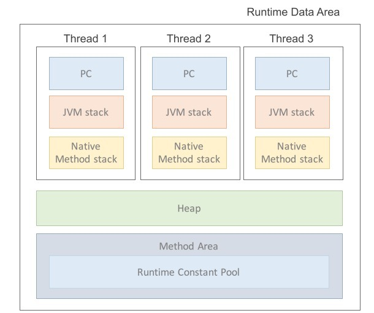
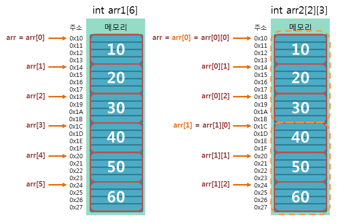

# 목차
##### 1. [자바 시작하기](#1-자바-시작하기)
##### 2. [변수와 타입](#2-변수와-타입)
##### 3. [연산자](#3-연산자)
##### 4. [조건문과 반복문](#4-조건문과-반복문)
##### 5. [참조 타입](#5-참조-타입)

---

# 1. 자바 시작하기

## 1. Java의 특징
- 이식성이 높은 언어
- 객체 지향 언어
- 함수적 스타일 코딩 지원
- 메모리를 자동으로 관리(JVM)
- 다양한 어플리케이션을 개발할 수 있음
   - 개발 도구와 API를 묶어 에디션 형태로 정의하고 있음(Java SE, EE 등)
 - 동적 로딩 지원
   - 객체가 필요한 시점에 클래스를 동적으로 로딩해서 객체를 생성
   - 전체 애플리케이션을 다시 컴파일할 필요가 없음
 - 막강한 오픈소스 라이브러리가 풍부

## 2. 자바 가상기계(JVM)
- 자바 프로그램은 완전한 기계어가 아닌 중간 단계의 바이트 코드임
- 때문에 이것을 해석하고 실행할 수 있는 가상의 운영체제 필요
- 이것이 바로 JVM(가상의 운영체제 역할)
- 바이트 코드는 모든 JVM에서 동일한 실행 결과를 보장하지만 JVM은 운영체제에 종속적
- java는 JVM에 의해 기계어로 번역되고 실행됨
  - C, C++ 같은 완전한 기계어보다는 속도가 느림
  - JVM 내부의 최적화된 JIT 컴파일러를 통해서 속도의 격차는 많이 줄어드는 중


## 3. 자바 프로그램 개발 순서
1. 소스 코드 작성 -> 자바 소스 파일(.java)
2. 컴파일러(javac.exe)로 컴파일 -> 바이트 코드 파일(.class)
3. JVM을 구동시키는 명령어 java.exe로 실행 -> main() 메서드를 찾아 실행

---

# 2. 변수와 타입

## 1.변수
- 변수(variable)는 **값을 저장할 수 있는 메모리의 공간을 의미**
- 프로그램에 의해서 수시로 값이 변동됨
- 한 가지 타입의 값만 저장 가능
- 의미 있는 변수 이름을 지어주는 것이 좋음
- 리터럴(literal)
  - 소스 코드 내에서 직접 입력된 값
  - 상수(contant)와 같은 의미이지만 프로그램에서는 상수를 '값을 한 번 저장하면 변경할 수 없는 변수'로 정의하기 때문에 이와 구분하기 위해 사용
- 변수는 초기화 되어야 읽을 수 있음
- 선언된 블록 내에서만 사용 가능
- 저장할 수 있는 값의 범위를 초과해서 값이 저장될 경우 엉터리 값이 변수에 저장됨 -> 쓰레기 값

## 2. 데이터 타입
### 기본(원시: primitive) 타입
- 정수, 실수, 문자, 논리 **리터럴을 직접 저장**하는 타입

#### 정수 타입(byte, char, short, int, long)
- ##### byte 타입
  - 색상 정보 및 파일 또는 이미지 등의 이진(바이너리) 데이터를 처리할 때 주로 사용됨
- ##### char 타입
  - 자바는 모든 문자를 유니코드(Unicode)로 처리함
  - Ex) char c = 65;    // 10진수
  - Ex) char c = '\u0041';  // 16진수
  - String은 기본 타입이 아닌 클래스 타입이고 String 변수는 참조 변수임
    - 문자열을 String 변수에 대입하면 문자열이 변수에 직접 저장되는 것이 아니라 String 객체가 생성되고 String 변수는 String 객체의 번지를 참고함
    - 자세한 내용은 [참조 타입]()에서 자세하게 설명
- ##### short 타입
  - C언어와의 호환을 위해 사용
  - 보통 자바에서는 잘 사용되지 않음
- ##### int 타입
  - **자바에서 정수를 연산하기 위한 기본 타입**
  - byte, short 타입의 변수와 int 타입 변수는 성능 차이가 거의 없음
    - 자바에서 정수 연산을 4 byte로 처리하기 때문
- ##### long 타입
  - 수치와 큰 데이터를 다루는 프로그램에서 사용(은행, 우주 관련 등)
  - int 타입의 저장 범위를 넘어서는 큰 정수는 반드시 소문자 'l'이나 대문자 'L'을 붙어야 함
    - 그렇지 않으면 컴파일 에러 발생
    - 보통 혼동을 피하기 위해 대문자 'L'을 사용함
    - Ex) long var = 1000000000L;

#### 실수 타입(float, double)
- 실수는 정수와 달리 부동소수점(floating-point) 방식으로 저장됨
- 높은 정밀도를 요구하는 계산에서는 double 타입을 사용
- 자바는 실수 리터럴의 기본 타입을 double로 간주함
- 실수 리터럴을 float 타입 변수에 저장하려면 리터럴 뒤에 소문자 'f'나 대문자 'F'를 붙여야 함

#### 논리 타입(boolean)
- 1byte(8bit)로 표현되는 논리값(true/false)을 저장할 수 있는 데이터 타입
- 상태값에 따라 조건문과 제어문의 실행 흐름을 변경하는데 주로 이용됨

## 3. 타입 변환
- 데이터 타입을 다른 데이터 타입으로 변환하는 것
- 자동(묵시적) 타입 변환과 강제(명시적) 타입 변환이 있음

#### 자동 타입 변환(Promotion)
- 프로그램 실행 도중 자동적으로 타입 변환이 일어남
- 작은 크기를 가지는 타입이 큰 크기를 가지는 타입에 저장될 때 발생
- 변환 이전의 값과 변환 이후의 값은 동일함 -> 손실 없이 그대로 보존

#### 강제 타입 변환(Casting)
- 큰 데이터 타입을 작은 데이터 타입으로 쪼개어서 저장
- float -> int 형변환의 경우 소수점 이하 부분은 버려지고 정수 부분만 저장됨
- 사용자로부터 입력받은 값을 변환할 때 손실이 발생하지 않도록 해야함
- 정수 타입을 실수 타입으로 변환할 때 정밀도 손실을 피해야 함
  - 모든 int 값을 실수 타입으로 안전하게 변환시키는 double 타입을 사용하면 됨
  - double의 가수부는 52비트가 할당되어 있기 때문에 모든 int 값 커버 가능

#### 연산식에서의 자동 타입 변환
- 연산은 기본적으로 같은 타입의 피연산자(operand) 간에만 수행됨
- 정수 연산일 경우 int 타입을 기본으로 함
  - 크기가 4byte 보다 작은 타입(byte, char, short)은 4byte인 int 타입으로 변환된 후 연산이 수행됨
  - 따라서 연산 결과도 int 타입임
- 피연산자 중 하나가 long 타입이라면 다른 피연산자도 long 타입으로 변환 -> 결과값도 long 타입
- 실수 연산은 double 타입을 기본으로 함

---

# 3. 연산자

## 1. 연산자와 연산식
- 연산(operations) : 데이터를 처리하여 결과를 산출하는 것
- 연산자(operator) : 연산에 사용되는 표시나 기호
- 피연산자(operand) : 연산되는 데이터
- 연산식(expressions) : 연산의 과정을 기술한 것
- 산출되는 값의 타입은 연산자별로 다름
- 필요로 하는 피연산자의 수에 따라 단항, 이항, 삼항 연산자로 구분함

## 2. 단항 연산자
#### 비트 반전 연산자(~)
- 비트 반전 연산자 산출 타입은 int 타입임
- 부호를 바꾸기 위해서는 비트 반전 연산자를 사용한 후 +1을 해줘야 함
```java
byte v1 = 10;
int v2 = ~v1 + 1;
```

## 3. 이항 연산자

#### 산술 연산자(+, -, *, /, %)
- boolean 타입을 제외한 모든 기본 타입에 사용 가능
- 피연산자들의 타입이 동일하지 않을 경우 다음과 같은 규칙을 사용함
  - 피연산자들이 *모두 정수 타입이고, int 타입(4 byte)보다 작은 타입일 경우* 모두 int 타입으로 변환 후, 연산을 수행한다. 따라서 연산의 **산출 타입은 int**이다.
  - 피연산자들이 *모두 정수 타입이고, long 타입이 있을 경우* 모두 long 타입으로 변환 후, 연산을 수행한다. 따라서 연산의 **산출 타입은 long**이다.
  - 피연산자 중 *실수 타입(float, double)이 있을 경우*, 크기가 큰 실수 타입으로 변환 후, 연산을 수행한다. 따라서 연산의 **산출 타입은 실수 타입**이다.
- 정수 타입 연산의 결과가 int 타입으로 나오는 이유 -> JVM이 기본적으로 32비트 단위로 계산하기 때문
- 리터럴 간의 연산은 타입 변환 없이 해당 타입으로 계산됨
```java
char c1 = 'A' + 1;  // 오류 발생 안함
char c2 = 'A'
char c3 = c2 + 1;   // 컴파일 에러
char c4 = (char) (c2 + 1);  // 강제 타입 변환(casting)을 했기 때문에 정상 동작
```

- ##### 오버플로우 탐지
  - 산술 연산할 때 산출 타입으로 충분히 표현 가능한지 살펴봐야 함
  - safeAdd() 메소드를 사용하면 오버플로우 발생 시 ArithmeticException을 발생시켜 데이터에 쓰레기값이 들어가는 것을 방지할 수 있음
- ##### 정확한 계산은 정수 사용
  - 이진 포맷의 가수를 사용하는 부동소수점 타입(float, double)은 0.1을 정확히 표현할 수 없어 근사치로 처리함
  - 정확한 계산이 필요하다면 정수 연산으로 변경해서 계산해야 함
- ##### NaN과 Infinity 연산
  - 정수 연산 시 우측 피연산자로 0을 사용하면 실행 시 ArithmeticExceiption 발생
  - 실수 연산으로 하게 되면 에러는 발생하지 않지만 Infinity 값을 가지고 % 연산은 NaN(Not a Number)을 가짐
  - Inifinity와 NaN은 어떤 다른 값과 연산을 하더라도 Inifinity와 NaN이 산출되기 때문에 데이터가 엉망이 될 수 있음
    - 이를 방지하기 위해 Double.isInfinity()와 Double.isNaN() 메소드를 사용함

#### 문자열 연결 연산자
- 문자열을 서로 결합하는 연산자
- 문자열과 숫자가 혼합된 + 연산식은 왼쪽에서부터 오른쪽으로 연산이 진행됨
```java
"JDK" + 3 + 3.0;        // "JDK33.0"
3 + 3.0 + "JDK";        // "6.0JDK"
```

#### 비교 연산자
- 흐름 제어문에서 주로 이용되어 실행 흐름을 제어할 때 사용됨
- 연산을 수행하기 전에 타입 변환을 통해 피연산자의 타입을 일치시킴(자동 타입 변환 적용)
```java
'A' == 65       // true, 'A'가 더 큰 타입인 int 타입으로 변환되어 65 == 65로 수행
3 == 3.0        // true, double이 int보다 더 큰 타입이기 때문에 3.0 == 3.0으로 비교

/* 예외사항 */
0.1 == 0.1f     // false
/*
이진 포맷의 가수를 사용하는 모든 부동소수점 타입은 0.1을 정확히 표현할 수 없어서 
0.1f는 0.1의 근사값으로 표현되어 0.1000000149011612와 같은 값이 됨

때문에 피연산자라를 모두 float 타입으로 강제 타입 변환한 후에 비교 연산을 하던지,
정수로 변환해서 비교해야 함
*/
```

#### 논리 연산자
- 논리 연산자의 피연산자는 boolean 타입만 사용 가능
- &&와 &는 산출 결과는 같지만 연산 과정이 조금 다름
  - &&는 앞의 피연산자가 false라면 바로 false 산출 결과를 내지만 &는 두 피연산자 모두를 평가해서 산출 결과를 냄
  - 따라서 보다 &&가 더 효율적으로 동작함
  - 이는 ||와 |도 마찬가지

#### 비트 연산자
- 0과 1로 표현이 가능한 정수 타입만 비트 연산 가능

--- 

# 4. 조건문과 반복문


#### if문
- 조건식에 true 또는 false 값을 산출할 수 있는 연산식이나, boolean 변수가 올 수 있음
#### switch문
- 조건식에 정수형(byte, char, short, int)이 올 수 있음
- 조건식에 boolean, 실수형(float, double)은 사용불가
- break를 써주지 않으면 case 값과 상관없이 다음 case가 연달아 실행됨

#### for문
- 반복 횟수를 알고 있을 때 주로 사용함
- 초기화식에서 루프 카운트 변수를 선언할 때 부동소수점 타입을 사용하지 말아야 함
  - 근사값으로 표현되기 때문에 원하는만큼 루프가 시행되지 않을 수 있음

#### while문
- 조건에 따라 반복할 때 주로 사용
- 조건식이 false가 되면 반복 행위를 멈추고, while문을 종료함

#### break, continue
- 반복문이 중첩되있을 때 label을 사용하여 바깥쪽 반복문까지 종료하거나 다음 루프를 실행할 수 있음
```java
for (;;) {
    for (;;) {
        break;      // 안쪽 반복문만 종료
    }
}

Outer: for (;;) {
    for (;;) {
        break Outer;      // 라벨이 적혀있는 바깥쪽 반복문까지 종료
    }
}

All: for (;;) {
    for (;;) {
        for (;;) {
            continue All;      // continue도 마찬가지
        }
    }
}
```

---

# 5. 참조 타입

## 1. 데이터 타입 분류
- 자바의 데이터 타입
  - 기본 타입(primitive type) : 정수, 실수, 문자, 논리 리터럴을 저장하는 타입
  - 참조 타입(reference type) : 객체(Object)의 번지를 참조하는 타입(배열, 열거, 클래스, 인터페이스 등)

## 2. 메모리 사용 영역
- JVM이 시작되면 JVM은 운영체제에서 할당받은 메모리 영역(Runtime Data Area)을 다음과 같이 세부영역으로 구분해서 사용함
- 추후 다시 읽어봐야 할 글
  - [Full explanation of JVM – Runtime Data Area and How JVM using it](https://blog.knoldus.com/full-explanation-of-jvm-runtime-data-area-and-how-jvm-using-it/)
  - [자바 메모리 구조(Runtime Data Area)](https://jithub.tistory.com/40)


### 메소드 영역
- 코드에서 사용되는 클래스(~.class)들을 클래스 로더로 읽어 클래스별로 runtime contant pool, field data, method data, method 코드, constructor 코드 등을 분류해서 저장함
- Class Loader가 적재한 클래스(또는 인터페이스)에 대한 메타데이터 정보가 저장됨
- JVM이 시작할 때 생성되고 **모든 스레드가 공유**하는 영역

### 힙(Heap) 영역
- 객체와 배열이 **동적**으로 생성되는 영역
  - 이를 JVM 스택 영역의 변수나 다른 객체의 필드에서 참조함
- 참조하는 변수나 필드가 없다면 의미 없는 객체(쓰레기)로 취급하고 JVM의 GC(Garbage Collector)를 실행시켜 쓰레기 객체를 힙 영역에서 자동으로 제거함
- 개발자는 객체 제거를 위해 별도의 코드를 작성할 필요가 없고 오히려 부작용만 낳을 가능성이 큼
- 모든 Thread가 공유하기 때문에 동기화 문제가 발생할 수 있음

### JVM 스택(Stack) 영역
- 각 스레드마다 하나씩 존재하며 스레드가 시작될 때 할당됨
- 기본적으로 main 스레드 하나만 존재하며 JVM 스택도 하나임
- 메소드를 호출할 때마다 프레임(Frame)을 추가(push)하고 메소드가 종료되면 해당 프레임을 제거(pop)함
- printStackTrace()에서 Stack Trace의 각 라인은 하나의 프레임을 표현함
- 로컬 변수 스택
  - 프레임 내부에 있음
  - 초기화될 때 변수가 이 영역에 생성됨
  - 변수는 선언된 블록 안에서만 스택이 존재하고 블록을 벗어나면 스택에서 제거됨

## 3. 참조 변수의 ==, != 연산
- 동일한 객체를 참조하는지, 다른 객체를 참조하는지 알아볼 때 사용됨
- 참조 타입 변수의 값은 힙 영역의 객체 주소이므로 결국 주소 값을 비교한느 것임

## 4. null과 NullPointerException
- 참조 타입 변수는 힙 영역의 객체를 참조하지 않는다는 뜻으로 null 값을 가질 수 있음
- null로 초기화된 참조 변수는 스택 영역에 저장됨
- NullPointerException : 참조 타입 변수를 잘못 사용하면 발생함


## 5. String 타입
- 큰 따옴표로 감싼 문자열 리터럴을 대입하여 저장 가능
```java
String s;
s = "test";
String s2 = "second";
```
- new 연산자
  - 힙 영역에 새로운 객체를 만들 때 사용
  - 객체 생성 연산자라고도 함
```java
String s1 = "TEST";
String s2 = "TEST";
/* 
s1 == s2 -> true
s1.equals(s2) -> true

자바에서는 문자열 리터럴이 동일하다면 String 객체를 공유하도록 되어있음
*/ 

String s3 = new String("TEST");
String s4 = new String("TEST");
/*
s3 == s4 -> false
s3.equals(s4) -> true

문자열이 동일하더라도 new를 사용하여 String 객체를 생성했기 때문에 서로 다른 객체를 참조함
문자열의 값은 같기 때문에 equals() 메소드의 결과값은 true임
*/
```

## 6. 배열 타입
- 같은 타입의 데이터를 연속된 공간에 나열시키고, 각 데이터에 인덱스(index)를 부여해놓은 자료구조임
- 같은 타입의 데이터만 저장할 수 있음
- 선언과 동시에 저장할 수 있는 데이터 타입이 결정됨
- 다른 데이터 타입의 값을 저장하려고 하면 타입 불일치(Type mismatch) 컴파일 오류 발생

### 배열 선언
- 대괄호 []를 타입 또는 변수 뒤에 붙임
- null 값으로 초기화할 수 있음
- 배열 변수를 이미 선언한 후에 다른 실행문에서 중괄호를 사용한 배열 생성은 허용되지 않음
  - new 연산자를 사용해서 할당해주는건 가능
- new 연산자를 사용하여 배열을 생성할 경우, 배열은 자동적으로 기본값으로 초기화됨
  - 배열의 데이터 타입에 따라 0, 0.0f, false, null 등으로 초기화됨
```java
// 배열 선언
int[] intArray;
double[] doubleArray;
String[] strArray;

int intArray[];
double doubleArray[];
String strArray[];

// 배열 생성
String[] names = {"Alice", "Brown", "Charile"};

String[] names = null;
names = {"Alice", "Brown", "Charile"};                  // 컴파일 에러 발생!!
naems = new String[] {"Alice", "Brown", "Charile"};     // 정상 동작

int[] scores = new int[3];    // 기본값인 0으로 초기화
// 배열 생성 후 값을 저장하기 위해서 대입 연산자 사용
scores[0] = 84;
scores[1] = 91;
scores[2] = 76;
```
- 배열 길이
  - length 필드 사용
  - length 필드는 읽기 전용이기 때문에 바꿀 수 없음
  - for문에서 유용하게 사용
- #### 다차원 배열
  - 값들이 행과 열로서 구성된 배열을 2차원 배열이라고 함

  - 배열 변수인 arr2는 길이가 2인 배열을 참조함(0x10)
  - arr2[0]은 arr2[0][0]을 참조함
  - arr2[1]은 arr2[1][0]을 참조함
- #### 배열 복사
  - 한 번 생성된 배열은 길이를 늘리거나 줄일 수 없음
  - 만약 길이를 변경하고 싶다면 새로운 배열을 생성하고, 기존 배열 항목을 복사해야 됨
  - 얕은 복사(shallow copy)
    - 새 배열에 이전 배열의 객체 주소를 복사
    - 기존 배열의 값을 수정하면 새 배열에도 영향을 끼침
  - 깊은 복사(deep copy)
    - 참조하는 객체를 별도로 생성
  - [자바 배열 복사 메소드 참고](https://coding-factory.tistory.com/548)
- #### 향상된 for문
```java
int[] scores = {95, 71, 84, 93, 87};

for (int score: scores) {
    // do something
}
```

## 7. 열거 타입(enumeration type)
- 한정된 값만을 가지는 데이터 타입
- 몇 개의 열거 상수(enumeration constant) 중에서 하나의 상수를 저장하는 데이터 타입
- 네이밍
  - 열거 타입 이름은 관례적으로 pascal case를 사용함
  - 열거 타입 이름과 소스 파일명은 대소문자 모두 동일해야함
  - 관례적으로 열거 상수는 모두 대문자로 작성하고, 여러 단어일 경우 단어 사이를 언더바(_)로 연결함


```java
// Week.java

public enum Week {      // Week -> 열거 타입 이름
    /* 열거 상수 */
    MONDAY,
    TUESDAY,
    WEDNESDAY,
    THURSDAY,
    FRIDAY,
    SATURDAY,
    SUNDAY
}
```

```java
// test.java

/* 
- 열거 타입 변수 today에 열거 상수 대입
- 열거 상수는 단독으로 사용 못하고 열거타입.열거상수로 사용 가능
- 열거 상수는 열거 객체로 생성되기 때문에 Heap 영역에 있음

- 여기서는 열거 타입 Week가 총 7개의 Week 객체로 생성되고, 
  메소드 영역에 생성된 열거 상수가 Week 객체를 각각 참조함
- 열거 타입 변수 today는 stack 영역에 생성됨
*/
Week today = Week.SUNDAY;       

today == Week.SUNDAY;       // true, 동일한 Week 객체를 참조하기 때문

```