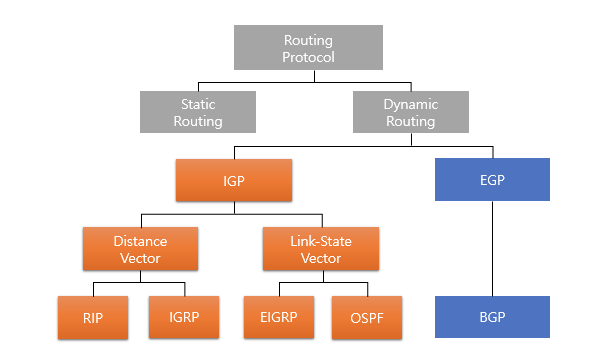

> 작성일 : 2024/01/15

# 프로토콜

- `프로토콜`
  - 통신 규약
  - 통신할 데이터의 구성, 데이터를 확실하게 주고받는 절차 등 각종 결정 사항과 기준이 정의되어 있음

## 통신 규약인 프로토콜

네트워크로 데이터를 주고 받으려면 송신 측과 수신 측이 *서로를 인식*하고 있어야 한다.

같은 프로토콜을 사용하면 다른 기기 간에도 통신할 수 있지만, 프로토콜이 다르면 기기가 같아도 서로 통신할 수 없다.

프로토콜은 어디까지가 주소고, 어디까지가 신호이며, 어디까지가 데이터 본체인지 약속이 필요하다.

## 프로토콜의 종류

**네트워크 계층별**로 다양한 종류의 표준과 규약이 있다.

# 네트워크 계층

## 계층별로 나누어 처리

모든 애플리케이션에서 프로토콜의 변환 처리를 수행한다면 프로그램은 복잡해지고 낭비도 많아짐

-> 네트워크를 하드웨어, 프로토콜, 애플리케이션이라는 계층(레이어)으로 나누어 처리를 분담함

## 프로토콜 스택

- 프로토콜 구조
  - 헤더 : 프로토콜 정보
  - 페이로드 : 전송하려는 데이터
- `프로토콜 스택`
  - 어떤 프로토콜의 페이로드에 다른 프로토콜의 헤더와 페이로드가 들어가 계층 구조처럼 되어 있는 상태
  - 프로토콜은 자신의 헤더를 처리하고 상위 네트워크 프로토콜에 페이로드를 전달함

> 하위 계층 프로토콜의 페이로드에 상위 계층의 헤더와 페이로드를 포함
>  -> 해당 프로토콜 계층은 자신의 헤더 정보만 해석한 후 페이로드를 상위 네트워크로 전달
>  -> 페이로드에 상위 계층의 헤더와 페이로드로 구성되어 있기 때문에 상위 네트워크의 프로토콜이 제대로 처리될 수 있음

# 네트워크 모델

## OSI 참조 모델

- `OSI(Open Systems Interconnection) 참조 모델`
  - ISO(국제표준화기구)에서 제정한 네트워크 계층 모델
  - 7계층으로 나뉘어짐
  - 1977년 제정 당시 네트워크 기술을 기반으로 만들어짐 
   -> *현재는 이를 그대로 구현한 네트워크나 장비가 거의 없음*
  - 프로토콜을 **계층 구조**로 만든 개념임
    - 애플리케이션 단에서 프로토콜 차이를 신경쓸 필요 없으므로 장비나 소프트웨어 개발이 용이해짐
    - 시스템을 **프로토콜 스택** 개념으로 설계 및 개발이 가능함
  - 현재도 계층을 구분하는 하나의 모델로 이용되고 있음

## TCP/IP 모델

- `TCP/IP 모델`
  - **인터넷**을 기준으로 한 네트워크의 통신 모델
  - 4계층
  - OSI 참조 모델을 기반으로 만들어졌고 각 계층이 매칭될 수 있지만, *각 계층의 구분과 역할이 모두 동일하지는 않음*
  - 오늘날 인터넷 통신에서 가장 널리 사용되는 표준 모델

## OSI와 TCP/IP 모델의 차이

OSI는 네트워크 구조를 명확하게 설명할 수 있는 **개념적 모델**이고, TCP/IP는 실제 인터넷 통신에 사용되고 있는 **실전형 모델**이다.

OSI 모델과 완전히 맞아떨어지는 모델은 구현되지 않았지만 여전히 표준 모델로서, 네트워크 학습 자료로서 참조된다. 각 레이어는 서로 연결되어 있으며, OSI 모델에서 데이터는 계층 순서대로 이동한다.

> 참고 : [네트워크 모델 OSI TCP/IP 차이](https://change-words.tistory.com/entry/OSI-TCPIP)

# TCP/IP

## IP 프로토콜

TCP/IP는 통신하는 패킷의 `식별자`로 IP 주소를 사용하기 때문에 보통 `TCP/IP`라고 표현한다. 하지만 프로토콜은 IP, UDP, TCP 프로토콜 등으로 분류된다.

- `IP 프로토콜`
  - UDP, TCP, HTTP 등 다른 프로토콜의 기본
  - **IP 주소(출발지 및 목적지 정보)** 를 참조하여 **데이터 본체(페이로드)** 를 *올바른 목적지에 전송하는 최소한의 절차와 규칙을 규정*
  - 페이로드에는 UDP, TCP 뿐만 아니라 상위 계층의 프로토콜 데이터가 저장됨

## UDP 프로토콜과 TCP 프로토콜

UDP와 TCP 모두 식별자로 각각 헤더에 **포트 번호**를 부여해서 IP 주소가 나타내는 사용자나 애플리케이션 종류 등을 지정한다.

- `UDP 프로토콜`
  - 포트 번호를 부여할 뿐 처리 과정 자체는 IP 프로토콜과 거의 같음
  - 수신 확인, 전송 오류 확인, 재전송 처리 등은 수행하지 않음
  - 데이터그램 : 단순히 목적지만 지정해서 전송하는 데이터
  - 신뢰성보다는 속도와 편의성을 우선시할 때 사용됨
    - 상위 애플리케이션에서 오류 검사 및 재전송 처리 등을 수행해서 기능을 보완할 수 있음

- `TCP 프로토콜`
  - 포트 번호 부여
  - 오류 검사, 재전송 처리 등 일련의 과정 규정과 세션 통신 기능 등이 있음
  - 오류 검사와 세션 통신에 필요한 정보(시퀀스 번호, 응답 확인 번호, 세션 플래그 등)가 부여됨
  - 안정적인 통신을 원할 때 사용됨

> - 식별자 : 대상을 식별하는 부호. Ex) 패킷의 목적지를 식별하는 것 -> 목적지 IP 주소
> - 세션 : 목적지로 연결을 확인하고 통신 경로를 확보 및 유지하는 것
> - 시퀀스 번호 : 큰 데이터를 여러 개의 패킷으로 분할할 때 사용하는 패킷 번호
> - 응답 확인 번호 : 시퀀스 번호가 맞는지 확인하는 번호. 자기 다음에 와야 하는 시퀀스 번호가 들어감
> - 세션 플래그 : TCP 세션의 상태를 나타내는 다양한 플래그를 의미

# IP 주소

## IP 주소의 구조

> IP 주소에는 IPv4와 IPv6라는 두 가지 버전이 있다. 43억개 밖에 표현할 수 없는 IPv4 주소가 점점 고갈되어 새로운 IP 주소 체계가 필요하게 되자 책정된 것이 IPv6다.

- `IP 주소`
  - TCP/IP 프로토콜에서 출발지나 목적지를 식별하는 식별자로 사용되는 데이터
  - 인터넷에서 사용하는 **글로벌 IP 주소**와 LAN 내에서 사용하는 **프라이빗 IP 주소**가 있음
  - 32비트로 되어있으며 8비트씩 4등분하여 8비트의 10진수로 표시할 때 점으로 구분하여 표기
    - Ex) 192.168.0.1
    - 이 때 8비트 단위를 네트워크에서는 **옥텟(octet)** 이라고 함
    - 이론상 43억 개의 주소를 사용할 수 있지만 실제로 모두가 이를 사용할 수 있는 것은 아님

## 글로벌 IP 주소와 프라이빗 IP 주소

- `글로벌 IP 주소`
  - IP 주소의 주소 공간 중 인터넷 주소로 사용할 수 있는 것
  - 이 주소를 가진 기기는 인터넷상에서 하나뿐임
- `프라이빗 IP 주소`
  - 인터넷에 직접 연결되지 않는 LAN 내부 등의 주소 공간에서 사용하는 IP 주소
  - LAN마다 중복되지 않게 관리하면 다른 사무실이나 LAN에서 같은 IP를 사용할 수 있음

> 인터넷에서 개인을 식별할 때는 IP 주소를 이용한다. 그러나 인터넷상의 IP 주소는 단지 네트워크에 연결된 라우터나 서버, 일부 컴퓨터를 가리킬 뿐이다. 때문에 IP 주소 정보로 발신자를 식별하려면 라우터나 서버의 로그 정보 등의 다른 정보가 필요하다.

# IPv4/IPv6

v4와 v6 사이에 프로토콜 호환성은 없고, 현재 인터넷에는 이 두 포로토콜이 혼재되어 있다.

## IPv4와 IPv6의 차이점

IPv6는 2의 128제곱이라는 방대한 주소 공간을 갖고 있어 IP 주소가 고갈될 염려는 거의 없다. 다만 IPv4와 IPv6 간에는 호환성이 없으므로 IPv6로 인터넷에 연결하려면 IPv6와 호환되는 앱이나 서비스를 사용해야 한다.

다만 주류로 사용되는 OS나 웹브라우저, DNS에서는 IPv6을 지원하므로 사용자가 IPv4와 IPv6를 구분할 필요는 없다.

## IPv6의 특징

- 특징
  - 프로토콜 수준에서 암호화 통신이 규정되어 있음
  - MAC 주소를 이용하여 IPv6 주소를 자동으로 생성할 수 있고, 2계층을 포함한 설정 자동화가 가능
  - 헤더가 IPv4보다 단순해서 처리가 간단
  - 계층 구조가 엄격하여 라우팅 효율이 좋음

현재 IPv4와 IPv6 패킷은 인터넷상에 혼재되어 있고, IPv4가 금지되어 있는 것은 아니므로 전 세계 서버 및 웹 서비스 등은 *IPv4를 기반으로 동작*하고 있다.

# Q&A

## Q1. IMAD에서 채택 중인 REST API는 프로토콜인가? 그 이유는?

REST(RESTful, Representational State Transfer)는 프로토콜이 아니라 아키텍처 스타일이다. 이러한 REST 아키텍처를 스타일의 제약 조건을 준수하고 RESTful 웹 서비스와 상호 작용할 수 있도록 하는 애플리케이션 프로그래밍 인터페이스(API)를 REST API라고 부른다.

REST는 웹 기반 시스템에서 리소스 간 상태 전이를 나타내기 위한 아키텍처적인 원칙의 모음이며 주로 HTTP 프로토콜을 기반으로 한다. 그러나 일반적으로 HTTP에서 쓰일 뿐 종속적인 것은 아니다.

> 참고 : [REST API란?](https://www.redhat.com/ko/topics/api/what-is-a-rest-api)

## Q2. TCP/UDP의 사용 예시와 그 이유

### TCP
- 누락되는 데이터가 있으면 안 되고 안정적인 통신을 원할 때 사용
- 파일 전송(FTP), 이메일(SMTP, POP3), 웹 브라우징(HTTP) 등

### UDP
- 데이터의 신뢰성보다는 속도(실시간 통신)가 중요하고 패킷이 누락되어도 감수할 수 있는 경우 사용
- 실시간 스트리밍, 온라인 게임, 보이스톡 등

## Q3. 스마트폰에서 모바일 데이터(LTE/5G)를 사용했을 때 할당받는 IP는 공인 IP일까 사설 IP일까? 그 이유는?

일반적으로 모바일 통신 사업자가 데이터 네트워크를 사용하는 스마트폰 이용자들에게 할당하는 IP 주소는 공인 IP 주소가 아닌 사설 IP 주소다. 이는 IP 주소의 한계와 효율성을 고려하여 구현된 방식 중 하나다.

공인 IP(글로벌 IP 주소)는 약 43억 개로 제한되어 있기 때문에 대륙별, 국가별, 이동통신 사업자(통신사)별로 할당하여 사용되고 있다. 통신사는 네트워크 주소 변환(Network Address Translation, NAT)을 통해 사용자들이 사설 IP 주소로부터 외부 인터넷과 통신할 수 있도록 한다. (이 때 여러대의 클라이언트(기기)들이 하나의 IP를 실시간으로 공유하는 경우가 많다.)

NAT는 여러 사용자를 하나의 공인 IP 주소로 연결하고, 통신 패킷의 출발지 주소를 변환하여 인터넷에서의 고유한 출발지 주소를 숨긴다.

> 참고 : [How are cellphone IP addresses assigned?](https://serverfault.com/questions/60361/how-are-cellphone-ip-addresses-assigned)

---

> 작성일 : 2024/01/17

# MAC 주소

- `MAC(Media Access Control) 주소`
  - 네트워크에 연결되는 기기나 단말기가 고유하게 가지는 식별자
  - NIC(Network Interface Card)에 붙는 고유넘버(이름)
  - IEEE(미국전기전자학회)가 관리하고, 전 세계 기기 제조사에 고유 코드를 할당함
  - 컴퓨터의 네트워크 카드, 스마트폰, 라우터, 스위치, IoT 가전제품 등에 사용됨

## 구조

- 48비트 길이를 가짐
- **상위 24비트**를 `벤더 코드`(OUI 식별자)로 *장비 제조사*에 할당함
  - 제조사는 여러 개의 벤더 코드를 가질 수 있음
- **하위 24비트**(노드 번호)는 각 제조사의 책임하에 *제품에 하나씩* 할당됨

## MAC 주소와 IP 주소의 차이

### 공통점

프로토콜에 사용되는 식별자다.

### 차이점

사용되는 계층이 다르다.

- MAC 주소
  - **이더넷 프레임**(이더넷으로 주고받는 데이터 덩어리)에서 장치나 단말기의 식별자로 사용된다.
  - 이더넷은 2계층(데이터 링크 계층)이므로 OSI 참조 모델에서 **2계층(이하)의 식별자**다.
- IP 주소
  - **TCP/IP 프로토콜**에서 출발지나 목적지의 장치나 네트워크 식별자로 사용된다.
  - TCP/IP나 인터넷은 OSI 참조 모델에서 3계층 이상의 계층이므로 IP 주소는 **3계층(이상)의 식별자**다.

# ARP

## 장치의 MAC 주소를 조사하는 ARP

- `ARP`
  - Address Resolution Protocol
  - IP 주소에서 해당 장비의 MAC 주소를 확인하는 프로토콜
  - IP 주소 정보를 전송하고 특정 대상과 통신하기 위해 질의

LAN 내부에서 각 장치 연결은 이더넷을 사용하지만, 연결된 장치에서 실행되는 애플리케이션은 주로 TCP/IP 프로토콜을 사용한다. (3계층 이상)

장치 간 통신에는 MAC 주소가 필요하지만 MAC 주소는 2계층 이하이므로 *애플리케이션은 IP 주소를 알고 있어도 MAC 주소를 모른다.*
 -> LAN 내에서 패킷을 교환하려면 해당 IP 주소가 LAN 내 어느 MAC 주소를 가진 장치의 것인지 확인하고 이더넷 프레임을 구성해야 한다. 이 때 사용되는 것이 `ARP`이다.

## ARP의 작동 방식

### 기본 동작 방식
1. MAC 주소를 알고자 하는 IP 주소 정보를 LAN에 대상을 지정하지 않고 전송(브로드캐스팅)
2. 브로드캐스트 패킷이므로 모든 장치가 수신
3. IP 주소에 대한 패킷을 수신하면 해당 장치는 자신의 MAC 주소를 회신

### 실제 작동 방식

실제로는 통신마다 ARP 사용은 비효율적이다.

1. ARP로 허브나 라우터에 조회
2. LAN 내 모든 기기의 IP 주소와 MAC 주소의 대응표(주소 테이블)이 있으면 전송(보통 만들어 둘 때가 많다.)
3. 없으면 브로드캐스팅 수행

# 포트 번호

- `포트 번호`
  - TCP/UDP 프로토콜에서 사용되는 식별자
  - IP 주소만으로 특정할 수 없는 LAN 내 장치나 단말기, 상위 프로토콜이 이용하는 애플리케이션 종류나 애플리케이션의 클라이언트 등을 지정함

## 포트 번호의 역할

TCP/UDP 헤더의 처음 16비트(2옥텟) 정보이며, 16비트이므로 0~65535의 번호를 나타낸다. 포트 번호에는 목적지 포트 번호와 출발지 포트 번호가 있다.

- 목적지 포트 번호
  - 패킷이 *어떤 애플리케이션을 위한 것인지 나타내기 위해* 목적지 포트 번호를 사용
  - IP 주소는 목적지 서버는 지정할 수 있지만, 해당 서버의 어떤 앱을 사용할지는 지정할 수 없음
  - 서버에서는 수신한 포트 번호를 보고 어떤 앱에 대한 요청인지 판단함
- 출발지 포트 번호
  - 패킷을 보낸 쪽 사용자와 터미널을 식별하는 번호
  - 이메일을 보낸 계정이나 웹 사이트에 액세스한 기기 등을 식별하기 위해 사용됨

## 주요 애플리케이션의 번호

- 잘 알려진 포트(well-known port)
  - 주요 애플리케이션의 포트 번호로 사용됨(FTP(20), SSH(22), HTTP(80), HTTPS(443) 등)
  - 0~1023을 할당하는 것이 관례
- 등록된 포트 번호
  - 주요 공급 업체 및 앱에 할당된 포트 번호
  - 기존 애플리케이션에서 보조적으로 사용
  - 1024~49151
- 다이내믹/프라이빗 포트 번호
  - 개인이나 기업이 자체 애플리케이션이나 서비스용으로 자유롭게 사용

> **포트 번호의 필요성**
>  실제 LAN 내 IP 주소는 프라이빗 IP 주소이며, 인터넷에서는 라우터나 서버 등 LAN을 구성하는 장치까지만 특정이 가능하기 때문에 포트 번호가 필요함

# 회선 교환 방식

- `회선 교환`
  - 통신 상대와 일대일 연결을 설정해서 통신하는 방식
  - 기존 전화 시스템으로 대표되는 통신 방식의 명칭

## 유선 전화의 통신 방식

### 과거

- 전화
  - 음성을 마이크를 통해 아날로그 신호로 바꾸고, 이를 전선에 실어 보내 상대방 스피커에서 재생하는 장치
  - 양쪽에 마이크와 스피커, 송수신을 위한 전선 2개만 있으면 서로 통화 가능
  - 이 때 모든 통화 상대는 전선으로 연결되어 있어야 함
    -> 교환원과 교환대 사용
- 교환원 : 걸려온 번호와 지정한 번호의 전선 연결
- 교환대 
  - 다른 지역의 교환대와 연결하는 포트를 추가하면 그 지역과도 연결
  - 현재 전화번호가 지역 번호, 시외 전화번호, 국가 번호 등 계층 구조로 되어 있는 이유

### 현재

전화번호의 신호(펄스타 톤)를 식별해서 기계나 컴퓨터가 연결을 처리한다. 중간 회선으로 마이크로웨이브 등 무선 기술, 디지털 회선, 광섬유 등이 사용되지만 *기본 원리는 동일하다.*

- `펄스` : 전화기는 전화번호 숫자에 대응하는 신호를 발생시킨다. 펄스 방식은 번호에 대응하는 개수의 펄스를 발생시킨다.

## 특징

- 일대일 연결을 설정하므로 연결이 설정되면 해당 회선은 양측이 독점함(통화 상태)
  - 교환기 구성이 복잡해지고 회선 유지 보수 및 관리에 비용이 들어감
  - 통신량이 방대해질 때 통신과 회선의 일대일 매칭은 효율적이지 않음
- 현재는 지역 전화국 이후의 통신은 대부분 디지털화되어 있고 신호도 다중화되어 있음

# 패킷 교환 방식

- `패킷 교환 방식`
  - 데이터를 패킷이라는 단위로 분할해서 통신
  - 인터넷이나 이더넷을 비롯하여 많은 네트워크에서 채택한 통신 방식

## 원리와 장점

- `패킷`
  - 주고받는 데이터 단위
  - 데이터를 주고받을 때 필요한 데이터를 원래의 크기 그대로가 아니라 일정한 크기로 분할해서 전송함 -> 이 때 사용하는 단위가 패킷
  - 패킷의 크기는 **프로토콜**에 따라 정해짐

패킷을 분할하여 송수신하는 방식을 `패킷 교환 방식`이라고 한다.

### 장점

- 매번 상대방과 회선을 연결할 필요가 없음
- 데이터를 독립적인 타이밍에 송신할 수 있음
- 상대와 연결을 설정하는 절차가 필요하지 않음
- 여러 회선을 사용해 동시에 대량의 데이터를 전송할 수 있고, 다수의 상대방과 효율적으로 데이터를 송수신할 수 있음
- 서로 다른 종류의 패킷(프로토콜)도 혼재할 수 있음
- 연결 외부에 장애가 발생해도 다른 경로로 송수신 가능

### 단점

- 회선 혼잡이나 액세스의 집중 등이 발생
- 패킷이 보낸 순서대로 도착한다는 보장이 없음 -> 헤더에 필요한 데이터가 늘어남
- 패킷이 오류로 사라질 수 있음
- 헤더 등 부가 정보의 처리나 크기가 필요
- 실시간 전송을 할 수 없음(어디까지나 저지연)

## 패킷 교환 방식에 필요한 정보

패킷 교환 방식은 효율적으로 대량의 데이터를 주고받을 수 있지만 같은 회선 내에 무수한 패킷이 흐르므로 패킷별로 **관리 정보**가 필요하다.

- 관리 정보
  - 출발지와 목적지 정보
  - 데이터를 분할할 때 목적지에서 데이터를 재구성하는 정보
  
이러한 관리 정보는 헤더에 집약되어 통신 데이터 본체(페이로드)와는 별도로 부여된다.

# Q&A

## Q1. MAC 주소는 약 280조 개를 표현할 수 있다. 그렇다면 MAC 주소 충돌은 발생하지 않을까? 그 이유는?

발생한다. 

MAC 주소는 IEEE에서 수수료를 받으며 관리하고 있지만 일부 제조사에서 생산되는 한 모델의 제품에 같은 MAC 주소를 할당하고 팔아도 이를 잡을 수 있는 방법은 거의 없다. 법적인 제약 또한 없으므로 제한하기도 어렵다. 또한 보안을 위해 MAC 주소를 랜덤으로 변경하는 경우에도 중복이 발생할 수 있다.

LAN 네트워크 내에서 같은 MAC 주소를 사용하고 있는 장치가 2개 이상이라면 주소 충돌이 발생해 통신에 문제가 발생한다. 네트워크 기기에서 장치를 특정할 수 없기 때문이다.

한 사람이 MAC 주소가 모두 같은 모델의 제품을 여러 개 사서 사용하거나 일부러 주소를 똑같게 만드는 것과 같은 경우가 아니라면, MAC 주소가 중복될 확률은 1/2^24이다. 그리고 외부 네트워크와의 통신을 할 때는 MAC 주소보다는 IP 주소가 중요하다. 때문에 대부분 MAC 주소 중복으로 인해 문제가 발생하는 경우는 거의 없다. 

실제 규모가 큰 서비스의 로그를 보면 MAC 주소가 겹치는 경우가 많다고 한다. (특히 중국산 네트워크 관련 제품 사용 시)

> 참고
> - [MAC주소(MAC Address)에 대한 잘못된 오해, 편견들](https://pcb4.tistory.com/category/%ED%87%B4%EC%A7%81%2C%ED%87%B4%EC%82%AC%2C%EA%B5%AC%EC%A7%81%2C%EC%B7%A8%EC%97%85%20%ED%99%9C%EB%8F%99)
> - [맥 주소 MAC Address IP 주소처럼 추적 및 증거될까? 변경방법은?](https://netxhack.com/network/mac-address-trace-evidence/)

## Q2. LAN 내부에서는 MAC 주소를 알아야 통신할 수 있는데 외부에 있는 네트워크와는 IP만 알고서 어떻게 통신하는가?

내부 네트워크에서는 MAC 주소가 주로 사용되지만, 외부 네트워크와의 통신에서는 IP 주소가 중요하다. 이는 라우터를 통해 다른 네트워크로 라우팅되기 때문이다. 라우터는 송신자의 IP 주소를 확인하고 이를 기반으로 패킷을 다음 네트워크로 전송한다. 그리고 라우터는 해당 패킷을 받은 뒤에 이를 내부 네트워크에서 사용되는 MAC 주소로 변환하여 전달한다.

따라서 내부 네트워크에서는 MAC 주소를 사용하여 통신하고, 외부 네트워크와의 통신에서는 IP 주소를 사용하여 라우팅 및 목적지 식별을 수행한다.

## Q3. 현재의 스마트폰도 회선 교환 방식을 사용할까? + 그렇게 생각한 이유와 예시

스마트폰은 패킷 교환 방식을 사용한다. 정확하게는 LTE/5G 모델부터 패킷 교환 방식을 사용하기 시작했으며 그 전까지는 회선 교환 방식만 사용하거나 혼합해서 사용했다.

음성 통화할 때 패킷 교환 방식을 사용하기 때문에 음성과 영상을 동시에 보내야하는 **영상통화**, 일대일로 회선을 독점하면 구현하기 어려운 **그룹통화** 등을 예시로 들 수 있다. 보이는 **ARS**와 같은 서비스의 경우 스마트폰 화면에 특정 컨텐츠(앱 또는 웹)를 띄울 수 있다.

> [5G 서비스 구현 기술의 이해 中]
> 
> 우리나라에서 이동통신 서비스가 처음 시작된 것은 1984년이다. 1세대(1G)라고 불리는 당시의 이동통신 서비스는 아날로그 방식으로 음성통화만 가능했다. 이후 1996년에는 디지털 방식의 2G 이동통신 서비스가 개시됐다. 이때부터는 음성통화 뿐만 아니라 문자나 저속의 데이터 통신도 가능했다. 2002년 시작된 3G 이동통신 서비스에서는 데이터 통신 속도가 빨라져 저화질의 영상통화나 동영상 서비스가 가능해졌다. 하지만, 통신 속도의 한계로 텍스트나 이미지 중심의 모바일 웹서비스나 팟캐스트 같은 오디오 스트리밍 서비스가 주로 이용되었다.
> 
> 그리고, 2011년 7월 시작된 4G 서비스에서는 통신속도가 더욱 빨라져 초고속 무선 인터넷 및 고화질 동영상 서비스를 이용하는 것이 가능해졌다. 품질 보장을 위해 기존에 회선교환 방식으로 제공되던 음성통화 서비스도 데이터 통신에 사용되는 패킷교환 방식에 통합되었다.

회선 교환 방식은 현재에 이르러 잘 사용되지 않는다. 구식 전화기나 극도의 보안 상황을 요구하는 경우(군용, 의료분야 등), 특정한 산업분야 또는 기기와 같이 예외적인 경우들이 대부분이다.

> 참고 : [5G 서비스 구현 기술의 이해](https://koreascience.kr/article/JAKO201924156252200.pdf)

---

> 작성일 : 2024/01/20 (DAY4)

# 라우터

## LAN끼리 이어주는 라우터 기능

- `라우터`
  - LAN과 LAN을 연결해서 대규모 LAN이나 인터넷을 구성하는 장치
    - 이를 위해 인접한 라우터와 이더넷으로 연결함
  - 수신한 패킷을 목적지에 따라 처리
    - IP 주소를 보고 목적지가 내부 LAN인지 아닌지 확인해서 패킷을 처리
- `라우팅`
  - 라우터가 네트워크 세그먼트를 LAN으로 묶어 *내부 패킷을 처리*하면서 *동시에 외부 LAN과도 연결해 상호 간 패킷을 교환*하는 것
  - 수신한 패킷의 헤더를 확인 후
    - 자신이 관리하는 LAN을 향한 패킷이라면 목적지 장치에 전달
    - 그렇지 않다면 다른 라우터(*인접 라우터)에 전송
    - 위의 기능을 위해 내부 LAN 연결포트(LAN 포트)와 외부 LAN을 연결하는 연결 포트(WAN 포트), 이렇게 2개가 있음
- 인접 라우터
  - 특정한 라우터에 직접 연결된 라우터

## 라우터와 인터넷의 관계

- 대규모 LAN 구성 시
  - 인접한 라우터와 이더넷으로 연결
  - 전용선이나 ISP 회선 등을 이용하여 먼 거리의 라우터와 연결할 수도 있음
- `인터넷`
  - 위와 같은 구성으로 LAN을 광범위하게 연결한 것
  - TCP/IP가 기본 프로토콜
  - 라우터의 WAN 쪽에서는 공인 IP 주소 사용
  - `에지 라우터` : 내부 LAN과 외부 인터넷의 경계에 설치하는 라우터

# 액세스 포인트

## 각 장치의 무선 연결을 설정하는 액세스 포인트

- `액세스 포인트`
  - 무선 LAN을 구축하고자 여러 기기의 무선 연결을 모아서 네트워크에 연결하는 장치
  - 무선 LAN에서 **허브**에 해당하는 장치
  - 비슷한 장치로 광대역 라우터와 Wi-Fi 라우터가 있음
    - 광대역 라우터 : 라우터와 액세스 포인트가 통합된 것

> 액세스 포인트와 Wi-Fi 라우터의 차이
> - 액세스 포인트는 무선으로 여러 단말기나 기기를 묶을 수 있지만 인터넷에 연결할 수 없음 (별도의 라우터 필요)
> - Wi-FI 라우터나 광대역 라우터는 라우터 기능에 액세스 포인트 기능을 갖춘 것이므로 단독으로 인터넷 사용 가능

## 인프라스트럭처 모드와 애드혹 모드

- `인프라스트럭처 모드`
  - 액세스 포인트를 이용하여 여러 장치를 연결
  - 액세스 포인트가 세그먼트 내 통신을 제어함
- `애드혹 모드`
  - 액세스 포인트를 거치지 않고 장치끼리 직접 **무선 링크 기능**을 사용해서 통신
  - Ex) 컴퓨터 - 프린터 연결 등

# 허브

## 각 장치의 회선을 모으는 허브

- `허브`
  - 다수의 회선을 정리해서 기기 접속을 확보하고 네트워크를 올바르게 연결하는 장치

## 리피터와 스위치 기능도 갖추고 있다

- 연결할 장치가 많아지면 허브의 포트 중 하나를 다른 허브에 연결해서(캐스케이드 연결) 연결 대수를 늘리는 경우도 있음
- 과거에는 집선 기능만 허브도 있었지만 현재는 거의 없음
  - 대부분 허브는 전원이 필요하며, 내부에서 신호 증폭 및 전파 성형 등(리피터)을 함
  - 전자 회로나 CPU를 장착해서 소프트웨어로 이더넷 프레임을 분석하고 고도의 연결 전환을 수행하는 제품이 주류임
    - 연결 대상을 전환할 때 **내부 전자 회로**만으로 전환하거나, **CPU**를 탑재해서 **내부 프로그램**으로 전환하는 경우가 있음
  - => 이러한 장치는 엄격히 말해 허브가 아닌 스위치로 분류됨
    - 현재의 허브는 대부분 스위치 제품을 가리키며, 순수한 허브와 구분하고자 `스위칭 허브`라고도 한다.
- 허브와 스위치 기능 차이
  - 허브 : 같은 신호선이 모두 연결됨
  - 스위치 : 연결할 곳만 스위치를 닫아 연결함 (실제로는 전자 회로나 CPU에서 자동으로 처리)

# 스위치(스위칭 허브)

## 연결 대상을 전환하는 기능을 가진 스위치

- `스위치`
  - 연결 대상을 전환하는 기능이 있는 허브(집선 장치)
  - 2계층의 장비로 원칙적으로 이더넷 프레임을 처리함
    - 회선 내 헤더나 페이로드 정보를 참조해서 목적지(MAC 주소)의 장치와 연결
    - 이더넷 프레임의 충돌을 방지하거나 불필요한 이더넷 프레임 등을 억제할 수 있음

## 스위치로 세그먼트를 분할할 수 있다

- `L2 스위치` : 일반적인 스위치는 2계층에서 연결하는 장치이므로 L2 스위치라고도 함
- `L3 스위치`
  - IP 주소에 의한 라우팅 기능을 가진 3계층에서 연결하는 스위치
  - LAN끼리 연결할 수 있으며, 라우터와 거의 기능이 동일함
  - 라우터와의 차이 : L2 스위치의 기능을 갖추면서 *하드웨어로 처리하므로 고속임*, 포트 수가 많은 제품이 있음 등
  - CPU를 탑재하고 있기 때문에 임의의 포트를 지정해서 세그먼트를 나눌 수 있음 => **VLAN**
    - `VLAN` : 세그먼트를 논리적으로 분할해서 여러 세그먼트로 만들거나 여러 스위치의 세그먼트를 하나의 세그먼트로 논리적으로 묶을 수 있는 기술
    - 임의의 포트 수(총수 이내)를 가진 여러 개의 세그먼트를 스위치 한 대로 설정할 수 있음

# Q&A

## Q1. 공유기는 액세스 포인트인가? 그 이유는?

공유기(iptime)는 액세스 포인트 기능을 내장하고 있는 Wi-FI 라우터다. 공유기는 외부의 인터넷과 연결하는 라우터의 일부 기능 뿐만 아니라 스위치(VLAN), DHCP, 액세스 포인트 등의 다양한 기능을 포함하고 있다. 

### 스마트폰의 핫스팟은 액세스 포인트와 Wi-Fi 라우터 중 개념적으로 어디에 가까울까?

핫스팟은 일종의 이동형 Wi-Fi 라우터의 일종으로 볼 수 있다. 별도의 추가 장비 없이 스마트폰에서 자체적으로 무선 신호를 생성하여 다른 기기들이 이를 감지하고 인터넷에 연결할 수 있도록 하기 때문이다.

## Q2. `스위치를 사용하면 이더넷 프레임의 충돌을 방지한다`의 이유를 허브의 특징과 함께 설명하라

> `충돌` : 신호가 보내지고 있는 도중에 다른 신호를 보내는 경우에 충돌이 일어나면 전기신호가 뒤섞여서 신호의 진폭이 붕괴된다.

허브는 단순히 수신한 데이터를 연결된 *송신한 포트 외의 모든 포트로 전송*하는 역할을 한다. (브로드캐스트) 즉, 신호를 증폭하고 재생은 할 수 있지만 수신한 데이터에 대한 어떤 제어도 하지 않는다. 이런 허브에 *연결되어 있는 여러 기기가 동시에 신호를 보내면 충돌이 발생할 가능성이 생긴다.* 이처럼 신호를 송신하면 충돌이 발생할지도 모르는 범위를 `충돌 도메인(콜리전 도메인)`이라고 한다.

스위치에서는 프레임의 목적지 MAC 주소를 확인하여 해당 포트로 이더넷 프레임을 보내기 때문에 이러한 이더넷 프레임의 충돌이 크게 감소한다.

> 참고 : [Network 신호의 전송과 충돌](https://velog.io/@alicesykim95/Network-%EC%8B%A0%ED%98%B8%EC%9D%98-%EC%A0%84%EC%86%A1%EA%B3%BC-%EC%B6%A9%EB%8F%8C)

## Q3. VLAN을 사용하는 이유. 어떤 이점이 있나?

> `브로드캐스트 도메인(Broadcast Domain)`은 네트워크에서 브로드캐스트 패킷이 도달하는 범위를 나타내며, 이는 물리적인 또는 논리적인 경계에 따라 정의된다. 브로드캐스트 도메인의 크기를 작게 유지하는 것이 네트워크 성능과 효율성을 유지하기 위해 중요하다.

VLAN을 사용하면 물리적으로 분리되어 있는 네트워크 장비들을 논리적인 그룹으로 나눌 수 있다. 이는 각각의 VLAN이 자신만의 독립된 브로드캐스트 도메인을 가지게 하고, 네트워크 트래픽을 분리하여 성능을 향상시킬 수 있다. 또한 네트워크 상에서 특정 그룹이나 부서를 논리적으로 분리시켜 민감한 정보를 가진 데이터를 다른 그룹과 격리시켜 보안을 강화할 수 있다.

> 참고 : [VLAN: VLAN이란 무엇이며 어떻게 작동합니까?](https://www.fibermall.com/ko/blog/what-is-vlan-and-how-it-work.htm)

---

> 작성일 : 2024/01/23 (DAY5)

# 케이블

네트워크에서 사용되는 케이블이라고 하면 보통 **이더넷용 LAN 케이블**이 일반적이다. 고속 전송을 하는 스위치나 10Gbps 이상의 네트워크 장비 등에서는 **광섬유 케이블**이 사용된다.

## 직렬 케이블과 병렬 케이블

- 직렬 케이블
  - 데이터를 1비트씩 전송
- 병렬 케이블
  - 8비트나 16비트 단위로 여러 개의 데이터를 동시에 전송

## 네트워크에서 사용되는 케이블 규격

- RS-232C
  - EIA-232-D 등
  - 시리얼 케이블의 대표적인 규격
  - 이전에는 대부분이 컴퓨터에 포트가 있었지만, 현재는 서버나 라우터, 스위치에 콘솔(디스플레이와 키보드)을 연결할 때 사용됨
- 이더넷
  - IEEE 802.3 시리즈 등
  - 연결 형태에 따라 규격이 다름
- 광섬유 케이블
  - ANSI/TIA-568.3-D 등
  - 광섬유 코어의 전송 경로 수에 따라 싱글 모드와 멀티 모드 두 종류가 있음
  - 규격에 따라 코어 지름, 파장, 대역폭이 달라짐

# 커넥터

## 이더넷에서 사용되는 커넥터 규격

- RS-232C 케이블
  - D-Sub 커넥터
  - RS-232C 신호선은 25개지만 콘솔 연결이나 컴퓨터간 통신이라면 신호선 몇 개면 충분하기 때문에 9핀인 D-Sub 커넥터를 주로 사용
- 이더넷 케이블
  - 표준으로 RJ-45 커넥터가 사용됨

## 광섬유 커넥터와 USB 커넥터

광섬유 커넥터는 일반 네트워크 장비에 연결할 수 없다. 광 신호를 전기 신호로 변환(미디어 변환)해야 하기 때문
변환할 때는 SFP 트랜시버를 사용하며, 10Gbps 이상 고속으로 전송하는 스위치에는 SFP 포트가 있다.

USB 커넥터는 스마트폰 충전에 사용되기도 하지만 원래는 장치끼리 통신할 수 있는 규격이다.
USB에는 여러 규격이 있지만 각 규격과 커넥터 종류는 연동되지 않는다. 규격에 따라 전송 속도와 용량이 달라진다.

# DHCP

- `DHCP`
  - LAN 내 장치에 IP 주소를 자동으로 할당하는 프로토콜
  - 일반적으로 라우터와 기본 게이트웨이가 담당함

## IP 주소를 할당하는 DHCP

네트워크에 연결되는 각 장치의 IP 주소는 **네트워크 관리자**가 설정한다. *인터넷에 접속하는 장치에는 글로벌 IP 주소를 설정*하지만, *LAN 내 장치에는 프라이빗 IP 주소를 임의로 할당*한다.

IP 주소 설정은 수동으로 설정할 수 있지만, 효율적이지 않고 충돌이 발생할 수 있으므로 `DHCP(Dynamic Host Configuration Protocol)`를 이용하여 *자동으로 할당*한다. **DHCP는 그 방식과 절차를 규정한 클라이언트-서버형 프로토콜**이다.

DHCP 서버는 *클라이언트(컴퓨터나 네트워크 장치)의 요청에 따라 관리하는 IP 주소 중 적절한 것을 할당*한다.

- DHCP 서버용 프로그램 : 라우터, 고기능 스위치, 리눅스나 윈도 서버 등
- DHCP 클라이언트용 프로그램 : 윈도, macOS, 리눅스, 안드로이드, iOS 등 주요 OS

## IP 주소 자동 할당 절차

1. Discover : 클라이언트가 브로드캐스트로 *DHCP 서버를 찾는 메세지*를 보냄
2. Offer : DHCP 서버는 메시지를 받으면 자신이 할당할 수 있다고 회신
3. Request : 클라이언트는 응답한 DHCP 서버에 *IP 주소를 요청*
4. Ack : DHCP 서버가 필요한 정보를 발행

> 윈도우에서 DHCP를 활성화하면 윈도 설정화면에서 자동으로 설정된 내용을 확인할 수 없고, `ipconfig /all` 명령어를 입력해서 확인할 수 있다.

# NAT/NAPT

## 할당된 글로벌 IP 주소를 사용하는 NAT

프라이빗 IP 주소는 인터넷 상에서는 사용할 수 없는 주소이다. => 글로벌 IP 주소 필요

LAN 내부의 컴퓨터가 인터넷에 액세스하기 위해 `NAT(Network Address Translation)` 또는 `NAPT(Network Address Port Translation)`가 필요하다.

## TCP/UDP 포트 번호도 이용하는 NAPT

NAT에서 사용할 수 있는 글로벌 IP 주소가 적으면 여러 장치에서 액세스하기 어렵다. 이러한 문제를 해소하고 적은 글로벌 IP 주소를 효율적으로 사용할 수 있게 하는 기술이 NAPT이다.

NAPT에서는 IP 주소 변환표 외에 **TCP/UDP의 출발지 포트 번호**도 사용한다. *동일한 글로벌 IP 주소라도 프라이빗 IP 주소마다 다른 포트 번호를 할당*하면 어떤 컴퓨터의 요청 또는 응답인지 구별할 수 있다.

> 각 컴퓨터가 글로벌 IP 주소를 사용한다는 것은 인터넷에서 그 *장치에 직접 액세스*할 수 있다는 의미이기 때문에, 보안 측면에서 이런 운영 방식은 상당한 주의와 대책이 필요하다. 
> 
> 내부 주소나 구성 등을 알 수 없게 하는 것은 현재 네트워크 관리에서 기본적인 대책이다. *기업 내 장치가 직접 인터넷에 액세스하거나 액세스되는 일이 없도록 중간에 대행하는 서버를 설치*하기도 하는데 이를 `프록시 서버`라고 한다.

# Q&A

## Q1. 최근에는 병렬 케이블을 사용하지 않는 이유

병렬 케이블은 직렬 케이블에 비해 여러 단점을 가지고 있다.

- 복잡성 및 비용: 병렬 케이블은 여러 개의 독립적인 전선으로 이루어져 있어 복잡하고 비용이 높고, 이 때문에 설치 및 유지 관리가 어렵고 비용이 높아진다.

- 전송 거리의 한계: 데이터 전송 거리에 제한이 있을 수 있다. 여러 개의 독립적인 선이 평행하게 놓여있어 선 사이에 신호 간 간섭이 발생할 수 있다. 또한, 전송 거리가 길어질수록 통신 라인들 간의 속도 차이가 시간 지연을 일으킬 가능성이 높아진다.

따라서 최신 외장형 저장 장치 및 다른 기기들은 보통 USB, Thunderbolt, SATA 등과 같은 직렬 인터페이스를 사용하며, 병렬 케이블은 거의 사용되지 않는다.

## Q2. 이더넷 케이블과 광섬유 케이블 차이. 통신 거리 관점에서

이더넷은 주로 짧은 거리의 유선 네트워크에서 사용되고, 광섬유는 장거리 통신 및 대역폭이 큰 네트워크에서 사용된다.

> 대역폭(Bandwidth)이 넓다 -> 일반적으로 데이터 전송 속도가 높고, 많은 데이터를 동시에 전송할 수 있는 능력을 의미

이더넷 케이블과 관련 장비는 비교적 저렴하게 구입할 수 있다. 구리 케이블이기 때문에 유연하고 쉽게 설치할 수 있고 유지보수도 편리하다. 또한 제품에 따라 속도도 다르기 때문에 일반적인 가정이나 사무실에서 LAN 네트워크를 구축하는데 사용된다.

광섬유는 전기 신호 감쇠가 적고, 빛의 신호를 사용하기 때문에 장거리 통신에 적합하다. 비용상 전송 거리가 길어질수록 이러한 장점이 부각된다. 그리고 물리적으로 감지하기 어려운 빛의 신호를 사용하기 때문에, 보안 측면에서 데이터를 안전하게 전송할 수 있다.

## Q3. 왜 일상에서 쓰이는 대부분의 커넥터로 USB가 채택될까?

USB는 1996년 USB-IF라는 비영리 조직에 의해 발표된 표준 통신 규격으로, 여러 장점들 덕분에 현재에 이르러서는 대부분의 전자제품에 쓰이고 있다.

- 쉬운 설치 : PC 등에 USB 연결 시 대부분 자동으로 드라이버가 설치된다. (플러그 앤 플레이)
- DC 5V 전원 사용 : USB를 사용하면 DC 5V 전원을 쉽게 사용할 수 있기 때문에 선풍기, 키보드, 스탠드 등 여러 주변기기에서 많이 채택한다.
- 빠른 전송 속도 : 다른 표준에 비해 가장 빠른 데이터 전송 속도를 보인다.
- 핫스왑 가능 : 하드 드라이브나 CPU와 같은 대부분의 컴퓨터 부품은 컴퓨터가 꺼진 경우에만 교체할 수 있다. 하지만 USB는 컴퓨터를 끄지 않고도 장치를 추가하거나 제거할 수 있다. 
- 단자의 통일 : 과거의 키보드, 마우스, 프린터, 스피커 별로 단자를 구별해서 연결해야 했지만, USB는 그럴 필요가 없다. 

이러한 성능, 편의성 등을 두루 갖추고 있어 현대 사회에서는 없어서는 안 되고 가장 널리 쓰이는 커넥터 규격이 되었다.

---

> 작성일 : 2024/01/25 (DAY6)

# 라우팅

## 경로를 제어하는 라우팅

- 라우터의 역할
  - 패킷을 참조 -> 목적지가 자신이 관리하는 LAN이면 받아들이고, 아니면 다른 라우터로 전달
  - 어떤 라우터를 경유해서 패킷이 목적지까지 도달하는지 같은 경로(루트) 제어 => `라우팅`
- `라우팅`
  - 방대한 양의 패킷을 처리하기 위해 **목적지 지정**뿐만 아니라 **경로를 제어**하는 기술
  - 경유하는 라우터 수를 최소화하거나 고장 난 라우터를 우회할 수 있음
  - 회선 속도나 요금을 판단해 최단 경로나 최저 요금 경로로 제어할 수도 있음
  - 위와 같은 경로 정보들을 `메트릭(Metric)`이라고 함
  - 메트릭 및 목적지 라우터 정보는 `라우팅 테이블`에서 관리됨

## 라우팅 프로토콜

- `라우팅 프로토콜`
  - 라우터 간 경로를 제어하고자 정보를 교환하는 프로토콜
  - 라우팅 테이블을 생성, 유지, 업데이트, 전달하는 프로토콜

### 구성

- 라우팅 테이블(Routing Table)
  - 라우팅을 위해서 네트워크 상의 모든 라우터(Router)들은 목적지에 따라서 패킷을 보낼 Interface를 선 계산해서 저장해둔 표
  - 패킷을 목적지로 라우팅 할 때 참조하는 테이블
  - 목적지 주소, Output I/F, Metric 값
- 메세지(Message)
  - 라우터 간 라우팅을 위해 교환하는 메세지
  - 이웃 도달 메세지, 라우팅 정보
- 메트릭(Metric)
  - 라우팅 테이블 생성 및 업데이트 시 최적의 경로를 결정하는 기술
  - 경로 길이, 홉(Hop) 수, 대역폭, 비용, 신뢰성

### 종류

#### 라우팅 경로 고정 여부

라우팅을 사람이 수동으로 하는지, 라우터가 스스로 하는지에 따라 분류됨

- `정적 라우팅(Static Routing)`
  - 수동식, 사람이 일일이 경로를 입력, 라우터 부하경감, 고속 라우팅 가능
  - 관리자의 관리부담 증가 및 정해진 경로 문제 발생 시 라우팅 불가능
- `동적 라우팅(Dynamic Routing)`
  - 라우터가 스스로 라우팅 경로를 동적으로 결정
  - RIP, IGRP, OSPF, EIGRP 등

#### 내/외부 라우팅

동일한 AS 간의 라우팅이 이루어지는지 여부에 따라 분류됨

- `IGP(Interior Gateway Protocol)`
  - 동일한 관리 정책의 라우터(Autonomous System, AS)끼리 경로를 제어하는 프로토콜
  - 같은 AS 내부의 라우터는 AS 번호라는 식별자로 구별되며, LAN 내부와 LAN 외부도 대상이 됨
  - 일반적으로 AS 번호는 통신 사업자 및 공급자별로 할당됨
  - RIP, IGRP, OSPF, EIGRP 등
  - RIP : 라우터의 개수만으로 최적의 경로를 판단. 미국 사이에 라우터 한 개를, 일본 사이에 라우터 세 개를 두고 있다고 했을 때 미국이 더 가깝다고 판단함
- `EGP(Exterior Gateway Protocol)`
  - 서로 다른 AS 사이에서 사용되는 라우팅 프로토콜
  - BGP, EGP 등

#### 라우팅 테이블 관리

라우팅 정보의 취급 방법과 동작 방식에 따라 거리 벡터형, 링크 스테이트형, 하이브리드형, 경로 벡터형 등으로 분류됨

- 거리 벡터형(Distance Vector Algorithm)
  - 라우팅 Table에 목적지까지 가는데 필요한 거리와 방향만을 기록
  - RIP, IGRP 등
- 링크 스테이트형(Link State Algorithm)
  - 라우터가 목적지까지 가는 경로를 SPF(Shortest Path First) 알고리즘을 통해 모든 라우팅 테이블에 기록해 두는 것 (모든 라우터)
  - OSPF 등

> - 관리 정책 : 네트워크의 세그먼트 구성이나 분할 방법 등을 결정하는 기준이나 절차
> - AS 번호 : 프로토콜 상 동일한 관리 정책이 적용되는 네트워크 단위에 할당하는 ID 번호

# 기본 게이트웨이

## 미지의 패킷을 처리하는 원리

> **라우터**는 자신이 관리하는 LAN으로 들어오는 패킷을 제외하고는 **라우팅 테이블**에 따라 다른 라우터로 패킷을 전달한다. 보내는 곳은 일반적으로 인접 라우터(이웃)다.
> 
> 인접 라우터도 마찬가지로 자기 앞으로 오는 패킷이 아니면 자신의 라우팅 테이블을 참조해서 인접 라우터로 전송한다.

위 과정을 반복하여 *최종 목적지 라우터로 패킷을 전달*한다.

어디로 보낼지 알 수 없는 패킷, 어떻게 처리할지 알려지지지 않은 패킷은 중간에 버린다.

- `기본 게이트웨이`
  - 네트워크에서 다른 네트워크로 패킷을 전달하는데 사용되는 인터페이스
  - 라우터가 *자신이 판단할 수 없는 IP 주소의 패킷*을 기본으로 전송할 곳

## 기본 게이트웨이의 IP 주소

- LAN 내부
  - 각 장치의 기본 게이트웨이는 라우터의 IP 주소를 지정
- 외부 네트워크에 연결된 라우터
  - 상위에 있는 다른 라우터나 인터넷 경계에 있는 라우터를 지정

# 서브넷

## 네트워크를 분할하는 방식

- `서브넷`
  - 하나의 네트워크를 여러 세그먼트로 나누는 것
  - 어떤 네트워크에 대해 하나하나의 세그먼트
- 클래스 방식
  - 일반적인 LAN은 장비의 종류나 용도, 사용 부서 등에 따라 세그먼트로 분할됨
  - IP 네트워크에서 IP 주소 상위 1비트부터 5비트까지 패턴에 따라 주소 영역을 클래스 A~E로 나누어 생각함 => 클래스 주소
  - 클래스 방식은 배포에 낭비가 많아 IP 주소 임의의 비트 위치에서 **클래스 부분(네트워크부)**과 **주소 부분(호스트부)**으로 구분하는 `CIDR 방식`이 사용됨
    - 네트워크부 : IP 주소 상위에서 임의의 비트 수를 사용해서 그 네트워크를 대표하는 주소
    - 호스트부 : 해당 네트워크 내에서 사용할 수 있는 개별 주소 범위

## 네트워크부와 호스트부를 나타내는 방식

`CIDR 방식`으로 분할한 네트워크가 서브넷이다. 서브넷의 네트워크부와 호스트부 구분은 **서브넷 마스크**로 나타낸다.

개별 호스트의 IP 주소만 봐서는 서브넷 구분이 잘 되지 않는다. 때문에 CIDR 방식에서는 IP 주소의 뒤에 슬래시와 네트워크부의 비트 수를 붙인 프리픽스 표기로 나타낸다.

Ex) IPv4 주소 예시 : 192.168.0.14

서브넷 마스크 : 255.255.255.0
프리픽스 표기 : 192.168.0.14/24

# Q&A

## Q1. IGP, EGP의 차이점과 사용되는 예시

IGP는 AS 내에서의 라우팅을 담당하는 라우팅 프로토콜이고, EGP는 서로 다른 AS 사이에서 사용되는 라우팅 프로토콜이다. 즉, 라우터 간에 동일한 관리 정책을 사용하는지 여부에 따라 구분된다.

라우터들은 네트워크 구조, 요구 사항, 보안 정책, 서비스 수준 등 다양한 요소들 때문에 관리 정책이 다르게 적용된다. 그래서 IGP는 주로 관리 정책이 통일된 기업 등의 내부 LAN에서 사용되며, 네트워크의 내부에서 경로를 찾는데에 중점을 둔다. EGP는 인터넷과 같이 다른 네트워크와의 연결에 사용되며, 주로 대규모 네트워크 간 경로 교환을 담당한다.

> 참고 : [라우팅 프로토콜(Routing Protocol)](https://needjarvis.tistory.com/159)

## Q2. 아래 그림과 같이 A 컴퓨터에서 B 컴퓨터로 통신할 때, 패킷의 내용과 그 변화에 대해 설명하시오. 네트워크는 라우터, 공유기, 스위치 등으로 구성되어 있다.

(아래 내용은 각 장치의 라우팅 테이블이 위의 내용대로 설정되어있다는 전제로 설명한다)

### A 컴퓨터 -> A측 공유기
먼저, A라는 컴퓨터에서 B 컴퓨터에 패킷을 전송하기 위해 **IPv4의 목적지 주소**에는 B의 주소(192.168.20.20)를 설정하고, Eth의 **목적지 MAC 주소**에는 A측 공유기의 내부 MAC 주소(cc:cc:cc:cc)를 설정한다. A의 **라우팅 테이블**에 192.168.20.0/24 대역 네트워크로 가기 위해서는 공유기(192.168.10.1)로 보내야 하기 때문이다.

ICMP에는 REQUEST 플래그와 메세지 데이터가 포함되어 있다.

> - Eth : cc:cc:cc:cc
> - IPv4 : 192.168.20.20

### A측 공유기 -> 라우터

A로부터 패킷을 받은 공유기는 목적지 IP 주소를 확인한다. 192.168.20.0/24 네트워크는 라우터(192.168.30.2)로 보내라고 **라우팅 테이블**에 설정되있으므로 라우터로 보낸다.

> - Eth : 22:22:22:22
> - IPv4 : 192.168.20.20

### 라우터 -> B측 공유기

라우터도 마찬가지로 패킷을 확인해보고 라우팅 테이블 내용에 따라 B측 공유기(44:44:44:44)로 패킷을 전송한다.

> - Eth : 44.44.44.44
> - IPv4 : 192.168.20.20

### B측 공유기 -> B 컴퓨터

목적지 IP 주소가 같은 네트워크의 B 컴퓨터이므로 패킷을 전송한다.

> - Eth : 44.44.44.44
> - IPv4 : 192.168.20.20

### 응답 패킷은 위 과정의 역순

이후 A 컴퓨터로부터 패킷을 수신한 B는 이에 응답하기 위해 ICMP에 RESPONSE 플래그를 담는다. IP 주소는 A 컴퓨터(192.168.10.10), MAC 주소는 같은 네트워크의 공유기(dd:dd:dd:dd)로 설정한다.

위의 동작 중 IP 주소만 알고 있고 보내려는 장치에 MAC 주소를 모를 경우 ARP 작업을 수행한다. 때문에 A에서 패킷을 송신했을 때 패킷 작업은 4번, ARP 작업은 경우에 따라 여러 번 발생할 수 있다.

> 참고 : [[따라學IT] 06. 멀리 있는 컴퓨터끼리는 이렇게 데이터를 주고받는다 - 라우팅 테이블 및 전송 과정](https://www.youtube.com/watch?v=CjnKNIyREHA&ab_channel=%EB%94%B0%EB%9D%BC%ED%95%98%EB%A9%B4%EC%84%9C%EB%B0%B0%EC%9A%B0%EB%8A%94IT)

## Q3. 아래 표를 채우시오

| IP 주소        | 클래스 | 서브넷 마스크 | 프리픽스 표기 |
| ------------ | --- | ------- | ------- |
| 10.3.4.3     |     |         |         |
| 132.12.11.4  |     |         |         |
| 203.10.1.1   |     |         |         |
| 192.12.100.2 |     |         |         |
| 130.11.4.1   |     |         |         |
| 261.12.4.1   |     |         |         |

| IP 주소        | 클래스      | 서브넷 마스크       | 프리픽스 표기         |
| ------------ | -------- | ------------- | --------------- |
| 10.3.4.3     | A        | 255.0.0.0     | 10.3.4.3/8      |
| 132.12.11.4  | B        | 255.255.0.0   | 132.12.11.4/16  |
| 203.10.1.1   | C        | 255.255.255.0 | 203.10.1.1/24   |
| 192.12.100.2 | C        | 255.255.255.0 | 192.12.100.2/24 |
| 130.11.4.1   | B        | 255.255.0.0   | 130.11.4.1/16   |
| 261.12.4.1   | 이런 주소 없음 |               |                 |

> 참고 : [IP주소_보기좋게 정리](https://m.blog.naver.com/PostView.naver?blogId=hai0416&logNo=221564816863&targetKeyword=&targetRecommendationCode=1)
