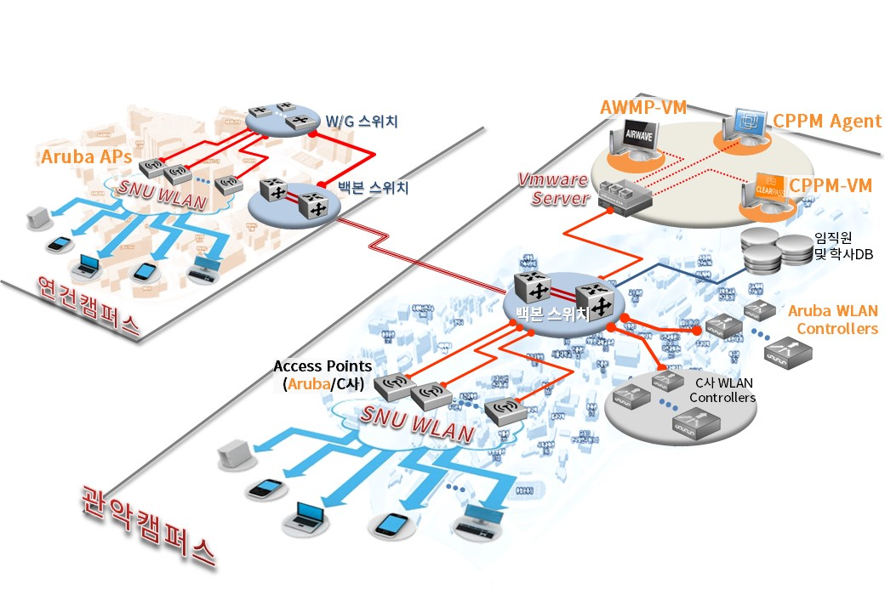
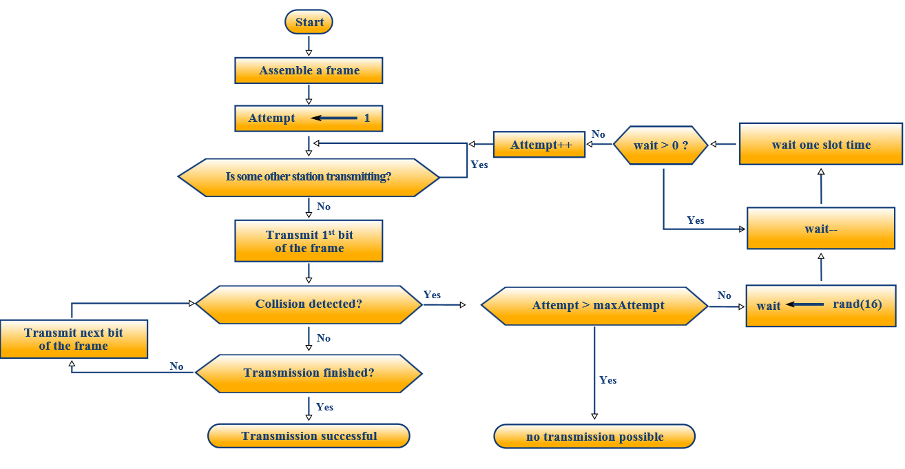
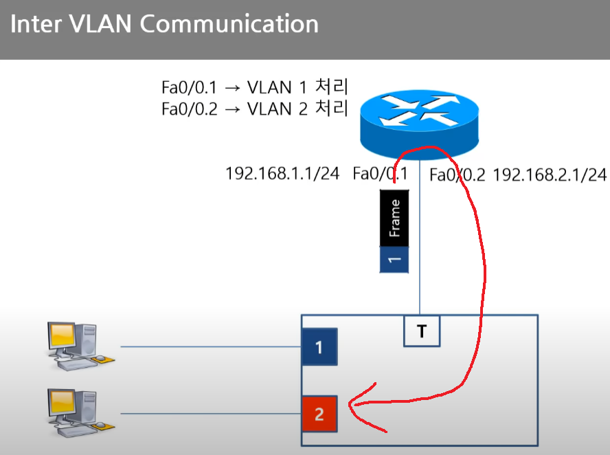
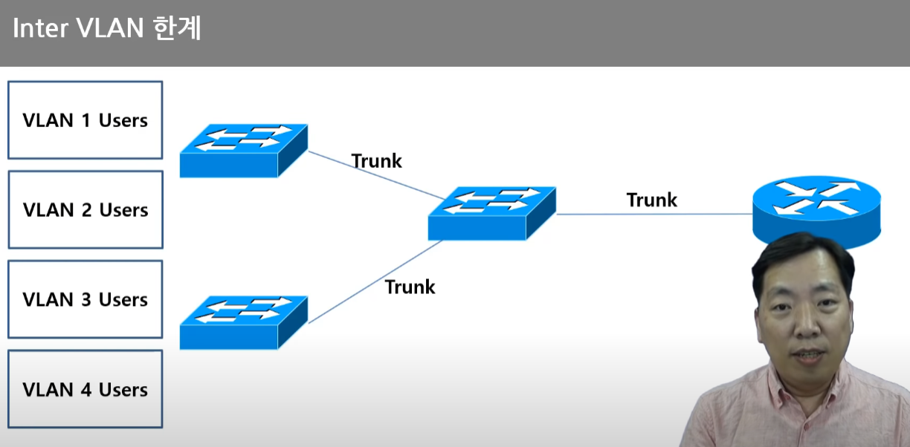
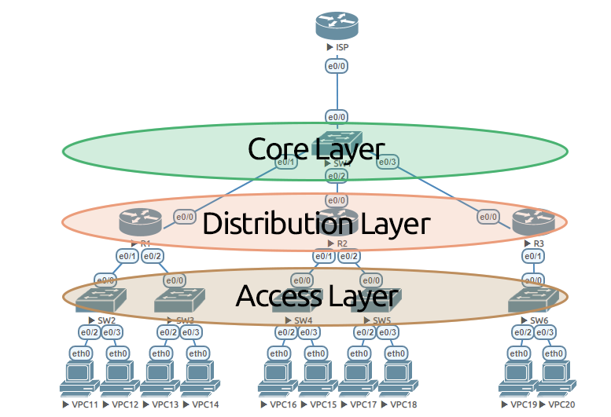
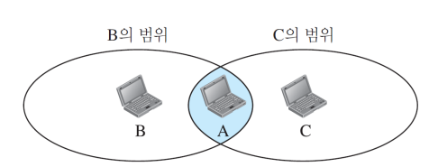

> 작성일 : 2024/01/27 (DAY7)

# 클라이언트 서버형과 피어 투 피어형

네트워크는 장치를 연결하는 방식에 따라 클라이언트-서버형과 피어 투 피어형 등으로 나눌 수 있다.

## 클라이언트-서버형 구조

> **메인 프레임** : 대용량의 메모리와 고속도의 처리 속도를 가졌으며 멀티유저 및 대규모 서버 인프라 구축용으로 사용되는 2m 정도의 초대형 컴퓨터이다. 주로 인구 조사, 공업/소비자 통계, 기업의 ERP, 금융 서비스, 데이터센터, 클라우드 컴퓨팅, 군사 서버 같은 중요하고, 막대한 처리량을 필요로 하며, 다수의 사용자가 동시에 작업할 수 있어야 하는 환경에 쓰인다. 
>
> **미니 컴퓨터** : 메인 프레임보다 더 작지만 개인용 컴퓨터보다는 큰 컴퓨터다. 대규모 데이터 처리, 과학 연구, 기업용 데이터베이스 등 특수한 목적에 활용된다.
>
> **워크 스테이션** : 전문적인 작업(금융 계산, 그래픽 작업, 과학 연산 등)을 하는 고성능 개인용 컴퓨터이다. 주로 서버용 CPU나 워크스테이션용 GPU를 장착한다.
>
> **서버 컴퓨터** : 서버용으로 설계된 컴퓨터다. 높은 안정성, 대용량의 데이터를 빠르게 처리하기 위한 컴퓨팅 능력, 가동하면서 발생하는 열을 효율적으로 배출할 수 있는 설계 등 서비스를 안정적으로 제공하는데 특화되어 있다.
> - 참고 : [서버와 일반 컴퓨터, 무엇이 다를까?](https://library.gabia.com/contents/infrahosting/794/)

클라이언트-서버형 구조는 미니컴퓨터나 워크스테이션 등이 발전하면서 함께 확산된 형태다. 

- `서버`
  - 서비스 제공
  - 이메일을 제공하는 메일 서버, 파일(스토리지)을 제공하는 파일 서버 등
- `클라이언트`
  - 서비스를 받는(요청하는) 쪽

서비스를 제공하는 서버 장치라도 다른 서버로부터 서비스를 제공받는 클라이언트가 되기도 한다.

## 피어 투 피어형의 필요성

인터넷은 클라이언트-서버 형태로 사용하는 것이 기본이지만, 서버를 거치지 않고 단말기끼리 직접 통신하는 것이 효율적일 때가 있다. 이러한 연결 방식을 `피어 투 피어(Peer to Peer, P2P)`라고 한다.

인터넷에서는 IP 주소와 전용 통신 앱 등을 사용하여 LAN의 단말기끼리 직접 연결할 수 있다.

# LAN

## 좁은 범위의 네트워크를 가리키는 LAN

- `LAN(Local Area Network)`
  - 일반적으로 같은 건물 내부나 같은 층 등 제한된 범위의 네트워크를 의미함
  - 본사와 지사 등 지리적으로 떨어져 있는 거점을 중앙에서 관리하고자 하나의 LAN으로 구성하기도 함

## LAN을 구성하는 장치와 프로토콜

- 구성
  - LAN을 구성하는 네트워크는 이더넷이 주류임
  - 각 장치를 연결할 때는 RJ-45 규격 커넥터(랜선) 사용

이더넷은 식별자로 MAC 주소를 사용한다. 그러나 실제로는 이더넷(데이터 링크 계층)의 상위 계층 프로토콜, TCP/IP(네트워크 계층)의 식별자인 **IP 주소**도 이용한다.

MAC 주소는 계층 구조가 없어 LAN 구성이나 관리가 번거롭다. 때문에 이더넷 프레임의 페이로드에 포함된 IP 주소를 사용해서 네트워크를 구성하는 `L3 스위치`를 이용한다. 원래 스위치는 2계층(L2) 장치로, MAC 주소만 식별할 수 있지만 L3 스위치는 IP 주소도 식별자로 이용할 수 있다.

> 구체적인 LAN의 실체
>
> **스위치**는 *LAN의 최소 단위를 구성*한다. L2 스위치로 묶인 LAN은 기본적으로 다른 스위치로 묶인 LAN과 통신할 수 없다.
>
> 이를 해결하기 위해 스위치 간 캐스케이드로 연결하거나 모든 장치를 연결할 수 있는 스위치를 이용한다. 하지만 캐스케이드는 연결에 대수 제한이 있고, 이들을 하나의 LAN으로 관리하는 것은 유지 보수가 번거롭고 보안상 문제가 될 수 있다. 그래서 L2 스위치를 묶어 다른 LAN 사이에서 **교통을 정리**하는 라우터(또는 L3) 스위치를 도입해서 대응한다.

# 이더넷

현재 LAN은 대부분 이더넷 표준을 사용한다.

## 이더넷의 기본 원리

사무실이나 연구실의 장치를 연결하는 네트워크로 개발되었다. *다수의 장치가 독자적인 타이밍에 통신을 시작*하는 것을 목표로 잡고 패킷 통신을 이용한 `랜덤 액세스 방식`을 채용했다.

- `랜덤 액세스 방식`
  - 전송 중일 때 다른 기기가 전송 중이면(충돌 탐지) 조금 기다린 후 재전송 시도
  - **CSMA/CD 방식** : 회선의 사용 상황을 탐지해서 재전송하는 방식
  - **CSMA/CA 방식** : 재전송 대기 시간에 재전송 횟수를 고려한 난수를 이용해 재전송 충돌률을 낮추는 방식

(CSMA/CD 방식)

개발 당시에는 **태핑**(동축 케이블에 구멍을 내서 중심선에 직접 연결하는 방법)으로 각 기기를 연결하는 **버스형 네트워크**였지만, 전송 속도가 100Mbps(100BASE-T) 이상이면 CSMA/CD 방식이 제대로 작동하지 않는 문제가 있었다. 때문에 현재는 *스위치 허브를 이용하여 패킷 식별자로 목적지를 전환*하는 **스타형 네트워크**로 구성하고 있다.

## 이더넷 프레임의 구조

- `이더넷 프레임`
  - 이더넷으로 주고받는 데이터 덩어리
  - 필드 구성 : 출발지 식별자 정보, 목적지 식별자, 패킷 종류나 페이로드 프로토콜 정보(타입 필드), 페이로드, 체크섬
  - 이더넷 식별자는 MAC 주소를 이용함
  - 스위칭 허브는 이 MAC 주소를 참조해 어느 포트끼리 연결하면 좋을지 판단

# 무선 LAN

## 전파를 사용하는 무선 LAN의 장점과 단점

- `무선 LAN`
  - 케이블이 아니라 전파를 사용해서 무선으로 연결되는 LAN
  - 케이블의 제약 없이 전파가 닿는 범위 내에서 자유롭게 장치를 설치할 수 있음
  - 전파는 누군가 무단으로 가로챌 수 있는 위험이 있음
  - 무선 LAN에 연결하려면 SSID를 지정해서 액세스 포인트를 식별함
    - 브로드캐스트 되는 SSDI를 제한하는 기능(스텔스 SSID)도 있음
- 허용되지 않는 연결을 차단하는 방법
  - MAC 주소 인증
  - 무선 통신 암호화

## 무선 LAN의 보안 대책

일반적으로 무선 LAN은 **도청 위험**이 높다고 여겨지므로 앞서 언급한 *보안 기능이 프로토콜에 구현*되어 있다. 그러나 이들이 완전하지는 않다.

- MAC 주소 인증 -> 주소 테이블을 조사하는 프로토콜이 있음
- 스텔스 SSID -> 프로토콜을 알고 있으면 SSID를 알려 달라고 요청 가능
- 암호화 방식 -> 오래된 WEP 같은 것은 안전하지 않음

=> LAN 내 별도 인증 서버를 설치하는 등 사우이 계층에서 대책도 필요함

# Q&A

## Q1. P2P의 실사용 예시와 장단점

### 예시

P2P를 이용하는 예시로 파일 공유 프로그램(웹하드, 토렌트 등), 블록체인 관련 서비스, 음악 또는 동영상 스트리밍, VoIP 통화(Skype, Zoom) 등이 있다.

### 장점

- 확장성 : 확장성이 높아 다수의 참여자가 동시에 데이터를 전달하고 수령할 수 있다.
- 탈중앙화 : 중앙 기관(서버)의 필요 이상의 간섭에서 벗어나 새로운 형태의 커뮤니티를 만들 수 있다. 중앙 기관이 변조되거나 해킹에 노출될 가능성 자체를 없애기 때문에 블록체인 기반 암호화폐 등에 사용된다.
- 저렴한 운용 비용 : 중앙서버나 개별서버에 걸리는 부하를 줄이거나 사용자가 분담할 수 있도록 하여 서비스 제공 비용을 낮출 수 있다.
- 분산 구조와 탄력성: 중앙 서버가 없기 때문에 네트워크에 유연성과 탄력성을 부여한다. 피어 수가 늘어나면 파일 전송 속도가 올라간다.

### 단점

- 보안과 프라이버시의 문제 : 모든 클라이언트가 서버 역할을 겸하기 때문에 자신의 IP 주소가 다른 클라이언트에 노출된다. 즉, 중앙 집중화된 시스템보다 데이터 보안과 프라이버시가 관리하기 어려울 수 있다.
- 서비스의 일관성과 신뢰성: 피어들 간에 연결이 끊기면 서비스 일관성과 신뢰성에 영향을 줄 수 있다. 데이터를 공유할 때마다 통신 경로와 상대의 컴퓨터 성능에 따라 속도가 동일하기 어렵다. 또한 피어 수가 줄어들면 속도가 느려진다.

### P2P 구현 방식

- 하이브리드 P2P 방식

기존 서버-클라이언트 모델을 완전히 벗어나지 못한 형태의 P2P이다. 중앙서버가 중개 및 검색을 제공하고 데이터 전송은 개인 PC 즉, 피어 간에 주고 받는 방식이다. 하이브리드 피투비 방식을 사용한 대표적인 예로는 냅스터, 소리바다 같은 파일 공유 프로그램, 네이트온 등과 같은 메신저를 통한 파일 전송 등이 있다. 이 방식에서는 중앙서버가 존재해 검색이 빠르다는 장점이 있지만, 네트워크가 커질수록 중앙서버에 부담이 가며 중앙서버가 죽으면 전체 네트워크가 죽는 단점이 있다.

- 퓨어 P2P 방식

중앙서버를 사용하지 않는 방식으로서, 네트워크에 참여하는 모든 컴퓨터는 똑같이 서버-클라이언트 역할을 겸하며 검색, 데이터 전송에 있어서 동일한 수준의 책임을 진다. 이를 사용한 네트워크는 그누텔라(Gnutella)와 프리넷(Freenet )등이 있다. 

해당 방식의 장점으로는 전체 네트워크가 죽는 일이 거의 불가능하며, 네트워크 확장성이 매우 높고, 네트워크 증가에 따른 비용이 제로에 가깝다. 또한 전 세계 모든 컴퓨터의 정보 자료를 100% 검색 및 공유할 수 있고, 제한된 커뮤니티 내에서 파일 정보 공유 네트워크를 구성할 수도 있다. 또한 각 네트워크의 연결을 통해 커뮤니티 상호 간의 정보 공유망 또한 자유롭게 구축할 수 있다.

그러나 중앙 서버가 없기 때문에 네트워크를 제어할 수단이 없고, 파일 목록을 검색할 때마다 네트워크의 모든 컴퓨터를 검색해야 하므로 검색 속도가 크게 뒤떨어지며, 과도한 부하, 해킹 위험 등이 있는 것이 단점이다.

> 참고
> - [P2P](https://namu.wiki/w/P2P)
> - [Peer-to-Peer(P2P) 네트워크](https://m.blog.naver.com/pcmola/222092887306)

## Q2. L2 스위치들을 라우터가 아닌 L3 스위치로 묶는 이유는? L3 스위치와 라우터의 차이점

### L3 스위치란

VLAN 간의 통신을 위해 서로 다른 VLAN끼리 라우팅 시키는 것을 `Inter VLAN Communication`이라고 한다. 이를 통신을 구성하기 위해 L2 스위치들을 스위치로 묶어주고 라우터에 연결해서, 라우터가 통신을 중개할 수 있도록 한다.

그러나 이런 통신 방식은 연결된 VLAN이 많아지고 트래픽이 증가하면 상위 스위치와 라우터 간의 **병목 현상**이 발생한다. 그래서 스위치와 라우터를 하나의 장치로 통합하고 내부적으로 처리해서 병목 현상을 없애기 위해 L3 스위치가 탄생했다.

L3 스위치는 위와 같이 대규모 네트워크, 특히 기업 인트라넷의 라우팅 성능을 향상시키기 위해 고안되었다. 

L3 스위치는 VLAN 간 라우팅을 지원하는데, **Hardware-ASIC**(Application-Specific Integrated Circuit, 특정 목적을 위해 설계된 집적 회로) 기반으로 동작하므로 SW 기반인 라우터보다 스위칭 동작이 더 빠르다. 때문에 서브넷 간, VLAN 간 통신할 때 유용하며 이러한 구조를 구성하는데 라우터보다 유리하다.

다만 이러한 L3 스위치는 기존 L2 스위치보다 비용이 훨씬 더 많이 들고 별도의 설정과 구성을 해야하기 때문에 많은 비용과 리소스가 발생한다. 즉, L3 스위치는 장치 서브넷과 트래픽이 많은 대규모 인트라넷 환경에 적합하므로 가정과 소규모 조직에는 필요하지 않다.

### L3 스위치와 라우터의 차이

L3 스위치는 "스위칭" 기능에, 라우터는 "라우팅" 기능에 초점을 두고 있다. 

L3 스위치는 VLAN 간의 연결에서 라우팅 기능은 Hardware-ASIC 기반으로 패킷을 전송하므로 라우터에 비해 성능면에서 이점을 가지고 있다. 그러나 **WAN 기능**은 부족하여 조직 내부와 외부의 트래픽을 라우팅하려면 라우터가 필요하다.

이러한 구성은 `Hierarchical 3 Layer` 모델의 구성 예시에서 확인할 수 있다. 

> 가장 아래의 **Access Layer(접근 계층)** 는 최종 사용자가 네트워크에 접근하는 지점이다. 이 계층에서는 사용자 디바이스들이 네트워크에 연결되고 데이터를 전송할 수 있도록 한다. 일반적으로 L2 스위치와 같은 장비들이 사용된다.
>
> 중간 계층인 **Distribution Layer(분배 계층)** 는 접근 계층에서 수집된 데이터를 분배하고 전송하는 역할을 한다. 라우팅, 필터링, 중계 등의 기능이 이루어지며, 여러 개의 접근 계층에서 온 데이터를 효율적으로 관리한다. 라우터 또는 L3 스위치가 사용된다.
>
> 가장 상위의 Core Layer(코어 계층)은 분배 계층 간의 데이터를 빠르게 전송하고 라우팅하는 역할을 한다. 대용량의 데이터 전송을 처리하며 전체 네트워크의 효율성을 유지한다. 코어 라우터 또는 코어 스위치가 사용된다.

L3 스위치와 라우터 이 두 장비는 처음에는 다른 용도로 사용되었지만, 점점 비슷해지고 있기 때문에 지금 시점에서 유의미한 차이는 존재하지 않는다.

> 참고
> - [L3 스위치, 라우터의 차이점 (L3 switch, Router 차이점)](https://blog.naver.com/PostView.nhn?blogId=wjw1225&logNo=222241663960)
> - [Layer 3 Switch vs. Router](https://www.youtube.com/watch?v=KA4-z6mBQxI&ab_channel=ITBEST-PATH)
> - [What is a layer 3 switch and why would your network need it?](https://techgenix.com/layer-3-switch/)
> - [[Topology]ⅰ- 소규모 LAN 네트워크 구축 기초 I](https://net-study.club/entry/%EC%86%8C%EA%B7%9C%EB%AA%A8-LAN-%EB%84%A4%ED%8A%B8%EC%9B%8C%ED%81%AC-%EA%B5%AC%EC%B6%95-%EA%B8%B0%EC%B4%88-I)

## Q3. 현대 이더넷에는 CSMA/CD 방식이 사용되지 않는 이유 + 무선 LAN은 CSMA/CD 방식을 사용하지 못하는 이유

### CSMA/CD 방식이 사용되지 않는 이유

현대 이더넷에서는 CSMA/CD (Carrier Sense Multiple Access with Collision Detection) 액세스 방식이 거의 사용되지 않는다. 초기 이더넷은 **허브**를 사용하기 때문에 충돌을 감지하고 처리하는 방식이 필요했지만 현대에는 스위치를 사용하는 것이 일반적인 경우가 되었기 때문이다. 스위치에서 패킷의 충돌과 전송을 제어하므로 CSMA/CD 방식의 필요성이 감소했다. 

### 무선 LAN에서 CSMA/CA 방식을 채택한 이유

무선 LAN은 낮은 전력으로 인해 한번에 송신 또는 수신만 수행할 수 있고, 3차원 공간에 전파되는 전자기파의 특성상 감쇠가 심하기 때문에 송신자 입장에서는 자기가 송신하는 신호에 수신 신호가 전부 묻혀버린다. 또한 같은 링크안에 있는 지국끼리도 서로 신호를 주고받지 못하는 경우(숨겨진 지국 문제)가 발생할 수 있다.

> 무선 네트워크에서는 통신하는 장치들이 서로를 직접 감지할 수 있는 것이 아니라, 무선 신호가 전파되는 범위 내에서 감지할 수 있다. 따라서, 어떤 두 장치가 서로 감지하지 못하는 상태가 발생할 수 있다.
> 
> 위와 같은 경우, A와 B는 서로 감지할 수 있지만, B와 C는 서로 감지할 수 없는 상태다. 그러나 A는 두 지국의 신호를 전부 수신할 수 있다. 만약 B와 C가 동시에 전송을 하면 A는 제대로된 데이터를 수신하지 못한다. 그럼에도 B와 C는 서로에게 통신이 불가능하므로 충돌이 났다는 것을 인지하지 못한다. B에게는 C가 숨겨진 지국이고, C에게는 B가 숨겨진 지국이다.

위와 같은 이유로 무선 LAN에서는 충돌을 감지하고 회피하는 CSMA/CD 방식은 사용하지 못하고, 대신 매체를 감지해 충돌을 회피하는 CSMA/CA 방식을 채택했다.

> 참고
> - [[임의접근] CSMA/CD, CSMA/CA](https://velog.io/@semteul/CSMACD-CSMACA)
> - [Hidden Terminal Problem (CSMA/CA) RTS-CTS Mechanism](https://www.youtube.com/watch?v=BLEt10OkE4g&ab_channel=HowTo)
