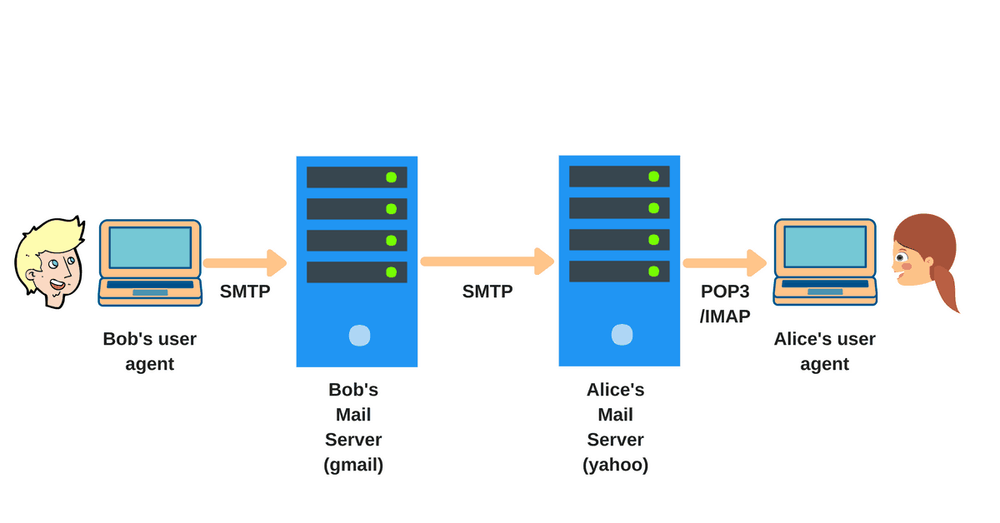
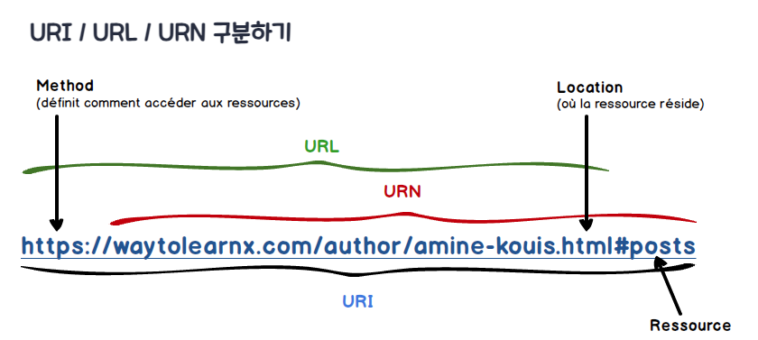
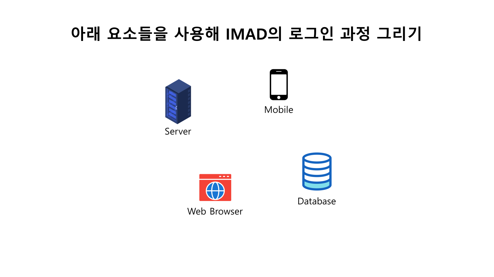
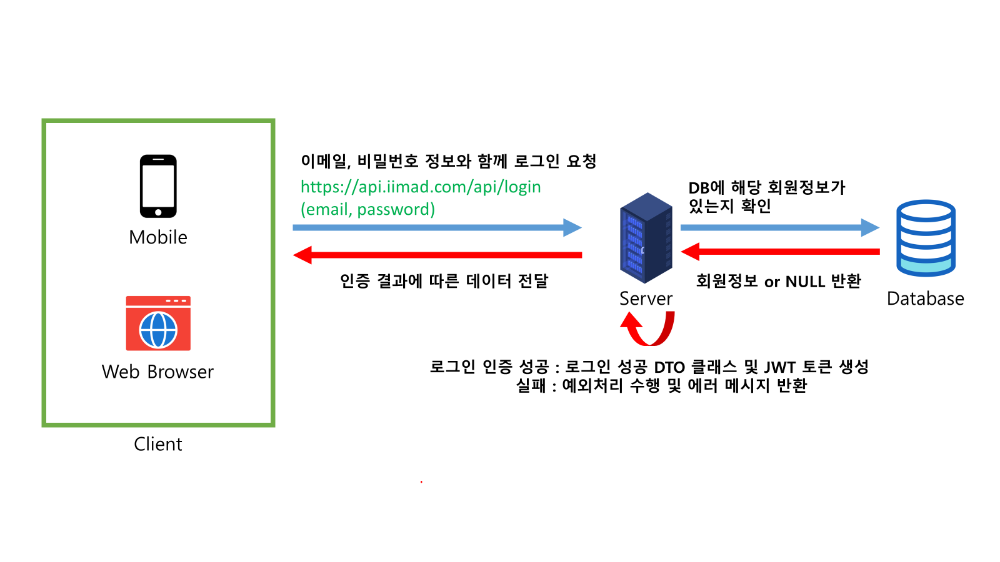
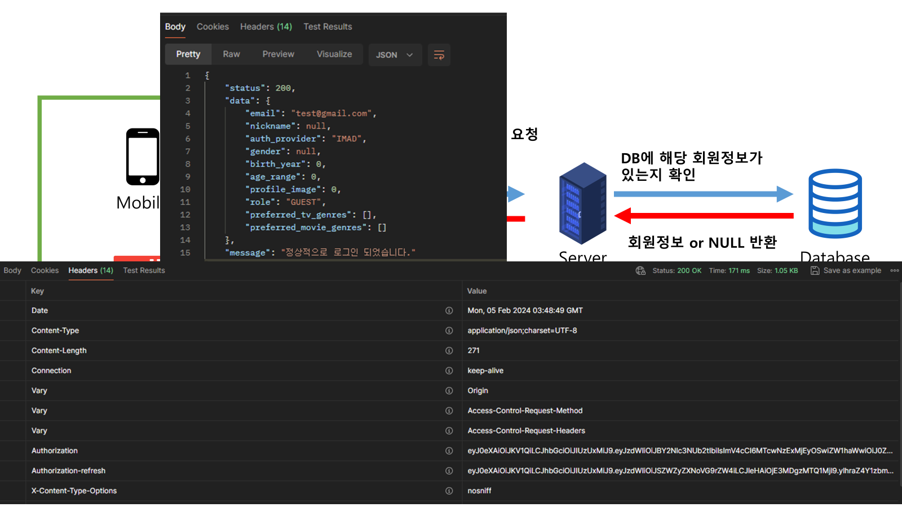
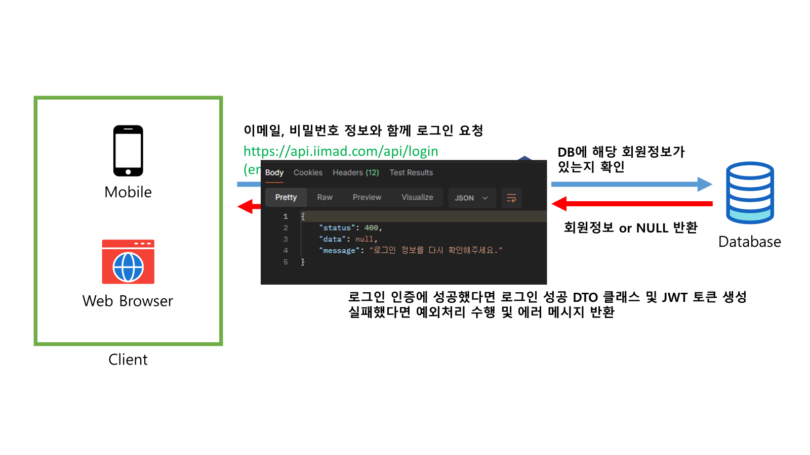

# 38. 인터넷 구조

## 인터넷 기원

- `인터넷`
  - 1980년대 후반부터 인터넷이라는 용어가 사용됨
  - *네트워크끼리 서로 대등한 관계로 연결*하고 있었기 때문에 네트워크 사이를 연결한다는 의미에서 "internet"으로 불림

## 네트워크를 연결하는 인터넷 구조

- `라우터`
  - 네트워크를 연결하고 패킷의 교통 정리를 수행
  - 인터넷에서 전 세계 LAN이나 ISP, 모바일 네트워크를 연결하는데 라우터를 사용함
- 라우터의 기본 기능
  - LAN 내부의 통신은 외부로 내보내지 않음
  - 자신의 LAN 주소가 아닌 통신은 내부로 들여보내지 않음
  - 자신의 LAN 주소가 아닌 통신은 라우팅 테이블이나 기본 게이트웨이를 설정하여 전달함
  - 이 때 IP 주소를 자신이나 자신이 관리하는 LAN과 전송 대상의 **식별자**로 사용함

---

> 작성일 : 2024/02/05 (DAY10)

# 39. 인터넷에서 사용하는 프로토콜

인터넷에서 기본적으로 TCP/IP 프로토콜이 사용되지만 이들만으로 복잡한 애플리케이션 구현은 힘들다. 때문에 TCP/IP를 기반으로 하는 다양한 프로토콜이 있다.

## IP 주소를 보고 패킷을 전송하는 TCP/IP

- TCP/IP 프로토콜
  - IP 주소를 기반으로 패킷을 전송하는 기능 밖에 없음
  - 최소한의 오류 검사, 세션을 확립하는 기능 포함
  - 그러나 목적지에 패킷이 도달했는지, 재전송할 필요가 있는지 등 확인하는 기능은 없어서 이 역할은 애플리케이션이 담당함
=> 이메일 교환, 웹 서버 액세스, 웹 동영상 시청 등 복잡한 기능을 실현하기 어려움

## 서비스 프로토콜로 상위 기능 실현

- `서비스 프로토콜`
  - 파일 전송, 암호화 통신, 도메인 이름과 IP 주소 검색, 이메일 교환, 웹 사이트 접속 등이 있음
  - IP, TCP, UDP 프로토콜을 사용해서 상위 기능을 구현함
  - 더 큰 규모의 서비스나 앱은 전체 기능을 구현하려고 여러 개의 서비스 프로토콜을 사용하기도 함
  - 다양한 웹 앱, 웹 서비스, 클라우드 서비스 등을 구현하는데 필수적임
  - 애플리케이션 프로토콜이라고도 함

# 40. 이메일을 주고받는 구조

## SMTP로 받는 사람의 메일 서버에 이메일 보내기

- SMTP 서버(송신 메일 서버)
  - 이메일을 보내기 위해 받는 사람의 이메일 주소를 지정하여 자사에서 관리하는 메일 서버로 전송함
  - 사용하는 프로토콜이 SMTP이므로 SMTP 서버라고도 함
  - 이메일 주소의 **도메인 이름**(@보다 오른쪽에 있는 문자열)을 확인해서 받는 사람의 수신 메일 서버로 전송

## POP로 메일 서버에서 이메일 받기

- POP 서버(수신 메일 서버)
  - POP 프로토콜 사용
  - 이메일을 올바른 수신자에게 전달하기 위해 등록 사용자 데이터베이스를 갖추고 있음
  - 일반적으로 @보다 왼쪽에 있는 문자열이 POP 서버에 등록된 **사용자 ID**임
- **스풀 파일**
  - POP
    - 메일 클라이언트가 POP 서버에 접속해서 정상 사용자로 인증 -> 이메일 다운로드
    - 내려받은 이메일은 스풀 파일에서 삭제됨
    - 같은 계정이라도 다른 컴퓨터 등에서 볼 수 없음
  - IMAP
    - 서버가 이메일을 관리함
    - 스풀 파일에서 이메일이 삭제되지 않음
    - 같은 계정이라면 모든 컴퓨터에서 이메일을 볼 수 있음

# 41. 웹 페이지를 열람할 수 있는 구조

## 웹을 구성하는 인프라 기술

- `웹(WEB, World Wide Web)`
  - 네트워크 모델 : 클라이언트-서버형
  - 인프라 기술 : TCP/IP, HTTPS, DNS 등
  - 웹 서버, 웹 클라이언트, HTML/JS/CSS/PHP/Java 등의 언어, SQL 등 DB, REST API 등으로 구성됨
    - 이 중 웹 서버와 웹 클라이언트는 필수임
  - 이러한 인프라 기술은 온갖 기능과 서비스를 제공함

## 웹의 기본 구조

- 초기 웹
  - 학술 논문 등 정보를 열람하는 서비스였음
  - 미래의 확장성을 고려해 동영상, 음성 등도 통합할 수 있는 데이터 형식으로 HTML이 채택됨
  - HTML 형식의 문서를 웹 서버에 저장하고, 웹 브라우저인 웹 클라이언트가 인터넷을 통해 웹 서버에 액세스하여 논문 페이지를 화면에 표시하는 방식

# 42. URL/URI

## 네트워크상의 장소나 이름을 특정하는 URL

- `URL(Uniform Resource Locator)`
  - 인터넷상의 서버나 데이터(리소스) 등을 특정하는 방법을 규정한 것
  - 유사한 것으로 URI나 URN이 있음
    - 정확하게는 URI가 URL과 URN의 상위개념

> 참고 : [[네트워크/기본] URI, URL 및 URN의 차이점](https://hanamon.kr/%EB%84%A4%ED%8A%B8%EC%9B%8C%ED%81%AC-%EA%B8%B0%EB%B3%B8-url-uri-urn-%EC%B0%A8%EC%9D%B4%EC%A0%90/#:~:text=URN%EC%9D%80%20%EB%A6%AC%EC%86%8C%EC%8A%A4%EB%A5%BC%20%EC%98%81%EA%B5%AC%EC%A0%81%EC%9D%B4%EA%B3%A0%20%EC%9C%A0%EC%9D%BC%ED%95%98%EA%B2%8C%20%EC%8B%9D%EB%B3%84%ED%95%A0%20%EC%88%98%20%EC%9E%88%EB%8A%94%20URI%EC%9D%B4%EB%8B%A4.,%EC%95%8A%EA%B3%A0%20%EA%B2%BD%EB%A1%9C%EC%99%80%20%EB%A6%AC%EC%86%8C%EC%8A%A4%20%EC%9E%90%EC%B2%B4%EB%A5%BC%20%ED%8A%B9%EC%A0%95%ED%95%98%EB%8A%94%20%EA%B2%83%EC%9D%84%20%EB%AA%A9%ED%91%9C%EB%A1%9C%ED%95%98%EB%8A%94%20URI%EC%9D%B4%EB%8B%A4.)

# Q&A

## 아래 요소들을 사용해 IMAD의 로그인 과정 그리기

### 문제

### 답안

### 로그인 성공 시 응답

### 로그인 실패 시 응답

---

> 작성일 : 2024/02/07 (DAY11)

# 43. HTTP/HTTPS

## 웹에서 통신에 사용되는 HTTP

- 웹
  - 클라이언트-서버 모델
  - 먼저 웹 브라우저가 요청을 보내고(요청 정보는 URL로 기술), 서버는 해당하는 HTML 파일을 변환하면서 응답함

웹에서는 HTTP 또는 HTTPS라는 프로토콜을 사용해서 정보를 교환한다. `HTTP` *보안을 강화*하고 *패킷 페이로드를 암호화*하여 상호 작용하는 프로토콜은 `HTTPS`다.

## 통신 낭비를 줄이는 웹 브라우저 기능

- `스테이트리스(Stateless)`
  - HTTP는 하위 프로토콜로 TCP를 사용하여 세션을 설정한다.
    - 하지만 웹 브라우저 및 서버의 요청과 응답은 *전후 통신에 관계없이 매번 독립적*으로 처리된다.
    - 이런 통신을 `스테이트리스`라고 한다.
  - 스테이트리스 통신은 각각의 통신이 독립적이고 의존성이 없으므로, 같은 웹 페이지를 여러 번 반복해서 요청해도 매번 같은 HTML 파일이 전송된다.
  - 웹 서버가 불특정 다수의 웹 브라우저 요청을 처리하는 동안 접속별로 상태를 유지하기 어렵기 때문에 이와 같은 방식을 사용
    - 그러나 같은 HTML 파일을 여러 번 전송하는 것은 낭비임

- `스테이트풀(Stateful)`
  - 같은 HTML이 여러 번 전송되는 낭비를 웹 브라우저에서 해결할 수 있음
    - 브라우저의 **캐시(쿠키)**에 한번 접속한 웹 페이지 정보(HTML 파일)을 보관
    - 두 번째 접속부터는 웹 페이지가 업데이트되지 않으면 캐시에 저장된 파일을 사용함
  - 이러한 기능을 `스테이트풀`이라고 함
  - 쿠키
    - 과거 방문한 웹 페이지의 URL, 타임스탬프, 로그인할 때 생성되는 세션 정보, 과거에 입력한 주소 및 이메일 주소 등이 저장됨
    - 웹 사이트 방문자를 추적하고 분석하기 위해 웹 서버에서 쿠키 정보를 활용할 수도 있음

# 44. DNS

## IP 주소를 다루기 쉽게 한 도메인 이름

- 인터넷 상의 식별자
  - 인터넷은 IP 프로토콜을 사용하므로 IP 주소가 유일한 목적지를 특정할 수 있는 식별자임
  - 숫자만의 나열은 인간이 다루거나 외우기 어려움 -> 다루기 쉬운 문자열(도메인 주소)을 사용
  - 도메인 이름은 조직별 임의의 서버 이름에 조직 이름이나 지역, 속성 등 정보를 **계층적**으로 추가한 것
- `DNS(Domain Name System)`
  - 도메인 이름과 IP 주소의 대응표를 관리하는 체계
  - 이 대응표 데이터베이스를 관리하는 서버를 DNS 서버라고 함
  - DNS 서버는 여러 서버에 데이터베이스를 분산하여 서로 통신하며 관리함

## 도메인 이름과 IP 주소 관리 방법

전 세계 도메인 이름과 IP 주소 대응표를 한곳에 집중해서 관리하는 것은 현실적이지 않음
 => 여러 DNS 서버에 분산시켜 관리

일반적으로 도메인 이름과 IP 주소가 `영역`이라는 단위로 관리된다. 이 영역 정보를 유지하는 서버를 **권한 DNS 서버** 또는 **네임서버**라고 한다.

### 클라이언트에서 IP 주소 문의하는 과정

1. LAN 내 DNS 서버에게 문의 
2. IP 정보 유무 
2-1 알고 있다면 직접 IP 주소를 알려줌 
2-2 모른다면 알고 있을 것 같은 DNS 서버에 문의(거기서도 모른다면 다른 DNS 서버에 문의) 
3. IP 주소를 알고 있는 DNS 서버를 찾을 때까지 2.2번 과정을 반복 수행

이러한 문의를 처리하는 프로그램을 리졸버(resolver)라고 함

> - 영역 : DNS 서버가 직접 관리하는 도메인 이름과 IP 주소 범위
> - 권한 DNS 서버 : 영역 내 호스트 정보를 직접 관리하는 서버
> - IP 주소 조회 : DNS 서버가 도메인 이름으로 IP 주소를 조회하는 것을 이름 해석이라고 함. DNS 서버는 한 번 이름을 해석한 IP 주소를 보관하는 기능이 있음

# 45. ICMP

## 경로상 장애 등을 통지하는 ICMP

- `ICMP(Internet Control Message Protocol)`
  - 목적지와 연결을 설정하기 전 정보 교환이나 패킷이 잘 도착했는지 확인하는 기능 등을 규정한 프로토콜
  - 역할
    - 처리 실패나 장애가 발생했을 때 **오류 메시지** 통지
    - 데이터를 주고받을 때 필요한 전처리, 후처리, 관리 정보 교환
    - 통신 상태 확인
  - LAN 뿐만 아니라 라우터를 넘어서 인터넷으로도 전송됨

## ICMP 패킷의 구조

TCP나 UDP와 마찬가지로 ICMP 패킷의 헤더와 페이로드는 IP 패킷의 페이로드에 들어가는 형태로 구성됨 
 => 3계층 프로토콜임

- ICMP 패킷의 구조
  - 헤더 : 타입, 코드, 체크섬 등
  - 페이로드 : 유형과 코드에 따라 오류 메시지, 전송 데이터 등
  - 헤더의 필드와 페이로드의 크기는 타입과 코드에 따라 가변 길이가 됨
  - 타입 : 패킷의 종류(ICMP, TCP, UDP 등)
  - 코드 : 타입에 따라 달라지는데, 주로 타입 3(목적지 도달 불가)의 원인을 나타내는 코드임

> - 오류 메시지 : 통신 중 어떤 장애가 발생했을 때 통신 경로에 있는 노드에서 출발지로 통지되는 메시지
> - 체크섬 : 패킷 데이터에 글자 깨짐 등이 없는지 확인하고자 부여하는 부호. 목적지에서 받는 데이터로 동일한 계산을 실시하여 부가된 체크섬과 일치하면 오류가 없다고 판단함

# 46. 텔넷

## 원격으로 서버를 관리하는 텔넷

- `텔넷(Telnet)`
  - 단말기에서 서버에 원격으로 로그인하는 프로토콜
    - 단말기와 서버는 **텍스트 데이터**를 주고 받음
  - 원격 로그인은 서버 관리 및 네트워크 관리에 필수적인 기능임
  - 3계층 이상의 네트워크 장치(라우터, L3 스위치, 방화벽 등)를 설정할 때도 텔넷을 사용할 수 있음
  - 클라이언트-서버 방식을 채용함

## 텔넷 연결 문제점

텔넷을 사용할 때 연결할 서버 이름(호스트 이름) 또는 IP 주소를 지정한다. 포트가 열려있으면 연결을 수락하고 사용자 ID와 암호를 입력해서 서버에 로그인한다.

그러나 텔넷에는 패킷을 **암호화**하는 기능이 없기 때문에 로그인 후 작업하는 명령 정보는 평문으로 네트워크로 흘러간다.
 => **보안 문제**로 현재는 텔넷 대신 암호화 통신이 가능한 SSH를 사용함

# Q&A

## 텔넷은 패킷을 암호화하는 기능이 없기 때문에 보안 문제가 있다. 그럼에도 리눅스, 윈도우 등의 OS에서 아직까지 지원하는 이유는?

아래와 같은 경우나 이유 때문에 간간이 사용됨

- Telnet만을 지원하는 구식 장비 또는 서버에 접속하는 경우 (생각보다 많음)
- 서버의 특정 포트나 서비스가 제대로 작동하는지 확인하기 위해
- 조직 또는 기업 내부에서 서버/장치에 간단하게 연결 후 사용하기 위해
- SSH 설정하기 귀찮을 때

> 참고
> - [What is Telnet and what is it still used for?
](https://www.digitalcitizen.life/simple-questions-what-telnet-what-can-it-still-be-used/)
> - [[Serious] Why is Telnet still used?](https://www.reddit.com/r/AskNetsec/comments/52rdaf/serious_why_is_telnet_still_used/)

---

> 작성일 : 2024/02/13 (DAY12)

# 47. SSH

- `SSH(Secure Shell)`
  - 보안에 문제가 있는 텔넷을 대신해서 **원격 로그인**에 사용되는 프로토콜
  - **공개키 암호화 방식**으로 공개키와 개인키를 사용하여 통신을 암호화해서 원격 접속을 보호함

## 공개키 암호화 방식의 원리

- `공개키 암호화 방식`
  - HTTPS, SSH 등에서 사용하는 암호화 통신 방식
  - 일반적인 암호 방식(`공통키 암호 방식`)은 양쪽이 같은 키(**공통키**)를 공유함
  - `공개키 암호화 방식`에서는 **공개키와 개인키** 2개를 사용함
  - 원리
    - 두 개의 키는 반드시 올바른 쌍으로 이용함
    - 공개키 : 네트워크상에 공개하는 키
    - 공개키와 암호문이 있어도 쌍이 되는 개인키가 없으면 **복호화**할 수 없음
    - => 출발지에서 공개키로 암호화된 데이터는 개인키를 가진 목적지에서만 복호화할 수 있게 됨(암호화 통신)
  - 공개키 암호화 기술은 전자 서명에도 응용됨

## SSH 암호화 원리

SSH의 암호화 키를 생성하고 공유하는 방식에 따라 SSH1, SSH2 두 가지 유형으로 나뉜다.

- SSH1
  - 클라이언트가 서버에서 받은 공개키로 암호화한 공통키(쌍을 이루는 개인키와 다른 것)을 생성하고, 그 암호와 데이터를 서버로 보냄
  - 서버는 클라이언트에서 받은 데이터를 자신의 개인키로 복호화하여 공통키를 생성
    - 이후의 통신을 공통키로 암호화함
  - SSH1은 현재 잘 사용되지 않음
- SSH2
  - **디피-헬만(Diffie-Hellman) 키 교환 방식**을 사용함
  - 양측이 개인키와 공개키를 생성하고, 공개키를 교환한 후 개인키와 공개키로 특수한 계산을 수행해서 얻은 동일한 계산 결과를 통신용 공통키로 사용함
  - HTTPS의 암호화 통신도 이 방식으로 키를 생성함

# 48. FTP

## 파일 전송 기능 및 보안 문제

- `FTP(File Transfer Protocol)`
  - 호스트 사이에서 또는 클라이언트와 서버 사이에서 파일을 주고받는 프로토콜
  - 네트워크상의 저장소 등에 액세스할 때 이용함
  - 클라이언트가 FTP 서버에 로그인하면 서버에 있는 파일을 내려받거나 클라이언트의 파일을 업로드할 수 있음
  - 텔넷과 마찬가지로 로그인할 때 암호화되지 않음
    - SCP나 SFTP처럼 암호화 통신이 가능한 프로토콜과 이를 지원하는 서버 또는 클라이언트 프로그램으로 대체되고 있음

## 액티브와 패시브 두 가지 전송 모드

- 컨트롤 포트(TCP 21) : 세션을 관리
- 데이터 포트(TCP 20)
  - 파일을 전송
  - 원래는 서버끼리 파일을 전송하는 포트이고, 클라이언트와 파일 전송은 임의의 포트를 사용함
- `액티브 모드` : TCP 20을 데이터 포트로 사용하는 모드
- `패시브 모드` : 임의(대개는 3만 이상의 숫자)의 포트를 네고시에이션 하는 모드

컨트롤 포트와 데이터 포트를 나눈 이유는 파일 전송 중에도 중단 등 관리할 수 있도록 하기 위함이다.

> 네고시에이션 : 서버와 통신할 때 적절히 통신할 수 있도록 접속하는 포트 번호 등 조건이나 절차를 결정하는 일을 의미함

# 49. NTP

## 컴퓨터 내 시간을 동기화하는 NTP

- 내부 시계
  - 컴퓨터나 서버는 내부에 시계를 가지고 있음
  - 이 시간으로 파일의 **타임스탬프**를 기록하거나 로그 파일의 시간 정보로 이용함
  - 시계에는 오차가 있고 모든 컴퓨터가 올바르게 설정되어 있는 것은 아님 => NTP 사용
- `NTP(Network Time Protocol)`
  - 호스트 간에 시간을 동기화하는 프로토콜
  - 컴퓨터나 서버 등 내부 시각을 정기적으로 동기화함
  - 인터넷상에서 하는 모든 서비스의 시간(내부 시계)을 동기화하는 프로토콜이므로 매우 중요함
- NTP 서버
  - 클라이언트가 문의하면 현재 시간을 응답함
  - GPS의 시간 정보나 각 국가에서 관리하는 표준 시계(원자시계, 분자시계 등) 정보를 이용함

## 계층 구조로 배치되는 NTP

현재 인터넷에서 시간 동기화는 매우 중요하며 NTP 서버 문의량은 방대하다. 따라서 NTP 서버는 국가나 대학 등이 관리하는 *표준 시간에 가까운 서버 아래 계층적으로 배치*된다.

Startum 1 아래에 Startum 2나 Startum 3 NTP 서버가 분기되어 연결되어 있다. *계층이 깊어지면 시간 오차가 누적*되어 가지만, *Startum 2 이하는 그 오차를 예측해서 보정*한다.

# 50. Ajax, REST API

웹 기술이나 프로토콜에는 지금까지 소개한 것 외에도 다양한 종류가 있다.

## 통신 대기 시간에 다른 처리르 하는 Ajax

- 동기 통신
  - 서버에 요청을 하고, 응답 데이터가 준비될 때까지 다른 처리를 하지 않음
- 비동기 통신
  - 모든 응답이 완료되기 전에 다른 처리를 하거나 추가 요청을 수행함
  - 요청 이후 응답까지의 대기 시간을 효율적으로 사용할 수 있음
  - 이를 실현하려면 응답으로 주고받는 데이터양을 줄여야 함
- `Ajax(Asynchronous JavaScript + XML)`
  - XML 형식으로 필요한 데이터만 주고받으며 비동기 통신을 할 수 있게 한 것
  - 웹에서의 지도 스크롤, SNS 타임라인 표시, 게임처럼 반응하는 웹 페이지 모두 Ajax로 구현됨

## 기능 호출에 사용되는 REST API

- `REST API(REpresentational State Transfer API)`
  - API : Application Programming Interface
  - 애플리케이션 간 처리나 호출 방법 등을 정한 규약
  - 보통 HTTP(S)를 사용하며 HTML이나 JSON, PHP 등으로 처리 내용이나 처리 데이터를 주고받는다.
  - 클라우드 서비스는 대부분 REST API를 이용하여 서로 연계하면서 하나의 서비스를 구축함
