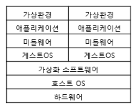

> 작성일 : 2024/02/16 (DAY13)

# 51. 클라우드 구조

- `클라우드(Cloud)`
  - 인터넷으로 연결된 기기가 제공하는 데이터나 앱, 서비스 등 인프라
  - 다양한 기능과 서비스를 이용할 수 있음

## 클라우드라는 용어의 유래

- 클라우드의 유래
  - '구름(cloud)'이라는 뜻의 영어에서 유래
  - 회선이나 통신망, 웹 서비스 기반, 빅데이터 저장 장소로 인터넷을 표현할 때 경계가 모호하고 실체가 정해지지 않는 이미지를 나타내기에 구름이 편리함
  - 현재는 인터넷을 이용한 컴퓨터 사용 형태를 클라우드 또는 클라우드 컴퓨팅이라고 함

## 네트워크로 연결된 기기가 클라우드를 구성

- `데이터센터`
  - 인터넷을 구성하는 네트워크와 이와 연결된 컴퓨터, 서버 등의 기기를 한데 모아 놓은 시설
  - 대량의 서버를 가동시키려고 서버 랙, 네트워크 회선, 전원/공조/방화/내진 설비 등을 갖춘 시설
  - AWS, MS 에저, 구글 클라우드 같은 주요 클라우드 서비스를 제공하는 플랫폼은 아마존, 마이크로소프트, 구글이 운영하는 세계적인 규모의 데이터센터이다.
  - 데이터센터의 시설만 이용하는 방식을 `하우징`, 서버까지 이용하는 방식을 `호스팅`이라고 한다.
- 클라우드 기술과 데이터센터 기술의 공통점
  - 서버와 네트워크 가상화, 분산형 데이터베이스, SaaS 같은 기술과 이용 형태에 따라 구성됨

# 52. 서버 가상화

## 서버 한 대로 여러 OS 등을 구성

- `서버 가상화`
  - 하나의 서버에서 여러 개의 CPU와 OS 등을 **논리적**으로 구성하는 기술
  - 이 때 가상 머신(VM)이라는 기술을 사용함
    - VM(Virtual Machine) : 한 컴퓨터에서 여러 개의 OS를 운용할 때 사용
    - 이를 적용해 하나의 서버에서 여러 개의 OS를 실행할 수 있음
  - 가상 서버를 통해 각각 용도에 맞는 전용 서버를 구성할 수 있음
  - 데이터센터의 호스팅(임대 서버)을 이용하면 사용자는 서버에 할당하는 비용을 절감 및 효율화할 수 있음
  - => 클라우드의 원형

## 가상화 종류

- `호스트 OS형`
  - 하드웨어에 설치된 OS(호스트 OS)에 가상 머신 소프트웨어를 설치하여 여러 OS(게스트 OS)를 실행함
- `하이퍼바이저형`
  - 하드웨어에 호스트 OS가 필요 없고, 그 대신 하이퍼바이저를 설치해서 여러 가상 머신을 실행함
  - `전가상화(Full-Virtualization)`
    - 하이퍼바이저가 호스트 시스템의 하드웨어를 완전히 가상화하여 가상 머신(VM)에 물리적 하드웨어를 모방
    - => 게스트 운영 체제는 실제 하드웨어 상에서 직접 실행되는 것처럼 작동할 수 있음
    - 호환성이 높고 다양한 운영 체제를 지원할 수 있으며, 게스트 운영 체제가 전가상화 기술을 인식하지 않아도 됨
  - `반가상화(Para-Virtualization)`
    -  하이퍼바이저가 게스트 운영 체제에 대한 가상화된 인터페이스를 제공하지만, 게스트 운영 체제는 수정된 운영 체제 커널을 사용하여 가상화된 하드웨어와 상호 작용함
    -  게스트 운영 체제의 커널이 가상화된 환경에서 실행되도록 수정되어야 한다. 이로 인해 일반적으로 게스트 운영 체제의 성능이 향상되고 오버헤드가 감소한다.
    -  반가상화는 전가상화보다 약간의 성능 향상을 제공하지만, 게스트 운영 체제의 수정이 필요하다는 점에서 구현 및 호환성에 제약이 있을 수 있음
- `컨테이너형`
  - 호스트 OS 위에 컨테이너 관리 소프트웨어를 설치하여, 논리적으로 컨테이너를 나누어 사용함
  - 컨테이너에는 게스트 OS나 가상하드웨어를 포함하지 않고 애플리케이션 동작을 위한 라이브러리와 애플리케이션 등으로 구성됨 => 이를 각각 개별 서버처럼 사용 가능
  - Docker, Linux VServer, OpenVZ 등이 있음

### 호스트 OS형

### hypervisor vs container

# 53. 분산 기술

## 중앙 집중형과 분산형의 차이

컴퓨터 네트워크에서는 연결 유형과 관리 유형으로 네트워크를 분류한다. 관리 유형은 중앙 집중형과 분산형으로 나뉜다.

- `중앙 집중형`
  - 전체 네트워크 트래픽을 단일 지점에서 관리 => 제어가 쉽고 관리가 편리함
  - 관리 호스트가 다운되면 전체 네트워크가 다운됨
  - 네트워크의 확장성과 유연성도 제한됨
- `분산형`
  - 네트워크 전체를 중앙에서 관리하는 주체가 존재하지 않음
  - 각 노드(호스트 또는 라우터)는 각각 자율적으로 데이터 통신 및 패킷 교환을 수행함
  - 개별 호스트 또는 회선이 다운되어도 네트워크 전체의 가동은 멈추지 않음
  - 확장성과 유연성은 높아지지만, *통신을 위한 제어(프로토콜)가 복잡해지고 트래픽이 혼잡해지기 쉬움*

## 인터넷에서 활용되는 분산 기술

- DNS
  - 전 세계 도메인 이름과 IP 주소 대응표를 관리하는 분산 데이터베이스
  - 분산형 네트워크로 구현됨
  - 중앙 집중형으로는 이런 구조를 거의 실시간으로 관리하기가 불가능함

대규모 클라우드 서비스에서도 필요한 서버 리소스를 전 세계 데이터센터로 분산시킨다. 액세스가 집중될 때마다 서버를 증강하거나 축소시킬 수 있다. 

이러한 분산형 컴퓨팅은 장애에 강할 뿐만 아니라 시스템 가용성도 증가할 수 있다.

# 54. IaaS/PaaS/SaaS/DaaS

## IaaS, PaaS, SaaS 이용 형태의 차이

클라우드가 제공하는 서비스는 **이용 형태**에 따라 나눌 수 있다.

- `IaaS(Infrastructure as a Service)`
  - *하드웨어(서버)의 기본 구성(Infrastructure)을 지정하는 이용 형태*
  - CPU, 메모리, 하드디스크 등 일반적인 사양부터 머신 러닝, 시뮬레이션 등에 사용되는 클러스터 구성까지 선택 가능
  - 지정한 것 이외의 소프트웨어는 직접 구현함
- `PaaS(Platform as a Service)`
  - DB, 개발 환경 등 미들웨어라고 하는 *시스템 애플리케이션까지 포함하는 형태*
- `SaaS(Service as a Service)`
  - IaaS와 PaaS의 구성 요소가 아닌 *애플리케이션이나 기능만 이용하는 형태*
  - 클라우드상에서 구동되는 재고 관리, 전자상거래 사이트 기능, CAD, 디자인 소프트웨어 등
  - 판매되는 메일 소프트웨어가 아닌 지메일을 사용하는 것은 이메일 기능인 SaaS를 이용하는 것임

## 클라우드의 OS를 이용하는 DaaS

- `DaaS(Desktop as a Service)`
  - *클라이언트 단말기의 OS를 SaaS처럼 이용하는 형태*
  - 연결하는 단말기가 변경되어도 같은 컴퓨터의 데스크톱 환경에서 작업할 수 있음

# Q&A

## AWS는 IaaS, PaaS, SaaS 중 어디에 해당할까?

AWS(Amazon Web Services)는 `IaaS(Infrastructure as a Service)`와 `PaaS(Platform as a Service)`를 제공한다. 

직접적으로 `SaaS(Software as a Service)`를 제공하지는 않는다. AWS는 클라우드 인프라를 제공하여 기업이 자체적으로 애플리케이션을 구축, 배포 및 관리할 수 있도록 도와주는데, 이는 SaaS와는 조금 다르다.

### EC2와 RDS는?

#### EC2

`Amazon Elastic Compute Cloud(Amazon EC2)`는 Amazon Web Services(AWS) 클라우드에서 온디맨드 확장 가능 컴퓨팅 용량을 제공한다. 원하는 수의 가상 서버를 구축하고 보안 및 네트워킹을 구성하며 스토리지를 관리할 수 있다. 트래픽 및 컴퓨팅 성능에 따라 용량을 늘리거나 줄일 수 있다.

따라서 `EC2`는 가상 서버, 스토리지, 네트워킹 및 기타 컴퓨팅 리소스와 같은 기본적인 인프라를 제공하는 `IaaS`에 해당한다. 

#### RDS

`Amazon Relational Database Service(Amazon RDS)`는 AWS 클라우드에서 관계형 데이터베이스를 더 쉽게 설치, 운영 및 확장할 수 있는 웹 서비스다. 이 서비스는 산업 표준 관계형 데이터베이스를 위한 경제적이고 크기 조절이 가능한 용량을 제공하고 공통 데이터베이스 관리 작업을 관리한다. Amazon RDS를 사용하면 번거로운 수동 작업을 처리할 필요가 없어 애플리케이션과 사용자에게 집중할 수 있다.

PaaS에서는 제공업체가 자체 인프라에서 하드웨어와 소프트웨어를 호스팅하고 이러한 플랫폼을 사용자에게 통합 솔루션, 솔루션 스택 또는 인터넷을 통한 서비스로 제공한다. 주로 개발자와 프로그래머에게 유용한 PaaS를 통해 사용자는 자체 애플리케이션을 개발, 실행 및 관리할 수 있으며, 이 과정에서 일반적으로 이러한 프로세스와 관련된 인프라 또는 플랫폼을 구축하고 유지 관리할 필요가 없다. 따라서 `RDS`는 `PaaS`에 해당한다.

#### 그 외 AWS의 서비스

EC2, S3 등은 IaaS에, Elastic Beanstalk, AWS Lambda 등이 PaaS에 해당한다.

> 참고
> - [AWS 기반 서비스형 소프트웨어(SaaS)](https://aws.amazon.com/ko/saas/)
> - [서비스형 인프라(IaaS)란 무엇인가요?](https://aws.amazon.com/ko/what-is/iaas/)
> - [IaaS, PaaS 및 SaaS 비교](https://www.redhat.com/ko/topics/cloud-computing/iaas-vs-paas-vs-saas)
> - [Amazon EC2란 무엇인가요?](https://docs.aws.amazon.com/ko_kr/AWSEC2/latest/UserGuide/concepts.html)
> - [Amazon Relational Database Service(Amazon RDS)란 무엇입니까?](https://docs.aws.amazon.com/ko_kr/AmazonRDS/latest/UserGuide/Welcome.html)
