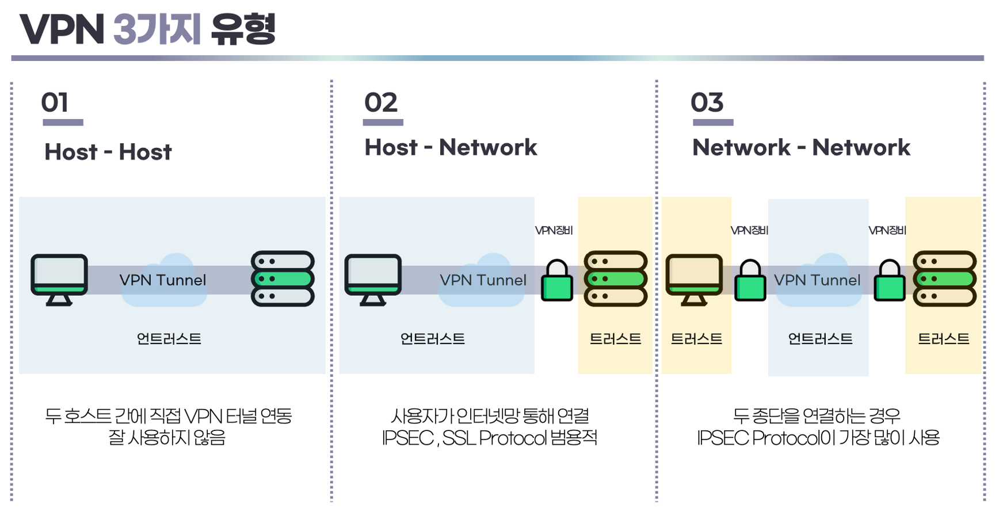

> 작성일 : 2024/02/26 (DAY18)

# 73. 보안의 기본과 개념

## 정보 보안의 CIA 밸련스

- `정보 보안`
  - 모든 분야에서 필수적인 요소
  - 현재 컴퓨터는 네트워크에 연결해서 이용하는 것이 전제됨 -> *정보 보안은 네트워크 보안*이라고 할 수 있음
- CIA 밸런스
  - `기밀성(Confidentiality)` : 적법한 사람만 정보를 이용할 수 있도록 보호 및 관리되는 것
  - `무결성(Integrity)` : 변경이나 파괴 없이 정보가 올바른 상태로 유지되는 것
  - `가용성(Availability)` : 앞서 말한 올바른 정보들이 적절하게 이용 간으한 상태에 있는 것
  - 기밀성과 무결성은 가용성과 상충되는 경향이 있음
    - 기밀성과 무결성을 높일수록 정보를 이용하거나 변경할 때 제한이 강화되어 가용성이 떨어짐
    - 정보 보안에서는 이 세 가지 요소 사이에서 균형을 잡는 것이 중요함

## 정보 보안을 검토하는 절차

### 보호할 `정보 자산`을 구체적으로 결정
- '개인이나 조직에서 지켜야 할 가치가 있는 것은 무엇인가'를 고려해야 한다.

### 정보 자산이 가지는 위험과 위협을 파악
- **위험(risk)** : 손해나 피해를 초래하는 환경이나 가능성
- **위협** : 위험을 일으키는 구체적인 요인이나 사건
- 자연재해나 정보 유출, 법 개정 등 **위험**에 대해 어떤 **위협**(지진이나 해킹, 악성 코드 등)이 있는지 나열

### 나열한 위협에 대해 어떻게 대응할지(하지 않을지) 검토
- 기술적인 대책이나 대응, 조직적인 규칙 등
- 사전 대책이나 후대응을 고려하면 네트워크 강화 등 기술적인 조치가 필요해짐

# 74. 멀웨어/컴퓨터 바이러스

## 컴퓨터 바이러스와 멀웨어의 차이

- `컴퓨터 바이러스`
  - 자기 전염 기능, 잠복 기능, 발병 기능을 가짐
  - 예전에는 컴퓨터에 위해를 가하는 모든 것을 가리켰지만, 자기 전염 기능이나 잠복 기능 등이 명확하지 않고 침입이나 공격만 하거나 더 복잡한 동작을 하는 악성 코드 등이 증가하고 있음
  - => 악의적인 소프트웨어나 프로그램을 모두 일컬어 멀웨어라는 용어를 사용

## 악영향을 미치는 멀웨어 종류

- `멀웨어(malware)`
  - 컴퓨터나 기타 단말기에 악영향을 미치는 악의적인 프로그램이나 소프트웨어
  - 종류
    - 컴퓨터 바이러스 : 자기 전염 기능이 있고 공격까지 잠복 기간이 있음. 단독으로 존재할 수 없으며, 기존 프로그램에 기생해서 전염됨
    - 웜(worm) : 네트워크 등을 이용하여 침입하고 독립적으로 전염됨. 다른 프로그램 등 작동에 악영향을 미침
    - 트로이 목마(trojan horse) : 정상적인 소프트웨어나 프로그램으로 위장하여 침입함. 다른 프로그램 작동에 악영향을 미침
    - 스파이웨어(spyware) : 키보드나 마우스 조작, 표시 화면 등을 감시하고 기록해서 외부로 유출시킴. 자기 전염 기능은 없음

# Q&A

## 랜섬웨어 예방하는 방법

### 소프트웨어 업데이트 및 보안 패치

랜섬웨어가 네트워크에 침입하고 확산하는 일반적인 방법은 오래된 소프트웨어의 취약점을 악용하는 것이다. `취약점`이란 누군가가 악의적인 목적으로 사용할 수 있는 소프트웨어의 결함이다. 취약점이 발견되면 소프트웨어 벤더는 정기적으로 소프트웨어 업데이트의 형태로 취약점에 대한 수정 사항을 발표한다.

예를 들어, 2017년 5월에 발생한 WannaCry 랜섬웨어는 Microsoft가 이전에 해당 취약점에 대한 패치를 발표했음에도 불구하고 "이터널블루" 취약점을 이용하여 20만여 대의 컴퓨터로 확산시킨 것으로 유명하다.

랜섬웨어 공격은 또한 취약점을 악용하여 일단 네트워크에 침투한 후 네트워크 내에서 확산된다. 예를 들어, Maze 랜섬웨어는 네트워크에 일단 침투한 후 악용할 취약점을 스캔한 다음 해당 취약점을 사용하여 최대한 많은 컴퓨터를 감염시킨다.

운영 체제(OS), 웹 브라우저, 보안 소프트웨어 등 시스템에 설치된 모든 프로그램을 최신 상태로 업데이트 해야한다. 보안 업데이트는 취약점을 해결하여 해커가 악용하는 것을 방지한다.

### 신뢰할 수 있는 소프트웨어만 다운로드

소프트웨어를 다운로드할 때 공식 웹사이트나 신뢰할 수 있는 소스에서만 다운로드한다. 토렌트와 같은 비공식 소스나 의심스러운 이메일 첨부 파일을 통해 다운로드하는 것은 위험하다.

### 이메일 조심

의심스러운 이메일 첨부 파일을 열지 않고, 알 수 없는 발신자로부터의 링크를 클릭하지 않는다. 랜섬웨어는 주로 이메일을 통해 전파되므로 신뢰할 수 없는 이메일에 대해 주의를 기울이는 것이 중요하다. 

특히 비밀번호가 걸려있는 압축파일은 조심해야 한다. 압축 파일에 비밀번호가 걸려있으면 보안 소프트웨어는 이를 감지하여 사전에 경고할 수 없기 때문이다.

### 백업

정기적으로 파일을 백업하여 랜섬웨어에 감염되었을 때 파일을 복구할 수 있다. 백업은 외부 저장매체에 저장되어야 하며, 백업 매체는 인터넷에 연결되어 있지 않아야 한다.

## 참고

- [랜섬웨어 공격을 방지하는 방법](https://www.cloudflare.com/ko-kr/learning/security/ransomware/how-to-prevent-ransomware/#:~:text=%EB%9E%9C%EC%84%AC%EC%9B%A8%EC%96%B4%20%EA%B3%B5%EA%B2%A9%EC%9D%84%20%EB%B0%A9%EC%A7%80%ED%95%98%EB%8A%94%20%EB%B0%A9%EB%B2%95%201%201.%20%EC%86%8C%ED%94%84%ED%8A%B8%EC%9B%A8%EC%96%B4%EB%A5%BC%20%EC%A0%95%EA%B8%B0%EC%A0%81%EC%9C%BC%EB%A1%9C,...%206%206.%20Zero%20Trust%20%EB%AA%A8%EB%8D%B8%20%EC%82%AC%EC%9A%A9%20)

---

> 작성일 : 2024/02/28 (DAY19)

# 75. 암호화 기술

## 암호화의 기본 개념

- `암호화`
  - 어떤 방법으로든 데이터를 해독할 수 없는 상태로 변환하는 것
  - **암호 알고리즘** : 암호화 처리 절차나 계산 방법
  - **키** : 알고리즘 계산에 사용하는 특정한 부호(수치 데이터)
  - 암호의 기밀성은 키로 유지됨

## 해시 함수를 사용한 암호화

암호화 방식에는 키의 특성 등에 따라 주로 `공통키 암호화 방식(비밀키 암호화 방식)`, `공개키 암호화 방식`, `해시 함수` 이렇게 세 가지가 있다.
  
- `해시 함수`
  - 원본 데이터(평문)에 대해 일정한 처리를 한 결과(해시 값)를 출력하는 함수
  - 암호화에 사용하는 키가 없으며, **복호화**하는 것도 불가능하다.
  - 평문과 해시값은 일대일로 대응되는데, 해시 값을 계산하여 평문으로 되돌리는 것은 거의 불가능함
  - 이런 특성 때문에 **비밀번호 저장**이나 **데이터 변조 방지** 등에 이용됨
    - 같은 데이터에서 반드시 같은 해시 값이 출력되야 함 
    - -> 입력한 값을 해시 함수로 처리한 결과와 등록된 값이 일치하는지 여부로 비밀번호를 검증함

# 76. 공통키 암호화 방식 / 공개키 암호화 방식

## 공통키 암호화 방식과 공개키 암호화 방식의 차이

- `공통키 암호화 방식`
  - 암호화에 사용하는 키(공통키)를 데이터 송신자와 수신자가 양쪽에서 비밀리에 공유하여 암호화 통신을 수행하는 방식
  - 공통키를 안전하게 공유해야 함
    - 이 과정에서 공통키가 네트워크로 교환할 때 유출될 위험이 있음
- `공개키 암호화 방식`
  - 암호화와 복호화에 키(공개키와 개인키)를 2개 사용하여 암호화 통신을 수행하는 방식
  - 송신자는 수신자가 공유한 **공개키**를 사용하여 원본 데이터 암호화 후 전송
  - 암호화된 데이터는 수신자가 가진 **개인키**로만 복호화할 수 있으므로 암호화 통신이 성립함
  - 네트워크로 공개키를 전송해도 안전함

## 공개키 암호화 방식을 역으로 사용한 전자 서명

- `전자 서명(디지털 서명)`
  - 공개키 암호화 방식에서 공개키로 암호화하고 개인키로 복호화함
  - 암호화된 데이터를 송신자의 공개키로 복호화할 수 있음 
    - => 해당 데이터가 송신자만 가지고 있는 개인키로 암호화되었다는 것을 증명

# 77. 서버 인증서 / 인증 기관

## 본인 인증을 위한 서버 인증서

- `서버 인증서`
  - 공개키 암호화 방식을 이용한 전자 서명을 통해 **인증 기관(CA)**이 본임임을 인증해 주는 인터넷 상의 체계
  - HTTPS 통신에서는 패킷을 암호화하기 전에 접속한 곳에서 서버 인증서를 받아 정당성을 검증함

## 서버 인증서를 발행하는 인증 기관

- `인증 기관`
  - HTTPS 통신 등에서 서버 인증서를 발급하고, 접속하는 웹 서버 등 적법성을 인증하는 기관
  - 서버 인증서는 인증 기관 서버에서 발급됨
  - 서버에서 HTTPS 지원하기
    - 인증 기관에 기업이나 웹 서버 등 정보를 등록
    - 서버 인증서와 공개키 암호화 방식의 개인키와 공개키 쌍이 발급됨
  - HTTPS 통신
    - 웹 브라우저가 HTTPS 통신 요청
    - 웹 서버는 서버 인증서와 공개키를 반환
    - 웹 브라우저는 서버 인증서를 인증 기관에 확인함

# 78. SSL/TLS

## SSL을 개량해서 TLS를 설계

`SSL`과 `TLS` 모두 웹 브라우저와 웹 서버 간 통신을 암호화하는 프로토콜이다. HTTPS 프로토콜에는 암호화를 위한 상세한 절차를 규정하지 않아, 웹 브라우저에 구현된 SSL 프로토콜이 사용되었다.

- `SSL(Secure Socket Layer)` : 웹 브라우저 개발사에서 만든 프로토콜
- `TLS(Transport Layer Security)` : 인터넷 기술 표준화 단체인 IETF가 TLS로 다시 설계하여 인터넷 표준으로 삼음

SSL과 TLS 사이에 엄격한 호환성은 없다. SSL과 TLS 1.1 이전의 프로토콜에 취약성이 발견되어 현재는 TLS 1.2와 TLS 1.3이 정식 프로토콜이다.

## TLS를 이용한 암호화 통신

TLS에 의한 암호화 통신은 `공개키 암호화 방식`을 사용한다.

### 과정

- 브라우저는 서버에서 서버 인증서와 공개키를 받아 인증서를 검증함
- 브라우저는 받은 공개키로 암호화 통신용 키 생성에 필요한 정보(난수)를 공개키로 암호화해서 웹 서버에 보냄
- 서버는 받은 난수를 개인키로 복호화해서 암호화 통신용 키를 생성
- 이렇게 웹 브라우저와 웹 서버 사이에서 암호화 통신용 키를 공유함

# Q&A

## SSL에서는 대칭키와 비대칭키 방식을 혼합해서 사용한다. 그 이유는?

## 이유

### 계산 비용

- 대칭키: 대칭키 암호화는 비교적 간단한 연산(대칭키를 사용한 XOR 연산 등)으로 이루어지기 때문에 계산 비용이 적다.
- 비대칭키: 공개키 암호화는 복잡한 수학적 계산을 요구한다. 공개키와 개인키의 관계를 이루는 수학적 연산을 수행해야 하므로 계산 비용이 많이 들어간다.

### 알고리즘 취약점

- 대칭키 : 충분히 안전하고 널리 사용되는 알고리즘들이 대부분이다.
- 비대칭키 : 패딩 오라클 공격, 소수 분해 공격, 비선형 연산 공격 등의 취약점이 있다. 키쌍 중 하나가 공개되어 있기 때문에 나머지 소수 한쌍을 추측하기 비교적 쉽다고 한다.

위와 같은 이유들 때문에 SSL에서 대칭키와 비대칭키를 혼합해서 사용한다.

## 통신 방식

1. 서버에서 비대칭키(공개키, 개인키) 쌍을 생성한다.
2. 클라이언트에서 대칭키를 생성한다.
3. 클라이언트에서 대칭키를 서버의 공개키로 암호화해서 보낸다.
4. 서버는 암호화된 대칭키를 개인키로 복호화한다.

위 과정을 통해 클라이언트는 성능, 안정성 측면에서 더 좋은 대칭키를 서버로 암호화해서 보낼 수 있다. 

이 때 클라이언트에서 생성하는 대칭키는 서버와 클라이언트 간의 세션이 유지되는 사용되기 때문에 **세션키**라고도 한다. 또한 키를 교환하는 과정을 **IEK(Internet Key Exchange)** 라고 한다.

실제로는 이 방식을 그대로 사용하면 **MITM attack(중간자 공격)** 에 노출되기 때문에 신뢰할 수 있는 CA를 통해서 인증서와 공개키를 교환한다.

## 참고

- [비대칭키가 인터넷 환경에서 사용되는 기본 원리](https://www.youtube.com/watch?v=jyZ7TQaFy_o&list=PLXvgR_grOs1CakfdJgCy_Df14U3DqRuPk&index=8&ab_channel=%EB%84%90%EB%84%90%ED%95%9C%EA%B0%9C%EB%B0%9C%EC%9E%90TV)
- [HTTPS와 SSL 인증서](https://opentutorials.org/course/228/4894)

---

> 작성일 : 2024/03/01 (DAY20)

# 79. 방화벽

## 보안 대책의 기본이 되는 방화벽

- `방화벽(Firewall)`
  - 네트워크 세그먼트 경계에 설치되는 게이트웨이의 일종
  - 네트워크 보안 대책의 가장 기본적인 구조 중 하나
  - 외부에서 들어오는 불필요한 패킷이나 수상한 접속 등을 차단함
  - 패킷의 종류와 내용을 확인하여 LAN 내부로 통과시킬지 여부를 결정함
    - 패킷의 IP 주소, 포트 번호, 패킷 내용 정보를 확인해서 통과 여부를 제어

## 방화벽 종류

### 패킷 필터링형

IP 주소나 포트 번호를 기준으로 통과시킬 패킷을 제어한다. 세 종류로 나눌 수 있다.

- **스태틱형** : 차단하거나 통과시킬 IP 주소나 포트 번호를 고정 리스트로 관리하는 방식
- **다이내믹형** : 특정 통신에 대한 응답이면 허용하는 등 동적인 리스트로 관리
- **스테이트풀형** : 패킷 단독이 아니라 프로토콜 순서도 감시하여 부정한 액세스를 감지

### 게이트웨이형

- 네트워크의 게이트웨이로서 모든 통신을 제어한다. 
- 네트워크 내부와 외부 모두 방화벽이 창구 역할을 하기 때문에 **프록시형**이라고도 한다.

> `프록시` : *인터넷과 LAN 경계에서 패킷 출입을 대행해서 처리하는 기능*을 의미한다. 패킷 제어나 액세스 부하의 분산, 보안 대책 등으로 프록시 서버를 경유시킬 때가 있다.

# 80. DMZ

## 공개 서버와 내부 네트워크 보호

- `DMZ(DeMilitarized Zone)`
  - 내부 네트워크를 외부 공격에서 보호하려고 방화벽 등으로 격리된 네트워크상의 세그먼트
  - 외부에 직접 공개하지 않는 내부 네트워크를 2단계로 보호하는 세그먼트
  - 일반적으로 외부에 공개하는 웹 서버나 메일 서버 등을 배치함
    - 웹 서버는 에지 라우터보다 안쪽 세그먼트에 위치
    - 외부에서 오는 무작위 패킷이 내부까지 도달하는 것은 보안상 위험 요소가 됨
    - => 웹 서버를 배치한 세그먼트를 방화벽 등으로 격리해서 내부 네트워크를 보호하는 것

## 라우터 등을 활용한 DMZ의 다양화

실제 네트워크에서는 DMZ 앞뒤로 방화벽을 배치하기도 한다.

라우터, 게이트웨이, 방화벽은 네트워크 장비로서 개별 하드웨어로 있을 때가 많지만, 이들 장비의 내부는 서버(컴퓨터)와 차이가 없다. 네트워크 장비는 패킷을 읽어야 하므로, 내부에서는 **서버 OS**가 작동하며, 애플리케이션 기능으로 **라우팅**이나 **필터링** 등을 한다.

# 81. IDS/IPS

## 부정한 패킷의 침입을 탐지한느 IDS와 IPS

- 방화벽
  - 방어 정책 : 입구의 방어벽을 높이고 검문을 강화하여 내부 안전을 확보
  - 공격자 수법이 강화되면서 입구만 강화해서는 침입을 막을 수 없게 됨
    - => 부정한 패킷이 통과한 후 내부에서 침입을 탐지하고 제거할 수 있는 시스템 필요
- `IDS`와 `IPS`
  - `IDS(Intrusion Detection System)` : 부정한 패킷의 침입을 탐지
  - `IPS(Intrusion Prevention System)` : 부정한 패킷을 탐지하여 방지하는 시스템
  - 탐지 방법 : 방화벽의 스테이트풀형과 마찬가지로 *IP 주소나 포트 번호*뿐만 아니라 *프로토콜 순서와 처리 상황* 등도 검증함
  - 설치 장소에 따라 호스트형과 네트워크형으로 나누어짐
    - **호스트형** : 서버에 소프트웨어로 설치되어 부정한 패킷 검사
    - **네트워크형** : 네트워크상에서 흐르는 패킷 감시

## 다양한 공격을 방어하는 시스템

- 차세대 방화벽(NGFW)
  - IDS, IPS, 고기능 방화벽 등을 말함
  - 패킷 내용, 프로토콜 순서, 처리 상황, 앱별 패킷 동작, IP 주소나 포트 번호 등 다양한 요소로 검증함
- WAF(Web Application FireWall)
  - SQL 인젝션, XSS, CSRF처럼 웹 사이트의 취약점을 노린 공격에서 보호
- UTM(Unified Threat Management)
  - IDS, 안티바이러스, 로그 감시 등 여러 기능을 방화벽에 통합함

# 82. VPN/터널

## 인터넷 등에 가상 전용선을 구축한다

- `VPN(Virtual Private Network)`
  - 일반에 공개되어 불특정 다수와 연결되는 네트워크 특정 상대만 이용할 수 있는 전용선을 가상으로 구축하는 기술
  - VPN 통신은 암호화 등으로 보호됨
  - 호스트(일반적으로 라우터)를 VPN으로 연결했을 때
    - 연결 대상과 교환하는 패킷이 암호화됨
    - VPN 통신의 패킷은 마찬가지로 여러 라우터를 거쳐서 연결 대상까지 연결되지만, 중계하는 라우터는 패킷 내용을 해독할 수 없음
    - => 경로는 보호된 상태
    - 이렇게 암호화하는 기술을 `터널`이라고 함
- `터널`
  - 본래 프로토콜의 패킷을 그대로 다른 프로토콜의 패킷에 실어 전송하는 기술을 가리킴
    - 경로 암호화는 필수 요소가 아님
  - 경로 내에 다른 프로토콜의 네트워크가 있을 때는 패킷을 원활하게 전달할 수 있는 터널을 사용하는 것이 유용함
    - => `캡슐화`

## 암호화와 터널을 구현하는 VPN 프로토콜

- IPsec
  - 연결 대상의 인증 기능과 패킷의 암호화 기능을 갖춘 프로토콜
  - 인터넷 표준
- L2TP
  - 패킷 암호화는 하지 않고 터널로 연결 대상과 전용 경로를 구축하는 프로토콜
- PPTP
  - 윈도우에서 표준으로 사용되던 프로토콜
- SSL-VPN
  - SSL(세션 계층 프로토콜)을 사용하므로 웹 브라우저 연결을 VPN으로 사용하고자 할 때 이용
  - HTTPS를 사용해서 암호화와 터널을 구현

# 83. 트래픽 감시/로그 감시

## 이상 검출의 위한 트래픽이나 로그 감시

- 보안을 높은 수준으로 유지하려면 *네트워크 상태를 항상 감시하고 검증*하는 것이 중요하다.
- 네트워크에서 수상한 동작을 검출하려면 *네트워크 트래픽을 감시*해야 한다.
  - 평소 발생하지 않는 해외 접속이나 통신 등이 있는지 확인
  - 서버의 이벤트 로그를 확인하여 수상한 통신, 중요 데이터에 대한 액세스나 로그인 오류 등이 있는지 확인
  
## 트래픽 감시와 로그 감시 방법

- 트래픽 감시
  - 차세대 방화벽과 같은 고기능 제품이나 패킷 캡쳐 기능이 있는 네트워크 기기를 이용
  - 위와 같은 장비를 이용해 네트워크를 흐르는 패킷을 상시 체크할 수 있음
    - => 거의 실시간으로 이상 탐지 가능
- 로그 감시
  - 서버의 로그 파일을 소프트웨어로 해석
  - 로그 파일에 남아 있는 공격이나 이상 등 흔적을 체크하여 이상이 발생하지 않았는지 조사
  - 과거 발생 상황을 조사
